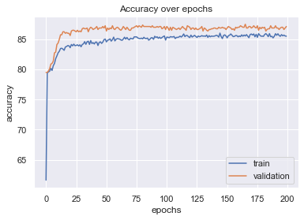

# Project title: Bank Customer Churn Classification


## Problem Statement: Predicting if a Customer will exit bank or not from the given Bank Customer data.

## 1.0 Business Understanding

The Banking Inducstry has experienced massive growth over the years and with many new high tech entrants, competition has also increased tremendously.

There are limitless number of options where customers can put their money, from traditional Banks to online solid startups. To understand how your customers are likely to behave will equip the bank in addressing issues that in the first place cause them to leave.

Customer experience or customer service has been cited as the number one reason why clients move banks followed by unfavourable fees among other reasons such as lack of new digital products.

Once customers leave, it is hard to get them back. For this reason post event analysis will only give reasons why they left and cannot prevent the action from happening. However, with the help of AI, we can use the same data to predict who might leave and therefore have an opportunity to seek to understand why.

For most companies, the customer acquisition cost (cost of acquiring a new customer) is higher than the cost of retaining an existing customer. Therefore, the challenge of implementing a successful churn project is to increase customer loyalty and, consequently, increase company revenue.

It is therefore neccessary to analyze data of customers who left to find insights which might help us predict the ones who are likely to leave and develop plans to reduce these number.

## 2.0 Data Understanding

##### Creating a Churner Profile and Identifying Churn Behavior

In trying to gain insights into the data, I create visual representations that aggregate and summarize the following:

    1. Creating Customer Segmentation based on behavior, characteristics, patterns and address the question, "Which Customer do we care about? The best vs the most valuable.
    2. Compare to Control population: Understanding one time customers vs regular engaged ones
    3. Identifying what makes your Churner different

##### Implementing the Churn Scoring Mechanism

In looking for a solution, I determine the best approach and algorithms by first:

    1. Finding relevant features, then
    2. Computing a Churn Score
    

### Feature description¶
#### Bank client data:

    1 - ID (numeric)
    2 - Surname (String)
    3 - age (numeric)
    4 - Credit Score (Numeric)
    5 - Geographical Area : (categorical: 'France', 'German', 'Spain')
    6 - Gender : (categorical: 'Male' or 'Female')
    7 - Tenure : Number of years member has been with Bank (Numeric)
    8 - Balance: Amount in Account (Numeric)
    9 - NumofProducts: Number of Products member has with Bank (Numeric)
    
#### Other Attributes:

    10 - HasCrCard: Has Credit Card (binary: '1 = yes',0 = 'no')
    11 - IsActiveMember: Is Member Still current Account Holder (binary: '1 = yes',0 = 'no')
    12 - EstimatedSalary: Estimated Salary (Numeric)
    

#### Output variable (desired target):

    13 - y - has the client Exited? (binary: '1 = yes',0 = 'no')


```python
!python -m pip install scikit-learn==0.22.0 --user
```


```python
#!python -m pip install cufflinks
```


```python
from toggle_cell import toggle_code as hide_solution
```


```python
# Importing Libraries
from __future__ import print_function
import numpy as np # linear algebra
import pandas as pd # data processing, CSV file I/O (e.g. pd.read_csv)
import seaborn as sns #visualization
sns.set()

import matplotlib.pyplot as plt #visualization
%matplotlib inline

import itertools
import warnings
warnings.filterwarnings("ignore")
import os
import io
import plotly.offline as py #visualization
py.init_notebook_mode(connected=True) #visualization
import plotly.graph_objs as go #visualization
import plotly.tools as tls #visualization
import plotly.figure_factory as ff #visualization

# Required to make it work in Google Colab
from plotly import __version__

import cufflinks as cf
from plotly.offline import download_plotlyjs, init_notebook_mode, plot, iplot 

cf.go_offline()

hide_solution()
```


        <script type="text/javascript">
        window.PlotlyConfig = {MathJaxConfig: 'local'};
        if (window.MathJax) {MathJax.Hub.Config({SVG: {font: "STIX-Web"}});}
        if (typeof require !== 'undefined') {
        require.undef("plotly");
        requirejs.config({
            paths: {
                'plotly': ['https://cdn.plot.ly/plotly-latest.min']
            }
        });
        require(['plotly'], function(Plotly) {
            window._Plotly = Plotly;
        });
        }
        </script>
        


        <script type="text/javascript">
        window.PlotlyConfig = {MathJaxConfig: 'local'};
        if (window.MathJax) {MathJax.Hub.Config({SVG: {font: "STIX-Web"}});}
        if (typeof require !== 'undefined') {
        require.undef("plotly");
        requirejs.config({
            paths: {
                'plotly': ['https://cdn.plot.ly/plotly-latest.min']
            }
        });
        require(['plotly'], function(Plotly) {
            window._Plotly = Plotly;
        });
        }
        </script>
        


<form action="javascript:code_toggle()"><input type="submit" id="toggleButton" value="Show Sloution"></form>


Setting Notebook Mode to False


```python
# training dataset import
#cust_data = pd.read_csv("C:\\Users\\Welcome\\PROF790\\Bank_Churn\\Churn_Modelling.csv")
cust_data = pd.read_csv("Churn_Modelling.csv")
cust_data.head(10)
```


<div>
<style scoped>
    .dataframe tbody tr th:only-of-type {
        vertical-align: middle;
    }

    .dataframe tbody tr th {
        vertical-align: top;
    }

    .dataframe thead th {
        text-align: right;
    }
</style>
<table border="1" class="dataframe">
  <thead>
    <tr style="text-align: right;">
      <th></th>
      <th>RowNumber</th>
      <th>CustomerId</th>
      <th>Surname</th>
      <th>CreditScore</th>
      <th>Geography</th>
      <th>Gender</th>
      <th>Age</th>
      <th>Tenure</th>
      <th>Balance</th>
      <th>NumOfProducts</th>
      <th>HasCrCard</th>
      <th>IsActiveMember</th>
      <th>EstimatedSalary</th>
      <th>Exited</th>
    </tr>
  </thead>
  <tbody>
    <tr>
      <th>0</th>
      <td>1</td>
      <td>15634602</td>
      <td>Hargrave</td>
      <td>619</td>
      <td>France</td>
      <td>Female</td>
      <td>42</td>
      <td>2</td>
      <td>0.00</td>
      <td>1</td>
      <td>1</td>
      <td>1</td>
      <td>101348.88</td>
      <td>1</td>
    </tr>
    <tr>
      <th>1</th>
      <td>2</td>
      <td>15647311</td>
      <td>Hill</td>
      <td>608</td>
      <td>Spain</td>
      <td>Female</td>
      <td>41</td>
      <td>1</td>
      <td>83807.86</td>
      <td>1</td>
      <td>0</td>
      <td>1</td>
      <td>112542.58</td>
      <td>0</td>
    </tr>
    <tr>
      <th>2</th>
      <td>3</td>
      <td>15619304</td>
      <td>Onio</td>
      <td>502</td>
      <td>France</td>
      <td>Female</td>
      <td>42</td>
      <td>8</td>
      <td>159660.80</td>
      <td>3</td>
      <td>1</td>
      <td>0</td>
      <td>113931.57</td>
      <td>1</td>
    </tr>
    <tr>
      <th>3</th>
      <td>4</td>
      <td>15701354</td>
      <td>Boni</td>
      <td>699</td>
      <td>France</td>
      <td>Female</td>
      <td>39</td>
      <td>1</td>
      <td>0.00</td>
      <td>2</td>
      <td>0</td>
      <td>0</td>
      <td>93826.63</td>
      <td>0</td>
    </tr>
    <tr>
      <th>4</th>
      <td>5</td>
      <td>15737888</td>
      <td>Mitchell</td>
      <td>850</td>
      <td>Spain</td>
      <td>Female</td>
      <td>43</td>
      <td>2</td>
      <td>125510.82</td>
      <td>1</td>
      <td>1</td>
      <td>1</td>
      <td>79084.10</td>
      <td>0</td>
    </tr>
    <tr>
      <th>5</th>
      <td>6</td>
      <td>15574012</td>
      <td>Chu</td>
      <td>645</td>
      <td>Spain</td>
      <td>Male</td>
      <td>44</td>
      <td>8</td>
      <td>113755.78</td>
      <td>2</td>
      <td>1</td>
      <td>0</td>
      <td>149756.71</td>
      <td>1</td>
    </tr>
    <tr>
      <th>6</th>
      <td>7</td>
      <td>15592531</td>
      <td>Bartlett</td>
      <td>822</td>
      <td>France</td>
      <td>Male</td>
      <td>50</td>
      <td>7</td>
      <td>0.00</td>
      <td>2</td>
      <td>1</td>
      <td>1</td>
      <td>10062.80</td>
      <td>0</td>
    </tr>
    <tr>
      <th>7</th>
      <td>8</td>
      <td>15656148</td>
      <td>Obinna</td>
      <td>376</td>
      <td>Germany</td>
      <td>Female</td>
      <td>29</td>
      <td>4</td>
      <td>115046.74</td>
      <td>4</td>
      <td>1</td>
      <td>0</td>
      <td>119346.88</td>
      <td>1</td>
    </tr>
    <tr>
      <th>8</th>
      <td>9</td>
      <td>15792365</td>
      <td>He</td>
      <td>501</td>
      <td>France</td>
      <td>Male</td>
      <td>44</td>
      <td>4</td>
      <td>142051.07</td>
      <td>2</td>
      <td>0</td>
      <td>1</td>
      <td>74940.50</td>
      <td>0</td>
    </tr>
    <tr>
      <th>9</th>
      <td>10</td>
      <td>15592389</td>
      <td>H?</td>
      <td>684</td>
      <td>France</td>
      <td>Male</td>
      <td>27</td>
      <td>2</td>
      <td>134603.88</td>
      <td>1</td>
      <td>1</td>
      <td>1</td>
      <td>71725.73</td>
      <td>0</td>
    </tr>
  </tbody>
</table>
</div>


#### Percentage of Exited Customers Vs Remaining


```python
# Percentage per category for the target column.
percentage_labels = cust_data['Exited'].value_counts(normalize = True) * 100
percentage_labels
```


    0    79.63
    1    20.37
    Name: Exited, dtype: float64


Note: Of the 10,000 Bank Customer data provided, 20.37% of them Left the Bank 

## Exploratory Data Analysis
#### How does the provided data Features Correlate?


```python
# Drop the irrelevant columns  as shown above
cust_data = cust_data.drop(["RowNumber", "CustomerId", "Surname"], axis = 1)

# Build correlation matrix
corr = cust_data.corr()
corr.style.background_gradient(cmap='PuBu')
```


##### Note
The graphical analysis shows all values are very small and less than +0.5 or -0.5. We can therefore say features are not correlated.


```python
#price range correlation
corr.sort_values(by=["CreditScore"], ascending=False).iloc[0].sort_values(ascending=False)
```


    CreditScore        1.000000
    IsActiveMember     0.025651
    NumOfProducts      0.012238
    Balance            0.006268
    Tenure             0.000842
    EstimatedSalary   -0.001384
    Age               -0.003965
    HasCrCard         -0.005458
    Exited            -0.027094
    Name: CreditScore, dtype: float64


#### Taking a look at how Data is Distributed using Scatter Plots


```python
#scatterplot
sns.set()
cols_pr = ['CreditScore', 'Age', 'Tenure', 'Balance', 'NumOfProducts','HasCrCard', 'EstimatedSalary']
sns.pairplot(cust_data[cols_pr], height = 2.0)
plt.show()
```


###### Deductions:
    Credit Score seems to be normally distributed while
    There are high number of customers with low balances and
    Most Customers either have one or two bank products.

#### Checking for Missing Data
There some algorithms that can't handle missing data or may perform poorly when present with such data.
We check and appropriate handle any missing values for that matter.


```python
#missing data
total_null = cust_data.isnull().sum().sort_values(ascending=False)
percent_null = (cust_data.isnull().sum()/cust_data.isnull().count()).sort_values(ascending=False)
missing_data = pd.concat([total_null, percent_null], axis=1, keys=['Total', 'Percent'])

missing_data


```


<div>
<style scoped>
    .dataframe tbody tr th:only-of-type {
        vertical-align: middle;
    }

    .dataframe tbody tr th {
        vertical-align: top;
    }

    .dataframe thead th {
        text-align: right;
    }
</style>
<table border="1" class="dataframe">
  <thead>
    <tr style="text-align: right;">
      <th></th>
      <th>Total</th>
      <th>Percent</th>
    </tr>
  </thead>
  <tbody>
    <tr>
      <th>Exited</th>
      <td>0</td>
      <td>0.0</td>
    </tr>
    <tr>
      <th>EstimatedSalary</th>
      <td>0</td>
      <td>0.0</td>
    </tr>
    <tr>
      <th>IsActiveMember</th>
      <td>0</td>
      <td>0.0</td>
    </tr>
    <tr>
      <th>HasCrCard</th>
      <td>0</td>
      <td>0.0</td>
    </tr>
    <tr>
      <th>NumOfProducts</th>
      <td>0</td>
      <td>0.0</td>
    </tr>
    <tr>
      <th>Balance</th>
      <td>0</td>
      <td>0.0</td>
    </tr>
    <tr>
      <th>Tenure</th>
      <td>0</td>
      <td>0.0</td>
    </tr>
    <tr>
      <th>Age</th>
      <td>0</td>
      <td>0.0</td>
    </tr>
    <tr>
      <th>Gender</th>
      <td>0</td>
      <td>0.0</td>
    </tr>
    <tr>
      <th>Geography</th>
      <td>0</td>
      <td>0.0</td>
    </tr>
    <tr>
      <th>CreditScore</th>
      <td>0</td>
      <td>0.0</td>
    </tr>
  </tbody>
</table>
</div>


#### Inspecting for Ouliers


```python
cust_data.describe()
```


<div>
<style scoped>
    .dataframe tbody tr th:only-of-type {
        vertical-align: middle;
    }

    .dataframe tbody tr th {
        vertical-align: top;
    }

    .dataframe thead th {
        text-align: right;
    }
</style>
<table border="1" class="dataframe">
  <thead>
    <tr style="text-align: right;">
      <th></th>
      <th>CreditScore</th>
      <th>Age</th>
      <th>Tenure</th>
      <th>Balance</th>
      <th>NumOfProducts</th>
      <th>HasCrCard</th>
      <th>IsActiveMember</th>
      <th>EstimatedSalary</th>
      <th>Exited</th>
    </tr>
  </thead>
  <tbody>
    <tr>
      <th>count</th>
      <td>10000.000000</td>
      <td>10000.000000</td>
      <td>10000.000000</td>
      <td>10000.000000</td>
      <td>10000.000000</td>
      <td>10000.00000</td>
      <td>10000.000000</td>
      <td>10000.000000</td>
      <td>10000.000000</td>
    </tr>
    <tr>
      <th>mean</th>
      <td>650.528800</td>
      <td>38.921800</td>
      <td>5.012800</td>
      <td>76485.889288</td>
      <td>1.530200</td>
      <td>0.70550</td>
      <td>0.515100</td>
      <td>100090.239881</td>
      <td>0.203700</td>
    </tr>
    <tr>
      <th>std</th>
      <td>96.653299</td>
      <td>10.487806</td>
      <td>2.892174</td>
      <td>62397.405202</td>
      <td>0.581654</td>
      <td>0.45584</td>
      <td>0.499797</td>
      <td>57510.492818</td>
      <td>0.402769</td>
    </tr>
    <tr>
      <th>min</th>
      <td>350.000000</td>
      <td>18.000000</td>
      <td>0.000000</td>
      <td>0.000000</td>
      <td>1.000000</td>
      <td>0.00000</td>
      <td>0.000000</td>
      <td>11.580000</td>
      <td>0.000000</td>
    </tr>
    <tr>
      <th>25%</th>
      <td>584.000000</td>
      <td>32.000000</td>
      <td>3.000000</td>
      <td>0.000000</td>
      <td>1.000000</td>
      <td>0.00000</td>
      <td>0.000000</td>
      <td>51002.110000</td>
      <td>0.000000</td>
    </tr>
    <tr>
      <th>50%</th>
      <td>652.000000</td>
      <td>37.000000</td>
      <td>5.000000</td>
      <td>97198.540000</td>
      <td>1.000000</td>
      <td>1.00000</td>
      <td>1.000000</td>
      <td>100193.915000</td>
      <td>0.000000</td>
    </tr>
    <tr>
      <th>75%</th>
      <td>718.000000</td>
      <td>44.000000</td>
      <td>7.000000</td>
      <td>127644.240000</td>
      <td>2.000000</td>
      <td>1.00000</td>
      <td>1.000000</td>
      <td>149388.247500</td>
      <td>0.000000</td>
    </tr>
    <tr>
      <th>max</th>
      <td>850.000000</td>
      <td>92.000000</td>
      <td>10.000000</td>
      <td>250898.090000</td>
      <td>4.000000</td>
      <td>1.00000</td>
      <td>1.000000</td>
      <td>199992.480000</td>
      <td>1.000000</td>
    </tr>
  </tbody>
</table>
</div>


## Data Visualization

#### Distribution by Geographical Area


```python
from itertools import chain
countmale = cust_data[cust_data['Gender']=='Male']['Gender'].count()
countfemale = cust_data[cust_data['Gender']=='Female']['Gender'].count()    
fig,aix = plt.subplots(figsize=(8,6))
#print(countmale)
#print(countfemale)
aix = sns.countplot(hue='Exited',y='Geography',data=cust_data)
```


Note:
    0 = 'Male'
    1 = 'Female'


```python
from matplotlib import rcParams

# figure size in inches
#rcParams['figure.figsize'] = 11.7,8.27

g = sns.FacetGrid(cust_data,hue = 'Exited', height = 6.27, aspect=9.7/6.27)
(g.map(plt.hist,'Age',edgecolor="w").add_legend())
```


    <seaborn.axisgrid.FacetGrid at 0x28d18d37ba8>


###### Note: 
Legend -  1 = 'Yes', 0 = 'No'

###### Observation:

From above graph, Current Customer Age data  distribution is skewed to the left meaning more younger generation tend to stick with the bank.


```python
sns.kdeplot(cust_data.CreditScore[cust_data.Gender=='Male'], label='Men', shade=True)
sns.kdeplot(cust_data.CreditScore[cust_data.Gender=='Female'], label= 'Women', shade=True)
plt.xlabel('Credit Score')
```


    Text(0.5, 0, 'Credit Score')


###### Note: 
    Credit Score data tends to be normally distributed both in men and women


```python
# Drop the irrelevant columns  as shown above
training_data = cust_data
```


```python
training_data.head()
```


<div>
<style scoped>
    .dataframe tbody tr th:only-of-type {
        vertical-align: middle;
    }

    .dataframe tbody tr th {
        vertical-align: top;
    }

    .dataframe thead th {
        text-align: right;
    }
</style>
<table border="1" class="dataframe">
  <thead>
    <tr style="text-align: right;">
      <th></th>
      <th>CreditScore</th>
      <th>Geography</th>
      <th>Gender</th>
      <th>Age</th>
      <th>Tenure</th>
      <th>Balance</th>
      <th>NumOfProducts</th>
      <th>HasCrCard</th>
      <th>IsActiveMember</th>
      <th>EstimatedSalary</th>
      <th>Exited</th>
    </tr>
  </thead>
  <tbody>
    <tr>
      <th>0</th>
      <td>619</td>
      <td>France</td>
      <td>Female</td>
      <td>42</td>
      <td>2</td>
      <td>0.00</td>
      <td>1</td>
      <td>1</td>
      <td>1</td>
      <td>101348.88</td>
      <td>1</td>
    </tr>
    <tr>
      <th>1</th>
      <td>608</td>
      <td>Spain</td>
      <td>Female</td>
      <td>41</td>
      <td>1</td>
      <td>83807.86</td>
      <td>1</td>
      <td>0</td>
      <td>1</td>
      <td>112542.58</td>
      <td>0</td>
    </tr>
    <tr>
      <th>2</th>
      <td>502</td>
      <td>France</td>
      <td>Female</td>
      <td>42</td>
      <td>8</td>
      <td>159660.80</td>
      <td>3</td>
      <td>1</td>
      <td>0</td>
      <td>113931.57</td>
      <td>1</td>
    </tr>
    <tr>
      <th>3</th>
      <td>699</td>
      <td>France</td>
      <td>Female</td>
      <td>39</td>
      <td>1</td>
      <td>0.00</td>
      <td>2</td>
      <td>0</td>
      <td>0</td>
      <td>93826.63</td>
      <td>0</td>
    </tr>
    <tr>
      <th>4</th>
      <td>850</td>
      <td>Spain</td>
      <td>Female</td>
      <td>43</td>
      <td>2</td>
      <td>125510.82</td>
      <td>1</td>
      <td>1</td>
      <td>1</td>
      <td>79084.10</td>
      <td>0</td>
    </tr>
  </tbody>
</table>
</div>


```python
#Separating churn and non churn customers
churn     = training_data[training_data["Exited"] == 1]
not_churn = training_data[training_data["Exited"] == 0]
```


```python
target_col = ["Exited"]
cat_cols   = training_data.nunique()[training_data.nunique() < 6].keys().tolist()
cat_cols   = [x for x in cat_cols if x not in target_col]
num_cols   = [x for x in training_data.columns if x not in cat_cols + target_col]
```

Setting Display Function for Colab


```python
# Setting to Allow for Colab Display of interactive Plots
#configure_plotly_browser_state()

# Function which plot box plot for detecting outliers
trace = []
def gen_boxplot(df):
    for feature in df:
        trace.append(
            go.Box(
                name = feature,
                y = df[feature]
            )
        )

new_df = training_data[num_cols[:1]]
gen_boxplot(new_df)
data = trace
py.iplot(data)
```


<div>
        
        
            <div id="6b481eb3-6a20-4f22-b5c9-b93c677a70a6" class="plotly-graph-div" style="height:525px; width:100%;"></div>
            <script type="text/javascript">
                require(["plotly"], function(Plotly) {
                    window.PLOTLYENV=window.PLOTLYENV || {};
                    
                if (document.getElementById("6b481eb3-6a20-4f22-b5c9-b93c677a70a6")) {
                    Plotly.newPlot(
                        '6b481eb3-6a20-4f22-b5c9-b93c677a70a6',
                        [{"name": "CreditScore", "type": "box", "y": [619, 608, 502, 699, 850, 645, 822, 376, 501, 684, 528, 497, 476, 549, 635, 616, 653, 549, 587, 726, 732, 636, 510, 669, 846, 577, 756, 571, 574, 411, 591, 533, 553, 520, 722, 475, 490, 804, 850, 582, 472, 465, 556, 834, 660, 776, 829, 637, 550, 776, 698, 585, 788, 655, 601, 619, 656, 725, 511, 614, 742, 687, 555, 684, 603, 751, 581, 735, 661, 675, 738, 813, 657, 604, 519, 735, 664, 678, 757, 416, 665, 777, 543, 506, 493, 652, 750, 729, 646, 635, 647, 808, 524, 769, 730, 515, 773, 814, 710, 413, 665, 623, 738, 528, 670, 622, 582, 785, 605, 479, 685, 538, 562, 675, 721, 628, 668, 506, 524, 699, 828, 674, 656, 684, 625, 432, 549, 625, 828, 770, 758, 795, 687, 686, 789, 589, 461, 637, 584, 579, 756, 663, 682, 793, 691, 485, 635, 650, 735, 416, 754, 535, 716, 539, 614, 706, 758, 586, 646, 631, 717, 684, 800, 721, 683, 660, 704, 615, 667, 682, 484, 628, 480, 578, 512, 484, 510, 606, 597, 754, 850, 510, 778, 636, 804, 514, 730, 525, 616, 687, 715, 512, 479, 601, 580, 807, 616, 721, 501, 521, 850, 759, 516, 711, 512, 550, 608, 618, 643, 671, 689, 603, 620, 676, 572, 668, 695, 730, 807, 592, 726, 514, 567, 850, 671, 670, 694, 547, 751, 594, 673, 610, 512, 767, 585, 763, 712, 539, 668, 703, 662, 725, 703, 659, 523, 635, 772, 545, 634, 739, 771, 587, 681, 544, 696, 766, 727, 671, 693, 850, 732, 726, 557, 682, 738, 531, 498, 651, 549, 791, 650, 733, 811, 707, 712, 706, 756, 777, 646, 714, 782, 775, 479, 807, 799, 675, 602, 475, 744, 588, 703, 747, 583, 750, 681, 773, 714, 687, 511, 627, 694, 616, 687, 712, 553, 667, 731, 629, 614, 438, 652, 729, 642, 806, 744, 474, 559, 706, 628, 429, 525, 680, 749, 763, 734, 716, 594, 644, 671, 664, 656, 667, 663, 584, 626, 485, 659, 649, 805, 716, 642, 659, 545, 543, 718, 840, 630, 643, 654, 582, 659, 762, 568, 670, 613, 539, 850, 522, 737, 520, 706, 643, 648, 443, 640, 628, 540, 460, 636, 593, 801, 640, 611, 802, 717, 769, 745, 572, 629, 687, 483, 690, 492, 709, 705, 560, 611, 730, 709, 544, 712, 752, 648, 556, 594, 645, 557, 547, 701, 616, 605, 593, 751, 443, 685, 718, 538, 611, 668, 537, 709, 850, 745, 693, 795, 626, 487, 556, 643, 605, 756, 586, 535, 678, 596, 648, 492, 702, 486, 568, 619, 724, 548, 545, 683, 762, 627, 516, 800, 464, 626, 790, 534, 745, 553, 748, 722, 501, 675, 778, 494, 850, 592, 590, 758, 506, 733, 711, 514, 637, 468, 539, 509, 662, 818, 608, 850, 816, 536, 753, 631, 703, 774, 785, 571, 621, 605, 611, 569, 658, 788, 525, 798, 486, 615, 730, 641, 542, 692, 714, 591, 710, 639, 531, 673, 765, 622, 806, 757, 570, 555, 692, 774, 638, 543, 584, 691, 684, 733, 599, 524, 632, 735, 734, 605, 793, 468, 779, 698, 707, 850, 850, 527, 696, 661, 776, 701, 610, 572, 673, 519, 702, 729, 543, 550, 608, 639, 686, 564, 745, 833, 622, 597, 721, 504, 842, 587, 479, 508, 749, 721, 674, 685, 417, 574, 590, 587, 598, 741, 850, 584, 650, 607, 509, 689, 543, 438, 687, 737, 761, 601, 651, 745, 648, 848, 546, 439, 755, 593, 701, 701, 607, 586, 547, 647, 760, 621, 725, 526, 519, 713, 700, 666, 630, 779, 611, 685, 646, 683, 484, 601, 762, 687, 566, 702, 601, 699, 584, 699, 698, 495, 650, 605, 667, 688, 727, 754, 612, 546, 673, 593, 656, 535, 678, 477, 850, 427, 752, 649, 799, 589, 583, 839, 540, 850, 696, 660, 682, 744, 785, 752, 706, 583, 660, 819, 673, 752, 578, 438, 652, 629, 720, 668, 459, 729, 498, 549, 601, 544, 751, 632, 694, 678, 695, 661, 661, 559, 503, 695, 640, 624, 667, 642, 640, 529, 563, 593, 739, 788, 684, 482, 591, 651, 749, 583, 661, 715, 769, 625, 641, 716, 767, 745, 589, 796, 664, 445, 543, 746, 742, 750, 669, 594, 574, 659, 750, 626, 620, 580, 686, 540, 634, 632, 501, 650, 786, 554, 701, 474, 621, 672, 459, 669, 776, 694, 787, 580, 711, 673, 499, 591, 769, 657, 738, 545, 497, 816, 525, 725, 692, 618, 546, 635, 611, 650, 606, 844, 450, 727, 460, 649, 758, 490, 815, 838, 803, 664, 736, 633, 664, 600, 693, 663, 742, 710, 710, 700, 720, 684, 531, 742, 717, 589, 767, 636, 648, 622, 692, 754, 679, 639, 774, 517, 571, 747, 792, 688, 714, 562, 704, 698, 611, 850, 743, 654, 761, 702, 488, 683, 601, 605, 671, 614, 511, 850, 790, 793, 628, 598, 657, 618, 681, 516, 421, 700, 745, 696, 580, 497, 720, 659, 841, 642, 732, 600, 464, 680, 758, 630, 577, 684, 708, 732, 634, 633, 559, 694, 686, 553, 507, 732, 818, 660, 773, 640, 505, 714, 468, 611, 705, 646, 667, 511, 653, 675, 523, 567, 741, 456, 598, 667, 548, 725, 717, 594, 678, 545, 636, 603, 435, 535, 629, 722, 561, 645, 501, 502, 652, 574, 518, 749, 679, 565, 643, 515, 521, 739, 585, 733, 542, 788, 435, 577, 703, 728, 728, 718, 621, 523, 657, 727, 643, 645, 568, 599, 672, 685, 516, 685, 806, 604, 648, 545, 756, 569, 596, 475, 646, 784, 552, 729, 609, 555, 572, 785, 714, 738, 639, 520, 764, 661, 564, 708, 512, 592, 619, 775, 850, 577, 724, 710, 696, 376, 675, 745, 697, 599, 715, 659, 684, 635, 789, 571, 694, 665, 706, 807, 771, 531, 629, 850, 685, 642, 529, 683, 663, 563, 637, 544, 649, 638, 723, 635, 750, 730, 750, 586, 520, 652, 550, 594, 749, 668, 614, 773, 551, 566, 569, 659, 722, 655, 615, 752, 661, 838, 610, 811, 587, 811, 759, 648, 788, 725, 646, 601, 521, 561, 564, 444, 650, 724, 719, 548, 635, 496, 676, 541, 778, 850, 633, 625, 485, 547, 642, 718, 582, 628, 737, 828, 609, 730, 631, 830, 645, 663, 678, 521, 625, 523, 714, 580, 722, 630, 579, 670, 588, 807, 726, 812, 631, 682, 625, 607, 600, 602, 545, 675, 581, 640, 850, 490, 710, 613, 812, 723, 512, 731, 650, 594, 844, 686, 695, 624, 503, 535, 743, 702, 658, 677, 664, 766, 461, 688, 678, 796, 803, 712, 498, 850, 628, 539, 732, 715, 651, 813, 692, 756, 543, 790, 494, 850, 703, 432, 512, 589, 514, 678, 420, 679, 595, 713, 833, 690, 731, 608, 479, 519, 731, 617, 756, 848, 809, 698, 779, 606, 612, 663, 549, 675, 669, 571, 500, 628, 559, 769, 733, 750, 583, 468, 727, 618, 617, 793, 630, 765, 546, 614, 593, 613, 655, 700, 826, 652, 755, 538, 729, 615, 700, 434, 729, 513, 755, 615, 747, 850, 712, 622, 548, 607, 653, 699, 693, 647, 478, 705, 719, 726, 626, 552, 807, 621, 651, 673, 652, 584, 756, 670, 765, 528, 701, 797, 639, 785, 363, 764, 676, 718, 590, 584, 645, 772, 399, 529, 463, 630, 780, 584, 752, 697, 850, 711, 452, 610, 694, 579, 745, 572, 505, 706, 693, 725, 791, 536, 699, 500, 707, 531, 557, 659, 575, 775, 772, 587, 667, 771, 523, 662, 717, 746, 569, 579, 519, 696, 693, 587, 626, 666, 512, 689, 803, 548, 588, 693, 499, 628, 624, 733, 628, 633, 559, 704, 744, 665, 638, 837, 534, 548, 837, 658, 554, 724, 723, 585, 474, 562, 719, 635, 743, 681, 521, 741, 790, 622, 669, 583, 520, 579, 698, 548, 672, 653, 734, 794, 641, 824, 534, 653, 498, 683, 618, 538, 643, 428, 593, 718, 811, 823, 645, 710, 591, 748, 850, 542, 809, 675, 607, 850, 789, 598, 756, 687, 724, 700, 635, 687, 613, 781, 703, 593, 743, 640, 849, 778, 539, 489, 568, 618, 710, 625, 682, 727, 794, 652, 670, 460, 568, 643, 521, 615, 575, 717, 648, 535, 626, 611, 734, 709, 591, 664, 431, 647, 578, 555, 775, 850, 625, 645, 608, 689, 652, 769, 611, 489, 528, 632, 429, 457, 768, 715, 668, 625, 846, 661, 571, 582, 716, 758, 725, 630, 627, 653, 775, 794, 831, 561, 705, 636, 487, 693, 517, 684, 620, 757, 739, 662, 359, 572, 721, 707, 444, 523, 685, 673, 503, 485, 799, 585, 607, 521, 535, 724, 520, 696, 657, 603, 726, 591, 792, 550, 601, 820, 667, 573, 755, 552, 598, 576, 670, 504, 778, 558, 627, 683, 556, 583, 705, 637, 697, 555, 594, 632, 551, 687, 672, 521, 686, 639, 850, 465, 817, 578, 611, 616, 517, 637, 806, 633, 624, 691, 819, 568, 806, 726, 552, 755, 634, 756, 776, 649, 595, 646, 592, 574, 850, 850, 475, 642, 710, 596, 609, 797, 504, 735, 680, 449, 685, 569, 631, 595, 461, 630, 661, 796, 710, 741, 606, 747, 549, 576, 528, 535, 575, 656, 440, 539, 850, 646, 744, 710, 544, 723, 507, 787, 598, 796, 569, 711, 661, 415, 578, 611, 600, 661, 850, 573, 764, 838, 821, 607, 558, 530, 654, 530, 656, 520, 602, 701, 653, 668, 652, 639, 730, 780, 592, 628, 658, 850, 515, 571, 760, 720, 632, 694, 559, 773, 581, 524, 713, 676, 651, 717, 594, 716, 668, 678, 545, 613, 687, 715, 618, 721, 445, 690, 709, 671, 538, 735, 592, 747, 675, 632, 621, 521, 591, 706, 677, 769, 771, 601, 670, 517, 834, 571, 576, 718, 636, 566, 711, 574, 619, 588, 760, 665, 739, 641, 685, 594, 557, 697, 656, 712, 689, 697, 589, 525, 680, 617, 680, 662, 736, 657, 350, 617, 562, 705, 516, 573, 538, 699, 504, 583, 712, 626, 631, 663, 506, 570, 703, 698, 731, 625, 634, 616, 500, 446, 669, 581, 704, 748, 680, 655, 690, 695, 700, 773, 749, 611, 606, 554, 567, 559, 594, 513, 652, 680, 784, 812, 784, 570, 712, 705, 681, 620, 711, 613, 613, 682, 850, 601, 595, 675, 591, 602, 554, 541, 506, 814, 683, 485, 696, 608, 792, 686, 790, 654, 452, 719, 707, 699, 850, 828, 850, 712, 634, 730, 685, 809, 707, 648, 760, 805, 585, 595, 630, 627, 631, 776, 676, 758, 637, 850, 601, 735, 614, 672, 642, 633, 769, 796, 715, 695, 747, 584, 476, 850, 529, 584, 586, 674, 552, 601, 541, 744, 595, 724, 533, 618, 523, 642, 584, 521, 662, 758, 717, 611, 766, 636, 814, 760, 607, 725, 600, 656, 640, 439, 549, 622, 715, 657, 703, 802, 793, 554, 533, 658, 713, 711, 669, 439, 763, 697, 702, 686, 629, 823, 683, 555, 647, 714, 850, 713, 452, 683, 577, 552, 769, 691, 818, 739, 639, 651, 779, 850, 829, 579, 510, 531, 628, 633, 714, 604, 630, 850, 788, 798, 770, 569, 425, 547, 725, 506, 632, 620, 663, 700, 696, 767, 561, 350, 706, 464, 501, 745, 587, 667, 737, 485, 590, 518, 581, 785, 799, 698, 730, 740, 785, 527, 544, 705, 684, 639, 565, 481, 731, 607, 760, 559, 715, 656, 652, 624, 634, 850, 659, 529, 572, 640, 770, 648, 579, 589, 530, 831, 790, 656, 563, 667, 613, 429, 665, 731, 584, 634, 488, 535, 776, 850, 673, 850, 627, 570, 796, 773, 752, 625, 535, 786, 620, 605, 670, 617, 595, 687, 757, 746, 503, 543, 428, 768, 618, 591, 658, 625, 717, 667, 804, 693, 729, 484, 632, 536, 573, 655, 666, 726, 523, 728, 701, 518, 739, 531, 452, 684, 728, 783, 734, 648, 688, 680, 516, 680, 604, 624, 623, 624, 565, 565, 710, 645, 707, 655, 705, 358, 578, 800, 612, 681, 559, 488, 717, 666, 582, 733, 693, 694, 622, 598, 717, 494, 644, 554, 476, 667, 748, 531, 719, 845, 738, 563, 695, 841, 626, 613, 824, 705, 584, 534, 672, 603, 633, 842, 661, 601, 632, 684, 785, 687, 705, 639, 729, 556, 570, 841, 705, 553, 779, 696, 728, 691, 706, 627, 716, 501, 601, 545, 634, 451, 655, 458, 520, 624, 765, 667, 665, 709, 583, 782, 668, 621, 579, 547, 840, 667, 723, 487, 668, 520, 549, 567, 720, 492, 712, 689, 850, 747, 469, 539, 743, 707, 581, 737, 445, 703, 588, 765, 626, 545, 744, 658, 629, 719, 686, 743, 626, 661, 710, 654, 569, 640, 562, 721, 456, 811, 534, 423, 594, 725, 716, 595, 679, 667, 661, 655, 555, 531, 611, 600, 531, 601, 548, 759, 678, 755, 594, 768, 492, 637, 646, 593, 596, 722, 642, 472, 738, 732, 404, 701, 683, 460, 690, 618, 671, 765, 651, 704, 544, 790, 710, 743, 702, 704, 614, 609, 688, 713, 736, 727, 850, 718, 643, 653, 674, 690, 819, 634, 633, 850, 665, 630, 836, 668, 753, 745, 693, 606, 660, 608, 744, 731, 683, 727, 561, 700, 605, 767, 511, 667, 787, 705, 773, 554, 526, 661, 698, 646, 757, 699, 667, 774, 745, 649, 634, 665, 713, 652, 739, 556, 699, 708, 480, 700, 525, 845, 613, 850, 798, 773, 614, 473, 762, 701, 600, 850, 613, 509, 509, 609, 456, 728, 663, 673, 717, 741, 498, 850, 493, 686, 666, 733, 631, 714, 767, 711, 722, 631, 701, 790, 633, 644, 757, 696, 746, 649, 565, 720, 648, 632, 622, 835, 493, 785, 681, 621, 756, 515, 625, 717, 595, 539, 762, 706, 677, 733, 684, 679, 478, 696, 686, 466, 686, 576, 763, 572, 757, 582, 623, 617, 425, 659, 605, 538, 665, 491, 726, 580, 550, 542, 732, 473, 745, 732, 848, 572, 702, 664, 630, 618, 556, 619, 644, 658, 598, 677, 689, 591, 699, 749, 709, 607, 650, 651, 676, 723, 714, 759, 582, 697, 610, 488, 599, 781, 645, 545, 597, 561, 662, 649, 630, 672, 636, 593, 545, 567, 583, 681, 762, 648, 644, 706, 850, 484, 508, 439, 484, 803, 724, 640, 701, 537, 651, 523, 717, 593, 706, 714, 794, 518, 589, 824, 719, 617, 651, 637, 554, 731, 569, 625, 592, 669, 663, 518, 686, 709, 571, 707, 701, 672, 620, 557, 648, 479, 730, 737, 616, 639, 815, 786, 549, 622, 624, 841, 614, 676, 697, 732, 623, 541, 773, 762, 655, 602, 850, 649, 850, 543, 672, 600, 671, 706, 541, 711, 630, 531, 641, 631, 685, 702, 708, 653, 654, 596, 549, 754, 815, 556, 706, 850, 732, 614, 580, 593, 653, 746, 662, 573, 684, 793, 798, 524, 816, 742, 540, 537, 759, 774, 608, 704, 581, 628, 566, 701, 735, 680, 560, 663, 665, 758, 621, 764, 537, 589, 555, 734, 783, 678, 661, 607, 537, 513, 576, 660, 637, 672, 629, 583, 763, 516, 617, 700, 727, 689, 626, 686, 351, 739, 627, 451, 512, 774, 652, 638, 475, 567, 750, 850, 753, 683, 710, 645, 714, 696, 612, 520, 782, 666, 466, 567, 613, 718, 614, 711, 691, 527, 476, 619, 607, 695, 653, 677, 655, 625, 679, 734, 666, 592, 564, 814, 592, 758, 612, 498, 638, 558, 756, 782, 505, 671, 801, 604, 716, 624, 607, 827, 606, 717, 651, 691, 573, 723, 584, 550, 611, 549, 850, 668, 686, 660, 682, 524, 645, 850, 537, 599, 727, 756, 755, 634, 837, 727, 567, 650, 655, 763, 843, 667, 705, 660, 553, 612, 641, 513, 680, 711, 689, 665, 551, 645, 616, 582, 365, 697, 704, 656, 712, 748, 724, 691, 563, 741, 778, 848, 634, 505, 692, 537, 633, 833, 592, 587, 550, 680, 622, 594, 643, 540, 635, 657, 814, 600, 682, 682, 566, 550, 630, 546, 486, 762, 692, 498, 850, 603, 551, 627, 515, 605, 567, 568, 571, 634, 768, 554, 629, 638, 576, 661, 592, 702, 647, 593, 712, 625, 538, 637, 632, 736, 755, 425, 461, 745, 616, 587, 850, 601, 730, 532, 850, 779, 562, 670, 729, 767, 742, 669, 542, 586, 612, 740, 584, 524, 614, 598, 799, 724, 601, 804, 745, 667, 518, 819, 520, 625, 673, 656, 850, 574, 679, 530, 508, 558, 414, 648, 721, 751, 662, 628, 597, 698, 723, 586, 633, 564, 649, 622, 459, 718, 655, 696, 637, 630, 592, 634, 608, 565, 763, 665, 649, 695, 775, 788, 569, 726, 564, 544, 614, 453, 471, 829, 754, 749, 667, 670, 670, 623, 571, 641, 551, 741, 472, 650, 625, 650, 535, 649, 689, 694, 655, 620, 577, 401, 599, 481, 704, 698, 480, 682, 700, 492, 444, 624, 709, 557, 646, 719, 706, 660, 667, 705, 598, 669, 580, 676, 714, 597, 559, 564, 850, 689, 758, 604, 733, 778, 732, 646, 597, 821, 640, 511, 805, 540, 705, 540, 532, 535, 627, 646, 515, 697, 652, 579, 760, 769, 498, 774, 705, 648, 688, 592, 705, 654, 624, 594, 695, 597, 758, 737, 694, 683, 538, 669, 730, 622, 714, 569, 668, 628, 600, 693, 704, 527, 553, 575, 626, 582, 683, 850, 653, 679, 549, 850, 558, 528, 801, 513, 666, 606, 599, 544, 529, 850, 497, 764, 603, 609, 487, 748, 710, 432, 534, 607, 551, 674, 525, 645, 755, 708, 715, 727, 559, 545, 524, 707, 671, 439, 667, 831, 545, 604, 657, 487, 750, 694, 711, 551, 559, 620, 660, 449, 703, 795, 594, 586, 613, 601, 657, 531, 621, 782, 528, 696, 586, 626, 498, 691, 568, 715, 680, 802, 539, 494, 594, 596, 649, 699, 787, 604, 489, 651, 698, 578, 538, 696, 507, 685, 705, 499, 717, 510, 632, 668, 744, 663, 638, 688, 588, 631, 687, 599, 718, 730, 533, 711, 555, 850, 678, 576, 835, 592, 774, 620, 519, 734, 763, 733, 650, 538, 577, 792, 686, 589, 530, 778, 616, 550, 655, 721, 499, 511, 579, 696, 681, 815, 681, 641, 591, 565, 487, 729, 505, 580, 642, 850, 616, 526, 523, 663, 840, 570, 676, 689, 703, 491, 584, 810, 745, 625, 535, 729, 655, 751, 525, 532, 696, 786, 580, 596, 683, 747, 602, 779, 551, 666, 526, 849, 471, 628, 674, 797, 590, 588, 577, 571, 680, 648, 618, 648, 759, 585, 774, 697, 605, 676, 678, 495, 787, 770, 817, 659, 693, 744, 829, 716, 671, 835, 636, 649, 621, 658, 784, 783, 615, 791, 762, 607, 601, 540, 812, 685, 680, 680, 631, 569, 584, 582, 609, 506, 503, 503, 806, 653, 666, 674, 798, 740, 531, 614, 556, 678, 587, 527, 757, 468, 693, 483, 466, 770, 734, 716, 439, 538, 743, 734, 656, 666, 627, 480, 792, 613, 476, 539, 696, 810, 763, 640, 655, 526, 678, 554, 597, 560, 850, 546, 623, 698, 620, 619, 561, 753, 721, 451, 680, 590, 634, 676, 642, 760, 736, 656, 776, 832, 631, 795, 648, 615, 682, 694, 694, 607, 664, 756, 645, 653, 710, 697, 619, 648, 482, 548, 752, 648, 643, 573, 686, 644, 702, 652, 641, 692, 574, 643, 834, 591, 470, 608, 649, 665, 651, 555, 637, 675, 677, 850, 815, 665, 485, 577, 586, 722, 528, 542, 552, 678, 575, 669, 636, 667, 652, 637, 516, 801, 692, 585, 590, 554, 659, 690, 697, 610, 599, 544, 548, 635, 722, 564, 719, 547, 850, 515, 667, 607, 525, 606, 686, 611, 827, 572, 726, 579, 598, 663, 505, 576, 555, 524, 776, 645, 850, 603, 691, 583, 584, 679, 646, 559, 595, 527, 684, 673, 802, 675, 762, 580, 621, 411, 815, 631, 514, 638, 791, 516, 734, 611, 850, 641, 585, 552, 507, 735, 707, 698, 841, 688, 614, 511, 447, 738, 422, 537, 707, 690, 664, 850, 584, 728, 560, 629, 658, 794, 790, 640, 652, 583, 775, 584, 635, 814, 735, 678, 693, 640, 773, 736, 693, 496, 751, 528, 754, 568, 592, 558, 825, 677, 653, 593, 632, 601, 786, 654, 572, 813, 523, 506, 513, 664, 684, 608, 527, 666, 779, 629, 430, 712, 682, 634, 487, 808, 527, 637, 802, 529, 850, 738, 817, 735, 619, 671, 581, 690, 579, 688, 599, 729, 718, 712, 474, 565, 658, 714, 725, 825, 665, 670, 474, 591, 508, 695, 660, 687, 658, 705, 739, 844, 602, 759, 747, 673, 671, 640, 581, 630, 703, 698, 742, 652, 644, 735, 777, 644, 665, 529, 803, 604, 738, 655, 698, 775, 735, 766, 537, 599, 420, 674, 570, 623, 710, 466, 759, 581, 820, 759, 628, 676, 591, 690, 624, 573, 694, 632, 632, 832, 598, 430, 711, 582, 605, 657, 578, 532, 612, 792, 674, 680, 593, 679, 493, 688, 769, 581, 465, 641, 731, 625, 468, 790, 587, 692, 676, 571, 700, 445, 746, 722, 596, 850, 597, 436, 660, 649, 646, 560, 710, 513, 607, 757, 619, 612, 842, 713, 657, 770, 773, 470, 781, 428, 600, 697, 692, 791, 538, 820, 679, 649, 632, 594, 682, 720, 769, 746, 623, 537, 468, 588, 729, 543, 499, 784, 604, 614, 671, 587, 593, 453, 570, 655, 632, 681, 591, 779, 456, 686, 617, 850, 646, 735, 543, 490, 640, 445, 761, 426, 777, 534, 777, 806, 790, 643, 584, 638, 771, 600, 661, 554, 627, 659, 835, 763, 625, 799, 849, 692, 623, 453, 408, 778, 695, 677, 662, 534, 602, 554, 667, 672, 838, 692, 675, 731, 468, 542, 662, 770, 675, 647, 604, 833, 741, 658, 528, 590, 675, 765, 650, 817, 699, 495, 491, 847, 676, 746, 470, 714, 695, 674, 664, 697, 670, 541, 640, 647, 757, 704, 778, 639, 637, 686, 577, 506, 757, 826, 721, 489, 446, 677, 769, 677, 555, 652, 722, 643, 796, 720, 613, 506, 608, 667, 750, 610, 588, 479, 682, 677, 850, 580, 746, 635, 664, 558, 415, 798, 792, 489, 730, 773, 711, 592, 695, 640, 470, 789, 604, 493, 671, 656, 739, 560, 827, 681, 740, 663, 845, 555, 680, 638, 640, 778, 679, 593, 788, 770, 729, 545, 597, 537, 732, 542, 688, 542, 754, 750, 731, 699, 534, 494, 497, 632, 724, 751, 733, 701, 525, 666, 653, 850, 646, 750, 764, 658, 727, 687, 631, 797, 650, 850, 676, 620, 576, 482, 695, 706, 668, 679, 703, 670, 590, 613, 742, 608, 571, 595, 745, 589, 749, 678, 603, 504, 739, 604, 612, 629, 652, 565, 707, 645, 762, 639, 709, 823, 817, 665, 646, 568, 850, 473, 731, 619, 715, 772, 686, 749, 781, 675, 730, 683, 554, 722, 689, 796, 447, 498, 663, 498, 627, 649, 738, 587, 655, 647, 776, 688, 605, 596, 427, 629, 496, 717, 777, 535, 744, 755, 593, 514, 721, 835, 682, 590, 653, 837, 841, 584, 769, 599, 698, 477, 477, 745, 749, 850, 528, 750, 543, 579, 624, 595, 596, 431, 647, 640, 752, 710, 638, 660, 609, 596, 705, 444, 727, 496, 554, 537, 839, 700, 458, 850, 699, 615, 850, 604, 668, 594, 470, 701, 664, 477, 756, 625, 703, 646, 650, 664, 682, 725, 553, 576, 608, 850, 627, 667, 548, 774, 794, 497, 587, 850, 722, 555, 609, 734, 718, 645, 598, 628, 629, 739, 653, 711, 783, 681, 712, 554, 611, 560, 646, 680, 631, 746, 654, 687, 708, 679, 636, 695, 677, 720, 780, 653, 674, 620, 623, 547, 530, 746, 512, 630, 570, 605, 530, 813, 704, 565, 645, 526, 778, 677, 588, 488, 519, 709, 642, 710, 653, 743, 418, 670, 723, 549, 543, 595, 673, 741, 508, 662, 752, 809, 575, 591, 643, 698, 496, 597, 603, 655, 431, 620, 782, 581, 553, 658, 686, 539, 685, 850, 763, 634, 567, 539, 764, 653, 566, 714, 580, 548, 646, 622, 706, 680, 698, 581, 728, 707, 761, 483, 736, 716, 654, 649, 649, 612, 657, 511, 682, 748, 554, 794, 807, 594, 652, 729, 625, 597, 657, 633, 663, 535, 702, 712, 607, 476, 748, 815, 602, 649, 551, 509, 685, 536, 711, 761, 535, 566, 620, 837, 685, 673, 638, 614, 626, 834, 691, 706, 633, 644, 666, 708, 496, 730, 696, 809, 701, 604, 665, 639, 696, 520, 545, 634, 750, 530, 589, 654, 648, 835, 446, 514, 694, 554, 720, 641, 813, 480, 811, 715, 620, 721, 772, 680, 535, 655, 660, 762, 662, 463, 501, 603, 688, 430, 632, 601, 769, 551, 841, 469, 479, 701, 593, 738, 635, 658, 687, 650, 720, 602, 618, 803, 793, 616, 550, 602, 452, 655, 510, 557, 676, 640, 529, 559, 689, 626, 697, 823, 565, 631, 646, 676, 850, 810, 581, 718, 713, 672, 781, 656, 583, 808, 721, 778, 850, 693, 520, 759, 637, 755, 662, 503, 599, 583, 764, 513, 730, 820, 597, 637, 696, 635, 673, 662, 683, 850, 815, 671, 601, 709, 702, 558, 691, 700, 667, 624, 580, 571, 561, 529, 670, 666, 628, 577, 652, 678, 692, 675, 712, 639, 618, 554, 533, 540, 704, 678, 712, 651, 789, 775, 564, 841, 850, 637, 500, 655, 666, 658, 749, 654, 623, 761, 627, 757, 695, 726, 587, 605, 850, 850, 751, 627, 736, 652, 627, 636, 775, 850, 850, 516, 513, 673, 564, 636, 712, 568, 741, 754, 709, 510, 716, 607, 656, 550, 486, 598, 675, 755, 656, 644, 598, 850, 679, 632, 550, 572, 626, 625, 515, 612, 628, 529, 668, 526, 791, 573, 565, 604, 656, 447, 682, 437, 792, 627, 767, 686, 789, 794, 587, 589, 543, 589, 701, 850, 726, 767, 648, 651, 633, 740, 592, 670, 628, 745, 705, 559, 595, 492, 498, 655, 636, 634, 793, 526, 768, 540, 732, 617, 637, 573, 531, 489, 601, 452, 728, 590, 490, 596, 635, 782, 790, 587, 794, 515, 746, 667, 709, 536, 711, 753, 748, 623, 465, 640, 562, 502, 536, 670, 775, 759, 604, 766, 554, 487, 725, 732, 623, 781, 714, 577, 731, 650, 779, 706, 733, 579, 476, 775, 538, 602, 615, 700, 615, 544, 573, 555, 692, 476, 770, 641, 705, 784, 727, 576, 646, 638, 632, 850, 492, 673, 609, 701, 651, 508, 616, 489, 567, 714, 678, 581, 748, 781, 691, 507, 724, 705, 708, 580, 850, 714, 559, 577, 647, 554, 549, 528, 720, 743, 615, 635, 686, 840, 695, 564, 805, 558, 657, 641, 755, 483, 545, 678, 781, 571, 634, 523, 501, 662, 573, 648, 662, 725, 563, 628, 546, 688, 850, 614, 719, 757, 669, 438, 492, 622, 645, 728, 651, 783, 732, 553, 660, 670, 718, 787, 775, 479, 660, 721, 659, 743, 670, 766, 845, 710, 602, 604, 564, 637, 527, 687, 756, 503, 657, 666, 615, 712, 764, 471, 608, 682, 587, 714, 630, 648, 785, 601, 717, 707, 771, 602, 626, 588, 616, 621, 674, 633, 698, 508, 736, 672, 613, 712, 624, 676, 683, 489, 739, 701, 666, 565, 666, 633, 578, 812, 809, 615, 684, 544, 713, 633, 672, 661, 749, 635, 850, 641, 633, 413, 538, 437, 612, 516, 826, 660, 646, 767, 640, 778, 679, 549, 598, 655, 494, 653, 539, 645, 751, 528, 696, 716, 602, 647, 850, 590, 825, 850, 789, 701, 713, 570, 536, 771, 512, 698, 656, 761, 709, 597, 592, 599, 572, 611, 634, 666, 696, 669, 726, 497, 750, 850, 617, 652, 560, 629, 660, 676, 581, 798, 705, 714, 664, 697, 609, 548, 850, 656, 727, 642, 710, 710, 718, 586, 617, 630, 791, 673, 477, 662, 850, 635, 537, 579, 651, 610, 581, 592, 688, 681, 658, 792, 528, 624, 562, 678, 705, 650, 593, 652, 554, 584, 516, 789, 598, 669, 645, 659, 833, 697, 580, 691, 534, 478, 572, 501, 624, 595, 603, 602, 500, 422, 615, 635, 711, 834, 633, 650, 743, 567, 706, 638, 641, 574, 642, 722, 623, 681, 530, 797, 653, 850, 581, 589, 555, 748, 745, 730, 565, 778, 812, 526, 708, 680, 567, 564, 709, 629, 510, 506, 605, 650, 850, 489, 659, 753, 477, 610, 619, 619, 758, 516, 789, 687, 485, 446, 597, 712, 522, 805, 781, 689, 670, 670, 524, 734, 489, 578, 622, 843, 687, 700, 410, 537, 780, 652, 620, 697, 786, 850, 749, 445, 443, 637, 616, 756, 644, 850, 703, 684, 706, 580, 777, 676, 708, 809, 588, 623, 537, 536, 769, 690, 771, 497, 622, 602, 543, 520, 669, 631, 537, 732, 844, 838, 652, 660, 692, 588, 533, 850, 511, 530, 554, 585, 754, 474, 837, 567, 800, 646, 627, 505, 566, 619, 757, 648, 621, 543, 658, 633, 648, 501, 683, 619, 705, 638, 710, 590, 725, 638, 791, 702, 607, 535, 651, 506, 511, 757, 768, 757, 663, 537, 570, 850, 661, 659, 454, 708, 720, 785, 743, 493, 557, 850, 799, 756, 752, 696, 630, 659, 685, 599, 559, 615, 580, 487, 646, 811, 526, 767, 548, 737, 613, 711, 850, 752, 710, 664, 510, 577, 529, 757, 691, 621, 709, 756, 788, 705, 483, 719, 793, 593, 551, 690, 823, 512, 802, 450, 651, 697, 611, 643, 822, 632, 575, 672, 517, 621, 775, 600, 640, 752, 613, 484, 511, 745, 786, 727, 622, 794, 636, 741, 687, 660, 660, 617, 762, 752, 561, 609, 803, 556, 531, 411, 587, 683, 654, 670, 655, 752, 534, 635, 491, 516, 530, 687, 684, 706, 490, 796, 849, 779, 794, 748, 663, 645, 464, 737, 590, 522, 648, 754, 669, 648, 763, 790, 581, 703, 571, 657, 737, 793, 783, 751, 579, 655, 614, 678, 562, 711, 620, 437, 691, 552, 765, 707, 764, 585, 784, 605, 699, 544, 803, 735, 673, 652, 694, 741, 590, 809, 523, 540, 596, 597, 407, 748, 562, 734, 710, 539, 542, 717, 682, 515, 526, 702, 651, 792, 817, 674, 641, 513, 561, 627, 682, 683, 420, 670, 505, 580, 577, 773, 616, 763, 640, 592, 528, 630, 529, 546, 753, 772, 567, 628, 658, 679, 629, 731, 775, 660, 752, 655, 543, 811, 689, 531, 515, 466, 782, 611, 621, 604, 655, 689, 681, 643, 617, 638, 743, 828, 776, 540, 616, 628, 667, 615, 543, 553, 554, 684, 452, 606, 629, 659, 493, 794, 554, 796, 807, 500, 722, 559, 584, 834, 754, 590, 740, 502, 733, 755, 554, 534, 656, 575, 480, 575, 672, 758, 682, 501, 746, 556, 823, 491, 638, 734, 555, 745, 728, 626, 681, 478, 709, 562, 769, 684, 536, 631, 657, 699, 606, 612, 660, 829, 567, 850, 712, 562, 755, 793, 471, 707, 784, 703, 704, 662, 636, 640, 739, 767, 753, 714, 707, 577, 633, 849, 614, 558, 832, 567, 587, 712, 655, 641, 676, 472, 644, 598, 792, 700, 616, 743, 427, 731, 610, 724, 653, 774, 547, 719, 740, 543, 688, 474, 505, 688, 650, 610, 705, 669, 650, 550, 595, 572, 622, 662, 783, 714, 671, 600, 847, 650, 710, 682, 642, 536, 754, 678, 533, 741, 757, 721, 700, 663, 677, 655, 832, 721, 542, 654, 821, 508, 588, 691, 664, 439, 479, 850, 518, 717, 698, 850, 700, 626, 774, 719, 646, 485, 784, 850, 669, 731, 721, 515, 774, 585, 695, 729, 713, 555, 699, 587, 762, 510, 842, 608, 850, 642, 850, 455, 726, 544, 651, 814, 537, 553, 800, 791, 699, 756, 591, 850, 760, 569, 661, 670, 694, 728, 764, 639, 683, 663, 826, 735, 682, 663, 562, 696, 850, 719, 804, 604, 782, 512, 569, 597, 753, 430, 756, 493, 777, 779, 702, 551, 749, 742, 752, 740, 576, 637, 724, 685, 625, 571, 584, 550, 662, 803, 615, 481, 701, 751, 675, 733, 822, 559, 731, 678, 645, 701, 554, 723, 766, 597, 574, 655, 780, 672, 717, 521, 633, 669, 740, 462, 619, 665, 655, 463, 799, 713, 807, 728, 582, 704, 714, 628, 809, 547, 560, 811, 584, 691, 680, 588, 721, 850, 529, 622, 683, 575, 577, 510, 652, 569, 687, 822, 656, 745, 386, 684, 635, 582, 613, 795, 659, 745, 604, 509, 706, 619, 572, 695, 543, 640, 672, 701, 634, 531, 699, 605, 534, 449, 684, 622, 714, 712, 783, 743, 683, 654, 700, 744, 645, 525, 732, 721, 622, 654, 529, 720, 850, 667, 620, 616, 637, 710, 717, 786, 651, 530, 815, 715, 496, 680, 646, 807, 727, 787, 806, 603, 649, 547, 684, 477, 558, 695, 592, 789, 597, 839, 405, 658, 684, 633, 589, 750, 771, 812, 539, 670, 673, 538, 575, 682, 712, 598, 776, 606, 686, 850, 642, 606, 627, 850, 850, 724, 579, 727, 813, 642, 669, 574, 774, 735, 639, 738, 835, 637, 589, 591, 723, 831, 733, 731, 654, 828, 590, 657, 531, 516, 561, 682, 575, 623, 642, 779, 671, 495, 850, 630, 588, 562, 740, 695, 589, 607, 794, 580, 644, 636, 599, 507, 682, 714, 696, 599, 577, 733, 647, 831, 543, 679, 713, 690, 751, 613, 701, 698, 451, 665, 726, 608, 549, 803, 663, 558, 714, 704, 805, 659, 738, 635, 530, 661, 531, 694, 731, 556, 647, 850, 573, 591, 723, 617, 704, 457, 787, 651, 612, 828, 724, 648, 569, 765, 577, 603, 568, 748, 573, 771, 763, 410, 728, 655, 580, 712, 680, 383, 721, 620, 774, 563, 850, 681, 631, 614, 704, 786, 534, 590, 583, 656, 597, 588, 667, 627, 708, 641, 527, 592, 465, 628, 678, 570, 815, 817, 717, 641, 624, 579, 698, 645, 691, 638, 705, 720, 553, 658, 648, 636, 527, 717, 614, 737, 587, 682, 710, 507, 609, 786, 688, 710, 779, 733, 583, 627, 666, 620, 614, 606, 700, 677, 850, 564, 771, 620, 610, 609, 683, 633, 676, 693, 709, 569, 684, 565, 681, 503, 656, 566, 592, 687, 686, 616, 494, 534, 695, 579, 432, 816, 730, 593, 715, 775, 539, 576, 617, 688, 608, 597, 670, 616, 579, 786, 704, 796, 598, 602, 619, 492, 641, 518, 623, 733, 625, 759, 604, 512, 520, 805, 626, 656, 785, 553, 569, 670, 586, 617, 508, 624, 654, 681, 578, 621, 632, 644, 821, 754, 568, 584, 549, 729, 523, 477, 675, 782, 616, 738, 717, 526, 660, 525, 629, 616, 521, 691, 687, 677, 695, 663, 496, 747, 546, 706, 472, 703, 850, 667, 559, 636, 672, 667, 648, 497, 743, 619, 639, 540, 766, 749, 655, 630, 778, 757, 529, 620, 615, 735, 705, 644, 505, 471, 722, 577, 744, 573, 653, 660, 787, 617, 567, 682, 684, 447, 625, 585, 516, 732, 628, 682, 746, 655, 644, 778, 617, 660, 537, 554, 806, 611, 665, 648, 692, 507, 696, 681, 687, 641, 507, 688, 535, 701, 488, 539, 674, 538, 829, 768, 585, 581, 682, 653, 712, 620, 709, 832, 635, 749, 629, 836, 542, 645, 844, 747, 645, 752, 760, 714, 717, 645, 681, 681, 679, 528, 710, 733, 724, 726, 520, 556, 579, 674, 570, 631, 623, 665, 523, 706, 619, 593, 608, 526, 684, 604, 636, 669, 624, 631, 753, 588, 729, 602, 689, 486, 809, 562, 763, 669, 709, 554, 699, 732, 625, 599, 584, 499, 526, 625, 537, 696, 679, 684, 850, 495, 537, 850, 513, 618, 802, 547, 613, 592, 546, 721, 671, 624, 751, 636, 607, 509, 653, 709, 559, 684, 635, 709, 656, 793, 609, 618, 850, 669, 594, 616, 676, 608, 710, 695, 530, 509, 517, 758, 665, 631, 576, 544, 596, 481, 498, 512, 594, 570, 721, 453, 562, 682, 748, 729, 663, 735, 627, 713, 562, 632, 479, 658, 598, 597, 512, 704, 474, 604, 683, 537, 794, 732, 495, 552, 602, 607, 675, 443, 727, 482, 686, 588, 605, 583, 738, 744, 781, 699, 639, 583, 587, 694, 570, 692, 511, 788, 526, 749, 691, 481, 752, 658, 679, 754, 679, 633, 674, 600, 645, 698, 508, 555, 751, 738, 706, 595, 577, 578, 699, 826, 656, 556, 569, 765, 544, 588, 740, 850, 766, 849, 612, 517, 645, 696, 716, 590, 656, 473, 742, 834, 721, 590, 516, 850, 748, 798, 612, 540, 719, 598, 796, 579, 850, 599, 724, 508, 773, 526, 542, 470, 805, 548, 672, 773, 614, 537, 704, 586, 677, 558, 634, 655, 619, 662, 705, 527, 630, 850, 668, 573, 680, 758, 597, 580, 622, 638, 640, 644, 753, 629, 775, 701, 708, 521, 636, 529, 757, 767, 525, 759, 520, 738, 548, 535, 615, 850, 487, 731, 726, 609, 714, 694, 786, 698, 601, 769, 850, 646, 659, 487, 740, 686, 612, 655, 617, 674, 711, 624, 597, 682, 775, 727, 629, 684, 549, 593, 536, 707, 592, 703, 723, 452, 552, 633, 479, 768, 742, 668, 707, 754, 544, 718, 762, 772, 691, 502, 563, 676, 576, 629, 625, 628, 471, 811, 504, 687, 660, 548, 609, 659, 526, 725, 519, 562, 482, 535, 561, 661, 771, 545, 850, 601, 712, 589, 600, 642, 575, 570, 532, 796, 833, 642, 655, 736, 617, 762, 703, 507, 581, 593, 648, 462, 596, 627, 494, 627, 850, 632, 490, 715, 679, 619, 465, 736, 501, 535, 759, 819, 533, 632, 686, 687, 667, 699, 497, 780, 652, 477, 652, 488, 572, 755, 779, 693, 530, 738, 690, 611, 643, 632, 727, 508, 550, 754, 759, 794, 549, 671, 756, 632, 579, 748, 488, 710, 619, 773, 657, 579, 542, 709, 617, 568, 769, 608, 503, 608, 731, 850, 591, 579, 570, 709, 611, 775, 699, 618, 704, 835, 714, 581, 592, 551, 689, 604, 514, 698, 581, 573, 449, 850, 612, 690, 599, 498, 497, 802, 644, 714, 690, 522, 502, 730, 590, 458, 553, 479, 693, 707, 636, 807, 513, 582, 694, 777, 598, 762, 588, 663, 777, 592, 631, 725, 850, 540, 674, 553, 630, 466, 613, 558, 775, 698, 608, 670, 591, 633, 678, 590, 705, 608, 682, 596, 395, 578, 547, 609, 774, 712, 585, 666, 708, 513, 445, 690, 850, 537, 705, 670, 652, 696, 747, 511, 743, 532, 642, 554, 604, 602, 757, 491, 850, 521, 726, 596, 850, 637, 690, 689, 633, 555, 563, 494, 534, 696, 535, 600, 807, 714, 590, 614, 766, 557, 788, 648, 726, 773, 583, 565, 705, 685, 741, 658, 575, 844, 559, 725, 450, 738, 642, 618, 590, 735, 550, 729, 743, 555, 667, 790, 727, 744, 629, 619, 634, 608, 507, 536, 730, 583, 644, 790, 807, 581, 627, 850, 754, 551, 637, 699, 542, 640, 553, 741, 598, 660, 618, 647, 491, 652, 650, 413, 416, 629, 678, 527, 743, 683, 536, 663, 646, 707, 602, 635, 597, 503, 524, 700, 692, 562, 679, 603, 720, 797, 594, 529, 606, 621, 513, 753, 605, 574, 726, 611, 593, 466, 741, 684, 550, 593, 601, 676, 556, 719, 850, 649, 509, 684, 806, 729, 683, 689, 672, 602, 739, 618, 674, 762, 790, 754, 729, 606, 616, 772, 652, 743, 793, 743, 746, 627, 713, 678, 540, 615, 415, 628, 700, 623, 623, 679, 632, 790, 514, 491, 753, 693, 679, 529, 619, 680, 693, 834, 636, 538, 566, 597, 711, 606, 615, 589, 606, 582, 710, 467, 749, 564, 730, 678, 540, 767, 615, 583, 850, 651, 798, 695, 497, 739, 549, 850, 648, 679, 606, 850, 619, 719, 640, 710, 580, 550, 841, 760, 687, 753, 661, 699, 617, 595, 669, 613, 782, 582, 679, 611, 455, 621, 596, 585, 742, 850, 738, 619, 628, 487, 513, 563, 803, 607, 628, 521, 669, 686, 700, 663, 671, 651, 728, 574, 464, 604, 836, 511, 518, 756, 489, 622, 652, 625, 521, 546, 697, 571, 748, 591, 814, 709, 433, 781, 656, 683, 620, 637, 525, 793, 638, 520, 641, 840, 504, 686, 533, 577, 445, 720, 643, 652, 663, 525, 662, 724, 581, 685, 595, 588, 647, 785, 794, 823, 687, 850, 496, 527, 576, 525, 727, 671, 625, 643, 707, 539, 498, 696, 758, 685, 655, 747, 601, 477, 558, 586, 850, 505, 591, 761, 554, 774, 771, 792, 673, 765, 748, 422, 568, 502, 524, 689, 661, 606, 678, 636, 647, 732, 646, 559, 581, 565, 657, 847, 558, 596, 579, 741, 613, 694, 729, 480, 666, 575, 850, 740, 588, 681, 611, 589, 717, 556, 850, 685, 713, 437, 605, 758, 600, 827, 608, 608, 554, 683, 660, 628, 668, 776, 820, 665, 850, 703, 506, 588, 622, 606, 517, 758, 677, 827, 729, 654, 654, 619, 642, 472, 470, 633, 602, 640, 454, 562, 636, 621, 795, 550, 630, 573, 561, 662, 637, 651, 646, 567, 638, 725, 709, 787, 653, 661, 681, 436, 663, 662, 607, 754, 850, 578, 666, 599, 586, 825, 808, 515, 663, 444, 650, 609, 824, 662, 699, 752, 603, 628, 745, 804, 454, 631, 503, 548, 668, 619, 842, 707, 715, 573, 509, 670, 613, 678, 555, 777, 552, 640, 541, 756, 684, 618, 604, 624, 661, 627, 812, 473, 717, 693, 705, 661, 573, 639, 718, 570, 461, 638, 608, 599, 762, 662, 747, 539, 625, 656, 469, 621, 754, 679, 535, 487, 850, 585, 603, 728, 621, 833, 502, 825, 668, 487, 600, 606, 623, 575, 577, 651, 693, 800, 760, 711, 637, 662, 568, 692, 614, 478, 562, 709, 684, 546, 779, 576, 481, 445, 606, 559, 608, 698, 568, 528, 802, 669, 581, 640, 529, 547, 718, 707, 735, 765, 469, 594, 675, 703, 810, 715, 664, 850, 724, 563, 714, 614, 740, 587, 465, 689, 656, 579, 716, 551, 527, 600, 685, 738, 622, 528, 546, 576, 733, 727, 605, 586, 564, 593, 736, 675, 656, 462, 685, 850, 636, 850, 628, 798, 610, 591, 614, 651, 665, 570, 631, 586, 691, 639, 698, 733, 850, 618, 473, 490, 754, 649, 578, 690, 610, 596, 492, 575, 569, 674, 507, 457, 584, 744, 687, 688, 519, 733, 666, 511, 705, 544, 564, 702, 658, 654, 649, 597, 782, 644, 679, 678, 806, 668, 659, 660, 601, 781, 628, 751, 531, 647, 708, 550, 670, 592, 589, 725, 570, 575, 501, 431, 719, 850, 554, 418, 715, 750, 766, 652, 658, 659, 574, 611, 738, 571, 686, 679, 617, 673, 745, 677, 613, 576, 584, 663, 466, 510, 619, 696, 554, 595, 659, 662, 556, 701, 587, 571, 539, 644, 572, 753, 706, 588, 825, 627, 532, 764, 700, 660, 518, 557, 639, 557, 633, 623, 611, 666, 521, 775, 681, 564, 646, 670, 751, 544, 639, 635, 672, 639, 697, 850, 748, 463, 572, 741, 646, 805, 637, 651, 672, 493, 524, 624, 569, 677, 464, 718, 594, 574, 478, 615, 651, 465, 558, 540, 568, 630, 523, 678, 438, 544, 595, 678, 850, 589, 785, 563, 602, 591, 643, 605, 755, 769, 620, 725, 818, 624, 669, 712, 603, 597, 580, 718, 527, 729, 746, 699, 759, 748, 698, 686, 679, 682, 778, 742, 649, 763, 595, 628, 625, 733, 665, 805, 725, 554, 675, 556, 635, 601, 600, 758, 606, 640, 753, 559, 754, 621, 654, 650, 831, 519, 552, 577, 576, 646, 711, 806, 670, 679, 850, 670, 733, 764, 673, 588, 564, 715, 621, 796, 672, 527, 722, 596, 746, 523, 624, 553, 850, 599, 492, 707, 743, 522, 681, 826, 630, 430, 806, 703, 755, 612, 719, 554, 683, 749, 724, 770, 680, 699, 442, 529, 574, 605, 515, 632, 558, 434, 525, 640, 690, 607, 850, 780, 616, 618, 676, 507, 490, 678, 637, 602, 744, 640, 684, 495, 559, 684, 613, 794, 736, 692, 703, 720, 777, 653, 552, 708, 647, 597, 501, 709, 621, 799, 675, 561, 707, 670, 649, 524, 689, 573, 657, 686, 683, 753, 520, 547, 653, 648, 639, 711, 484, 721, 548, 679, 553, 757, 581, 718, 625, 744, 799, 751, 781, 777, 704, 539, 716, 670, 555, 679, 571, 512, 697, 424, 684, 697, 580, 600, 521, 664, 634, 445, 702, 485, 582, 605, 628, 604, 724, 567, 779, 785, 563, 821, 747, 600, 625, 773, 726, 641, 649, 434, 738, 762, 507, 606, 655, 697, 504, 653, 660, 652, 669, 594, 756, 642, 486, 804, 629, 581, 667, 667, 679, 680, 644, 571, 627, 536, 599, 744, 709, 653, 648, 663, 613, 620, 661, 669, 767, 491, 653, 679, 687, 837, 850, 663, 547, 627, 707, 629, 687, 588, 502, 793, 727, 632, 474, 850, 584, 713, 742, 607, 761, 600, 650, 850, 501, 418, 797, 788, 699, 616, 651, 654, 676, 708, 499, 689, 850, 502, 643, 762, 719, 789, 553, 448, 632, 669, 654, 726, 596, 733, 529, 493, 615, 600, 666, 644, 692, 707, 603, 671, 568, 598, 606, 850, 644, 655, 850, 683, 663, 682, 639, 704, 691, 599, 573, 589, 620, 647, 737, 634, 660, 666, 696, 836, 667, 596, 430, 596, 599, 519, 721, 603, 572, 453, 668, 762, 633, 647, 796, 733, 556, 489, 639, 715, 807, 714, 626, 697, 850, 737, 812, 583, 730, 677, 748, 753, 634, 622, 699, 570, 552, 619, 714, 503, 685, 606, 678, 724, 779, 638, 610, 646, 628, 528, 432, 622, 721, 614, 634, 742, 516, 718, 636, 691, 698, 712, 659, 573, 778, 732, 550, 790, 665, 728, 645, 647, 596, 610, 512, 768, 666, 700, 651, 542, 686, 850, 658, 448, 609, 704, 698, 759, 677, 544, 567, 490, 626, 718, 616, 772, 561, 814, 651, 538, 600, 654, 622, 682, 610, 795, 557, 824, 698, 630, 609, 694, 681, 721, 563, 654, 659, 674, 576, 566, 545, 798, 757, 641, 718, 699, 623, 644, 586, 500, 583, 595, 670, 610, 814, 660, 580, 850, 676, 578, 579, 711, 692, 760, 630, 808, 611, 697, 655, 601, 755, 553, 723, 507, 777, 566, 732, 697, 555, 584, 705, 688, 626, 636, 719, 706, 731, 738, 426, 622, 701, 512, 635, 685, 609, 598, 708, 574, 629, 422, 656, 697, 718, 586, 481, 749, 561, 676, 615, 582, 601, 708, 708, 797, 682, 694, 490, 828, 594, 579, 723, 619, 794, 674, 418, 502, 678, 599, 736, 430, 537, 683, 828, 691, 608, 691, 718, 680, 838, 695, 681, 762, 751, 678, 634, 749, 590, 610, 502, 578, 547, 579, 661, 794, 719, 728, 598, 822, 670, 850, 723, 705, 677, 736, 661, 501, 516, 517, 766, 520, 541, 790, 797, 811, 722, 675, 660, 566, 768, 610, 715, 750, 431, 704, 535, 614, 748, 492, 573, 706, 680, 458, 612, 809, 590, 602, 540, 494, 797, 526, 631, 576, 405, 555, 750, 665, 640, 457, 695, 645, 647, 808, 641, 700, 660, 615, 705, 718, 754, 713, 587, 569, 568, 634, 770, 676, 723, 614, 601, 592, 605, 752, 677, 850, 608, 786, 777, 667, 848, 486, 598, 506, 612, 545, 793, 682, 517, 684, 692, 740, 666, 693, 757, 684, 691, 842, 482, 735, 681, 616, 850, 635, 638, 820, 694, 713, 543, 649, 777, 561, 724, 665, 441, 579, 777, 739, 660, 554, 850, 842, 785, 550, 750, 490, 605, 563, 675, 621, 850, 711, 549, 764, 627, 850, 614, 685, 683, 643, 561, 601, 766, 699, 850, 792, 636, 850, 628, 736, 711, 583, 757, 749, 705, 585, 437, 741, 738, 586, 627, 551, 606, 674, 584, 590, 585, 508, 458, 692, 502, 518, 660, 698, 678, 773, 619, 684, 635, 680, 608, 603, 579, 756, 611, 532, 684, 647, 583, 774, 677, 542, 613, 666, 777, 581, 705, 673, 594, 648, 605, 734, 572, 595, 749, 573, 624, 703, 665, 648, 850, 569, 566, 537, 706, 734, 586, 612, 648, 557, 643, 433, 643, 488, 758, 743, 730, 746, 666, 580, 850, 563, 766, 659, 607, 644, 746, 588, 691, 666, 640, 611, 651, 529, 676, 639, 782, 641, 697, 623, 494, 731, 657, 744, 774, 850, 551, 638, 792, 666, 716, 594, 600, 565, 678, 648, 642, 706, 668, 635, 603, 635, 642, 785, 628, 499, 567, 449, 701, 613, 683, 581, 620, 561, 558, 642, 805, 687, 695, 562, 613, 589, 593, 714, 588, 679, 730, 833, 586, 567, 637, 711, 828, 500, 807, 850, 782, 629, 582, 468, 670, 805, 720, 781, 592, 542, 532, 520, 759, 473, 639, 705, 530, 516, 850, 746, 622, 743, 732, 850, 850, 686, 556, 673, 809, 634, 630, 564, 625, 677, 583, 592, 637, 850, 633, 751, 592, 716, 641, 849, 647, 608, 555, 497, 599, 545, 774, 464, 696, 667, 812, 516, 645, 664, 427, 685, 585, 519, 708, 717, 465, 829, 826, 747, 707, 590, 603, 615, 634, 716, 647, 591, 574, 467, 701, 747, 650, 731, 638, 569, 459, 632, 683, 850, 512, 616, 664, 694, 655, 607, 684, 763, 671, 592, 666, 667, 850, 622, 577, 555, 547, 613, 672, 624, 698, 606, 720, 835, 771, 811, 734, 548, 652, 707, 605, 623, 686, 525, 657, 730, 816, 484, 728, 730, 477, 663, 549, 714, 430, 504, 530, 619, 617, 791, 609, 780, 777, 817, 850, 732, 693, 576, 643, 757, 569, 772, 576, 608, 794, 593, 597, 541, 692, 697, 768, 802, 584, 614, 850, 671, 626, 770, 633, 663, 581, 561, 479, 769, 659, 590, 560, 437, 661, 677, 560, 578, 421, 492, 545, 640, 624, 577, 704, 523, 793, 564, 711, 791, 629, 729, 651, 695, 847, 704, 613, 692, 720, 577, 710, 716, 410, 584, 792, 605, 486, 615, 676, 571, 850, 717, 642, 780, 492, 760, 500, 654, 606, 367, 799, 434, 719, 641, 461, 790, 588, 621, 768, 681, 606, 542, 713, 597, 635, 599, 496, 759, 757, 564, 561, 702, 678, 707, 610, 744, 598, 562, 621, 659, 722, 606, 603, 506, 715, 690, 644, 589, 592, 632, 577, 588, 617, 668, 810, 767, 718, 589, 778, 724, 477, 580, 566, 711, 706, 703, 679, 603, 598, 836, 687, 704, 605, 516, 572, 557, 443, 604, 483, 702, 670, 804, 850, 554, 588, 758, 787, 582, 633, 766, 564, 602, 649, 679, 639, 790, 565, 478, 825, 528, 577, 663, 505, 633, 586, 850, 629, 744, 750, 637, 575, 671, 571, 590, 619, 640, 670, 737, 555, 742, 618, 560, 654, 787, 611, 559, 481, 753, 675, 748, 610, 580, 624, 709, 605, 706, 567, 747, 664, 711, 609, 632, 725, 850, 682, 797, 668, 783, 766, 704, 722, 692, 584, 644, 598, 733, 615, 850, 521, 675, 746, 770, 618, 556, 749, 702, 555, 587, 639, 643, 600, 651, 666, 520, 650, 564, 586, 617, 712, 654, 605, 491, 707, 638, 683, 815, 645, 645, 683, 705, 647, 786, 534, 602, 695, 553, 516, 655, 849, 520, 568, 695, 807, 642, 703, 556, 585, 587, 524, 556, 504, 731, 651, 675, 657, 686, 690, 567, 557, 446, 850, 637, 499, 622, 684, 612, 813, 850, 795, 628, 565, 601, 802, 614, 434, 522, 550, 599, 493, 755, 605, 708, 699, 763, 743, 660, 619, 739, 769, 692, 560, 607, 630, 767, 543, 776, 535, 549, 844, 586, 583, 701, 726, 829, 749, 743, 619, 699, 749, 600, 760, 528, 630, 683, 677, 669, 693, 612, 719, 702, 755, 514, 753, 548, 850, 612, 628, 479, 724, 512, 638, 834, 781, 707, 670, 663, 624, 598, 619, 792, 683, 691, 765, 508, 637, 667, 575, 744, 567, 502, 609, 715, 541, 850, 595, 650, 625, 817, 526, 850, 598, 613, 709, 678, 720, 662, 525, 662, 770, 721, 633, 701, 556, 639, 632, 456, 729, 632, 433, 802, 670, 738, 706, 592, 522, 746, 651, 494, 753, 671, 696, 577, 587, 712, 498, 660, 678, 530, 559, 624, 592, 767, 653, 678, 586, 550, 643, 612, 674, 657, 724, 500, 688, 599, 631, 634, 545, 644, 690, 711, 712, 627, 694, 534, 603, 808, 723, 585, 706, 671, 597, 646, 801, 731, 620, 484, 647, 688, 680, 689, 513, 553, 689, 517, 731, 687, 507, 468, 682, 603, 522, 629, 729, 574, 677, 627, 788, 697, 578, 519, 632, 679, 699, 615, 622, 755, 767, 752, 633, 717, 585, 751, 754, 495, 650, 529, 585, 668, 591, 731, 754, 650, 588, 712, 691, 771, 678, 719, 610, 722, 758, 709, 634, 678, 633, 710, 640, 656, 551, 786, 561, 807, 602, 727, 678, 730, 596, 686, 684, 797, 658, 653, 641, 656, 750, 768, 568, 706, 430, 745, 747, 657, 639, 704, 651, 706, 632, 751, 767, 741, 651, 601, 520, 626, 811, 730, 604, 499, 754, 716, 636, 470, 444, 809, 850, 637, 512, 774, 641, 586, 611, 660, 532, 557, 730, 535, 773, 510, 539, 690, 821, 687, 557, 532, 540, 705, 542, 706, 765, 529, 714, 582, 609, 518, 791, 747, 565, 735, 697, 813, 772, 606, 667, 637, 542, 762, 698, 850, 621, 671, 775, 504, 751, 691, 841, 709, 673, 541, 661, 784, 742, 850, 443, 778, 529, 678, 516, 469, 786, 703, 579, 565, 443, 589, 691, 711, 775, 621, 350, 668, 633, 697, 734, 434, 646, 764, 727, 724, 749, 706, 728, 636, 634, 627, 518, 687, 622, 693, 450, 664, 663, 660, 579, 655, 683, 655, 575, 574, 795, 776, 707, 705, 678, 663, 748, 677, 634, 350, 727, 773, 675, 649, 552, 761, 622, 615, 681, 768, 617, 452, 807, 567, 603, 617, 701, 820, 438, 600, 782, 638, 850, 741, 689, 743, 493, 416, 725, 497, 537, 706, 651, 720, 797, 543, 454, 691, 510, 792, 721, 765, 850, 681, 586, 753, 593, 674, 610, 652, 850, 740, 637, 685, 558, 677, 592, 652, 662, 543, 675, 643, 611, 412, 638, 824, 683, 562, 599, 753, 594, 657, 716, 850, 664, 558, 606, 776, 557, 614, 620, 695, 729, 571, 457, 559, 664, 500, 782, 708, 681, 674, 697, 774, 624, 747, 715, 808, 678, 813, 687, 832, 668, 526, 457, 649, 669, 668, 466, 685, 610, 582, 702, 556, 812, 645, 809, 560, 744, 731, 471, 686, 668, 575, 435, 743, 580, 599, 534, 680, 631, 485, 699, 712, 603, 850, 584, 604, 586, 467, 520, 683, 557, 613, 786, 593, 670, 657, 718, 623, 496, 429, 606, 499, 642, 641, 673, 570, 472, 550, 625, 516, 682, 620, 626, 623, 569, 724, 678, 713, 631, 846, 660, 567, 731, 693, 772, 657, 774, 667, 516, 551, 542, 623, 701, 583, 731, 461, 702, 565, 711, 664, 518, 728, 585, 573, 568, 602, 603, 687, 741, 469, 477, 737, 835, 717, 562, 758, 408, 650, 582, 706, 567, 720, 631, 623, 514, 650, 673, 504, 723, 645, 664, 760, 766, 634, 640, 784, 547, 608, 547, 612, 573, 615, 710, 674, 702, 616, 688, 605, 676, 708, 745, 661, 726, 475, 751, 645, 775, 540, 591, 596, 573, 577, 830, 663, 421, 718, 655, 712, 663, 640, 577, 546, 802, 590, 594, 577, 541, 781, 806, 723, 535, 768, 653, 803, 545, 581, 513, 731, 727, 560, 766, 630, 652, 729, 629, 667, 671, 768, 732, 546, 630, 765, 704, 470, 688, 685, 567, 720, 609, 521, 556, 662, 704, 750, 619, 468, 435, 529, 702, 608, 576, 666, 730, 647, 516, 711, 736, 768, 427, 686, 690, 647, 714, 736, 608, 809, 745, 781, 527, 595, 850, 569, 728, 473, 738, 659, 597, 445, 671, 656, 658, 698, 655, 772, 681, 688, 633, 735, 521, 541, 612, 562, 703, 710, 731, 703, 618, 689, 718, 608, 749, 753, 630, 693, 838, 756, 775, 635, 705, 481, 727, 595, 535, 578, 597, 449, 850, 494, 676, 818, 712, 672, 636, 698, 597, 717, 614, 708, 507, 581, 579, 504, 737, 540, 609, 778, 621, 665, 608, 680, 663, 627, 607, 681, 766, 694, 411, 742, 673, 529, 519, 573, 453, 798, 693, 637, 672, 597, 543, 695, 584, 652, 601, 628, 607, 646, 572, 801, 597, 613, 529, 794, 557, 499, 544, 739, 458, 528, 773, 646, 564, 624, 682, 726, 560, 382, 457, 673, 584, 629, 584, 724, 644, 676, 499, 598, 655, 559, 543, 679, 594, 586, 776, 699, 847, 582, 648, 618, 543, 642, 462, 640, 740, 773, 583, 589, 509, 612, 505, 546, 681, 762, 786, 629, 787, 713, 541, 451, 644, 686, 847, 765, 678, 539, 800, 799, 629, 734, 542, 414, 675, 683, 748, 596, 642, 499, 649, 739, 616, 560, 427, 435, 633, 443, 727, 674, 661, 619, 562, 633, 551, 720, 688, 635, 561, 850, 636, 461, 771, 713, 658, 586, 737, 742, 824, 701, 623, 744, 698, 616, 662, 594, 685, 742, 678, 651, 585, 579, 722, 613, 694, 550, 741, 668, 529, 636, 563, 767, 644, 780, 635, 641, 593, 540, 663, 630, 605, 710, 755, 641, 737, 695, 466, 558, 665, 737, 654, 619, 845, 727, 582, 716, 660, 664, 801, 615, 718, 667, 670, 590, 739, 373, 418, 837, 645, 552, 580, 684, 634, 607, 802, 736, 629, 737, 718, 561, 641, 677, 641, 658, 659, 567, 584, 709, 690, 627, 765, 645, 716, 771, 687, 717, 524, 679, 538, 752, 846, 532, 670, 597, 627, 700, 766, 488, 694, 639, 705, 810, 638, 595, 575, 850, 419, 640, 570, 640, 689, 725, 751, 544, 768, 648, 577, 639, 686, 657, 613, 701, 578, 689, 687, 499, 693, 737, 651, 753, 523, 458, 643, 638, 685, 684, 670, 701, 705, 593, 651, 741, 596, 581, 689, 544, 718, 583, 663, 666, 524, 599, 667, 727, 689, 639, 678, 523, 650, 744, 697, 800, 664, 740, 835, 559, 676, 613, 713, 751, 523, 775, 608, 673, 616, 650, 655, 782, 781, 593, 505, 707, 692, 813, 850, 753, 850, 671, 791, 624, 649, 732, 664, 789, 680, 701, 684, 586, 522, 739, 835, 790, 671, 560, 651, 682, 808, 644, 688, 617, 738, 663, 515, 845, 639, 557, 543, 585, 610, 727, 540, 418, 660, 850, 618, 642, 850, 739, 508, 667, 741, 592, 651, 773, 850, 550, 783, 777, 659, 727, 603, 644, 647, 648, 721, 524, 626, 569, 578, 769, 694, 664, 646, 779, 782, 769, 655, 623, 705, 686, 678, 738, 703, 554, 582, 644, 724, 593, 710, 631, 739, 644, 652, 554, 483, 669, 841, 662, 821, 783, 850, 559, 602, 563, 695, 546, 719, 539, 632, 772, 708, 668, 738, 785, 597, 531, 509, 508, 749, 621, 659, 634, 675, 770, 736, 524, 674, 700, 741, 455, 608, 776, 635, 746, 692, 683, 591, 581, 684, 561, 718, 590, 573, 350, 504, 813, 641, 662, 497, 716, 526, 760, 669, 655, 547, 648, 790, 744, 761, 750, 680, 704, 521, 452, 695, 850, 625, 608, 715, 834, 469, 480, 527, 834, 583, 696, 606, 713, 821, 550, 675, 748, 606, 726, 547, 758, 596, 720, 674, 756, 649, 613, 643, 600, 735, 585, 724, 635, 472, 590, 651, 686, 606, 781, 593, 793, 791, 850, 698, 846, 765, 574, 617, 581, 710, 550, 533, 779, 763, 563, 678, 644, 682, 625, 733, 512, 642, 737, 575, 543, 521, 637, 714, 726, 680, 812, 757, 710, 516, 803, 560, 679, 526, 485, 625, 773, 530, 616, 651, 586, 607, 724, 733, 667, 700, 659, 710, 760, 677, 798, 758, 715, 752, 586, 818, 490, 610, 627, 533, 708, 681, 690, 656, 673, 806, 648, 501, 556, 627, 652, 807, 708, 619, 601, 445, 800, 554, 714, 656, 520, 480, 660, 532, 679, 780, 747, 705, 732, 515, 816, 641, 509, 601, 527, 455, 803, 553, 724, 610, 559, 825, 819, 772, 685, 506, 642, 627, 600, 653, 762, 569, 756, 673, 637, 644, 658, 649, 603, 820, 712, 645, 705, 590, 631, 604, 643, 690, 558, 637, 648, 652, 808, 551, 711, 467, 789, 602, 576, 584, 593, 705, 595, 699, 516, 838, 587, 750, 581, 484, 576, 567, 638, 646, 658, 590, 546, 603, 619, 678, 459, 671, 501, 719, 681, 706, 763, 716, 507, 678, 775, 544, 756, 757, 742, 591, 667, 787, 718, 521, 607, 633, 588, 724, 720, 521, 620, 505, 728, 486, 584, 687, 771, 678, 751, 670, 675, 684, 637, 760, 662, 680, 604, 764, 521, 684, 795, 678, 589, 660, 646, 706, 730, 606, 690, 645, 579, 481, 492, 739, 624, 682, 701, 718, 496, 543, 616, 635, 652, 688, 678, 757, 667, 725, 632, 694, 803, 814, 611, 755, 425, 850, 677, 797, 692, 735, 609, 700, 526, 693, 748, 657, 739, 784, 744, 645, 669, 615, 724, 850, 625, 635, 724, 550, 645, 714, 520, 633, 537, 764, 795, 573, 702, 740, 479, 627, 479, 623, 512, 609, 518, 833, 758, 611, 583, 610, 637, 683, 774, 677, 741, 498, 655, 613, 602, 659, 673, 606, 775, 841, 714, 597, 726, 644, 800, 771, 516, 709, 772, 792]}],
                        {"template": {"data": {"bar": [{"error_x": {"color": "#2a3f5f"}, "error_y": {"color": "#2a3f5f"}, "marker": {"line": {"color": "#E5ECF6", "width": 0.5}}, "type": "bar"}], "barpolar": [{"marker": {"line": {"color": "#E5ECF6", "width": 0.5}}, "type": "barpolar"}], "carpet": [{"aaxis": {"endlinecolor": "#2a3f5f", "gridcolor": "white", "linecolor": "white", "minorgridcolor": "white", "startlinecolor": "#2a3f5f"}, "baxis": {"endlinecolor": "#2a3f5f", "gridcolor": "white", "linecolor": "white", "minorgridcolor": "white", "startlinecolor": "#2a3f5f"}, "type": "carpet"}], "choropleth": [{"colorbar": {"outlinewidth": 0, "ticks": ""}, "type": "choropleth"}], "contour": [{"colorbar": {"outlinewidth": 0, "ticks": ""}, "colorscale": [[0.0, "#0d0887"], [0.1111111111111111, "#46039f"], [0.2222222222222222, "#7201a8"], [0.3333333333333333, "#9c179e"], [0.4444444444444444, "#bd3786"], [0.5555555555555556, "#d8576b"], [0.6666666666666666, "#ed7953"], [0.7777777777777778, "#fb9f3a"], [0.8888888888888888, "#fdca26"], [1.0, "#f0f921"]], "type": "contour"}], "contourcarpet": [{"colorbar": {"outlinewidth": 0, "ticks": ""}, "type": "contourcarpet"}], "heatmap": [{"colorbar": {"outlinewidth": 0, "ticks": ""}, "colorscale": [[0.0, "#0d0887"], [0.1111111111111111, "#46039f"], [0.2222222222222222, "#7201a8"], [0.3333333333333333, "#9c179e"], [0.4444444444444444, "#bd3786"], [0.5555555555555556, "#d8576b"], [0.6666666666666666, "#ed7953"], [0.7777777777777778, "#fb9f3a"], [0.8888888888888888, "#fdca26"], [1.0, "#f0f921"]], "type": "heatmap"}], "heatmapgl": [{"colorbar": {"outlinewidth": 0, "ticks": ""}, "colorscale": [[0.0, "#0d0887"], [0.1111111111111111, "#46039f"], [0.2222222222222222, "#7201a8"], [0.3333333333333333, "#9c179e"], [0.4444444444444444, "#bd3786"], [0.5555555555555556, "#d8576b"], [0.6666666666666666, "#ed7953"], [0.7777777777777778, "#fb9f3a"], [0.8888888888888888, "#fdca26"], [1.0, "#f0f921"]], "type": "heatmapgl"}], "histogram": [{"marker": {"colorbar": {"outlinewidth": 0, "ticks": ""}}, "type": "histogram"}], "histogram2d": [{"colorbar": {"outlinewidth": 0, "ticks": ""}, "colorscale": [[0.0, "#0d0887"], [0.1111111111111111, "#46039f"], [0.2222222222222222, "#7201a8"], [0.3333333333333333, "#9c179e"], [0.4444444444444444, "#bd3786"], [0.5555555555555556, "#d8576b"], [0.6666666666666666, "#ed7953"], [0.7777777777777778, "#fb9f3a"], [0.8888888888888888, "#fdca26"], [1.0, "#f0f921"]], "type": "histogram2d"}], "histogram2dcontour": [{"colorbar": {"outlinewidth": 0, "ticks": ""}, "colorscale": [[0.0, "#0d0887"], [0.1111111111111111, "#46039f"], [0.2222222222222222, "#7201a8"], [0.3333333333333333, "#9c179e"], [0.4444444444444444, "#bd3786"], [0.5555555555555556, "#d8576b"], [0.6666666666666666, "#ed7953"], [0.7777777777777778, "#fb9f3a"], [0.8888888888888888, "#fdca26"], [1.0, "#f0f921"]], "type": "histogram2dcontour"}], "mesh3d": [{"colorbar": {"outlinewidth": 0, "ticks": ""}, "type": "mesh3d"}], "parcoords": [{"line": {"colorbar": {"outlinewidth": 0, "ticks": ""}}, "type": "parcoords"}], "pie": [{"automargin": true, "type": "pie"}], "scatter": [{"marker": {"colorbar": {"outlinewidth": 0, "ticks": ""}}, "type": "scatter"}], "scatter3d": [{"line": {"colorbar": {"outlinewidth": 0, "ticks": ""}}, "marker": {"colorbar": {"outlinewidth": 0, "ticks": ""}}, "type": "scatter3d"}], "scattercarpet": [{"marker": {"colorbar": {"outlinewidth": 0, "ticks": ""}}, "type": "scattercarpet"}], "scattergeo": [{"marker": {"colorbar": {"outlinewidth": 0, "ticks": ""}}, "type": "scattergeo"}], "scattergl": [{"marker": {"colorbar": {"outlinewidth": 0, "ticks": ""}}, "type": "scattergl"}], "scattermapbox": [{"marker": {"colorbar": {"outlinewidth": 0, "ticks": ""}}, "type": "scattermapbox"}], "scatterpolar": [{"marker": {"colorbar": {"outlinewidth": 0, "ticks": ""}}, "type": "scatterpolar"}], "scatterpolargl": [{"marker": {"colorbar": {"outlinewidth": 0, "ticks": ""}}, "type": "scatterpolargl"}], "scatterternary": [{"marker": {"colorbar": {"outlinewidth": 0, "ticks": ""}}, "type": "scatterternary"}], "surface": [{"colorbar": {"outlinewidth": 0, "ticks": ""}, "colorscale": [[0.0, "#0d0887"], [0.1111111111111111, "#46039f"], [0.2222222222222222, "#7201a8"], [0.3333333333333333, "#9c179e"], [0.4444444444444444, "#bd3786"], [0.5555555555555556, "#d8576b"], [0.6666666666666666, "#ed7953"], [0.7777777777777778, "#fb9f3a"], [0.8888888888888888, "#fdca26"], [1.0, "#f0f921"]], "type": "surface"}], "table": [{"cells": {"fill": {"color": "#EBF0F8"}, "line": {"color": "white"}}, "header": {"fill": {"color": "#C8D4E3"}, "line": {"color": "white"}}, "type": "table"}]}, "layout": {"annotationdefaults": {"arrowcolor": "#2a3f5f", "arrowhead": 0, "arrowwidth": 1}, "coloraxis": {"colorbar": {"outlinewidth": 0, "ticks": ""}}, "colorscale": {"diverging": [[0, "#8e0152"], [0.1, "#c51b7d"], [0.2, "#de77ae"], [0.3, "#f1b6da"], [0.4, "#fde0ef"], [0.5, "#f7f7f7"], [0.6, "#e6f5d0"], [0.7, "#b8e186"], [0.8, "#7fbc41"], [0.9, "#4d9221"], [1, "#276419"]], "sequential": [[0.0, "#0d0887"], [0.1111111111111111, "#46039f"], [0.2222222222222222, "#7201a8"], [0.3333333333333333, "#9c179e"], [0.4444444444444444, "#bd3786"], [0.5555555555555556, "#d8576b"], [0.6666666666666666, "#ed7953"], [0.7777777777777778, "#fb9f3a"], [0.8888888888888888, "#fdca26"], [1.0, "#f0f921"]], "sequentialminus": [[0.0, "#0d0887"], [0.1111111111111111, "#46039f"], [0.2222222222222222, "#7201a8"], [0.3333333333333333, "#9c179e"], [0.4444444444444444, "#bd3786"], [0.5555555555555556, "#d8576b"], [0.6666666666666666, "#ed7953"], [0.7777777777777778, "#fb9f3a"], [0.8888888888888888, "#fdca26"], [1.0, "#f0f921"]]}, "colorway": ["#636efa", "#EF553B", "#00cc96", "#ab63fa", "#FFA15A", "#19d3f3", "#FF6692", "#B6E880", "#FF97FF", "#FECB52"], "font": {"color": "#2a3f5f"}, "geo": {"bgcolor": "white", "lakecolor": "white", "landcolor": "#E5ECF6", "showlakes": true, "showland": true, "subunitcolor": "white"}, "hoverlabel": {"align": "left"}, "hovermode": "closest", "mapbox": {"style": "light"}, "paper_bgcolor": "white", "plot_bgcolor": "#E5ECF6", "polar": {"angularaxis": {"gridcolor": "white", "linecolor": "white", "ticks": ""}, "bgcolor": "#E5ECF6", "radialaxis": {"gridcolor": "white", "linecolor": "white", "ticks": ""}}, "scene": {"xaxis": {"backgroundcolor": "#E5ECF6", "gridcolor": "white", "gridwidth": 2, "linecolor": "white", "showbackground": true, "ticks": "", "zerolinecolor": "white"}, "yaxis": {"backgroundcolor": "#E5ECF6", "gridcolor": "white", "gridwidth": 2, "linecolor": "white", "showbackground": true, "ticks": "", "zerolinecolor": "white"}, "zaxis": {"backgroundcolor": "#E5ECF6", "gridcolor": "white", "gridwidth": 2, "linecolor": "white", "showbackground": true, "ticks": "", "zerolinecolor": "white"}}, "shapedefaults": {"line": {"color": "#2a3f5f"}}, "ternary": {"aaxis": {"gridcolor": "white", "linecolor": "white", "ticks": ""}, "baxis": {"gridcolor": "white", "linecolor": "white", "ticks": ""}, "bgcolor": "#E5ECF6", "caxis": {"gridcolor": "white", "linecolor": "white", "ticks": ""}}, "title": {"x": 0.05}, "xaxis": {"automargin": true, "gridcolor": "white", "linecolor": "white", "ticks": "", "title": {"standoff": 15}, "zerolinecolor": "white", "zerolinewidth": 2}, "yaxis": {"automargin": true, "gridcolor": "white", "linecolor": "white", "ticks": "", "title": {"standoff": 15}, "zerolinecolor": "white", "zerolinewidth": 2}}}},
                        {"responsive": true}
                    ).then(function(){
                            
var gd = document.getElementById('6b481eb3-6a20-4f22-b5c9-b93c677a70a6');
var x = new MutationObserver(function (mutations, observer) {{
        var display = window.getComputedStyle(gd).display;
        if (!display || display === 'none') {{
            console.log([gd, 'removed!']);
            Plotly.purge(gd);
            observer.disconnect();
        }}
}});

// Listen for the removal of the full notebook cells
var notebookContainer = gd.closest('#notebook-container');
if (notebookContainer) {{
    x.observe(notebookContainer, {childList: true});
}}

// Listen for the clearing of the current output cell
var outputEl = gd.closest('.output');
if (outputEl) {{
    x.observe(outputEl, {childList: true});
}}

                        })
                };
                });
            </script>
        </div>


###### Note:
    Credit Score data is normally didtributed but with a concentration of low Credit Score for substantial number 
    of customers


```python
configure_plotly_browser_state()

# Function which plot box plot for detecting outliers
trace = []
def gen_boxplot(df):
    for feature in df:
        trace.append(
            go.Box(
                name = feature,
                y = df[feature]
            )
        )
new_df = training_data[num_cols[1:3]]
gen_boxplot(new_df)
data = trace
py.iplot(data)
```


        <script src="/static/components/requirejs/require.js"></script>
        <script>
          requirejs.config({
            paths: {
              base: '/static/base',
              plotly: 'https://cdn.plot.ly/plotly-1.5.1.min.js?noext',
            },
          });
        </script>
        


<div>
        
        
            <div id="134b7ab5-882a-4b4b-9428-1013f8c30bb5" class="plotly-graph-div" style="height:525px; width:100%;"></div>
            <script type="text/javascript">
                require(["plotly"], function(Plotly) {
                    window.PLOTLYENV=window.PLOTLYENV || {};
                    
                if (document.getElementById("134b7ab5-882a-4b4b-9428-1013f8c30bb5")) {
                    Plotly.newPlot(
                        '134b7ab5-882a-4b4b-9428-1013f8c30bb5',
                        [{"name": "Age", "type": "box", "y": [42, 41, 42, 39, 43, 44, 50, 29, 44, 27, 31, 24, 34, 25, 35, 45, 58, 24, 45, 24, 41, 32, 38, 46, 38, 25, 36, 44, 43, 29, 39, 36, 41, 42, 29, 45, 31, 33, 36, 41, 40, 51, 61, 49, 61, 32, 27, 39, 38, 37, 44, 36, 33, 41, 42, 43, 45, 19, 66, 51, 35, 27, 33, 56, 26, 36, 34, 43, 35, 21, 58, 29, 37, 25, 36, 21, 55, 32, 33, 41, 34, 32, 36, 34, 46, 75, 22, 30, 46, 28, 44, 45, 36, 29, 42, 35, 41, 29, 22, 34, 40, 44, 31, 36, 65, 46, 32, 36, 33, 35, 30, 39, 42, 36, 28, 30, 37, 41, 31, 34, 34, 39, 39, 48, 28, 42, 52, 56, 41, 24, 34, 33, 38, 25, 39, 50, 34, 40, 48, 35, 44, 34, 43, 52, 31, 21, 29, 37, 44, 32, 32, 48, 42, 37, 43, 57, 33, 28, 73, 33, 22, 30, 49, 36, 29, 31, 24, 41, 39, 24, 29, 27, 44, 30, 40, 35, 30, 36, 40, 55, 45, 65, 45, 42, 50, 32, 39, 37, 30, 34, 41, 36, 40, 32, 29, 35, 32, 37, 57, 35, 30, 42, 50, 38, 33, 37, 41, 34, 45, 45, 33, 31, 41, 34, 26, 47, 46, 33, 43, 54, 31, 30, 42, 33, 45, 37, 30, 39, 50, 29, 72, 40, 37, 20, 67, 42, 29, 43, 46, 28, 38, 39, 37, 67, 34, 40, 26, 26, 24, 54, 36, 34, 79, 37, 28, 41, 34, 34, 30, 38, 42, 48, 32, 26, 31, 36, 34, 36, 39, 35, 41, 34, 34, 30, 28, 37, 62, 53, 35, 46, 39, 29, 35, 42, 22, 40, 29, 32, 26, 34, 42, 41, 27, 34, 38, 25, 31, 44, 58, 33, 31, 36, 35, 33, 33, 31, 43, 35, 50, 31, 80, 30, 38, 59, 36, 37, 49, 42, 22, 24, 57, 30, 40, 31, 30, 35, 35, 46, 35, 26, 50, 40, 44, 30, 37, 29, 32, 33, 39, 39, 40, 31, 47, 22, 25, 43, 34, 59, 32, 39, 32, 39, 32, 25, 45, 30, 57, 34, 41, 58, 28, 45, 50, 29, 68, 33, 42, 35, 34, 29, 42, 75, 31, 31, 35, 39, 45, 35, 30, 39, 50, 36, 30, 28, 44, 66, 46, 62, 45, 21, 29, 38, 46, 38, 24, 37, 33, 32, 39, 66, 52, 38, 52, 36, 23, 36, 49, 37, 37, 41, 23, 38, 31, 41, 35, 26, 61, 39, 46, 28, 60, 38, 40, 35, 39, 26, 39, 45, 40, 40, 57, 41, 33, 37, 33, 51, 30, 35, 38, 42, 35, 31, 34, 46, 47, 26, 37, 40, 38, 47, 38, 40, 31, 44, 39, 36, 33, 38, 43, 37, 29, 39, 25, 32, 26, 33, 32, 38, 35, 35, 27, 37, 26, 28, 33, 46, 31, 40, 38, 29, 34, 23, 37, 37, 61, 35, 37, 39, 30, 55, 29, 41, 38, 47, 38, 36, 32, 40, 26, 58, 32, 54, 60, 44, 41, 31, 30, 40, 22, 37, 31, 38, 34, 34, 51, 38, 56, 37, 48, 58, 35, 56, 37, 32, 48, 31, 43, 26, 48, 30, 57, 26, 32, 35, 40, 59, 35, 34, 62, 28, 37, 26, 42, 51, 49, 44, 38, 30, 49, 24, 36, 47, 25, 34, 33, 51, 40, 41, 53, 70, 29, 61, 36, 46, 38, 36, 54, 63, 31, 31, 44, 45, 35, 49, 40, 27, 32, 30, 41, 39, 36, 33, 57, 30, 51, 51, 53, 44, 36, 47, 38, 38, 34, 32, 26, 41, 43, 39, 57, 34, 43, 26, 72, 30, 37, 29, 53, 28, 35, 51, 30, 27, 64, 38, 26, 31, 39, 62, 42, 37, 35, 40, 53, 36, 48, 35, 29, 49, 47, 28, 61, 54, 33, 44, 31, 51, 33, 48, 43, 36, 48, 29, 27, 39, 39, 34, 30, 38, 36, 38, 49, 52, 42, 48, 31, 25, 25, 54, 64, 30, 41, 57, 31, 46, 41, 33, 31, 29, 46, 42, 48, 42, 26, 32, 35, 39, 38, 45, 70, 38, 55, 58, 41, 40, 24, 42, 31, 45, 51, 36, 27, 43, 36, 34, 45, 57, 62, 57, 36, 33, 32, 30, 49, 36, 36, 40, 35, 42, 35, 34, 48, 35, 38, 41, 25, 34, 37, 42, 45, 43, 56, 42, 23, 38, 36, 42, 37, 25, 40, 57, 24, 25, 31, 43, 60, 47, 67, 36, 46, 28, 24, 24, 29, 49, 60, 40, 18, 46, 38, 46, 41, 47, 35, 37, 39, 31, 36, 28, 37, 58, 43, 35, 36, 21, 43, 27, 82, 60, 41, 63, 36, 31, 32, 36, 49, 33, 58, 28, 28, 35, 27, 28, 41, 35, 58, 36, 26, 42, 35, 48, 36, 49, 48, 34, 29, 36, 46, 32, 35, 42, 52, 44, 31, 29, 39, 46, 33, 69, 53, 37, 35, 65, 33, 28, 26, 25, 29, 42, 27, 43, 36, 36, 34, 69, 36, 33, 47, 56, 31, 39, 34, 41, 29, 37, 30, 34, 37, 56, 48, 36, 50, 31, 35, 41, 44, 49, 21, 42, 51, 25, 46, 48, 41, 43, 57, 32, 49, 39, 32, 64, 43, 32, 41, 53, 38, 25, 38, 48, 44, 36, 40, 45, 35, 28, 38, 39, 32, 42, 33, 45, 60, 43, 36, 45, 65, 25, 38, 42, 74, 43, 37, 32, 42, 51, 35, 32, 35, 40, 40, 25, 40, 36, 48, 28, 58, 45, 33, 46, 31, 25, 36, 53, 32, 27, 35, 47, 39, 45, 35, 45, 44, 61, 51, 19, 34, 36, 35, 38, 61, 24, 39, 41, 42, 36, 37, 38, 52, 44, 37, 37, 35, 31, 46, 29, 36, 25, 39, 38, 67, 48, 48, 33, 66, 39, 42, 44, 43, 67, 27, 37, 31, 35, 32, 63, 43, 42, 34, 34, 37, 70, 48, 25, 43, 38, 34, 36, 43, 38, 48, 46, 27, 44, 32, 35, 25, 31, 36, 34, 31, 49, 37, 35, 42, 28, 43, 29, 44, 62, 28, 38, 42, 43, 39, 42, 26, 52, 33, 42, 45, 71, 40, 35, 29, 24, 43, 37, 40, 41, 45, 31, 49, 32, 48, 32, 25, 32, 33, 35, 34, 53, 39, 22, 40, 29, 46, 30, 30, 24, 30, 72, 67, 30, 39, 35, 38, 34, 42, 48, 25, 40, 30, 49, 38, 50, 22, 74, 33, 47, 33, 38, 48, 38, 38, 34, 20, 36, 52, 26, 57, 40, 47, 52, 23, 37, 31, 32, 39, 29, 41, 32, 38, 35, 36, 32, 24, 42, 36, 31, 22, 51, 34, 36, 41, 40, 34, 29, 39, 36, 26, 38, 39, 29, 38, 32, 28, 46, 38, 34, 38, 31, 52, 59, 42, 21, 62, 48, 42, 47, 61, 29, 31, 24, 56, 33, 35, 58, 33, 45, 32, 35, 34, 37, 37, 34, 27, 31, 22, 42, 42, 57, 37, 40, 41, 43, 43, 28, 30, 29, 34, 38, 27, 29, 45, 45, 39, 34, 49, 54, 58, 37, 35, 41, 30, 32, 36, 49, 28, 35, 27, 38, 26, 40, 43, 36, 40, 39, 34, 21, 49, 31, 34, 24, 43, 36, 47, 37, 35, 50, 30, 40, 29, 27, 61, 28, 24, 43, 28, 34, 38, 41, 30, 46, 22, 35, 40, 76, 32, 30, 47, 32, 51, 32, 42, 22, 33, 54, 33, 29, 23, 44, 33, 37, 46, 47, 47, 53, 42, 28, 38, 31, 36, 30, 46, 39, 66, 63, 33, 42, 24, 28, 36, 21, 30, 25, 38, 44, 66, 24, 28, 26, 32, 40, 68, 55, 46, 46, 42, 38, 33, 36, 27, 38, 40, 42, 31, 55, 36, 38, 44, 38, 30, 42, 39, 33, 32, 32, 37, 42, 67, 39, 25, 46, 35, 45, 59, 63, 37, 39, 39, 40, 31, 37, 41, 30, 30, 33, 55, 34, 30, 42, 37, 34, 31, 32, 31, 52, 46, 49, 33, 30, 27, 37, 38, 38, 54, 27, 31, 37, 43, 41, 47, 40, 44, 50, 26, 46, 38, 20, 62, 40, 46, 37, 38, 38, 28, 43, 38, 30, 52, 46, 43, 41, 71, 42, 40, 26, 30, 37, 32, 43, 41, 54, 48, 29, 52, 39, 49, 43, 43, 37, 22, 32, 41, 30, 39, 43, 37, 44, 31, 50, 26, 43, 38, 46, 44, 27, 41, 44, 35, 32, 26, 41, 42, 23, 46, 35, 42, 66, 40, 55, 27, 38, 45, 32, 29, 46, 33, 46, 38, 29, 27, 43, 29, 27, 41, 44, 23, 69, 32, 40, 73, 30, 29, 30, 30, 28, 33, 24, 40, 44, 45, 32, 41, 30, 42, 42, 39, 59, 57, 26, 29, 48, 44, 62, 41, 44, 28, 31, 56, 65, 39, 44, 43, 43, 38, 24, 33, 56, 46, 26, 31, 38, 35, 53, 34, 35, 28, 66, 25, 55, 23, 34, 41, 37, 40, 32, 29, 35, 52, 49, 31, 48, 26, 36, 30, 26, 26, 37, 45, 32, 30, 38, 26, 36, 29, 46, 39, 51, 30, 39, 31, 43, 50, 30, 52, 57, 38, 35, 25, 28, 50, 31, 39, 47, 32, 48, 27, 43, 36, 37, 33, 37, 39, 42, 38, 39, 37, 54, 36, 64, 52, 29, 35, 41, 51, 41, 34, 35, 32, 23, 26, 28, 32, 37, 47, 33, 34, 28, 36, 38, 23, 37, 33, 69, 43, 42, 48, 30, 25, 48, 54, 52, 34, 38, 34, 40, 29, 37, 35, 42, 43, 42, 31, 40, 42, 38, 37, 53, 40, 42, 49, 23, 44, 35, 23, 23, 40, 21, 28, 41, 35, 34, 38, 43, 42, 33, 33, 37, 61, 36, 39, 39, 29, 36, 28, 38, 27, 32, 48, 42, 28, 49, 42, 36, 31, 31, 40, 64, 39, 35, 24, 49, 52, 29, 77, 21, 49, 40, 27, 18, 43, 38, 25, 38, 25, 44, 28, 32, 30, 46, 57, 54, 30, 35, 23, 33, 37, 31, 39, 32, 47, 53, 62, 34, 37, 41, 50, 45, 40, 41, 34, 31, 59, 56, 32, 47, 31, 54, 44, 31, 37, 32, 40, 40, 52, 42, 46, 46, 24, 37, 24, 41, 37, 26, 42, 33, 44, 40, 18, 42, 39, 32, 41, 52, 24, 20, 36, 37, 41, 35, 36, 31, 23, 34, 37, 34, 44, 30, 51, 31, 30, 50, 22, 42, 29, 35, 38, 40, 49, 30, 28, 30, 47, 44, 45, 43, 33, 35, 32, 57, 33, 39, 30, 42, 29, 37, 38, 36, 40, 33, 20, 44, 49, 32, 21, 30, 29, 39, 41, 23, 42, 25, 54, 40, 39, 30, 59, 34, 34, 42, 33, 29, 41, 23, 33, 52, 37, 39, 30, 35, 38, 36, 34, 38, 40, 43, 34, 48, 28, 39, 36, 37, 27, 34, 28, 38, 38, 34, 41, 36, 33, 36, 35, 38, 36, 40, 37, 25, 43, 37, 74, 35, 41, 36, 38, 35, 37, 44, 51, 39, 59, 30, 24, 26, 33, 31, 38, 49, 41, 50, 65, 26, 33, 38, 31, 32, 29, 36, 32, 45, 23, 35, 31, 57, 37, 45, 25, 22, 31, 45, 37, 36, 22, 32, 46, 38, 31, 56, 39, 54, 34, 34, 35, 36, 48, 36, 30, 37, 35, 29, 33, 52, 38, 41, 36, 47, 29, 29, 61, 34, 28, 38, 44, 25, 45, 32, 70, 33, 36, 33, 33, 36, 50, 39, 35, 31, 39, 55, 35, 31, 36, 36, 30, 24, 35, 32, 39, 34, 60, 23, 33, 37, 31, 34, 49, 29, 38, 37, 45, 30, 33, 67, 33, 36, 69, 20, 29, 67, 48, 32, 42, 41, 29, 30, 31, 25, 48, 40, 28, 56, 31, 35, 36, 36, 44, 24, 31, 36, 54, 40, 23, 26, 56, 74, 30, 39, 33, 30, 38, 37, 31, 44, 45, 39, 39, 22, 34, 52, 35, 43, 37, 53, 27, 21, 51, 58, 55, 54, 42, 33, 36, 24, 52, 34, 40, 33, 48, 25, 39, 36, 41, 26, 30, 41, 33, 35, 38, 35, 37, 33, 30, 69, 28, 40, 45, 47, 41, 54, 46, 28, 41, 36, 29, 60, 49, 44, 62, 34, 43, 43, 58, 27, 74, 41, 29, 32, 39, 43, 43, 46, 48, 32, 74, 35, 32, 40, 28, 37, 27, 30, 30, 18, 24, 41, 39, 45, 23, 59, 39, 33, 28, 51, 37, 41, 34, 44, 34, 24, 47, 64, 38, 39, 27, 34, 45, 31, 34, 37, 35, 45, 49, 37, 26, 63, 41, 38, 38, 32, 47, 50, 38, 38, 29, 35, 44, 33, 37, 31, 31, 28, 42, 36, 36, 48, 44, 45, 40, 34, 63, 45, 55, 32, 39, 24, 36, 28, 32, 52, 41, 33, 39, 37, 38, 55, 70, 40, 38, 37, 43, 57, 40, 49, 33, 61, 42, 31, 55, 42, 74, 41, 48, 25, 28, 35, 33, 54, 44, 31, 27, 29, 54, 30, 32, 25, 32, 45, 40, 34, 37, 34, 45, 38, 43, 32, 44, 57, 18, 38, 45, 51, 41, 18, 35, 38, 34, 33, 49, 33, 26, 57, 38, 57, 55, 36, 65, 35, 42, 44, 40, 72, 28, 32, 34, 35, 77, 33, 40, 33, 56, 43, 40, 58, 35, 46, 26, 34, 35, 24, 43, 40, 42, 46, 38, 38, 40, 40, 37, 34, 32, 35, 59, 47, 33, 37, 34, 58, 47, 35, 48, 29, 37, 35, 28, 30, 31, 38, 34, 33, 46, 33, 34, 40, 37, 41, 26, 36, 47, 35, 31, 34, 49, 35, 43, 34, 55, 38, 46, 58, 37, 44, 30, 35, 36, 38, 38, 56, 41, 30, 28, 31, 33, 42, 30, 38, 66, 58, 39, 41, 37, 35, 20, 25, 33, 41, 36, 43, 33, 35, 36, 41, 55, 61, 43, 49, 29, 35, 37, 39, 56, 33, 38, 25, 57, 27, 65, 48, 59, 43, 33, 34, 36, 40, 37, 45, 39, 50, 44, 26, 30, 48, 50, 27, 27, 45, 33, 40, 47, 40, 61, 25, 45, 61, 49, 45, 35, 29, 34, 57, 33, 46, 32, 19, 55, 40, 28, 37, 50, 36, 33, 37, 38, 45, 41, 51, 29, 29, 35, 30, 29, 35, 39, 28, 29, 36, 37, 48, 33, 35, 37, 26, 41, 25, 44, 38, 49, 38, 46, 55, 45, 42, 58, 35, 45, 26, 35, 42, 37, 38, 43, 32, 41, 43, 45, 33, 31, 32, 34, 39, 48, 54, 35, 22, 43, 31, 29, 39, 31, 50, 38, 26, 34, 41, 30, 42, 40, 27, 46, 39, 34, 35, 32, 31, 51, 28, 43, 52, 27, 34, 42, 51, 34, 30, 31, 26, 37, 35, 32, 43, 55, 37, 33, 31, 38, 25, 52, 32, 46, 33, 40, 57, 46, 25, 29, 29, 31, 39, 41, 49, 40, 31, 41, 22, 39, 74, 52, 42, 37, 41, 61, 42, 59, 29, 34, 57, 29, 34, 51, 26, 28, 46, 46, 24, 29, 59, 51, 47, 25, 38, 88, 63, 41, 40, 53, 32, 40, 32, 32, 27, 38, 36, 31, 49, 38, 57, 37, 32, 38, 41, 41, 40, 37, 57, 40, 37, 39, 38, 36, 32, 21, 28, 35, 26, 31, 23, 46, 56, 45, 20, 37, 37, 38, 38, 32, 32, 45, 37, 44, 33, 46, 50, 52, 34, 51, 39, 26, 40, 36, 36, 50, 62, 61, 25, 35, 24, 52, 34, 29, 42, 26, 29, 45, 47, 60, 61, 35, 40, 58, 33, 38, 46, 45, 61, 41, 24, 34, 43, 50, 59, 50, 36, 42, 53, 46, 71, 30, 38, 41, 26, 30, 40, 30, 34, 58, 27, 38, 50, 29, 42, 47, 40, 31, 44, 58, 40, 51, 54, 36, 29, 32, 30, 38, 31, 46, 31, 40, 28, 50, 33, 32, 44, 22, 38, 40, 53, 47, 29, 28, 40, 48, 62, 24, 41, 28, 34, 25, 34, 32, 31, 32, 46, 38, 42, 34, 26, 58, 63, 35, 45, 30, 49, 35, 36, 27, 28, 29, 29, 29, 25, 48, 42, 36, 35, 48, 41, 42, 27, 30, 29, 43, 40, 31, 28, 22, 27, 27, 23, 39, 51, 21, 37, 33, 40, 38, 26, 44, 53, 34, 29, 40, 62, 44, 28, 44, 32, 29, 30, 37, 35, 52, 19, 64, 35, 34, 50, 25, 38, 43, 38, 38, 35, 39, 36, 27, 23, 28, 60, 42, 44, 32, 38, 42, 37, 31, 34, 29, 39, 40, 48, 28, 29, 31, 31, 30, 46, 27, 34, 22, 38, 21, 37, 37, 28, 32, 67, 55, 38, 45, 70, 39, 42, 56, 44, 32, 41, 38, 58, 37, 57, 46, 23, 30, 33, 48, 32, 37, 30, 36, 31, 41, 45, 34, 38, 41, 22, 38, 52, 36, 35, 48, 25, 57, 42, 31, 28, 42, 31, 29, 45, 36, 37, 68, 50, 28, 47, 38, 36, 30, 27, 26, 38, 32, 28, 72, 29, 28, 51, 39, 61, 71, 38, 40, 61, 24, 33, 37, 43, 40, 46, 39, 44, 39, 66, 45, 23, 52, 25, 39, 27, 28, 43, 51, 29, 53, 43, 44, 51, 38, 33, 42, 32, 30, 34, 28, 52, 40, 37, 25, 30, 37, 34, 31, 33, 34, 59, 32, 40, 43, 36, 33, 43, 53, 32, 20, 40, 30, 35, 60, 49, 36, 32, 40, 38, 48, 38, 35, 45, 39, 38, 41, 41, 39, 48, 40, 53, 33, 75, 45, 51, 25, 32, 45, 25, 33, 43, 37, 21, 26, 27, 36, 22, 55, 38, 52, 36, 32, 33, 35, 67, 36, 52, 37, 35, 37, 38, 29, 42, 37, 26, 37, 31, 34, 30, 44, 50, 31, 47, 33, 29, 52, 35, 26, 73, 33, 47, 35, 32, 41, 22, 69, 38, 33, 52, 32, 40, 28, 52, 56, 57, 38, 42, 33, 46, 34, 41, 29, 76, 63, 32, 39, 32, 42, 37, 54, 46, 33, 35, 44, 28, 27, 39, 28, 26, 42, 41, 32, 20, 42, 36, 29, 39, 37, 31, 51, 43, 33, 46, 30, 41, 29, 25, 29, 31, 38, 51, 46, 36, 45, 39, 36, 34, 45, 30, 42, 56, 59, 37, 39, 45, 35, 40, 41, 39, 43, 35, 35, 30, 42, 26, 47, 45, 19, 49, 51, 59, 39, 29, 45, 26, 47, 33, 40, 43, 32, 55, 47, 39, 45, 33, 62, 31, 47, 30, 41, 27, 43, 43, 32, 29, 27, 29, 38, 36, 27, 39, 41, 39, 40, 42, 48, 39, 20, 22, 45, 85, 36, 45, 43, 21, 47, 26, 38, 34, 29, 38, 29, 27, 31, 48, 37, 32, 44, 53, 35, 34, 67, 44, 58, 33, 58, 33, 43, 33, 40, 32, 35, 42, 28, 31, 31, 43, 32, 32, 30, 32, 44, 35, 43, 33, 36, 34, 28, 29, 44, 40, 30, 54, 22, 36, 25, 40, 43, 37, 31, 41, 25, 19, 59, 30, 24, 60, 35, 32, 29, 47, 31, 28, 45, 30, 28, 47, 74, 42, 40, 32, 40, 21, 39, 43, 33, 51, 23, 27, 29, 30, 39, 26, 43, 33, 34, 37, 56, 39, 39, 27, 34, 37, 44, 48, 60, 40, 30, 24, 76, 41, 55, 48, 28, 44, 39, 34, 35, 39, 40, 29, 51, 32, 41, 34, 31, 23, 28, 34, 34, 37, 38, 39, 62, 48, 49, 40, 35, 56, 32, 27, 43, 35, 29, 27, 39, 34, 60, 37, 43, 43, 55, 45, 36, 45, 32, 42, 28, 32, 66, 49, 26, 29, 36, 36, 23, 46, 24, 20, 33, 69, 50, 42, 60, 56, 36, 26, 53, 27, 35, 46, 33, 32, 31, 56, 36, 37, 30, 24, 30, 39, 41, 32, 35, 26, 29, 66, 33, 36, 34, 36, 47, 34, 32, 38, 54, 19, 50, 31, 36, 24, 32, 45, 57, 25, 35, 37, 58, 43, 31, 38, 50, 29, 38, 58, 36, 31, 33, 51, 48, 43, 35, 33, 30, 40, 54, 33, 33, 32, 59, 43, 31, 25, 54, 41, 44, 37, 57, 32, 39, 48, 48, 43, 31, 37, 30, 23, 30, 28, 41, 39, 39, 19, 26, 41, 25, 34, 28, 34, 35, 44, 35, 62, 40, 38, 62, 28, 50, 72, 31, 54, 63, 25, 53, 71, 40, 35, 24, 30, 41, 31, 47, 32, 50, 40, 38, 43, 18, 34, 31, 41, 27, 31, 36, 56, 24, 28, 29, 29, 53, 37, 33, 31, 63, 45, 40, 45, 35, 34, 40, 31, 36, 24, 41, 29, 33, 60, 38, 48, 33, 38, 47, 34, 74, 40, 67, 33, 47, 43, 37, 37, 55, 58, 40, 37, 72, 45, 26, 49, 72, 39, 66, 41, 41, 84, 25, 55, 32, 46, 33, 30, 29, 22, 71, 33, 41, 31, 31, 33, 26, 62, 23, 60, 29, 40, 40, 46, 36, 37, 26, 39, 37, 40, 38, 42, 42, 26, 31, 39, 35, 32, 42, 43, 49, 41, 35, 43, 37, 36, 26, 37, 66, 34, 41, 32, 30, 36, 47, 36, 30, 46, 43, 28, 37, 32, 31, 49, 40, 21, 57, 40, 24, 29, 33, 36, 37, 40, 39, 35, 62, 43, 37, 43, 28, 42, 49, 26, 36, 27, 40, 42, 33, 31, 30, 40, 28, 46, 30, 34, 37, 39, 28, 33, 25, 31, 35, 43, 29, 35, 45, 47, 37, 46, 27, 63, 41, 74, 32, 30, 46, 35, 37, 45, 45, 36, 34, 37, 35, 42, 18, 33, 32, 37, 34, 18, 39, 41, 43, 49, 38, 35, 35, 31, 30, 69, 28, 24, 42, 84, 37, 42, 44, 37, 29, 59, 43, 42, 43, 67, 34, 49, 33, 32, 43, 35, 37, 61, 51, 31, 39, 40, 36, 36, 60, 34, 41, 64, 44, 31, 34, 61, 51, 30, 25, 31, 20, 50, 46, 36, 31, 68, 32, 66, 28, 23, 39, 31, 41, 33, 35, 43, 28, 28, 55, 41, 40, 51, 37, 29, 56, 62, 37, 32, 36, 40, 37, 41, 57, 50, 77, 47, 33, 34, 26, 37, 36, 40, 56, 21, 37, 25, 36, 46, 60, 29, 46, 33, 41, 36, 55, 27, 33, 31, 37, 39, 35, 48, 46, 19, 26, 47, 23, 37, 31, 52, 27, 48, 39, 62, 42, 45, 32, 55, 70, 67, 47, 41, 38, 79, 34, 46, 33, 35, 37, 30, 43, 42, 27, 35, 28, 31, 37, 42, 21, 33, 44, 29, 28, 52, 43, 24, 32, 32, 31, 33, 30, 25, 22, 40, 44, 52, 35, 39, 18, 32, 35, 45, 67, 76, 35, 60, 33, 40, 39, 48, 21, 37, 22, 46, 73, 40, 34, 35, 44, 42, 34, 49, 30, 34, 39, 22, 34, 46, 27, 39, 30, 62, 40, 41, 25, 42, 51, 31, 29, 27, 66, 29, 38, 51, 46, 67, 40, 32, 37, 27, 44, 32, 45, 29, 39, 32, 37, 37, 35, 32, 39, 33, 39, 29, 36, 23, 35, 29, 31, 45, 38, 40, 38, 64, 40, 37, 49, 27, 36, 29, 34, 47, 27, 34, 34, 35, 61, 22, 33, 31, 59, 37, 46, 27, 44, 26, 31, 45, 41, 27, 28, 45, 54, 38, 36, 58, 32, 22, 26, 51, 43, 35, 28, 31, 44, 51, 40, 34, 38, 30, 41, 35, 30, 42, 40, 73, 30, 33, 31, 29, 44, 46, 39, 56, 39, 31, 44, 44, 76, 57, 55, 36, 29, 46, 35, 38, 39, 39, 49, 23, 50, 40, 58, 60, 28, 38, 38, 34, 48, 37, 41, 32, 34, 26, 36, 43, 33, 32, 32, 45, 45, 42, 34, 37, 36, 28, 40, 40, 29, 39, 34, 31, 40, 21, 39, 37, 25, 37, 31, 45, 32, 33, 72, 64, 22, 39, 31, 56, 34, 46, 71, 39, 33, 28, 45, 42, 37, 25, 21, 41, 59, 36, 36, 30, 40, 45, 55, 29, 44, 46, 37, 63, 70, 35, 46, 53, 44, 43, 36, 50, 29, 39, 43, 59, 39, 41, 40, 44, 29, 65, 29, 36, 52, 35, 23, 37, 46, 45, 32, 26, 41, 25, 66, 32, 20, 46, 31, 40, 31, 61, 58, 43, 28, 47, 34, 33, 34, 39, 60, 38, 43, 49, 47, 29, 33, 31, 37, 23, 35, 32, 40, 27, 30, 40, 22, 38, 27, 49, 22, 21, 37, 40, 65, 24, 46, 44, 38, 24, 38, 37, 32, 30, 32, 59, 38, 40, 80, 33, 30, 39, 60, 19, 38, 53, 29, 26, 41, 59, 37, 43, 45, 39, 66, 33, 46, 57, 51, 32, 40, 46, 32, 31, 42, 48, 44, 38, 20, 63, 56, 39, 41, 27, 42, 37, 38, 48, 42, 38, 42, 52, 31, 27, 37, 36, 38, 31, 32, 36, 37, 21, 63, 33, 41, 63, 41, 51, 56, 60, 28, 26, 39, 37, 29, 31, 45, 58, 39, 30, 44, 32, 23, 34, 48, 54, 38, 30, 35, 43, 50, 33, 47, 31, 37, 33, 29, 45, 39, 34, 31, 60, 40, 47, 37, 39, 40, 48, 29, 62, 34, 26, 32, 34, 37, 57, 33, 41, 55, 28, 34, 40, 39, 28, 40, 40, 30, 33, 54, 23, 31, 37, 28, 36, 21, 42, 60, 38, 26, 49, 32, 52, 37, 48, 39, 47, 28, 33, 43, 29, 44, 51, 32, 40, 33, 39, 63, 45, 44, 33, 24, 66, 32, 39, 33, 44, 31, 53, 34, 41, 43, 62, 38, 29, 37, 43, 74, 35, 34, 60, 45, 34, 37, 42, 69, 27, 35, 29, 51, 43, 39, 32, 32, 33, 36, 26, 52, 26, 59, 35, 29, 32, 47, 32, 31, 36, 60, 45, 54, 47, 57, 58, 35, 39, 43, 46, 30, 52, 27, 38, 47, 37, 44, 55, 28, 47, 25, 34, 26, 53, 56, 35, 19, 25, 45, 23, 40, 51, 47, 36, 36, 36, 37, 34, 41, 36, 47, 32, 42, 29, 35, 29, 39, 39, 45, 63, 50, 26, 64, 34, 30, 54, 26, 44, 38, 35, 33, 29, 27, 29, 76, 29, 35, 37, 40, 46, 41, 24, 56, 32, 35, 41, 46, 44, 57, 33, 34, 75, 42, 32, 32, 51, 30, 33, 62, 41, 53, 35, 42, 40, 42, 53, 31, 37, 23, 32, 46, 44, 42, 34, 40, 68, 38, 30, 28, 32, 44, 56, 50, 31, 40, 46, 40, 35, 38, 52, 41, 69, 34, 30, 44, 28, 77, 34, 36, 34, 31, 43, 34, 45, 27, 30, 55, 60, 19, 21, 31, 34, 57, 64, 38, 38, 25, 43, 44, 35, 30, 54, 26, 46, 41, 24, 44, 45, 36, 43, 26, 31, 45, 39, 42, 36, 48, 44, 66, 48, 22, 35, 27, 40, 74, 50, 33, 22, 39, 35, 31, 45, 41, 41, 34, 37, 71, 29, 59, 39, 39, 42, 37, 35, 42, 67, 39, 30, 40, 38, 51, 38, 24, 20, 68, 39, 39, 45, 34, 38, 46, 43, 43, 35, 27, 31, 34, 41, 42, 42, 40, 39, 27, 24, 42, 27, 47, 32, 35, 31, 28, 40, 47, 28, 44, 23, 35, 38, 59, 42, 33, 26, 46, 64, 26, 24, 68, 21, 32, 38, 38, 32, 31, 29, 37, 50, 40, 36, 59, 34, 49, 33, 36, 31, 40, 47, 37, 23, 35, 28, 32, 70, 41, 30, 35, 31, 39, 33, 53, 56, 23, 29, 36, 40, 33, 52, 31, 47, 45, 30, 42, 38, 37, 34, 35, 31, 44, 35, 64, 61, 32, 32, 31, 32, 42, 47, 30, 44, 32, 75, 45, 33, 37, 30, 66, 28, 41, 35, 43, 45, 51, 41, 38, 30, 32, 39, 29, 38, 46, 27, 39, 52, 38, 43, 34, 38, 31, 44, 43, 37, 38, 39, 41, 37, 55, 31, 33, 37, 32, 36, 28, 42, 39, 36, 37, 37, 58, 59, 39, 46, 25, 30, 39, 35, 18, 37, 34, 62, 36, 31, 36, 64, 23, 46, 40, 27, 32, 33, 43, 20, 30, 24, 32, 29, 40, 39, 38, 52, 32, 47, 37, 38, 39, 30, 25, 34, 41, 35, 78, 32, 36, 44, 31, 65, 38, 46, 46, 38, 34, 30, 35, 23, 25, 34, 55, 51, 42, 34, 38, 48, 49, 46, 34, 44, 37, 24, 42, 47, 33, 43, 48, 24, 46, 45, 32, 39, 32, 49, 38, 30, 43, 48, 45, 33, 31, 30, 50, 27, 44, 34, 25, 60, 74, 34, 26, 28, 57, 31, 33, 25, 39, 51, 31, 39, 38, 48, 28, 50, 41, 43, 58, 35, 23, 35, 39, 54, 31, 50, 41, 45, 23, 33, 41, 38, 42, 48, 61, 35, 48, 44, 24, 38, 43, 42, 53, 48, 33, 45, 24, 37, 30, 32, 45, 37, 41, 48, 62, 56, 35, 27, 33, 44, 35, 22, 43, 27, 44, 31, 40, 39, 54, 35, 23, 38, 18, 38, 26, 35, 33, 44, 32, 42, 49, 43, 50, 19, 40, 42, 38, 35, 53, 31, 54, 43, 32, 36, 40, 32, 30, 45, 59, 57, 51, 49, 32, 64, 37, 29, 35, 64, 54, 40, 59, 37, 39, 36, 48, 34, 40, 32, 34, 38, 36, 49, 38, 39, 31, 31, 19, 36, 44, 35, 35, 35, 37, 33, 45, 40, 36, 53, 53, 37, 53, 22, 34, 42, 44, 41, 34, 35, 19, 41, 39, 29, 35, 32, 41, 52, 39, 71, 39, 41, 34, 41, 33, 28, 33, 37, 38, 26, 31, 39, 39, 77, 29, 28, 36, 26, 32, 33, 32, 32, 35, 31, 24, 52, 42, 34, 30, 35, 79, 32, 35, 34, 26, 28, 40, 53, 35, 44, 56, 29, 36, 36, 36, 23, 42, 70, 27, 48, 35, 41, 23, 33, 44, 27, 41, 22, 36, 22, 55, 33, 54, 29, 37, 34, 37, 50, 43, 40, 32, 37, 43, 33, 27, 44, 29, 44, 33, 31, 36, 43, 49, 41, 53, 37, 49, 41, 34, 34, 51, 29, 32, 31, 41, 40, 40, 32, 41, 59, 30, 42, 44, 30, 33, 34, 48, 29, 36, 37, 60, 51, 47, 45, 39, 32, 36, 50, 33, 33, 26, 34, 36, 58, 36, 40, 39, 34, 30, 81, 29, 31, 54, 43, 24, 36, 34, 37, 38, 43, 36, 43, 53, 31, 47, 62, 39, 36, 45, 20, 58, 34, 42, 33, 33, 39, 37, 46, 42, 45, 42, 40, 41, 36, 64, 40, 41, 35, 38, 30, 41, 24, 55, 39, 25, 35, 35, 45, 38, 23, 30, 30, 31, 26, 36, 35, 47, 40, 33, 33, 62, 44, 52, 36, 44, 43, 40, 38, 68, 35, 43, 36, 57, 48, 37, 46, 36, 33, 49, 47, 40, 40, 35, 50, 29, 34, 51, 53, 68, 29, 45, 40, 44, 37, 44, 37, 38, 38, 33, 34, 46, 61, 29, 34, 59, 38, 63, 38, 50, 29, 33, 44, 30, 29, 25, 26, 42, 38, 32, 36, 38, 28, 36, 31, 23, 46, 37, 29, 35, 42, 41, 41, 47, 27, 26, 45, 79, 29, 42, 35, 29, 34, 38, 25, 37, 34, 35, 37, 29, 31, 41, 38, 49, 49, 50, 43, 42, 45, 30, 43, 39, 55, 37, 46, 29, 20, 29, 45, 26, 58, 20, 58, 44, 51, 32, 37, 55, 28, 33, 26, 28, 47, 60, 49, 38, 31, 40, 37, 26, 35, 27, 29, 46, 54, 54, 38, 38, 42, 38, 40, 66, 37, 55, 40, 64, 51, 34, 47, 29, 32, 48, 31, 25, 38, 32, 38, 70, 49, 37, 35, 36, 29, 42, 42, 33, 50, 55, 69, 44, 46, 31, 36, 36, 33, 43, 29, 30, 31, 31, 39, 37, 38, 34, 29, 28, 27, 22, 34, 43, 35, 31, 38, 28, 39, 32, 30, 30, 41, 36, 58, 39, 29, 27, 38, 22, 71, 40, 27, 42, 36, 22, 30, 33, 28, 38, 37, 38, 38, 35, 22, 55, 29, 57, 24, 43, 28, 20, 38, 37, 29, 22, 72, 43, 66, 39, 23, 29, 35, 40, 38, 46, 49, 41, 68, 29, 26, 30, 44, 24, 41, 40, 37, 43, 38, 32, 59, 39, 44, 24, 39, 44, 27, 20, 63, 48, 31, 38, 52, 35, 26, 30, 41, 44, 27, 31, 26, 28, 34, 33, 40, 47, 32, 43, 42, 29, 40, 31, 40, 28, 31, 32, 23, 51, 53, 41, 38, 30, 19, 56, 32, 28, 41, 32, 29, 44, 51, 36, 71, 33, 39, 39, 25, 42, 27, 51, 49, 31, 36, 42, 40, 48, 72, 45, 36, 40, 37, 31, 25, 36, 25, 40, 32, 31, 43, 59, 25, 27, 41, 29, 46, 29, 33, 24, 39, 55, 57, 34, 55, 42, 51, 47, 47, 25, 34, 31, 32, 41, 32, 57, 41, 23, 35, 31, 29, 47, 31, 39, 42, 35, 46, 37, 51, 33, 39, 42, 41, 62, 52, 41, 33, 39, 30, 23, 38, 38, 72, 27, 21, 36, 32, 40, 28, 28, 36, 48, 22, 54, 32, 38, 27, 44, 32, 44, 48, 42, 40, 44, 35, 30, 47, 37, 22, 37, 64, 47, 37, 54, 28, 28, 40, 48, 42, 40, 28, 50, 32, 35, 56, 28, 39, 31, 35, 44, 44, 36, 36, 35, 48, 24, 25, 51, 37, 32, 33, 34, 30, 34, 61, 43, 29, 43, 28, 33, 36, 28, 50, 44, 46, 33, 43, 45, 25, 39, 45, 34, 62, 35, 36, 41, 31, 29, 36, 36, 41, 32, 33, 45, 21, 25, 39, 42, 38, 34, 42, 47, 34, 44, 35, 34, 44, 46, 28, 45, 38, 41, 35, 35, 33, 78, 36, 35, 31, 48, 35, 42, 36, 35, 27, 47, 31, 40, 24, 32, 53, 34, 40, 75, 33, 48, 32, 37, 33, 65, 28, 37, 33, 39, 43, 61, 37, 37, 35, 53, 51, 49, 38, 32, 34, 34, 31, 33, 44, 29, 32, 45, 41, 28, 39, 43, 51, 35, 38, 42, 33, 32, 38, 38, 33, 44, 26, 41, 31, 38, 39, 40, 39, 34, 36, 35, 56, 42, 46, 39, 35, 42, 28, 38, 36, 35, 38, 34, 29, 36, 40, 65, 62, 50, 22, 30, 67, 38, 31, 31, 38, 25, 37, 35, 37, 25, 38, 19, 50, 40, 33, 35, 42, 57, 50, 37, 44, 50, 39, 49, 58, 52, 41, 27, 40, 28, 42, 31, 32, 46, 29, 26, 43, 38, 41, 31, 44, 38, 42, 45, 60, 35, 29, 44, 28, 37, 40, 44, 28, 38, 27, 33, 29, 38, 61, 24, 42, 41, 36, 37, 42, 35, 19, 35, 29, 36, 61, 29, 41, 43, 63, 27, 30, 41, 52, 68, 26, 40, 38, 71, 33, 60, 34, 42, 33, 32, 73, 29, 34, 28, 26, 26, 32, 33, 33, 30, 39, 29, 61, 25, 47, 46, 37, 23, 50, 39, 44, 30, 32, 31, 46, 41, 39, 64, 35, 41, 49, 36, 42, 45, 40, 48, 25, 60, 39, 34, 35, 35, 47, 39, 31, 37, 37, 37, 27, 46, 49, 34, 26, 40, 33, 46, 38, 41, 43, 29, 45, 40, 22, 54, 44, 31, 35, 38, 30, 34, 42, 61, 38, 43, 32, 41, 34, 45, 29, 37, 40, 36, 41, 45, 50, 28, 32, 44, 37, 23, 31, 39, 32, 34, 30, 40, 45, 36, 29, 51, 44, 35, 36, 31, 49, 39, 66, 36, 40, 42, 36, 33, 71, 29, 48, 40, 26, 42, 55, 27, 42, 38, 32, 57, 39, 45, 37, 54, 45, 30, 50, 35, 38, 35, 38, 47, 33, 60, 32, 42, 38, 41, 30, 40, 41, 43, 69, 34, 29, 37, 47, 35, 51, 36, 62, 29, 35, 37, 32, 37, 27, 26, 49, 32, 37, 29, 35, 51, 40, 71, 49, 38, 21, 29, 33, 29, 45, 33, 51, 22, 33, 22, 40, 34, 46, 31, 56, 30, 38, 37, 48, 40, 40, 32, 39, 53, 62, 46, 31, 43, 33, 21, 40, 19, 33, 39, 26, 36, 41, 28, 31, 55, 38, 38, 29, 40, 33, 54, 31, 38, 34, 35, 48, 39, 37, 30, 23, 34, 27, 27, 42, 40, 29, 45, 30, 32, 66, 46, 33, 39, 33, 38, 42, 27, 47, 39, 31, 28, 49, 36, 54, 44, 48, 39, 39, 53, 43, 36, 32, 30, 46, 47, 41, 34, 37, 22, 31, 38, 30, 41, 33, 53, 55, 43, 40, 32, 45, 35, 44, 57, 41, 29, 31, 33, 39, 38, 76, 40, 33, 48, 32, 42, 40, 35, 30, 43, 37, 28, 29, 35, 37, 49, 37, 45, 44, 38, 40, 41, 24, 31, 37, 37, 28, 41, 33, 35, 25, 35, 53, 32, 27, 32, 45, 35, 59, 62, 20, 28, 31, 37, 30, 41, 19, 22, 24, 31, 28, 24, 33, 38, 45, 26, 37, 48, 59, 38, 34, 30, 35, 35, 52, 35, 33, 27, 46, 41, 44, 50, 44, 33, 40, 39, 36, 37, 34, 27, 32, 27, 26, 46, 45, 29, 31, 46, 37, 69, 40, 36, 41, 44, 45, 52, 42, 47, 23, 25, 31, 56, 44, 39, 47, 32, 31, 23, 37, 45, 34, 41, 52, 35, 52, 45, 36, 45, 42, 24, 37, 41, 31, 42, 52, 40, 38, 31, 45, 37, 27, 30, 27, 26, 33, 43, 38, 31, 37, 41, 47, 57, 52, 30, 32, 36, 28, 50, 34, 28, 35, 41, 26, 31, 23, 34, 36, 44, 40, 73, 37, 49, 33, 40, 48, 44, 33, 32, 34, 29, 33, 35, 43, 35, 60, 34, 33, 25, 37, 33, 51, 47, 37, 31, 24, 38, 24, 46, 22, 33, 31, 30, 34, 41, 31, 64, 31, 39, 26, 33, 29, 31, 26, 21, 38, 34, 28, 58, 41, 64, 75, 26, 29, 32, 61, 43, 73, 26, 31, 38, 37, 40, 34, 37, 39, 37, 53, 48, 36, 37, 36, 47, 39, 43, 27, 43, 28, 56, 41, 29, 54, 31, 33, 31, 41, 49, 49, 33, 29, 51, 33, 34, 40, 30, 40, 62, 36, 35, 41, 47, 31, 43, 37, 33, 45, 31, 32, 39, 32, 46, 34, 42, 36, 71, 48, 47, 34, 37, 36, 38, 28, 26, 47, 27, 33, 52, 33, 20, 39, 40, 46, 47, 48, 42, 37, 32, 34, 37, 55, 37, 36, 27, 28, 32, 35, 44, 37, 44, 37, 33, 48, 45, 36, 24, 49, 46, 43, 52, 33, 54, 34, 72, 55, 26, 31, 22, 37, 33, 35, 41, 32, 40, 63, 27, 24, 33, 27, 42, 50, 34, 34, 52, 24, 41, 45, 42, 49, 38, 33, 33, 27, 52, 25, 43, 29, 28, 27, 41, 67, 37, 29, 57, 19, 32, 47, 50, 34, 28, 59, 31, 36, 41, 34, 39, 35, 35, 34, 35, 35, 35, 43, 39, 24, 37, 40, 37, 55, 41, 35, 50, 35, 31, 25, 48, 27, 38, 35, 42, 41, 43, 68, 32, 45, 39, 25, 34, 40, 28, 48, 73, 41, 52, 38, 35, 34, 47, 67, 38, 64, 46, 33, 37, 37, 35, 33, 24, 36, 31, 32, 40, 43, 44, 30, 37, 38, 28, 41, 41, 36, 44, 33, 26, 48, 30, 46, 36, 55, 49, 41, 33, 30, 44, 33, 63, 21, 53, 20, 21, 42, 26, 37, 27, 44, 47, 23, 47, 41, 43, 39, 45, 37, 39, 38, 40, 39, 33, 53, 45, 26, 33, 37, 44, 37, 47, 45, 33, 92, 37, 30, 34, 31, 37, 45, 28, 29, 43, 44, 35, 29, 31, 51, 36, 45, 29, 36, 57, 30, 33, 26, 32, 31, 35, 23, 41, 40, 34, 22, 37, 41, 40, 34, 35, 49, 24, 39, 32, 41, 44, 26, 40, 31, 44, 31, 34, 30, 35, 35, 28, 39, 44, 50, 27, 32, 43, 30, 40, 37, 32, 48, 56, 32, 42, 40, 46, 50, 24, 41, 26, 65, 32, 51, 49, 50, 41, 35, 42, 31, 35, 34, 34, 38, 27, 37, 75, 45, 67, 47, 27, 36, 37, 39, 34, 45, 33, 35, 35, 29, 45, 27, 20, 30, 38, 32, 39, 30, 34, 50, 31, 35, 51, 40, 38, 38, 32, 48, 44, 25, 47, 33, 30, 54, 54, 38, 38, 46, 21, 35, 38, 55, 37, 38, 28, 36, 30, 71, 60, 21, 23, 39, 33, 33, 28, 45, 30, 33, 33, 30, 40, 24, 22, 32, 29, 49, 36, 51, 38, 35, 47, 33, 31, 41, 40, 41, 54, 27, 64, 28, 34, 26, 33, 54, 29, 32, 36, 50, 43, 28, 46, 41, 66, 41, 57, 39, 36, 44, 31, 42, 42, 59, 24, 36, 36, 41, 36, 33, 37, 34, 33, 37, 42, 37, 26, 47, 41, 46, 38, 23, 30, 44, 35, 33, 31, 39, 29, 36, 36, 31, 42, 32, 32, 26, 34, 56, 43, 49, 35, 36, 36, 36, 52, 26, 32, 30, 60, 31, 29, 48, 57, 34, 50, 38, 22, 41, 30, 24, 39, 27, 37, 33, 48, 41, 31, 41, 39, 37, 37, 49, 45, 33, 64, 39, 34, 66, 39, 36, 43, 46, 36, 67, 29, 58, 34, 39, 26, 77, 29, 51, 41, 40, 50, 36, 33, 50, 46, 32, 37, 28, 55, 37, 57, 38, 35, 55, 40, 44, 26, 51, 30, 55, 39, 34, 31, 24, 42, 53, 38, 38, 28, 38, 39, 36, 28, 92, 41, 27, 37, 67, 37, 40, 33, 48, 42, 44, 38, 29, 39, 43, 48, 48, 43, 27, 50, 38, 37, 42, 55, 31, 32, 41, 30, 37, 37, 46, 40, 39, 34, 50, 54, 48, 25, 46, 60, 38, 35, 43, 32, 44, 30, 35, 35, 36, 30, 26, 42, 42, 63, 44, 25, 36, 50, 56, 41, 39, 29, 39, 47, 24, 38, 44, 51, 49, 34, 43, 43, 52, 21, 34, 50, 33, 42, 40, 29, 36, 30, 26, 36, 33, 33, 24, 40, 30, 33, 44, 42, 39, 37, 43, 36, 41, 34, 52, 46, 38, 45, 41, 33, 24, 48, 26, 32, 32, 39, 30, 36, 48, 27, 37, 28, 57, 42, 37, 35, 25, 23, 29, 32, 30, 35, 27, 45, 19, 31, 25, 39, 48, 56, 50, 26, 49, 42, 48, 41, 66, 41, 31, 44, 41, 29, 35, 46, 34, 38, 43, 40, 54, 48, 36, 40, 31, 24, 41, 24, 33, 38, 39, 60, 34, 43, 29, 34, 37, 48, 39, 30, 37, 42, 46, 39, 33, 31, 50, 33, 43, 46, 25, 42, 40, 36, 31, 36, 31, 33, 37, 38, 42, 37, 35, 38, 35, 49, 44, 33, 46, 39, 33, 26, 39, 55, 30, 22, 26, 50, 38, 66, 44, 52, 39, 44, 38, 39, 42, 47, 40, 34, 39, 50, 35, 44, 32, 48, 60, 44, 36, 41, 29, 39, 35, 24, 32, 50, 68, 47, 27, 28, 48, 32, 44, 50, 43, 33, 38, 65, 28, 35, 25, 44, 34, 35, 30, 50, 25, 50, 36, 28, 28, 54, 29, 45, 51, 27, 37, 26, 53, 33, 48, 41, 45, 53, 56, 37, 46, 31, 60, 48, 38, 44, 34, 26, 36, 20, 31, 57, 39, 29, 43, 32, 43, 38, 33, 31, 72, 71, 35, 32, 35, 41, 76, 39, 53, 42, 24, 54, 46, 39, 63, 37, 40, 36, 34, 25, 24, 67, 30, 51, 36, 36, 32, 56, 38, 38, 35, 54, 48, 47, 53, 40, 41, 67, 38, 38, 50, 51, 37, 24, 44, 39, 42, 41, 45, 40, 45, 37, 39, 28, 39, 35, 24, 39, 42, 49, 31, 32, 31, 23, 34, 46, 38, 34, 32, 26, 44, 38, 33, 33, 35, 48, 30, 41, 57, 49, 28, 66, 67, 39, 38, 63, 54, 55, 30, 41, 36, 30, 37, 32, 34, 46, 36, 33, 45, 65, 32, 55, 59, 23, 36, 34, 46, 34, 28, 40, 29, 33, 34, 36, 30, 33, 30, 50, 38, 39, 28, 38, 42, 30, 42, 49, 36, 23, 44, 44, 38, 34, 40, 52, 42, 44, 34, 70, 33, 35, 42, 33, 32, 28, 30, 72, 33, 39, 29, 47, 30, 25, 47, 28, 37, 25, 55, 36, 32, 41, 41, 36, 54, 40, 41, 39, 31, 34, 35, 46, 24, 47, 29, 37, 40, 30, 38, 35, 35, 34, 43, 62, 45, 32, 37, 44, 77, 33, 36, 37, 40, 57, 25, 28, 31, 40, 55, 36, 32, 31, 47, 58, 32, 41, 53, 40, 46, 33, 38, 60, 31, 27, 34, 51, 42, 74, 38, 34, 42, 35, 32, 33, 37, 55, 59, 44, 31, 35, 29, 43, 32, 30, 35, 39, 33, 34, 34, 31, 31, 37, 43, 28, 51, 45, 33, 72, 43, 58, 28, 38, 28, 53, 22, 41, 37, 43, 36, 36, 33, 54, 59, 32, 37, 31, 36, 32, 24, 39, 34, 49, 42, 56, 34, 34, 59, 42, 43, 18, 41, 28, 34, 54, 42, 39, 54, 30, 34, 28, 49, 27, 42, 25, 42, 25, 34, 38, 21, 30, 35, 37, 29, 49, 36, 54, 36, 73, 40, 34, 36, 35, 42, 36, 26, 37, 30, 34, 37, 38, 77, 23, 40, 34, 36, 41, 25, 28, 39, 41, 38, 37, 44, 29, 34, 20, 31, 67, 28, 22, 45, 56, 47, 40, 37, 35, 39, 33, 56, 39, 34, 58, 22, 35, 42, 34, 23, 36, 31, 45, 29, 36, 37, 36, 40, 38, 36, 29, 36, 38, 33, 48, 33, 32, 43, 35, 38, 31, 37, 35, 50, 57, 29, 32, 27, 47, 54, 36, 24, 29, 45, 35, 30, 36, 37, 39, 20, 44, 35, 46, 33, 20, 43, 43, 29, 30, 32, 40, 36, 37, 30, 30, 37, 26, 35, 47, 55, 36, 32, 50, 31, 44, 56, 22, 35, 40, 34, 43, 44, 35, 32, 49, 56, 42, 26, 35, 40, 28, 37, 36, 27, 49, 27, 36, 71, 47, 58, 32, 44, 32, 27, 44, 44, 54, 37, 36, 38, 50, 29, 64, 35, 40, 58, 30, 42, 26, 43, 41, 72, 40, 35, 81, 35, 46, 33, 52, 40, 33, 51, 32, 36, 42, 38, 28, 42, 37, 28, 34, 43, 34, 26, 42, 29, 62, 44, 38, 37, 76, 35, 30, 41, 49, 34, 36, 30, 51, 41, 33, 53, 38, 52, 36, 44, 54, 28, 32, 52, 37, 37, 33, 49, 27, 43, 39, 40, 34, 42, 33, 26, 39, 40, 42, 38, 33, 35, 42, 30, 44, 28, 33, 50, 40, 29, 60, 45, 30, 31, 29, 28, 60, 39, 31, 41, 31, 46, 36, 38, 28, 37, 37, 37, 27, 33, 40, 32, 27, 39, 46, 61, 69, 19, 46, 40, 28, 68, 42, 40, 43, 47, 38, 29, 59, 32, 23, 46, 34, 31, 40, 32, 28, 39, 32, 25, 31, 31, 42, 45, 24, 30, 38, 38, 51, 40, 53, 31, 36, 44, 50, 39, 35, 37, 25, 29, 61, 38, 29, 39, 30, 37, 28, 37, 33, 36, 31, 32, 25, 33, 29, 26, 41, 40, 48, 61, 45, 46, 31, 38, 74, 46, 64, 47, 39, 41, 60, 36, 31, 29, 31, 48, 34, 29, 31, 35, 39, 64, 40, 46, 30, 56, 30, 62, 32, 46, 60, 71, 68, 33, 18, 35, 44, 35, 55, 63, 31, 35, 43, 42, 31, 58, 41, 41, 41, 30, 33, 41, 51, 60, 22, 35, 36, 40, 35, 24, 35, 38, 25, 39, 38, 28, 42, 34, 36, 40, 41, 55, 34, 30, 34, 36, 44, 49, 35, 49, 20, 27, 29, 29, 50, 67, 43, 40, 63, 21, 22, 46, 33, 34, 54, 43, 64, 26, 33, 57, 76, 38, 22, 31, 40, 56, 25, 44, 36, 33, 46, 46, 52, 54, 63, 52, 59, 34, 25, 34, 55, 43, 34, 30, 24, 63, 33, 38, 42, 58, 25, 29, 40, 28, 50, 32, 44, 23, 51, 41, 40, 36, 33, 42, 46, 33, 56, 41, 42, 48, 32, 21, 47, 46, 43, 36, 38, 34, 27, 20, 49, 41, 36, 68, 39, 47, 49, 59, 33, 27, 22, 28, 32, 28, 35, 47, 33, 30, 38, 46, 29, 45, 29, 36, 46, 36, 32, 38, 45, 41, 38, 44, 38, 46, 45, 45, 36, 42, 36, 30, 31, 57, 49, 48, 31, 40, 67, 43, 41, 30, 72, 40, 54, 28, 38, 34, 32, 35, 37, 39, 35, 61, 28, 26, 35, 24, 35, 56, 33, 38, 37, 31, 34, 35, 39, 38, 47, 33, 54, 30, 38, 30, 38, 47, 40, 70, 31, 33, 22, 36, 39, 26, 29, 33, 42, 42, 39, 45, 35, 35, 25, 52, 33, 40, 33, 33, 30, 38, 81, 34, 34, 40, 37, 38, 56, 37, 30, 51, 34, 40, 45, 49, 30, 42, 36, 31, 50, 42, 35, 47, 30, 26, 27, 38, 33, 36, 46, 27, 45, 32, 51, 39, 32, 39, 40, 33, 21, 67, 22, 24, 28, 26, 36, 32, 37, 57, 45, 36, 41, 41, 44, 34, 51, 35, 34, 32, 39, 26, 41, 50, 23, 73, 46, 41, 31, 36, 30, 24, 33, 39, 37, 50, 38, 36, 34, 36, 42, 30, 21, 62, 50, 43, 36, 50, 37, 31, 23, 47, 47, 33, 33, 31, 33, 56, 34, 29, 47, 41, 33, 34, 50, 34, 39, 31, 46, 34, 29, 49, 43, 29, 29, 44, 31, 48, 51, 34, 27, 58, 36, 40, 50, 37, 47, 30, 36, 29, 28, 33, 50, 38, 39, 24, 48, 29, 38, 47, 66, 36, 38, 52, 68, 38, 40, 43, 45, 51, 31, 60, 51, 50, 35, 34, 36, 31, 35, 34, 49, 32, 43, 34, 28, 31, 45, 35, 53, 33, 33, 38, 39, 35, 39, 31, 47, 33, 29, 34, 41, 24, 38, 33, 36, 30, 36, 24, 41, 23, 34, 37, 48, 39, 47, 38, 29, 40, 36, 25, 42, 38, 71, 32, 37, 25, 25, 31, 27, 48, 38, 37, 37, 24, 33, 27, 61, 44, 31, 31, 31, 22, 40, 40, 46, 27, 42, 28, 36, 59, 50, 40, 39, 39, 59, 21, 47, 40, 36, 66, 42, 59, 30, 54, 36, 32, 47, 49, 27, 33, 34, 39, 34, 63, 29, 32, 31, 39, 32, 34, 32, 61, 41, 75, 40, 39, 42, 59, 25, 27, 50, 57, 38, 30, 39, 37, 32, 43, 25, 33, 47, 37, 37, 39, 40, 34, 50, 32, 50, 29, 32, 35, 24, 25, 29, 38, 35, 37, 56, 36, 28, 40, 58, 40, 41, 38, 30, 38, 33, 32, 33, 40, 35, 38, 42, 53, 34, 37, 32, 32, 31, 46, 32, 40, 36, 34, 53, 40, 21, 57, 39, 25, 28, 36, 34, 40, 37, 38, 41, 28, 36, 40, 34, 35, 51, 50, 48, 58, 39, 43, 69, 58, 33, 30, 36, 27, 43, 42, 47, 38, 33, 41, 53, 27, 39, 50, 33, 64, 35, 30, 55, 27, 36, 35, 34, 43, 38, 38, 49, 30, 37, 35, 33, 41, 42, 42, 25, 31, 34, 49, 43, 46, 32, 28, 36, 39, 38, 30, 49, 32, 31, 44, 26, 34, 40, 22, 33, 35, 36, 57, 45, 31, 41, 60, 34, 37, 32, 29, 44, 29, 55, 38, 39, 40, 37, 55, 32, 36, 25, 36, 34, 62, 41, 44, 53, 25, 48, 38, 32, 60, 69, 30, 48, 29, 45, 34, 39, 58, 36, 28, 47, 40, 26, 28, 36, 38, 46, 56, 22, 36, 29, 38, 32, 26, 39, 26, 29, 43, 52, 44, 26, 29, 26, 40, 36, 28, 38, 33, 47, 41, 41, 43, 40, 29, 48, 22, 33, 23, 34, 23, 70, 26, 33, 33, 49, 33, 44, 22, 46, 41, 35, 53, 37, 32, 71, 23, 28, 44, 59, 49, 34, 40, 36, 62, 27, 71, 26, 51, 31, 33, 33, 58, 51, 42, 66, 50, 29, 38, 34, 34, 60, 25, 40, 34, 70, 41, 48, 42, 28, 46, 36, 42, 43, 36, 37, 35, 37, 29, 37, 48, 42, 28, 48, 38, 27, 42, 40, 28, 39, 27, 29, 35, 34, 20, 50, 29, 52, 37, 18, 54, 34, 29, 27, 39, 35, 45, 33, 30, 35, 34, 31, 43, 43, 46, 33, 25, 40, 47, 40, 30, 46, 34, 35, 47, 46, 37, 47, 32, 22, 58, 24, 25, 41, 32, 39, 39, 28, 36, 63, 45, 48, 40, 39, 30, 64, 36, 28, 42, 38, 26, 59, 45, 37, 65, 47, 34, 31, 43, 32, 38, 19, 45, 46, 41, 29, 34, 41, 39, 40, 36, 37, 23, 32, 53, 49, 35, 43, 45, 63, 59, 39, 49, 42, 38, 31, 40, 23, 30, 39, 26, 32, 39, 27, 37, 41, 36, 40, 33, 36, 38, 35, 43, 40, 42, 44, 23, 44, 30, 42, 35, 39, 29, 46, 34, 27, 30, 32, 47, 44, 40, 29, 20, 25, 43, 48, 30, 27, 43, 43, 57, 42, 30, 31, 43, 38, 25, 27, 36, 44, 39, 48, 40, 35, 46, 37, 39, 55, 35, 38, 56, 67, 54, 41, 40, 28, 35, 42, 40, 34, 49, 27, 43, 71, 42, 40, 67, 43, 39, 32, 50, 48, 31, 34, 37, 30, 32, 23, 37, 37, 31, 42, 35, 55, 35, 48, 39, 37, 65, 35, 40, 41, 41, 38, 44, 37, 44, 28, 27, 35, 51, 30, 27, 43, 30, 41, 48, 30, 41, 29, 42, 47, 30, 44, 34, 43, 59, 29, 23, 45, 25, 49, 28, 34, 29, 44, 47, 32, 30, 30, 32, 43, 52, 37, 44, 34, 66, 34, 63, 60, 61, 51, 39, 36, 29, 62, 31, 59, 31, 30, 34, 33, 37, 44, 24, 37, 34, 39, 60, 27, 34, 41, 27, 19, 73, 35, 36, 35, 25, 34, 66, 29, 38, 33, 45, 23, 34, 37, 52, 40, 41, 41, 39, 38, 60, 36, 38, 21, 35, 26, 26, 51, 43, 31, 40, 37, 36, 36, 42, 64, 50, 35, 49, 29, 41, 38, 40, 39, 41, 35, 50, 34, 34, 43, 46, 33, 40, 33, 36, 27, 42, 35, 39, 53, 40, 29, 38, 50, 42, 38, 43, 39, 43, 26, 36, 37, 32, 24, 43, 59, 38, 29, 72, 34, 38, 38, 41, 42, 30, 30, 34, 50, 36, 46, 24, 47, 43, 49, 29, 39, 28, 38, 45, 36, 37, 23, 39, 49, 34, 32, 46, 39, 40, 34, 51, 40, 41, 71, 51, 39, 35, 40, 36, 32, 34, 32, 29, 48, 32, 24, 31, 39, 36, 46, 62, 52, 32, 36, 37, 35, 55, 46, 32, 28, 39, 29, 35, 69, 55, 26, 32, 37, 43, 54, 31, 47, 34, 38, 34, 37, 37, 49, 35, 28, 43, 48, 46, 35, 23, 47, 42, 54, 50, 42, 37, 52, 26, 26, 44, 38, 52, 37, 58, 43, 25, 33, 51, 61, 40, 32, 33, 43, 41, 29, 31, 41, 35, 35, 35, 32, 37, 25, 41, 43, 36, 37, 31, 28, 42, 40, 35, 43, 28, 32, 33, 38, 38, 37, 32, 36, 33, 33, 38, 20, 31, 40, 54, 59, 42, 41, 34, 60, 41, 31, 40, 67, 34, 34, 61, 23, 28, 47, 29, 36, 37, 45, 18, 51, 39, 27, 34, 49, 45, 36, 41, 50, 44, 38, 49, 29, 39, 47, 27, 23, 41, 40, 33, 33, 31, 47, 35, 30, 55, 46, 33, 48, 34, 33, 38, 64, 39, 49, 30, 30, 41, 38, 32, 26, 44, 43, 60, 41, 40, 27, 36, 52, 27, 81, 54, 36, 40, 47, 42, 29, 35, 36, 34, 39, 40, 38, 31, 32, 38, 37, 43, 32, 29, 35, 38, 61, 29, 34, 31, 52, 38, 41, 33, 29, 40, 73, 29, 36, 36, 62, 32, 23, 40, 58, 40, 29, 33, 37, 34, 51, 39, 43, 40, 39, 27, 33, 36, 40, 49, 20, 38, 59, 29, 21, 43, 35, 34, 43, 45, 40, 35, 37, 43, 28, 49, 23, 36, 27, 39, 46, 32, 31, 32, 24, 40, 63, 47, 36, 46, 35, 26, 43, 45, 30, 54, 39, 43, 61, 38, 35, 28, 39, 34, 44, 47, 28, 42, 56, 35, 58, 38, 28, 32, 46, 30, 58, 26, 40, 29, 37, 34, 28, 26, 30, 43, 31, 51, 30, 31, 52, 52, 44, 24, 36, 38, 37, 40, 39, 37, 30, 31, 48, 31, 60, 37, 28, 67, 39, 32, 27, 31, 39, 35, 35, 38, 49, 31, 49, 27, 47, 40, 50, 32, 46, 35, 32, 37, 25, 41, 20, 29, 34, 39, 42, 39, 31, 49, 32, 41, 37, 37, 20, 40, 39, 61, 52, 31, 60, 38, 38, 32, 29, 35, 21, 47, 42, 31, 33, 42, 54, 29, 35, 62, 45, 31, 34, 27, 61, 48, 29, 32, 36, 31, 33, 36, 74, 38, 36, 45, 56, 30, 27, 26, 41, 43, 36, 38, 40, 39, 37, 40, 27, 83, 47, 50, 40, 37, 51, 42, 49, 42, 69, 27, 31, 61, 35, 50, 71, 41, 35, 40, 35, 35, 34, 19, 62, 78, 25, 50, 49, 47, 58, 29, 45, 29, 28, 43, 28, 50, 41, 36, 34, 43, 42, 63, 40, 37, 43, 40, 42, 46, 29, 43, 39, 45, 35, 35, 49, 29, 36, 40, 28, 39, 43, 31, 30, 36, 32, 48, 47, 26, 35, 26, 70, 45, 38, 23, 57, 44, 33, 32, 39, 32, 37, 61, 39, 43, 35, 52, 40, 52, 34, 39, 31, 46, 69, 36, 43, 36, 31, 27, 55, 34, 46, 40, 26, 44, 53, 43, 37, 33, 27, 26, 28, 34, 33, 28, 40, 72, 53, 39, 70, 32, 33, 24, 28, 39, 34, 38, 38, 27, 63, 31, 27, 33, 37, 54, 41, 28, 30, 41, 35, 28, 33, 29, 27, 27, 52, 55, 39, 28, 36, 47, 35, 40, 46, 24, 39, 56, 52, 36, 45, 25, 28, 22, 74, 45, 51, 46, 48, 41, 53, 35, 33, 35, 40, 36, 30, 37, 32, 32, 32, 33, 80, 35, 48, 36, 43, 33, 37, 25, 52, 25, 27, 18, 29, 48, 44, 28, 69, 41, 26, 29, 26, 33, 45, 48, 28, 38, 32, 37, 44, 27, 18, 40, 35, 32, 38, 46, 18, 40, 34, 41, 41, 60, 29, 45, 52, 41, 42, 40, 29, 29, 46, 38, 37, 35, 37, 57, 29, 34, 43, 36, 40, 31, 41, 38, 29, 72, 34, 67, 46, 39, 41, 36, 39, 28, 42, 38, 37, 29, 33, 30, 35, 41, 18, 35, 37, 30, 42, 52, 34, 45, 38, 28, 62, 34, 41, 35, 20, 76, 42, 71, 34, 40, 28, 67, 55, 61, 37, 26, 35, 32, 55, 33, 59, 39, 31, 29, 44, 28, 44, 35, 40, 37, 36, 33, 37, 47, 35, 35, 24, 35, 37, 33, 31, 47, 40, 44, 27, 31, 22, 44, 31, 37, 34, 31, 27, 49, 40, 31, 50, 32, 35, 34, 38, 41, 35, 31, 71, 31, 40, 38, 33, 33, 40, 58, 34, 40, 32, 32, 39, 42, 30, 39, 39, 40, 30, 30, 35, 37, 34, 37, 32, 78, 28, 62, 31, 39, 34, 33, 29, 19, 36, 63, 39, 32, 33, 45, 63, 31, 68, 57, 34, 42, 52, 51, 25, 37, 32, 51, 49, 23, 36, 38, 31, 43, 22, 36, 30, 41, 22, 57, 37, 41, 32, 40, 56, 34, 39, 30, 62, 47, 40, 38, 36, 32, 41, 36, 43, 45, 43, 23, 38, 29, 39, 64, 70, 32, 78, 22, 37, 25, 29, 35, 45, 32, 46, 36, 41, 69, 24, 35, 51, 59, 21, 68, 40, 36, 43, 35, 43, 27, 31, 60, 21, 27, 40, 64, 39, 33, 54, 44, 49, 39, 30, 36, 42, 26, 29, 39, 43, 40, 40, 48, 18, 49, 39, 27, 34, 32, 28, 45, 39, 35, 28, 42, 23, 43, 22, 40, 30, 46, 35, 30, 40, 31, 36, 33, 35, 36, 39, 39, 27, 31, 31, 29, 36, 34, 48, 30, 31, 51, 45, 28, 39, 26, 26, 28, 40, 33, 39, 38, 32, 48, 64, 41, 46, 31, 39, 38, 39, 41, 26, 46, 30, 24, 40, 38, 25, 34, 38, 34, 26, 28, 43, 37, 37, 24, 32, 39, 40, 55, 30, 38, 27, 43, 33, 49, 24, 32, 43, 38, 40, 34, 37, 33, 44, 39, 36, 33, 43, 62, 42, 40, 50, 41, 48, 33, 31, 24, 21, 32, 37, 49, 40, 40, 77, 56, 40, 61, 38, 28, 39, 56, 27, 36, 36, 41, 38, 28, 45, 58, 55, 44, 34, 44, 34, 41, 44, 53, 31, 26, 49, 36, 36, 29, 50, 38, 36, 31, 38, 38, 40, 34, 18, 46, 43, 28, 77, 42, 36, 57, 20, 36, 25, 23, 41, 44, 33, 34, 53, 47, 39, 46, 37, 47, 45, 29, 46, 25, 37, 38, 33, 44, 44, 33, 34, 33, 35, 48, 40, 41, 42, 34, 26, 27, 33, 50, 33, 32, 40, 58, 35, 42, 46, 40, 35, 36, 47, 30, 30, 28, 33, 53, 36, 28, 29, 39, 35, 36, 42, 28]}, {"name": "Tenure", "type": "box", "y": [2, 1, 8, 1, 2, 8, 7, 4, 4, 2, 6, 3, 10, 5, 7, 3, 1, 9, 6, 6, 8, 8, 4, 3, 5, 3, 2, 9, 3, 0, 3, 7, 9, 6, 9, 0, 3, 7, 7, 6, 4, 8, 2, 2, 5, 4, 9, 9, 2, 2, 10, 5, 5, 8, 1, 1, 5, 0, 4, 4, 5, 9, 1, 8, 4, 6, 1, 10, 5, 8, 2, 6, 0, 5, 9, 1, 8, 9, 5, 10, 1, 2, 3, 4, 4, 10, 3, 9, 4, 3, 5, 7, 10, 8, 4, 10, 9, 8, 8, 9, 6, 6, 9, 7, 1, 4, 1, 2, 5, 9, 3, 7, 2, 9, 9, 9, 6, 1, 8, 4, 8, 6, 6, 10, 3, 9, 1, 0, 7, 9, 3, 9, 9, 1, 7, 5, 5, 2, 2, 1, 10, 7, 5, 2, 5, 5, 8, 5, 9, 0, 7, 9, 8, 2, 6, 7, 7, 2, 6, 4, 6, 2, 7, 2, 0, 9, 7, 9, 2, 9, 4, 5, 10, 4, 5, 7, 0, 5, 8, 3, 2, 2, 1, 2, 4, 8, 1, 0, 5, 7, 8, 3, 1, 8, 9, 3, 6, 3, 10, 6, 2, 4, 5, 2, 3, 3, 3, 5, 5, 2, 2, 8, 9, 1, 4, 7, 7, 9, 1, 8, 9, 7, 2, 10, 6, 4, 9, 6, 2, 3, 1, 0, 1, 3, 5, 6, 2, 3, 2, 2, 4, 5, 8, 6, 7, 10, 7, 1, 8, 8, 5, 1, 0, 2, 8, 0, 10, 6, 6, 3, 9, 6, 6, 0, 9, 9, 2, 7, 7, 7, 9, 3, 1, 8, 4, 7, 3, 10, 6, 1, 8, 10, 4, 7, 8, 7, 5, 8, 5, 10, 9, 5, 7, 9, 3, 2, 4, 7, 0, 5, 10, 6, 8, 6, 4, 1, 2, 7, 4, 8, 4, 6, 3, 0, 2, 3, 2, 9, 3, 4, 2, 8, 1, 4, 3, 4, 2, 9, 1, 7, 7, 1, 2, 8, 6, 7, 3, 2, 5, 10, 6, 4, 5, 8, 7, 7, 9, 3, 1, 5, 3, 2, 7, 6, 1, 0, 8, 9, 1, 3, 3, 2, 9, 9, 9, 3, 9, 8, 2, 2, 4, 1, 0, 1, 7, 8, 10, 4, 2, 2, 9, 7, 10, 8, 3, 9, 6, 2, 2, 10, 7, 3, 9, 8, 0, 2, 3, 8, 9, 1, 1, 4, 8, 6, 8, 9, 9, 4, 10, 3, 10, 1, 3, 9, 8, 8, 5, 9, 6, 6, 3, 2, 7, 4, 9, 9, 10, 0, 9, 1, 3, 2, 0, 8, 8, 3, 4, 10, 2, 3, 3, 9, 7, 2, 3, 1, 2, 4, 6, 6, 7, 9, 7, 3, 6, 5, 3, 3, 1, 8, 1, 3, 3, 4, 4, 9, 9, 5, 8, 3, 10, 1, 2, 8, 1, 6, 1, 8, 7, 4, 6, 5, 8, 9, 9, 0, 7, 3, 2, 9, 1, 2, 4, 6, 2, 8, 6, 5, 8, 8, 4, 5, 5, 9, 4, 5, 7, 6, 5, 2, 10, 6, 5, 6, 3, 9, 10, 7, 4, 6, 1, 7, 5, 8, 3, 2, 2, 8, 3, 1, 2, 4, 6, 10, 7, 1, 10, 9, 5, 1, 8, 9, 4, 0, 7, 2, 0, 7, 7, 1, 3, 6, 10, 7, 3, 3, 5, 3, 3, 5, 7, 1, 8, 1, 6, 4, 2, 1, 5, 7, 1, 1, 9, 10, 3, 8, 3, 4, 6, 2, 8, 2, 3, 9, 1, 2, 9, 5, 1, 6, 7, 8, 9, 4, 4, 2, 9, 9, 5, 4, 8, 7, 9, 5, 10, 9, 4, 10, 5, 2, 10, 6, 2, 1, 8, 0, 6, 8, 7, 8, 9, 10, 5, 3, 2, 7, 1, 2, 1, 3, 1, 6, 10, 3, 6, 5, 1, 1, 10, 4, 5, 5, 1, 5, 9, 8, 3, 7, 4, 6, 4, 7, 3, 4, 8, 8, 6, 1, 9, 6, 3, 8, 2, 4, 1, 9, 3, 3, 3, 5, 3, 9, 0, 6, 5, 5, 4, 7, 1, 3, 5, 5, 4, 8, 9, 2, 2, 5, 7, 5, 1, 1, 8, 6, 2, 6, 1, 1, 2, 0, 5, 7, 2, 1, 2, 5, 4, 4, 8, 3, 0, 6, 1, 3, 3, 9, 4, 5, 10, 5, 2, 6, 1, 2, 3, 10, 9, 7, 5, 1, 6, 10, 3, 9, 7, 6, 6, 2, 6, 8, 7, 8, 7, 2, 8, 5, 2, 5, 2, 4, 0, 9, 7, 2, 5, 9, 2, 2, 9, 5, 5, 5, 6, 1, 2, 2, 2, 9, 2, 1, 2, 4, 2, 3, 6, 7, 7, 9, 8, 8, 8, 1, 2, 8, 7, 5, 1, 2, 0, 8, 2, 3, 6, 1, 1, 8, 9, 3, 6, 9, 7, 0, 7, 9, 4, 9, 0, 5, 10, 6, 10, 7, 3, 8, 2, 5, 8, 2, 9, 6, 4, 5, 8, 9, 4, 8, 5, 1, 2, 10, 6, 5, 1, 3, 6, 2, 3, 5, 3, 4, 6, 1, 8, 5, 3, 7, 6, 5, 1, 0, 1, 1, 8, 6, 8, 4, 5, 7, 9, 1, 8, 2, 7, 6, 4, 10, 1, 1, 6, 4, 8, 7, 2, 7, 5, 9, 1, 4, 3, 9, 6, 4, 6, 4, 7, 7, 0, 2, 3, 8, 8, 2, 9, 3, 8, 5, 8, 6, 2, 2, 1, 7, 7, 5, 4, 9, 6, 1, 10, 7, 6, 6, 4, 1, 10, 6, 6, 3, 3, 9, 5, 1, 5, 1, 9, 1, 3, 5, 8, 7, 6, 9, 8, 1, 9, 3, 8, 5, 4, 10, 1, 8, 6, 8, 8, 5, 4, 5, 4, 3, 8, 8, 9, 0, 2, 4, 0, 8, 8, 6, 1, 4, 7, 4, 4, 5, 6, 9, 3, 9, 10, 3, 5, 7, 5, 8, 8, 4, 8, 7, 0, 0, 7, 6, 1, 9, 1, 0, 7, 3, 5, 2, 3, 7, 9, 9, 3, 7, 4, 1, 8, 10, 1, 3, 7, 5, 6, 7, 6, 0, 10, 3, 4, 4, 3, 5, 7, 7, 5, 1, 6, 6, 1, 3, 4, 4, 6, 0, 9, 10, 1, 3, 4, 1, 3, 0, 2, 1, 1, 3, 3, 5, 7, 1, 4, 6, 1, 4, 5, 3, 4, 2, 3, 6, 7, 3, 3, 1, 8, 7, 8, 4, 9, 5, 4, 4, 10, 4, 6, 7, 5, 8, 6, 6, 7, 6, 8, 3, 8, 10, 7, 8, 0, 5, 8, 5, 2, 10, 2, 3, 4, 7, 4, 4, 0, 4, 3, 6, 4, 7, 2, 9, 7, 2, 7, 3, 2, 1, 7, 4, 0, 1, 3, 8, 8, 5, 8, 1, 7, 2, 4, 4, 1, 1, 7, 1, 8, 3, 2, 7, 1, 9, 0, 4, 2, 6, 5, 4, 9, 1, 5, 5, 9, 9, 4, 8, 3, 5, 3, 4, 6, 4, 2, 7, 2, 3, 3, 1, 9, 10, 8, 6, 9, 5, 0, 5, 1, 10, 2, 8, 6, 0, 3, 3, 5, 5, 9, 1, 4, 1, 6, 7, 5, 1, 7, 3, 3, 9, 2, 5, 1, 3, 4, 6, 7, 2, 4, 6, 9, 7, 6, 2, 5, 2, 7, 10, 5, 4, 6, 7, 7, 5, 6, 4, 6, 8, 5, 3, 5, 5, 7, 2, 1, 1, 8, 6, 6, 7, 3, 6, 2, 4, 9, 4, 7, 6, 0, 5, 3, 7, 9, 1, 4, 6, 0, 10, 7, 6, 3, 4, 5, 10, 4, 4, 1, 3, 9, 3, 3, 1, 5, 6, 1, 7, 9, 8, 3, 2, 6, 4, 7, 2, 7, 5, 6, 9, 5, 7, 7, 6, 4, 8, 8, 7, 7, 5, 5, 9, 7, 10, 9, 2, 7, 2, 0, 3, 2, 5, 10, 8, 1, 3, 2, 9, 0, 10, 3, 2, 10, 8, 2, 7, 8, 3, 2, 5, 4, 3, 5, 2, 7, 6, 2, 7, 2, 8, 3, 3, 3, 6, 8, 7, 3, 8, 1, 9, 5, 10, 5, 7, 2, 7, 4, 3, 6, 6, 5, 2, 7, 3, 3, 9, 5, 7, 7, 6, 4, 3, 9, 0, 3, 4, 10, 4, 3, 8, 7, 7, 4, 8, 7, 8, 8, 9, 3, 6, 8, 6, 4, 10, 3, 5, 3, 10, 8, 8, 7, 4, 0, 2, 9, 4, 8, 2, 9, 7, 0, 4, 3, 5, 9, 2, 8, 6, 4, 6, 2, 2, 9, 5, 7, 4, 4, 10, 5, 7, 8, 2, 9, 2, 5, 5, 9, 1, 8, 2, 4, 9, 5, 8, 3, 2, 4, 1, 9, 8, 1, 9, 9, 7, 10, 6, 8, 6, 10, 7, 2, 5, 4, 6, 3, 10, 3, 7, 7, 2, 8, 4, 2, 10, 10, 4, 1, 5, 6, 3, 7, 0, 3, 1, 1, 4, 1, 8, 6, 8, 5, 2, 5, 8, 5, 8, 8, 1, 1, 10, 4, 4, 6, 8, 8, 7, 9, 3, 6, 7, 8, 9, 7, 8, 1, 7, 5, 5, 8, 4, 10, 3, 6, 6, 2, 0, 10, 2, 8, 6, 7, 6, 8, 3, 5, 6, 1, 8, 6, 4, 8, 8, 5, 8, 2, 6, 1, 3, 4, 9, 8, 8, 4, 8, 1, 5, 4, 6, 7, 6, 1, 2, 8, 4, 2, 7, 1, 8, 4, 7, 10, 2, 1, 0, 10, 4, 6, 5, 8, 1, 9, 6, 8, 1, 1, 5, 3, 6, 10, 2, 9, 8, 7, 8, 6, 7, 1, 8, 3, 6, 4, 7, 7, 7, 5, 6, 3, 7, 6, 4, 7, 5, 8, 1, 2, 8, 4, 8, 1, 9, 2, 4, 2, 8, 0, 9, 3, 3, 9, 6, 4, 4, 8, 10, 1, 5, 4, 2, 10, 3, 0, 5, 9, 5, 8, 1, 3, 7, 5, 7, 6, 0, 9, 8, 5, 2, 3, 4, 7, 3, 5, 7, 8, 4, 6, 9, 5, 1, 8, 9, 6, 6, 2, 9, 7, 0, 7, 4, 4, 1, 5, 8, 10, 7, 3, 2, 6, 1, 7, 10, 8, 8, 4, 1, 6, 3, 0, 5, 7, 0, 5, 4, 1, 8, 3, 8, 7, 8, 9, 7, 8, 8, 7, 8, 8, 9, 5, 1, 4, 4, 0, 5, 2, 2, 8, 5, 1, 9, 6, 9, 9, 3, 8, 1, 3, 7, 5, 6, 5, 2, 5, 4, 5, 0, 7, 4, 5, 7, 3, 8, 0, 9, 8, 7, 7, 4, 1, 6, 7, 2, 1, 9, 2, 9, 7, 7, 2, 10, 5, 7, 2, 1, 5, 9, 5, 4, 1, 7, 1, 6, 3, 7, 1, 2, 4, 1, 4, 1, 7, 8, 5, 4, 5, 2, 8, 0, 6, 1, 8, 3, 2, 1, 8, 6, 3, 8, 7, 1, 1, 5, 9, 4, 4, 10, 3, 7, 8, 1, 5, 7, 7, 2, 5, 6, 0, 0, 7, 9, 2, 9, 3, 3, 5, 8, 9, 1, 4, 8, 4, 4, 9, 7, 9, 8, 5, 7, 0, 8, 5, 6, 6, 7, 0, 9, 5, 3, 8, 1, 2, 9, 7, 0, 8, 8, 5, 4, 10, 4, 4, 9, 2, 1, 4, 9, 8, 2, 9, 8, 7, 7, 9, 3, 8, 7, 6, 2, 10, 1, 5, 5, 9, 9, 7, 9, 9, 2, 2, 7, 6, 6, 7, 8, 7, 9, 4, 1, 8, 3, 7, 7, 3, 0, 5, 6, 8, 5, 10, 2, 1, 9, 4, 3, 6, 3, 0, 9, 4, 6, 2, 7, 1, 3, 3, 7, 7, 5, 9, 2, 8, 3, 1, 8, 3, 3, 6, 4, 5, 7, 5, 3, 9, 3, 3, 7, 7, 3, 6, 6, 9, 5, 3, 1, 9, 2, 10, 8, 9, 10, 5, 3, 4, 6, 6, 8, 1, 5, 8, 8, 5, 9, 8, 5, 9, 5, 10, 4, 0, 4, 4, 5, 6, 1, 5, 8, 9, 1, 6, 4, 1, 9, 2, 4, 8, 0, 1, 2, 6, 8, 7, 5, 2, 1, 5, 3, 1, 3, 2, 0, 8, 3, 7, 10, 6, 5, 8, 9, 9, 4, 3, 2, 4, 4, 3, 3, 6, 3, 4, 1, 6, 9, 9, 7, 9, 4, 2, 3, 5, 8, 4, 8, 6, 7, 0, 6, 5, 1, 3, 5, 2, 9, 8, 2, 5, 1, 8, 1, 4, 8, 5, 9, 6, 9, 3, 4, 6, 6, 3, 1, 6, 8, 9, 9, 2, 8, 4, 5, 4, 2, 1, 9, 6, 6, 2, 6, 3, 9, 7, 1, 5, 5, 0, 7, 9, 1, 9, 5, 3, 4, 1, 7, 9, 1, 2, 6, 4, 8, 6, 3, 5, 7, 1, 3, 5, 5, 10, 7, 4, 6, 8, 4, 7, 2, 7, 5, 4, 2, 9, 2, 7, 6, 9, 9, 8, 4, 6, 2, 6, 6, 1, 9, 4, 1, 3, 2, 8, 7, 6, 9, 1, 4, 5, 2, 7, 4, 10, 7, 9, 8, 10, 6, 5, 3, 7, 3, 5, 6, 2, 6, 8, 7, 9, 1, 2, 8, 4, 9, 2, 0, 4, 9, 2, 4, 1, 3, 7, 5, 9, 9, 1, 1, 9, 8, 8, 2, 5, 6, 8, 9, 2, 9, 2, 2, 8, 6, 8, 4, 9, 9, 3, 2, 1, 1, 2, 9, 1, 0, 8, 4, 4, 9, 5, 2, 9, 6, 5, 6, 2, 8, 9, 3, 2, 6, 8, 5, 8, 2, 8, 0, 10, 6, 3, 2, 2, 3, 6, 3, 2, 6, 6, 10, 6, 2, 1, 9, 8, 8, 7, 7, 6, 1, 2, 4, 5, 4, 9, 1, 2, 2, 0, 5, 4, 4, 9, 4, 8, 5, 4, 7, 9, 6, 2, 6, 5, 9, 7, 5, 1, 9, 7, 3, 5, 4, 7, 8, 2, 8, 2, 0, 9, 7, 9, 9, 2, 2, 10, 8, 4, 0, 7, 0, 2, 6, 4, 9, 6, 9, 5, 9, 3, 6, 5, 2, 2, 9, 5, 6, 1, 6, 2, 10, 7, 5, 2, 3, 5, 0, 6, 8, 1, 6, 7, 9, 3, 5, 0, 7, 5, 5, 4, 9, 4, 7, 3, 5, 3, 7, 2, 7, 2, 1, 4, 4, 1, 3, 5, 5, 4, 9, 2, 5, 9, 9, 10, 7, 2, 9, 1, 3, 4, 6, 9, 9, 4, 9, 4, 7, 1, 9, 10, 4, 4, 4, 4, 1, 7, 3, 4, 4, 9, 8, 3, 10, 8, 7, 4, 3, 3, 4, 8, 9, 8, 0, 7, 2, 1, 9, 2, 8, 9, 6, 9, 8, 6, 0, 7, 2, 4, 10, 2, 4, 3, 5, 2, 8, 4, 4, 3, 6, 2, 8, 4, 8, 1, 6, 7, 10, 1, 0, 4, 5, 8, 2, 10, 5, 10, 5, 0, 9, 1, 5, 4, 1, 10, 9, 1, 8, 9, 2, 4, 10, 3, 4, 9, 6, 3, 9, 6, 4, 8, 10, 9, 8, 5, 8, 2, 1, 4, 3, 6, 6, 7, 3, 1, 6, 4, 4, 3, 10, 5, 2, 4, 3, 8, 8, 10, 5, 0, 6, 0, 4, 8, 1, 2, 10, 2, 7, 1, 10, 4, 4, 6, 2, 2, 0, 7, 4, 1, 1, 4, 10, 6, 6, 8, 10, 3, 4, 2, 5, 5, 1, 3, 0, 6, 6, 8, 3, 9, 1, 5, 0, 1, 0, 4, 8, 0, 3, 7, 8, 2, 9, 4, 4, 8, 2, 6, 1, 9, 5, 6, 4, 6, 1, 6, 2, 5, 7, 9, 2, 9, 5, 4, 8, 1, 0, 6, 0, 5, 7, 0, 9, 6, 8, 5, 8, 7, 2, 6, 7, 6, 10, 4, 2, 1, 7, 10, 9, 0, 7, 5, 5, 3, 1, 1, 2, 4, 3, 3, 7, 3, 9, 9, 6, 1, 8, 6, 5, 0, 9, 3, 5, 2, 6, 2, 3, 3, 1, 2, 1, 9, 4, 2, 0, 9, 3, 8, 6, 5, 4, 5, 5, 5, 9, 4, 6, 5, 4, 0, 3, 3, 2, 5, 9, 2, 4, 2, 2, 8, 2, 3, 9, 7, 3, 2, 5, 9, 7, 2, 2, 7, 5, 1, 10, 10, 4, 5, 5, 3, 9, 7, 6, 0, 3, 4, 8, 2, 1, 8, 2, 3, 8, 0, 7, 5, 8, 4, 2, 4, 7, 2, 4, 9, 3, 1, 4, 1, 9, 9, 9, 8, 1, 3, 6, 3, 9, 8, 3, 9, 8, 8, 4, 3, 2, 10, 1, 3, 7, 1, 5, 7, 2, 8, 4, 3, 7, 4, 8, 2, 4, 7, 9, 8, 10, 8, 6, 9, 8, 8, 6, 0, 7, 1, 4, 6, 7, 2, 6, 3, 6, 7, 9, 1, 10, 4, 1, 5, 7, 6, 1, 1, 3, 7, 8, 10, 9, 8, 9, 8, 6, 5, 7, 9, 6, 1, 0, 4, 3, 2, 5, 8, 7, 6, 2, 6, 8, 9, 8, 4, 7, 2, 5, 0, 3, 7, 2, 10, 9, 2, 7, 2, 1, 4, 8, 4, 5, 1, 10, 3, 5, 9, 1, 4, 7, 9, 6, 1, 0, 4, 8, 9, 6, 8, 6, 2, 1, 4, 5, 2, 6, 2, 10, 4, 7, 5, 9, 5, 5, 6, 4, 1, 5, 3, 3, 3, 4, 7, 6, 8, 9, 8, 6, 9, 1, 8, 9, 1, 0, 3, 1, 9, 7, 7, 5, 1, 6, 8, 2, 3, 8, 3, 5, 6, 1, 2, 9, 5, 5, 3, 9, 3, 7, 2, 9, 6, 7, 8, 2, 1, 7, 3, 7, 6, 0, 9, 6, 2, 8, 1, 6, 7, 1, 2, 6, 4, 9, 4, 8, 6, 4, 6, 9, 8, 6, 0, 4, 7, 7, 9, 8, 7, 8, 10, 6, 5, 2, 5, 9, 9, 9, 7, 4, 1, 7, 1, 4, 0, 7, 10, 6, 5, 1, 8, 10, 2, 9, 7, 7, 9, 3, 1, 5, 5, 5, 7, 7, 7, 2, 9, 9, 9, 6, 4, 9, 1, 1, 3, 2, 3, 8, 9, 8, 0, 1, 1, 1, 2, 8, 5, 8, 3, 2, 7, 7, 5, 1, 5, 4, 2, 6, 5, 4, 1, 5, 10, 1, 2, 8, 9, 4, 3, 8, 10, 2, 8, 7, 6, 3, 7, 2, 5, 6, 7, 3, 2, 10, 1, 4, 3, 10, 2, 9, 1, 1, 9, 8, 4, 7, 10, 1, 2, 1, 3, 7, 1, 4, 5, 1, 2, 5, 1, 4, 1, 1, 8, 8, 7, 3, 9, 7, 6, 8, 5, 10, 7, 7, 2, 7, 8, 0, 6, 10, 2, 6, 6, 1, 3, 2, 5, 4, 8, 3, 8, 2, 5, 8, 3, 2, 2, 5, 3, 7, 8, 3, 3, 8, 3, 9, 3, 10, 5, 4, 6, 2, 1, 10, 8, 1, 7, 7, 10, 4, 7, 3, 6, 5, 7, 3, 4, 8, 6, 4, 7, 8, 6, 9, 5, 3, 4, 1, 5, 10, 0, 10, 2, 3, 4, 2, 7, 8, 1, 2, 8, 6, 6, 8, 9, 3, 9, 6, 7, 7, 8, 5, 3, 4, 5, 9, 7, 8, 5, 6, 4, 7, 0, 5, 2, 3, 1, 3, 6, 7, 1, 7, 4, 5, 10, 9, 1, 6, 9, 9, 10, 8, 4, 2, 6, 5, 8, 1, 3, 0, 4, 4, 1, 1, 4, 6, 4, 3, 3, 8, 9, 2, 8, 7, 1, 1, 10, 1, 9, 8, 6, 4, 10, 10, 7, 2, 1, 2, 2, 0, 1, 9, 10, 5, 6, 6, 5, 6, 1, 9, 0, 7, 6, 6, 0, 8, 10, 7, 2, 3, 6, 7, 5, 3, 8, 0, 10, 5, 4, 4, 7, 3, 7, 2, 2, 3, 6, 2, 5, 2, 1, 3, 5, 7, 7, 9, 4, 4, 6, 3, 1, 2, 7, 7, 3, 2, 2, 4, 9, 9, 1, 1, 6, 8, 9, 8, 1, 3, 0, 9, 10, 2, 10, 9, 0, 5, 4, 3, 8, 8, 3, 7, 10, 2, 3, 3, 7, 6, 3, 6, 5, 3, 6, 1, 2, 9, 8, 1, 8, 7, 4, 5, 2, 3, 4, 5, 3, 5, 5, 6, 10, 4, 3, 4, 5, 3, 6, 3, 8, 7, 4, 1, 6, 5, 2, 9, 2, 7, 2, 5, 10, 5, 5, 4, 7, 7, 9, 2, 1, 5, 2, 0, 5, 8, 6, 6, 4, 2, 2, 4, 4, 3, 5, 7, 3, 6, 5, 9, 9, 7, 6, 8, 7, 4, 7, 3, 8, 6, 6, 5, 4, 2, 9, 6, 3, 4, 5, 7, 2, 9, 7, 3, 9, 7, 1, 8, 6, 3, 2, 6, 9, 10, 2, 10, 1, 0, 1, 8, 5, 4, 10, 9, 4, 9, 1, 3, 5, 6, 4, 4, 8, 3, 3, 7, 2, 2, 8, 4, 5, 1, 9, 8, 5, 10, 3, 0, 3, 9, 1, 8, 6, 8, 9, 10, 5, 4, 1, 8, 7, 2, 4, 1, 1, 3, 2, 3, 9, 0, 6, 4, 1, 7, 3, 7, 0, 9, 3, 6, 2, 3, 10, 7, 3, 10, 6, 6, 7, 3, 7, 4, 1, 1, 7, 10, 5, 10, 2, 5, 3, 1, 10, 9, 3, 1, 2, 5, 3, 10, 2, 8, 7, 1, 5, 5, 10, 4, 9, 6, 7, 4, 9, 7, 5, 5, 5, 8, 0, 5, 4, 5, 7, 7, 2, 6, 5, 4, 4, 8, 1, 8, 6, 6, 5, 5, 4, 6, 3, 4, 1, 1, 6, 1, 4, 7, 8, 10, 9, 8, 5, 5, 3, 2, 3, 8, 2, 6, 3, 4, 4, 9, 8, 2, 1, 9, 5, 5, 4, 8, 8, 7, 4, 2, 3, 4, 3, 2, 5, 10, 9, 5, 0, 1, 8, 7, 6, 6, 2, 7, 4, 10, 1, 5, 7, 6, 1, 8, 3, 6, 0, 9, 6, 4, 8, 0, 4, 9, 8, 6, 1, 4, 6, 7, 8, 8, 9, 5, 3, 8, 7, 5, 4, 0, 5, 8, 0, 3, 6, 3, 3, 3, 9, 2, 8, 4, 3, 10, 8, 0, 8, 6, 6, 7, 3, 9, 2, 7, 5, 5, 0, 9, 9, 4, 2, 2, 4, 6, 6, 7, 9, 1, 2, 2, 10, 7, 3, 2, 8, 9, 2, 5, 2, 2, 1, 5, 6, 5, 4, 4, 4, 10, 7, 10, 3, 10, 6, 2, 8, 5, 7, 3, 6, 3, 7, 10, 1, 8, 1, 0, 3, 0, 2, 0, 8, 1, 8, 9, 4, 2, 9, 1, 7, 7, 5, 2, 3, 7, 6, 9, 2, 10, 8, 8, 2, 1, 7, 9, 6, 6, 3, 1, 5, 9, 10, 8, 2, 2, 2, 6, 8, 1, 5, 6, 4, 9, 7, 10, 2, 3, 8, 8, 4, 4, 2, 5, 1, 8, 7, 3, 1, 5, 2, 2, 3, 0, 5, 2, 2, 8, 9, 3, 9, 4, 2, 4, 0, 3, 7, 5, 4, 8, 7, 3, 0, 5, 2, 6, 9, 4, 1, 0, 10, 3, 0, 1, 6, 9, 7, 5, 7, 0, 9, 6, 10, 3, 9, 5, 0, 8, 2, 8, 4, 3, 7, 1, 10, 5, 1, 6, 6, 7, 5, 6, 4, 2, 1, 2, 8, 1, 6, 8, 7, 6, 4, 1, 3, 1, 9, 9, 9, 3, 0, 7, 9, 5, 6, 3, 3, 3, 5, 6, 6, 2, 4, 7, 8, 7, 6, 4, 5, 9, 2, 4, 6, 9, 8, 3, 6, 1, 6, 6, 8, 5, 0, 2, 9, 5, 6, 5, 2, 3, 9, 5, 2, 2, 9, 2, 1, 9, 8, 4, 8, 4, 1, 6, 3, 4, 2, 5, 2, 2, 6, 6, 1, 7, 3, 3, 3, 7, 0, 5, 6, 1, 5, 6, 9, 8, 5, 5, 1, 3, 4, 1, 1, 9, 5, 9, 5, 5, 8, 10, 5, 10, 9, 5, 5, 9, 7, 3, 9, 2, 0, 5, 5, 7, 0, 10, 2, 8, 4, 8, 4, 10, 4, 2, 6, 7, 5, 3, 8, 3, 7, 9, 6, 7, 0, 1, 4, 2, 8, 6, 8, 7, 8, 7, 10, 7, 0, 3, 8, 7, 5, 10, 5, 1, 5, 5, 8, 1, 4, 2, 6, 7, 3, 1, 9, 4, 4, 1, 2, 1, 6, 9, 3, 2, 4, 6, 0, 8, 7, 8, 10, 5, 8, 4, 6, 7, 9, 6, 4, 2, 2, 5, 6, 2, 8, 2, 5, 1, 8, 5, 9, 2, 7, 4, 9, 9, 10, 5, 3, 6, 3, 6, 8, 10, 4, 6, 8, 5, 10, 1, 1, 4, 3, 3, 1, 4, 9, 0, 2, 5, 1, 3, 1, 4, 2, 5, 6, 4, 4, 4, 4, 3, 2, 6, 8, 2, 4, 1, 10, 5, 10, 7, 5, 9, 9, 4, 3, 0, 6, 6, 10, 3, 9, 1, 6, 1, 9, 4, 3, 5, 3, 5, 9, 7, 1, 7, 10, 1, 5, 9, 10, 9, 5, 7, 2, 9, 6, 3, 5, 3, 2, 3, 8, 7, 7, 0, 5, 2, 8, 2, 2, 6, 6, 1, 6, 6, 8, 8, 3, 8, 8, 5, 0, 3, 7, 4, 5, 7, 1, 7, 5, 8, 8, 10, 3, 6, 2, 3, 4, 0, 8, 7, 1, 2, 10, 4, 5, 2, 8, 8, 4, 5, 9, 4, 3, 1, 2, 0, 9, 2, 7, 2, 1, 8, 5, 7, 9, 7, 2, 5, 8, 7, 5, 9, 2, 0, 4, 8, 7, 1, 9, 5, 9, 1, 1, 5, 6, 8, 2, 8, 8, 6, 9, 9, 10, 3, 5, 3, 7, 6, 4, 9, 6, 3, 2, 0, 5, 5, 1, 8, 8, 5, 8, 3, 5, 2, 7, 1, 8, 4, 9, 1, 7, 3, 2, 8, 8, 10, 8, 4, 8, 3, 8, 4, 7, 5, 3, 5, 0, 7, 4, 2, 4, 3, 7, 4, 10, 7, 2, 5, 3, 1, 4, 1, 5, 10, 2, 3, 3, 8, 9, 9, 7, 8, 3, 1, 2, 3, 7, 2, 4, 9, 7, 5, 5, 1, 4, 10, 5, 1, 7, 9, 10, 7, 7, 4, 8, 3, 5, 1, 3, 1, 6, 3, 3, 3, 2, 6, 3, 5, 9, 5, 2, 1, 8, 3, 6, 5, 10, 3, 7, 8, 2, 3, 6, 1, 7, 4, 4, 4, 7, 8, 1, 2, 8, 9, 3, 10, 8, 2, 6, 0, 5, 2, 4, 2, 0, 2, 2, 8, 5, 9, 0, 7, 7, 7, 9, 4, 0, 2, 2, 1, 1, 7, 3, 7, 0, 6, 6, 6, 4, 8, 8, 9, 6, 2, 10, 2, 2, 9, 7, 1, 7, 6, 9, 5, 2, 5, 8, 0, 3, 4, 10, 3, 6, 1, 8, 3, 1, 1, 6, 7, 5, 7, 4, 6, 4, 6, 3, 1, 7, 0, 0, 7, 9, 3, 1, 0, 7, 1, 3, 7, 1, 3, 2, 4, 8, 8, 6, 8, 8, 1, 2, 10, 5, 3, 8, 1, 6, 2, 2, 1, 0, 5, 1, 8, 6, 4, 3, 8, 1, 9, 4, 2, 0, 3, 1, 8, 1, 9, 3, 3, 6, 8, 1, 3, 0, 1, 6, 7, 6, 1, 2, 4, 9, 2, 5, 7, 7, 5, 3, 2, 1, 1, 9, 2, 2, 8, 8, 8, 8, 7, 7, 7, 10, 7, 5, 4, 8, 9, 9, 1, 6, 8, 7, 6, 0, 6, 2, 9, 7, 5, 1, 7, 1, 7, 9, 10, 8, 3, 5, 9, 1, 9, 3, 4, 2, 1, 7, 6, 1, 3, 1, 7, 0, 4, 1, 3, 4, 2, 4, 4, 8, 7, 9, 8, 7, 3, 9, 1, 7, 3, 1, 1, 6, 2, 4, 8, 9, 8, 0, 6, 6, 7, 6, 1, 8, 7, 1, 2, 6, 4, 9, 3, 5, 8, 1, 1, 5, 8, 10, 3, 8, 1, 8, 3, 7, 7, 1, 1, 3, 10, 1, 0, 2, 2, 5, 3, 1, 10, 3, 7, 1, 8, 2, 8, 5, 8, 3, 2, 2, 3, 7, 8, 9, 3, 3, 0, 5, 3, 8, 4, 4, 1, 2, 7, 3, 3, 5, 9, 8, 4, 8, 2, 0, 0, 6, 0, 10, 3, 5, 3, 7, 3, 2, 6, 1, 2, 1, 9, 3, 10, 8, 3, 3, 2, 7, 1, 1, 1, 2, 2, 5, 0, 6, 4, 9, 7, 7, 1, 0, 4, 2, 5, 0, 10, 0, 8, 0, 10, 4, 8, 6, 1, 3, 3, 3, 0, 9, 1, 10, 8, 8, 1, 3, 4, 0, 8, 6, 7, 7, 1, 5, 4, 1, 3, 1, 1, 4, 2, 0, 6, 1, 6, 6, 2, 8, 8, 1, 1, 9, 6, 7, 4, 5, 8, 8, 2, 2, 2, 1, 8, 7, 3, 1, 3, 1, 0, 3, 1, 9, 9, 3, 1, 5, 3, 6, 1, 7, 5, 7, 1, 2, 1, 8, 7, 8, 5, 7, 3, 2, 1, 9, 2, 8, 2, 4, 6, 5, 9, 1, 1, 6, 1, 6, 5, 3, 5, 2, 1, 1, 2, 0, 3, 4, 7, 6, 3, 8, 6, 8, 7, 1, 4, 3, 3, 2, 6, 5, 5, 10, 4, 9, 5, 4, 7, 7, 10, 2, 4, 10, 3, 9, 5, 2, 5, 7, 2, 2, 2, 7, 5, 1, 6, 9, 0, 3, 6, 2, 5, 8, 0, 10, 4, 4, 9, 1, 10, 9, 4, 3, 3, 6, 4, 1, 3, 3, 7, 8, 9, 8, 7, 8, 3, 4, 6, 10, 8, 2, 5, 5, 0, 9, 8, 4, 5, 10, 5, 8, 7, 5, 2, 7, 9, 7, 0, 2, 3, 7, 3, 3, 2, 2, 6, 9, 1, 0, 1, 10, 1, 6, 7, 2, 10, 2, 8, 5, 2, 5, 3, 6, 9, 7, 1, 6, 6, 0, 1, 2, 6, 1, 3, 10, 5, 0, 9, 1, 7, 5, 2, 8, 6, 4, 1, 6, 7, 9, 1, 9, 3, 2, 3, 6, 5, 10, 0, 2, 0, 3, 1, 9, 8, 3, 1, 2, 2, 2, 4, 2, 6, 7, 8, 7, 4, 10, 6, 7, 4, 4, 4, 4, 7, 3, 9, 8, 8, 9, 6, 9, 4, 9, 1, 7, 3, 9, 4, 7, 7, 3, 5, 0, 7, 4, 4, 7, 8, 5, 3, 5, 6, 8, 6, 8, 4, 1, 9, 2, 10, 0, 3, 10, 8, 4, 5, 8, 7, 3, 8, 2, 5, 3, 7, 2, 5, 7, 8, 3, 2, 3, 3, 3, 8, 2, 10, 1, 8, 0, 2, 4, 1, 2, 3, 9, 4, 4, 1, 10, 7, 9, 10, 2, 8, 5, 9, 6, 5, 8, 9, 0, 8, 7, 10, 6, 5, 10, 6, 4, 9, 1, 8, 2, 9, 4, 9, 9, 5, 0, 2, 0, 5, 7, 8, 9, 9, 5, 2, 9, 3, 7, 3, 1, 9, 9, 6, 8, 1, 4, 1, 8, 1, 4, 10, 3, 3, 5, 0, 2, 8, 7, 8, 5, 8, 3, 2, 9, 7, 9, 6, 10, 4, 10, 6, 6, 4, 4, 9, 5, 2, 3, 1, 2, 9, 3, 1, 0, 3, 10, 9, 4, 3, 5, 0, 9, 9, 6, 9, 7, 10, 4, 7, 6, 7, 8, 7, 4, 2, 2, 9, 7, 9, 6, 5, 7, 6, 8, 5, 2, 1, 4, 9, 9, 2, 4, 5, 5, 1, 8, 9, 4, 2, 7, 8, 1, 3, 9, 1, 6, 1, 8, 8, 3, 10, 7, 2, 7, 4, 5, 4, 3, 3, 3, 5, 4, 7, 9, 4, 7, 7, 3, 7, 1, 3, 10, 8, 5, 6, 5, 4, 1, 9, 2, 8, 3, 3, 1, 1, 0, 10, 5, 7, 2, 5, 3, 9, 9, 5, 7, 9, 8, 1, 1, 1, 1, 2, 3, 9, 8, 1, 5, 5, 7, 4, 1, 6, 9, 6, 6, 9, 8, 8, 4, 1, 0, 7, 3, 3, 8, 4, 3, 1, 1, 1, 2, 5, 9, 2, 6, 10, 9, 6, 6, 8, 6, 1, 6, 2, 9, 9, 6, 1, 9, 7, 1, 5, 9, 0, 8, 5, 10, 5, 5, 1, 0, 1, 3, 0, 7, 5, 5, 0, 6, 8, 2, 3, 9, 2, 3, 1, 2, 8, 4, 5, 9, 4, 0, 4, 1, 7, 5, 6, 1, 1, 3, 3, 9, 2, 1, 6, 4, 1, 2, 5, 7, 1, 10, 9, 1, 5, 2, 2, 5, 5, 3, 8, 6, 3, 5, 6, 10, 7, 1, 1, 2, 7, 0, 9, 6, 4, 1, 6, 9, 10, 1, 4, 1, 8, 2, 8, 0, 5, 9, 7, 3, 8, 5, 10, 4, 7, 4, 2, 6, 1, 0, 7, 4, 7, 2, 6, 1, 1, 8, 1, 3, 4, 5, 7, 1, 6, 9, 8, 1, 3, 2, 7, 7, 8, 0, 2, 5, 4, 2, 6, 7, 4, 2, 1, 10, 1, 5, 2, 8, 9, 5, 7, 6, 4, 1, 4, 5, 9, 9, 10, 2, 7, 5, 2, 5, 6, 2, 1, 3, 1, 5, 4, 1, 10, 4, 3, 9, 5, 1, 2, 9, 3, 8, 1, 2, 1, 2, 4, 5, 9, 7, 8, 2, 6, 7, 9, 8, 10, 1, 8, 3, 8, 9, 8, 3, 10, 2, 7, 0, 3, 3, 9, 1, 0, 2, 8, 6, 2, 3, 8, 6, 1, 6, 1, 6, 4, 0, 10, 4, 2, 4, 8, 6, 3, 9, 4, 8, 8, 3, 10, 9, 3, 0, 3, 2, 3, 6, 6, 9, 7, 2, 3, 6, 10, 3, 3, 0, 6, 6, 5, 3, 5, 4, 2, 9, 5, 2, 5, 3, 1, 7, 0, 2, 3, 6, 8, 9, 2, 4, 5, 5, 8, 2, 5, 3, 8, 9, 2, 2, 1, 6, 9, 10, 5, 6, 7, 6, 4, 9, 6, 7, 5, 7, 9, 1, 1, 0, 5, 8, 7, 1, 4, 5, 6, 1, 7, 3, 8, 2, 4, 10, 7, 6, 4, 10, 6, 1, 7, 7, 4, 3, 4, 9, 5, 5, 2, 2, 1, 3, 8, 7, 8, 2, 2, 4, 6, 8, 5, 9, 5, 7, 6, 10, 0, 9, 2, 3, 1, 9, 0, 9, 2, 4, 5, 7, 2, 4, 9, 7, 8, 7, 7, 8, 6, 5, 5, 8, 3, 6, 9, 9, 4, 6, 2, 9, 1, 3, 3, 6, 6, 6, 4, 4, 5, 6, 4, 6, 7, 7, 5, 9, 6, 3, 4, 7, 8, 6, 5, 9, 9, 3, 9, 5, 2, 9, 10, 10, 9, 1, 5, 7, 1, 6, 5, 3, 6, 5, 1, 8, 8, 10, 10, 4, 7, 8, 7, 8, 4, 3, 2, 8, 1, 8, 9, 2, 0, 1, 3, 7, 8, 8, 8, 9, 6, 3, 6, 9, 9, 7, 3, 4, 8, 7, 3, 5, 6, 0, 3, 5, 2, 2, 0, 8, 1, 8, 8, 1, 9, 8, 8, 0, 2, 10, 6, 8, 7, 2, 4, 5, 4, 10, 1, 7, 6, 5, 8, 5, 8, 4, 10, 0, 3, 9, 1, 10, 2, 5, 1, 1, 9, 2, 4, 7, 6, 3, 5, 1, 4, 1, 9, 6, 5, 4, 7, 2, 7, 1, 8, 0, 9, 8, 9, 4, 8, 6, 9, 2, 5, 10, 6, 3, 0, 4, 1, 9, 4, 5, 9, 1, 4, 0, 2, 6, 3, 3, 5, 5, 1, 6, 7, 10, 7, 4, 3, 4, 3, 9, 4, 8, 3, 5, 2, 2, 2, 7, 9, 2, 6, 2, 6, 10, 6, 0, 0, 9, 2, 10, 3, 5, 0, 3, 2, 4, 1, 3, 10, 1, 7, 1, 2, 2, 2, 4, 1, 9, 4, 6, 5, 4, 7, 9, 6, 6, 4, 6, 2, 7, 10, 2, 1, 2, 8, 6, 10, 3, 9, 1, 8, 7, 3, 8, 3, 5, 7, 2, 4, 9, 2, 9, 8, 7, 4, 6, 0, 0, 7, 4, 3, 9, 7, 7, 8, 8, 7, 10, 7, 0, 9, 4, 6, 3, 7, 6, 5, 0, 7, 6, 9, 9, 2, 1, 7, 1, 5, 9, 5, 8, 6, 10, 6, 3, 0, 7, 7, 9, 6, 4, 7, 8, 7, 2, 10, 9, 3, 2, 7, 10, 5, 4, 4, 0, 6, 10, 5, 2, 7, 10, 9, 5, 3, 5, 5, 1, 1, 3, 4, 9, 4, 7, 2, 7, 9, 2, 4, 7, 0, 6, 3, 1, 3, 5, 9, 8, 2, 4, 5, 8, 1, 4, 5, 7, 5, 4, 8, 1, 6, 0, 1, 2, 9, 6, 0, 6, 4, 1, 4, 0, 9, 6, 4, 9, 3, 7, 5, 8, 7, 2, 7, 0, 6, 4, 2, 4, 8, 9, 5, 5, 3, 3, 2, 4, 9, 2, 8, 8, 1, 9, 7, 3, 9, 7, 2, 7, 2, 3, 7, 10, 8, 4, 9, 5, 9, 2, 6, 6, 10, 9, 0, 3, 5, 3, 3, 9, 9, 1, 2, 5, 7, 0, 2, 5, 1, 7, 8, 3, 6, 7, 7, 5, 2, 1, 4, 2, 9, 9, 4, 8, 8, 6, 3, 9, 4, 8, 1, 1, 10, 3, 7, 3, 2, 9, 6, 8, 10, 2, 5, 3, 4, 8, 3, 0, 5, 1, 8, 5, 7, 7, 8, 2, 7, 10, 9, 2, 3, 5, 1, 1, 4, 8, 3, 4, 4, 4, 10, 9, 3, 4, 6, 5, 3, 5, 3, 4, 3, 7, 2, 0, 7, 5, 2, 0, 8, 3, 5, 8, 2, 1, 4, 7, 9, 10, 9, 3, 7, 2, 6, 9, 6, 1, 2, 10, 1, 10, 0, 2, 0, 8, 9, 6, 3, 5, 7, 4, 1, 1, 2, 6, 2, 3, 1, 3, 6, 1, 1, 8, 1, 4, 8, 4, 1, 3, 0, 10, 8, 3, 5, 1, 4, 1, 9, 2, 9, 10, 8, 1, 3, 9, 6, 7, 9, 5, 1, 9, 6, 1, 2, 3, 9, 6, 3, 3, 9, 4, 4, 5, 2, 8, 7, 9, 2, 8, 4, 8, 7, 1, 9, 7, 1, 0, 1, 2, 7, 3, 6, 4, 4, 2, 7, 9, 4, 5, 9, 4, 8, 9, 3, 10, 9, 6, 7, 9, 3, 5, 0, 2, 8, 0, 5, 8, 3, 7, 2, 6, 8, 4, 8, 6, 1, 4, 1, 8, 8, 8, 1, 10, 6, 3, 4, 1, 8, 8, 7, 1, 3, 9, 8, 5, 4, 9, 3, 2, 9, 1, 0, 8, 4, 6, 5, 9, 9, 0, 2, 2, 5, 2, 2, 1, 5, 5, 9, 2, 7, 1, 3, 5, 6, 7, 1, 7, 9, 3, 9, 7, 5, 3, 4, 2, 0, 2, 9, 9, 9, 5, 10, 3, 0, 2, 7, 4, 8, 4, 9, 1, 1, 5, 4, 2, 9, 6, 6, 8, 6, 0, 8, 9, 8, 5, 3, 7, 2, 5, 6, 3, 1, 3, 5, 8, 4, 2, 4, 3, 1, 10, 1, 5, 3, 6, 1, 9, 3, 6, 2, 6, 6, 5, 5, 0, 9, 10, 6, 1, 5, 4, 4, 1, 1, 2, 6, 4, 7, 6, 4, 5, 5, 10, 8, 2, 5, 4, 4, 9, 5, 6, 8, 4, 3, 2, 5, 5, 2, 9, 3, 2, 6, 5, 9, 7, 5, 4, 9, 5, 9, 5, 9, 2, 6, 1, 2, 1, 6, 6, 1, 8, 4, 7, 9, 7, 2, 7, 9, 4, 4, 10, 4, 1, 4, 1, 4, 7, 3, 9, 10, 9, 8, 4, 8, 9, 6, 7, 3, 4, 1, 3, 5, 7, 1, 3, 2, 0, 4, 7, 6, 3, 5, 5, 1, 4, 5, 1, 5, 0, 4, 1, 7, 3, 4, 0, 2, 0, 1, 8, 1, 4, 10, 8, 3, 9, 6, 5, 4, 9, 7, 6, 6, 7, 8, 9, 5, 7, 2, 5, 7, 0, 7, 6, 1, 3, 7, 5, 5, 2, 6, 2, 8, 1, 10, 6, 5, 6, 9, 6, 2, 3, 5, 3, 7, 1, 8, 8, 1, 3, 5, 5, 0, 1, 3, 7, 6, 7, 6, 6, 5, 3, 3, 5, 7, 1, 5, 2, 3, 4, 6, 5, 7, 6, 1, 3, 4, 2, 8, 1, 7, 10, 10, 5, 8, 8, 7, 1, 4, 5, 4, 5, 4, 1, 4, 7, 8, 3, 8, 5, 9, 10, 3, 0, 8, 2, 5, 8, 8, 1, 4, 8, 7, 5, 5, 3, 8, 3, 7, 6, 7, 8, 8, 5, 9, 9, 2, 3, 1, 6, 3, 10, 7, 7, 8, 3, 5, 0, 8, 7, 0, 2, 3, 4, 0, 3, 10, 4, 5, 2, 4, 7, 3, 5, 2, 8, 8, 8, 9, 10, 10, 9, 4, 9, 4, 0, 4, 1, 2, 9, 8, 2, 9, 1, 9, 4, 3, 3, 3, 10, 9, 2, 2, 7, 7, 3, 3, 9, 2, 1, 1, 5, 4, 5, 7, 6, 7, 5, 7, 6, 7, 2, 7, 6, 4, 9, 5, 8, 7, 6, 2, 2, 3, 10, 4, 9, 5, 1, 10, 6, 0, 6, 7, 3, 7, 9, 6, 8, 2, 6, 6, 8, 8, 9, 7, 7, 1, 1, 6, 9, 5, 9, 5, 3, 3, 6, 0, 5, 10, 3, 5, 3, 7, 0, 10, 9, 1, 1, 10, 9, 9, 9, 8, 2, 10, 8, 6, 6, 9, 6, 6, 7, 3, 1, 1, 8, 5, 5, 3, 1, 1, 1, 9, 4, 1, 5, 2, 1, 1, 4, 3, 6, 5, 9, 6, 3, 0, 8, 1, 4, 2, 0, 3, 7, 9, 3, 7, 10, 9, 0, 7, 2, 3, 1, 9, 8, 1, 2, 8, 4, 6, 1, 7, 8, 5, 8, 6, 7, 6, 2, 2, 4, 0, 7, 3, 6, 1, 3, 5, 5, 5, 1, 3, 10, 7, 7, 2, 8, 4, 0, 7, 3, 7, 2, 5, 1, 9, 1, 5, 0, 1, 3, 1, 9, 7, 2, 1, 2, 4, 4, 9, 1, 6, 8, 4, 7, 6, 7, 7, 3, 2, 6, 8, 1, 5, 7, 8, 4, 7, 4, 3, 7, 1, 3, 8, 6, 5, 6, 9, 7, 6, 7, 9, 9, 8, 8, 2, 9, 5, 7, 7, 10, 4, 4, 5, 8, 9, 1, 5, 1, 4, 3, 9, 7, 1, 4, 1, 2, 5, 5, 4, 9, 5, 10, 2, 8, 1, 6, 5, 5, 6, 8, 1, 8, 8, 2, 6, 1, 5, 9, 2, 7, 4, 3, 9, 5, 3, 2, 4, 7, 4, 8, 0, 4, 4, 1, 7, 3, 8, 0, 1, 2, 2, 1, 2, 3, 6, 2, 2, 6, 6, 6, 1, 5, 6, 6, 9, 8, 8, 4, 4, 1, 9, 4, 2, 3, 8, 1, 4, 3, 2, 3, 5, 9, 1, 5, 7, 4, 7, 1, 9, 10, 8, 5, 10, 6, 6, 3, 8, 4, 2, 1, 7, 3, 4, 3, 1, 3, 7, 4, 5, 8, 10, 2, 8, 4, 5, 5, 1, 2, 8, 9, 6, 2, 3, 1, 4, 6, 5, 8, 7, 3, 6, 10, 3, 4, 4, 4, 3, 1, 3, 2, 8, 8, 1, 5, 2, 0, 8, 6, 1, 6, 1, 2, 7, 0, 4, 5, 1, 8, 4, 4, 4, 8, 3, 9, 7, 6, 10, 8, 6, 3, 6, 9, 3, 5, 10, 8, 7, 7, 5, 0, 6, 8, 1, 9, 5, 8, 3, 5, 7, 8, 7, 6, 7, 0, 3, 8, 9, 4, 9, 8, 9, 9, 2, 8, 6, 5, 10, 6, 7, 1, 5, 8, 1, 10, 9, 1, 4, 4, 6, 9, 4, 5, 8, 1, 2, 8, 1, 7, 4, 9, 6, 4, 9, 8, 7, 0, 2, 2, 6, 2, 10, 4, 1, 5, 5, 7, 7, 7, 8, 7, 5, 7, 5, 7, 2, 5, 3, 2, 7, 6, 9, 7, 0, 2, 0, 2, 5, 8, 7, 7, 1, 4, 2, 3, 7, 10, 9, 6, 7, 1, 7, 0, 6, 6, 9, 2, 0, 4, 1, 7, 9, 7, 3, 4, 3, 4, 3, 4, 7, 4, 4, 3, 2, 2, 7, 8, 4, 9, 6, 1, 1, 6, 0, 8, 7, 2, 8, 6, 7, 6, 1, 0, 4, 2, 6, 2, 5, 1, 5, 1, 9, 1, 8, 10, 2, 7, 4, 1, 5, 8, 4, 6, 2, 6, 4, 7, 8, 8, 0, 4, 7, 4, 7, 2, 5, 6, 7, 2, 6, 7, 5, 4, 4, 1, 5, 8, 7, 6, 4, 6, 4, 6, 4, 5, 10, 8, 10, 3, 4, 4, 10, 9, 7, 1, 6, 6, 0, 8, 1, 7, 8, 6, 7, 7, 4, 2, 8, 9, 5, 3, 5, 6, 7, 8, 7, 5, 4, 1, 7, 1, 9, 7, 6, 1, 8, 4, 4, 2, 9, 5, 6, 7, 4, 2, 6, 8, 5, 4, 3, 9, 1, 7, 2, 1, 3, 4, 8, 9, 6, 0, 3, 2, 2, 1, 5, 6, 9, 4, 6, 6, 5, 5, 2, 4, 4, 3, 8, 7, 2, 5, 8, 8, 1, 0, 4, 8, 2, 5, 4, 6, 4, 9, 0, 9, 3, 4, 10, 2, 8, 4, 8, 6, 4, 4, 1, 2, 0, 4, 8, 6, 7, 5, 5, 9, 5, 8, 4, 4, 6, 2, 4, 10, 10, 1, 2, 8, 7, 8, 6, 4, 8, 10, 7, 2, 4, 4, 9, 4, 9, 1, 0, 6, 2, 9, 0, 8, 7, 2, 7, 8, 1, 6, 2, 8, 9, 1, 0, 5, 1, 8, 6, 1, 0, 1, 10, 1, 6, 6, 2, 1, 4, 4, 1, 3, 7, 10, 4, 9, 10, 7, 2, 9, 8, 6, 3, 3, 9, 0, 2, 6, 4, 6, 7, 1, 10, 4, 5, 4, 8, 7, 8, 8, 8, 1, 5, 4, 3, 1, 10, 3, 9, 10, 8, 9, 1, 10, 7, 1, 0, 8, 1, 3, 7, 8, 6, 10, 4, 7, 7, 1, 9, 9, 4, 6, 6, 3, 5, 5, 0, 5, 7, 5, 7, 7, 6, 4, 7, 7, 2, 9, 5, 6, 5, 1, 3, 3, 3, 8, 3, 8, 7, 4, 0, 9, 2, 8, 6, 3, 6, 2, 9, 1, 4, 9, 9, 10, 0, 5, 3, 8, 5, 2, 5, 4, 4, 8, 7, 3, 10, 5, 2, 10, 9, 8, 0, 6, 1, 6, 7, 5, 10, 1, 2, 8, 5, 7, 4, 7, 9, 7, 2, 8, 4, 1, 3, 9, 5, 4, 6, 1, 3, 5, 5, 4, 10, 8, 3, 9, 9, 4, 3, 8, 2, 9, 9, 5, 5, 8, 1, 3, 9, 3, 8, 9, 1, 9, 2, 5, 1, 2, 1, 9, 6, 3, 5, 6, 7, 8, 2, 10, 8, 2, 1, 3, 6, 3, 4, 6, 5, 8, 1, 3, 7, 0, 5, 8, 6, 9, 1, 0, 6, 3, 10, 6, 8, 7, 6, 3, 1, 6, 3, 2, 1, 2, 7, 2, 1, 9, 7, 3, 1, 4, 7, 5, 10, 10, 0, 2, 0, 10, 7, 8, 6, 2, 9, 10, 9, 2, 3, 3, 6, 8, 4, 2, 7, 3, 5, 3, 5, 1, 7, 9, 8, 9, 3, 4, 3, 7, 2, 2, 2, 8, 3, 3, 8, 2, 9, 8, 0, 5, 2, 2, 7, 8, 4, 2, 10, 9, 8, 9, 2, 3, 6, 9, 8, 4, 2, 8, 3, 4, 7, 7, 5, 1, 0, 3, 0, 10, 7, 0, 6, 3, 7, 7, 8, 7, 6, 3, 3, 9, 1, 5, 8, 2, 9, 6, 3, 4, 8, 8, 3, 10, 5, 5, 1, 0, 2, 10, 6, 9, 9, 1, 6, 6, 0, 8, 2, 0, 9, 7, 2, 5, 8, 1, 10, 1, 6, 4, 7, 1, 3, 9, 10, 0, 10, 3, 2, 4, 5, 6, 1, 2, 6, 9, 1, 6, 9, 5, 8, 5, 7, 6, 5, 2, 7, 5, 1, 4, 4, 7, 1, 8, 7, 6, 6, 2, 3, 2, 10, 6, 2, 1, 1, 1, 8, 6, 5, 3, 1, 10, 0, 2, 3, 7, 5, 5, 3, 6, 8, 4, 2, 3, 6, 0, 4, 4, 9, 8, 2, 6, 10, 5, 7, 2, 3, 4, 10, 2, 7, 7, 9, 1, 9, 6, 2, 3, 5, 8, 8, 5, 9, 7, 4, 1, 1, 5, 6, 3, 5, 8, 9, 1, 6, 5, 1, 8, 4, 10, 1, 10, 2, 10, 2, 2, 1, 2, 5, 3, 8, 2, 6, 3, 1, 10, 9, 8, 4, 8, 8, 3, 6, 5, 6, 9, 8, 1, 10, 5, 4, 10, 1, 6, 4, 9, 3, 3, 5, 6, 3, 2, 1, 9, 3, 1, 8, 7, 2, 2, 6, 6, 9, 6, 6, 9, 3, 5, 5, 4, 9, 1, 1, 4, 5, 7, 8, 9, 4, 8, 6, 3, 6, 3, 7, 4, 0, 6, 1, 9, 2, 1, 2, 1, 5, 2, 6, 6, 0, 2, 2, 6, 5, 2, 1, 6, 2, 10, 3, 6, 0, 10, 3, 2, 6, 2, 6, 9, 6, 7, 5, 5, 2, 2, 1, 10, 9, 6, 8, 4, 5, 5, 3, 4, 3, 6, 7, 1, 6, 4, 1, 6, 1, 4, 1, 1, 9, 7, 8, 7, 8, 5, 1, 2, 3, 6, 2, 9, 7, 2, 6, 5, 4, 4, 3, 2, 8, 8, 7, 2, 3, 1, 0, 8, 1, 0, 6, 3, 8, 7, 9, 1, 8, 5, 2, 3, 6, 3, 5, 3, 8, 2, 10, 8, 5, 4, 7, 3, 6, 3, 9, 5, 10, 4, 5, 3, 4, 6, 2, 3, 5, 6, 2, 7, 0, 4, 7, 4, 2, 9, 2, 6, 4, 7, 1, 3, 3, 3, 3, 10, 7, 4, 0, 9, 4, 9, 9, 3, 3, 7, 7, 8, 9, 2, 3, 0, 5, 7, 5, 6, 6, 9, 1, 9, 7, 3, 1, 1, 5, 1, 3, 5, 7, 4, 10, 6, 0, 1, 8, 2, 7, 0, 8, 5, 1, 1, 5, 9, 3, 8, 2, 7, 8, 4, 1, 3, 10, 7, 1, 9, 4, 4, 1, 5, 4, 2, 6, 7, 2, 4, 5, 7, 3, 2, 8, 1, 3, 4, 3, 7, 9, 6, 6, 6, 3, 4, 1, 7, 4, 6, 7, 3, 1, 5, 6, 3, 9, 0, 9, 5, 2, 2, 1, 4, 4, 10, 4, 0, 9, 1, 0, 7, 3, 3, 9, 3, 3, 9, 7, 2, 1, 2, 6, 7, 6, 1, 4, 3, 3, 8, 6, 9, 9, 7, 1, 10, 1, 2, 7, 7, 1, 3, 5, 2, 4, 7, 7, 3, 4, 6, 6, 8, 2, 3, 5, 3, 4, 0, 8, 4, 6, 0, 10, 3, 9, 10, 0, 4, 6, 7, 8, 8, 1, 6, 4, 5, 3, 5, 2, 4, 9, 9, 7, 9, 7, 6, 3, 2, 5, 2, 6, 9, 6, 5, 4, 2, 9, 1, 0, 2, 2, 7, 8, 6, 5, 7, 3, 7, 9, 7, 2, 8, 5, 4, 5, 3, 7, 6, 5, 1, 9, 5, 8, 1, 9, 6, 6, 9, 8, 4, 7, 5, 7, 1, 2, 4, 2, 9, 3, 5, 5, 0, 10, 3, 6, 4, 2, 9, 0, 0, 2, 5, 10, 2, 9, 3, 7, 6, 0, 5, 7, 5, 2, 9, 9, 2, 4, 3, 1, 7, 2, 2, 6, 8, 2, 3, 5, 9, 5, 2, 2, 8, 9, 5, 4, 7, 0, 4, 8, 3, 7, 1, 3, 8, 1, 6, 8, 1, 3, 4, 9, 2, 1, 2, 8, 6, 2, 8, 6, 5, 1, 7, 5, 8, 4, 7, 7, 2, 2, 4, 8, 1, 7, 1, 4, 3, 1, 10, 7, 5, 0, 5, 10, 7, 1, 10, 9, 4, 9, 0, 9, 7, 2, 10, 8, 4, 0, 9, 1, 10, 4, 6, 2, 1, 2, 6, 6, 9, 2, 7, 7, 10, 6, 9, 7, 9, 5, 2, 3, 1, 3, 9, 8, 8, 2, 7, 8, 5, 2, 3, 1, 8, 1, 3, 2, 1, 4, 6, 6, 6, 6, 8, 7, 9, 8, 4, 1, 7, 4, 3, 4, 2, 2, 4, 2, 5, 3, 2, 3, 4, 6, 9, 4, 6, 2, 8, 10, 8, 3, 2, 3, 1, 1, 1, 5, 6, 9, 1, 9, 2, 5, 6, 4, 4, 1, 2, 1, 1, 4, 5, 2, 8, 9, 1, 1, 8, 7, 1, 10, 9, 5, 4, 2, 1, 7, 6, 6, 8, 10, 9, 10, 5, 4, 8, 5, 9, 9, 0, 3, 7, 2, 8, 2, 9, 3, 2, 2, 7, 9, 3, 6, 2, 9, 5, 6, 6, 0, 5, 2, 7, 6, 8, 4, 7, 10, 8, 3, 8, 7, 4, 8, 5, 10, 6, 9, 10, 10, 2, 3, 8, 5, 7, 8, 4, 9, 5, 8, 8, 10, 6, 1, 2, 8, 5, 2, 4, 7, 3, 2, 10, 8, 10, 10, 3, 0, 8, 1, 6, 10, 5, 7, 8, 4, 6, 9, 6, 10, 9, 1, 9, 3, 9, 7, 6, 9, 9, 1, 8, 1, 1, 2, 8, 9, 2, 8, 1, 2, 2, 8, 5, 4, 9, 6, 7, 6, 2, 8, 6, 3, 7, 5, 9, 7, 3, 8, 4, 1, 7, 4, 3, 10, 9, 6, 4, 1, 6, 9, 5, 7, 3, 1, 6, 2, 4, 7, 3, 9, 7, 2, 0, 1, 2, 1, 9, 4, 7, 1, 2, 10, 3, 4, 5, 7, 8, 3, 6, 10, 5, 6, 1, 10, 4, 7, 2, 8, 5, 2, 3, 7, 8, 0, 8, 3, 2, 0, 6, 9, 3, 1, 9, 2, 4, 1, 2, 5, 2, 4, 1, 8, 3, 9, 10, 5, 5, 10, 2, 8, 1, 8, 6, 3, 2, 2, 5, 9, 4, 3, 0, 3, 10, 9, 5, 9, 7, 5, 6, 1, 6, 7, 4, 8, 3, 1, 9, 8, 2, 2, 8, 0, 1, 4, 5, 5, 4, 10, 6, 1, 9, 1, 8, 9, 7, 4, 9, 8, 1, 2, 7, 2, 3, 10, 5, 7, 10, 3, 8, 4, 8, 6, 8, 1, 8, 9, 0, 1, 9, 8, 8, 7, 0, 7, 2, 3, 4, 2, 1, 0, 2, 2, 2, 3, 3, 6, 8, 3, 0, 7, 6, 5, 5, 10, 2, 1, 8, 4, 4, 8, 5, 2, 10, 9, 9, 6, 7, 6, 3, 7, 8, 9, 7, 9, 8, 6, 3, 3, 7, 5, 6, 8, 9, 2, 5, 2, 2, 4, 6, 2, 7, 9, 2, 1, 2, 7, 5, 2, 0, 2, 3, 1, 8, 1, 3, 5, 5, 5, 1, 5, 4, 9, 5, 6, 9, 6, 5, 3, 5, 2, 8, 0, 6, 9, 1, 1, 3, 3, 2, 7, 5, 9, 1, 4, 1, 3, 6, 5, 5, 9, 1, 8, 7, 1, 6, 7, 5, 8, 6, 5, 2, 3, 8, 4, 5, 6, 2, 4, 0, 2, 9, 7, 5, 2, 6, 6, 2, 3, 6, 5, 10, 9, 10, 10, 9, 5, 9, 2, 5, 2, 3, 6, 6, 5, 4, 0, 1, 7, 5, 2, 4, 10, 1, 6, 5, 4, 5, 1, 3, 7, 4, 0, 10, 5, 7, 8, 9, 8, 10, 6, 4, 9, 8, 7, 4, 1, 4, 9, 5, 2, 2, 7, 10, 7, 4, 10, 7, 6, 7, 2, 2, 1, 8, 6, 2, 9, 8, 8, 1, 7, 9, 3, 6, 10, 2, 1, 0, 7, 4, 6, 3, 4, 4, 9, 8, 6, 1, 8, 7, 4, 9, 3, 4, 6, 6, 1, 9, 4, 5, 0, 0, 5, 2, 1, 0, 6, 10, 4, 10, 10, 10, 5, 2, 4, 4, 4, 3, 0, 0, 4, 5, 5, 2, 5, 8, 10, 9, 4, 4, 4, 6, 4, 4, 7, 10, 8, 9, 0, 3, 0, 1, 7, 6, 7, 0, 6, 7, 10, 6, 3, 7, 8, 0, 3, 7, 6, 6, 3, 3, 1, 5, 5, 2, 4, 3, 8, 2, 1, 9, 1, 3, 7, 6, 5, 6, 3, 1, 3, 3, 5, 7, 5, 9, 1, 8, 5, 1, 5, 8, 9, 9, 8, 5, 7, 9, 4, 10, 1, 9, 5, 2, 2, 0, 6, 2, 2, 10, 0, 7, 8, 0, 6, 9, 1, 6, 1, 9, 9, 9, 10, 2, 2, 7, 5, 9, 8, 9, 5, 10, 4, 9, 5, 2, 1, 10, 7, 3, 3, 2, 2, 9, 0, 7, 4, 4, 7, 8, 0, 8, 8, 7, 9, 9, 9, 2, 2, 3, 3, 9, 9, 6, 9, 8, 2, 4, 9, 1, 1, 5, 4, 2, 0, 1, 2, 1, 2, 7, 2, 4, 8, 10, 1, 5, 2, 5, 0, 0, 9, 8, 1, 2, 7, 2, 5, 3, 4, 3, 6, 5, 7, 6, 2, 10, 10, 5, 4, 6, 10, 9, 2, 6, 6, 2, 1, 7, 5, 9, 8, 1, 4, 1, 0, 9, 8, 5, 5, 2, 7, 7, 4, 4, 5, 3, 3, 10, 1, 9, 1, 2, 5, 4, 1, 8, 8, 2, 3, 5, 7, 4, 4, 6, 2, 8, 9, 7, 4, 6, 7, 9, 2, 2, 1, 9, 4, 10, 8, 0, 4, 8, 2, 7, 5, 1, 1, 0, 8, 1, 3, 1, 4, 6, 5, 6, 3, 3, 4, 4, 0, 8, 10, 1, 1, 6, 5, 8, 2, 3, 6, 5, 10, 6, 0, 8, 1, 2, 4, 5, 5, 9, 9, 3, 8, 7, 2, 2, 8, 7, 0, 5, 6, 5, 9, 9, 5, 6, 5, 7, 6, 2, 8, 10, 6, 2, 6, 3, 8, 9, 6, 7, 1, 7, 3, 7, 1, 9, 4, 5, 7, 3, 5, 7, 6, 4, 8, 5, 6, 5, 9, 1, 9, 6, 4, 1, 10, 8, 8, 7, 7, 3, 9, 1, 3, 2, 0, 9, 9, 6, 8, 2, 7, 6, 10, 1, 3, 7, 8, 1, 1, 5, 5, 7, 10, 1, 7, 7, 7, 3, 7, 3, 9, 10, 5, 9, 1, 1, 2, 1, 1, 4, 3, 9, 2, 3, 3, 4, 4, 8, 8, 0, 0, 1, 3, 9, 2, 8, 5, 6, 6, 10, 2, 5, 2, 1, 4, 3, 9, 6, 2, 8, 5, 10, 5, 7, 0, 5, 1, 7, 3, 5, 4, 4, 5, 10, 3, 4, 6, 3, 9, 7, 6, 5, 2, 3, 3, 4, 4, 7, 9, 8, 1, 1, 4, 2, 9, 1, 8, 4, 6, 3, 4, 4, 10, 5, 9, 10, 4, 7, 10, 5, 6, 8, 6, 9, 2, 4, 3, 5, 7, 9, 1, 6, 7, 10, 8, 3, 8, 3, 9, 2, 7, 5, 3, 3, 9, 6, 5, 3, 7, 2, 3, 7, 1, 7, 10, 2, 7, 3, 3, 3, 8, 2, 8, 7, 3, 8, 7, 4, 9, 8, 4, 0, 5, 5, 8, 8, 4, 8, 7, 1, 8, 7, 6, 4, 2, 2, 1, 8, 1, 10, 2, 4, 3, 4, 10, 5, 5, 1, 4, 1, 3, 7, 3, 9, 10, 9, 3, 7, 4, 4, 5, 4, 7, 5, 1, 2, 6, 8, 0, 5, 2, 10, 10, 2, 0, 3, 3, 1, 1, 9, 7, 9, 8, 9, 1, 10, 1, 9, 10, 1, 7, 8, 5, 7, 1, 5, 8, 3, 2, 9, 10, 4, 5, 1, 1, 6, 1, 2, 1, 6, 2, 10, 5, 1, 5, 8, 1, 9, 0, 5, 9, 7, 9, 10, 6, 4, 8, 6, 10, 6, 2, 1, 1, 3, 4, 10, 8, 8, 5, 1, 3, 4, 4, 0, 6, 1, 3, 2, 9, 4, 7, 7, 3, 8, 9, 3, 1, 3, 2, 4, 8, 2, 8, 10, 2, 4, 10, 5, 9, 6, 3, 2, 8, 4, 3, 6, 3, 7, 10, 10, 2, 4, 10, 9, 2, 7, 3, 6, 1, 1, 5, 7, 8, 1, 0, 3, 1, 8, 6, 5, 5, 1, 6, 4, 4, 9, 6, 8, 8, 10, 5, 1, 8, 5, 9, 7, 8, 5, 2, 7, 10, 9, 1, 1, 9, 10, 8, 6, 2, 6, 4, 10, 1, 6, 4, 9, 9, 9, 2, 5, 4, 4, 5, 8, 6, 7, 3, 4, 7, 7, 1, 7, 9, 9, 1, 6, 3, 7, 4, 7, 6, 1, 8, 4, 4, 3, 4, 2, 7, 2, 5, 10, 7, 3, 4]}],
                        {"template": {"data": {"bar": [{"error_x": {"color": "#2a3f5f"}, "error_y": {"color": "#2a3f5f"}, "marker": {"line": {"color": "#E5ECF6", "width": 0.5}}, "type": "bar"}], "barpolar": [{"marker": {"line": {"color": "#E5ECF6", "width": 0.5}}, "type": "barpolar"}], "carpet": [{"aaxis": {"endlinecolor": "#2a3f5f", "gridcolor": "white", "linecolor": "white", "minorgridcolor": "white", "startlinecolor": "#2a3f5f"}, "baxis": {"endlinecolor": "#2a3f5f", "gridcolor": "white", "linecolor": "white", "minorgridcolor": "white", "startlinecolor": "#2a3f5f"}, "type": "carpet"}], "choropleth": [{"colorbar": {"outlinewidth": 0, "ticks": ""}, "type": "choropleth"}], "contour": [{"colorbar": {"outlinewidth": 0, "ticks": ""}, "colorscale": [[0.0, "#0d0887"], [0.1111111111111111, "#46039f"], [0.2222222222222222, "#7201a8"], [0.3333333333333333, "#9c179e"], [0.4444444444444444, "#bd3786"], [0.5555555555555556, "#d8576b"], [0.6666666666666666, "#ed7953"], [0.7777777777777778, "#fb9f3a"], [0.8888888888888888, "#fdca26"], [1.0, "#f0f921"]], "type": "contour"}], "contourcarpet": [{"colorbar": {"outlinewidth": 0, "ticks": ""}, "type": "contourcarpet"}], "heatmap": [{"colorbar": {"outlinewidth": 0, "ticks": ""}, "colorscale": [[0.0, "#0d0887"], [0.1111111111111111, "#46039f"], [0.2222222222222222, "#7201a8"], [0.3333333333333333, "#9c179e"], [0.4444444444444444, "#bd3786"], [0.5555555555555556, "#d8576b"], [0.6666666666666666, "#ed7953"], [0.7777777777777778, "#fb9f3a"], [0.8888888888888888, "#fdca26"], [1.0, "#f0f921"]], "type": "heatmap"}], "heatmapgl": [{"colorbar": {"outlinewidth": 0, "ticks": ""}, "colorscale": [[0.0, "#0d0887"], [0.1111111111111111, "#46039f"], [0.2222222222222222, "#7201a8"], [0.3333333333333333, "#9c179e"], [0.4444444444444444, "#bd3786"], [0.5555555555555556, "#d8576b"], [0.6666666666666666, "#ed7953"], [0.7777777777777778, "#fb9f3a"], [0.8888888888888888, "#fdca26"], [1.0, "#f0f921"]], "type": "heatmapgl"}], "histogram": [{"marker": {"colorbar": {"outlinewidth": 0, "ticks": ""}}, "type": "histogram"}], "histogram2d": [{"colorbar": {"outlinewidth": 0, "ticks": ""}, "colorscale": [[0.0, "#0d0887"], [0.1111111111111111, "#46039f"], [0.2222222222222222, "#7201a8"], [0.3333333333333333, "#9c179e"], [0.4444444444444444, "#bd3786"], [0.5555555555555556, "#d8576b"], [0.6666666666666666, "#ed7953"], [0.7777777777777778, "#fb9f3a"], [0.8888888888888888, "#fdca26"], [1.0, "#f0f921"]], "type": "histogram2d"}], "histogram2dcontour": [{"colorbar": {"outlinewidth": 0, "ticks": ""}, "colorscale": [[0.0, "#0d0887"], [0.1111111111111111, "#46039f"], [0.2222222222222222, "#7201a8"], [0.3333333333333333, "#9c179e"], [0.4444444444444444, "#bd3786"], [0.5555555555555556, "#d8576b"], [0.6666666666666666, "#ed7953"], [0.7777777777777778, "#fb9f3a"], [0.8888888888888888, "#fdca26"], [1.0, "#f0f921"]], "type": "histogram2dcontour"}], "mesh3d": [{"colorbar": {"outlinewidth": 0, "ticks": ""}, "type": "mesh3d"}], "parcoords": [{"line": {"colorbar": {"outlinewidth": 0, "ticks": ""}}, "type": "parcoords"}], "pie": [{"automargin": true, "type": "pie"}], "scatter": [{"marker": {"colorbar": {"outlinewidth": 0, "ticks": ""}}, "type": "scatter"}], "scatter3d": [{"line": {"colorbar": {"outlinewidth": 0, "ticks": ""}}, "marker": {"colorbar": {"outlinewidth": 0, "ticks": ""}}, "type": "scatter3d"}], "scattercarpet": [{"marker": {"colorbar": {"outlinewidth": 0, "ticks": ""}}, "type": "scattercarpet"}], "scattergeo": [{"marker": {"colorbar": {"outlinewidth": 0, "ticks": ""}}, "type": "scattergeo"}], "scattergl": [{"marker": {"colorbar": {"outlinewidth": 0, "ticks": ""}}, "type": "scattergl"}], "scattermapbox": [{"marker": {"colorbar": {"outlinewidth": 0, "ticks": ""}}, "type": "scattermapbox"}], "scatterpolar": [{"marker": {"colorbar": {"outlinewidth": 0, "ticks": ""}}, "type": "scatterpolar"}], "scatterpolargl": [{"marker": {"colorbar": {"outlinewidth": 0, "ticks": ""}}, "type": "scatterpolargl"}], "scatterternary": [{"marker": {"colorbar": {"outlinewidth": 0, "ticks": ""}}, "type": "scatterternary"}], "surface": [{"colorbar": {"outlinewidth": 0, "ticks": ""}, "colorscale": [[0.0, "#0d0887"], [0.1111111111111111, "#46039f"], [0.2222222222222222, "#7201a8"], [0.3333333333333333, "#9c179e"], [0.4444444444444444, "#bd3786"], [0.5555555555555556, "#d8576b"], [0.6666666666666666, "#ed7953"], [0.7777777777777778, "#fb9f3a"], [0.8888888888888888, "#fdca26"], [1.0, "#f0f921"]], "type": "surface"}], "table": [{"cells": {"fill": {"color": "#EBF0F8"}, "line": {"color": "white"}}, "header": {"fill": {"color": "#C8D4E3"}, "line": {"color": "white"}}, "type": "table"}]}, "layout": {"annotationdefaults": {"arrowcolor": "#2a3f5f", "arrowhead": 0, "arrowwidth": 1}, "coloraxis": {"colorbar": {"outlinewidth": 0, "ticks": ""}}, "colorscale": {"diverging": [[0, "#8e0152"], [0.1, "#c51b7d"], [0.2, "#de77ae"], [0.3, "#f1b6da"], [0.4, "#fde0ef"], [0.5, "#f7f7f7"], [0.6, "#e6f5d0"], [0.7, "#b8e186"], [0.8, "#7fbc41"], [0.9, "#4d9221"], [1, "#276419"]], "sequential": [[0.0, "#0d0887"], [0.1111111111111111, "#46039f"], [0.2222222222222222, "#7201a8"], [0.3333333333333333, "#9c179e"], [0.4444444444444444, "#bd3786"], [0.5555555555555556, "#d8576b"], [0.6666666666666666, "#ed7953"], [0.7777777777777778, "#fb9f3a"], [0.8888888888888888, "#fdca26"], [1.0, "#f0f921"]], "sequentialminus": [[0.0, "#0d0887"], [0.1111111111111111, "#46039f"], [0.2222222222222222, "#7201a8"], [0.3333333333333333, "#9c179e"], [0.4444444444444444, "#bd3786"], [0.5555555555555556, "#d8576b"], [0.6666666666666666, "#ed7953"], [0.7777777777777778, "#fb9f3a"], [0.8888888888888888, "#fdca26"], [1.0, "#f0f921"]]}, "colorway": ["#636efa", "#EF553B", "#00cc96", "#ab63fa", "#FFA15A", "#19d3f3", "#FF6692", "#B6E880", "#FF97FF", "#FECB52"], "font": {"color": "#2a3f5f"}, "geo": {"bgcolor": "white", "lakecolor": "white", "landcolor": "#E5ECF6", "showlakes": true, "showland": true, "subunitcolor": "white"}, "hoverlabel": {"align": "left"}, "hovermode": "closest", "mapbox": {"style": "light"}, "paper_bgcolor": "white", "plot_bgcolor": "#E5ECF6", "polar": {"angularaxis": {"gridcolor": "white", "linecolor": "white", "ticks": ""}, "bgcolor": "#E5ECF6", "radialaxis": {"gridcolor": "white", "linecolor": "white", "ticks": ""}}, "scene": {"xaxis": {"backgroundcolor": "#E5ECF6", "gridcolor": "white", "gridwidth": 2, "linecolor": "white", "showbackground": true, "ticks": "", "zerolinecolor": "white"}, "yaxis": {"backgroundcolor": "#E5ECF6", "gridcolor": "white", "gridwidth": 2, "linecolor": "white", "showbackground": true, "ticks": "", "zerolinecolor": "white"}, "zaxis": {"backgroundcolor": "#E5ECF6", "gridcolor": "white", "gridwidth": 2, "linecolor": "white", "showbackground": true, "ticks": "", "zerolinecolor": "white"}}, "shapedefaults": {"line": {"color": "#2a3f5f"}}, "ternary": {"aaxis": {"gridcolor": "white", "linecolor": "white", "ticks": ""}, "baxis": {"gridcolor": "white", "linecolor": "white", "ticks": ""}, "bgcolor": "#E5ECF6", "caxis": {"gridcolor": "white", "linecolor": "white", "ticks": ""}}, "title": {"x": 0.05}, "xaxis": {"automargin": true, "gridcolor": "white", "linecolor": "white", "ticks": "", "title": {"standoff": 15}, "zerolinecolor": "white", "zerolinewidth": 2}, "yaxis": {"automargin": true, "gridcolor": "white", "linecolor": "white", "ticks": "", "title": {"standoff": 15}, "zerolinecolor": "white", "zerolinewidth": 2}}}},
                        {"responsive": true}
                    ).then(function(){
                            
var gd = document.getElementById('134b7ab5-882a-4b4b-9428-1013f8c30bb5');
var x = new MutationObserver(function (mutations, observer) {{
        var display = window.getComputedStyle(gd).display;
        if (!display || display === 'none') {{
            console.log([gd, 'removed!']);
            Plotly.purge(gd);
            observer.disconnect();
        }}
}});

// Listen for the removal of the full notebook cells
var notebookContainer = gd.closest('#notebook-container');
if (notebookContainer) {{
    x.observe(notebookContainer, {childList: true});
}}

// Listen for the clearing of the current output cell
var outputEl = gd.closest('.output');
if (outputEl) {{
    x.observe(outputEl, {childList: true});
}}

                        })
                };
                });
            </script>
        </div>


###### Note:
    While the lower age limit for banking is determined by law and pegged at minimum age of 18, there is no upper age limit and Banks have a good number of Customer well past the upper quartle of Age 63 years.

#### Distribution of Continous Variables


```python
#function  for histogram for customer churn types
def histogram(column) :
    trace1 = go.Histogram(x  = churn[column],
                          histnorm= "percent",
                          name = "Churn Customers",
                          marker = dict(line = dict(width = .5,
                                                    color = "black"
                                                    )
                                        ),
                         opacity = .9 
                         ) 
    
    trace2 = go.Histogram(x  = not_churn[column],
                          histnorm = "percent",
                          name = "Non Churn Customers",
                          marker = dict(line = dict(width = .5,
                                              color = "black"
                                             )
                                 ),
                          opacity = .9
                         )
    
    data = [trace1,trace2]
    layout = go.Layout(dict(title =column + " Distribution in Customer Attrition ",
                            plot_bgcolor  = "rgb(243,243,243)",
                            paper_bgcolor = "rgb(243,243,243)",
                            xaxis = dict(gridcolor = 'rgb(255, 255, 255)',
                                             title = column,
                                             zerolinewidth=1,
                                             ticklen=5,
                                             gridwidth=2
                                            ),
                            yaxis = dict(gridcolor = 'rgb(255, 255, 255)',
                                             title = "percent",
                                             zerolinewidth=1,
                                             ticklen=5,
                                             gridwidth=2
                                            ),
                           )
                      )
    fig  = go.Figure(data = data,layout=layout)
    
    py.iplot(fig)
```


```python
#configure_plotly_browser_state()

# Calling the function for plotting the histogram for creditscore column 
histogram(num_cols[0])
```


<div>
        
        
            <div id="eda96456-f5ff-4918-aa44-c4ca2159a6d5" class="plotly-graph-div" style="height:525px; width:100%;"></div>
            <script type="text/javascript">
                require(["plotly"], function(Plotly) {
                    window.PLOTLYENV=window.PLOTLYENV || {};
                    
                if (document.getElementById("eda96456-f5ff-4918-aa44-c4ca2159a6d5")) {
                    Plotly.newPlot(
                        'eda96456-f5ff-4918-aa44-c4ca2159a6d5',
                        [{"histnorm": "percent", "marker": {"line": {"color": "black", "width": 0.5}}, "name": "Churn Customers", "opacity": 0.9, "type": "histogram", "x": [619, 502, 645, 376, 653, 510, 591, 475, 465, 834, 829, 637, 655, 601, 511, 738, 777, 750, 646, 647, 670, 622, 479, 721, 524, 432, 549, 625, 584, 579, 793, 691, 535, 706, 683, 704, 667, 480, 754, 804, 715, 516, 711, 608, 643, 668, 807, 592, 850, 671, 547, 751, 763, 539, 668, 659, 635, 739, 549, 733, 756, 714, 479, 750, 687, 731, 614, 559, 749, 644, 584, 485, 805, 716, 642, 522, 643, 745, 687, 648, 556, 616, 538, 693, 487, 756, 535, 568, 619, 545, 553, 675, 514, 662, 816, 703, 621, 615, 542, 531, 673, 570, 774, 605, 468, 698, 850, 572, 608, 564, 745, 721, 504, 674, 590, 598, 509, 438, 651, 648, 607, 647, 760, 621, 519, 713, 683, 601, 566, 727, 612, 589, 583, 850, 752, 660, 819, 673, 459, 739, 661, 769, 625, 445, 543, 750, 650, 672, 459, 499, 738, 545, 611, 693, 663, 710, 720, 531, 742, 636, 622, 692, 747, 790, 421, 580, 732, 553, 732, 773, 667, 567, 598, 667, 548, 636, 603, 629, 749, 679, 643, 703, 728, 523, 727, 599, 672, 516, 475, 609, 555, 512, 775, 376, 599, 715, 684, 665, 529, 683, 586, 614, 569, 722, 646, 521, 444, 724, 676, 850, 625, 630, 807, 726, 631, 581, 613, 512, 731, 594, 844, 686, 688, 803, 712, 715, 692, 756, 420, 713, 833, 731, 608, 731, 698, 779, 606, 669, 618, 765, 755, 434, 513, 755, 693, 705, 552, 673, 765, 701, 785, 363, 399, 711, 610, 579, 745, 706, 693, 587, 626, 588, 628, 704, 534, 474, 635, 790, 672, 593, 811, 823, 542, 675, 789, 598, 635, 593, 743, 568, 727, 794, 460, 648, 535, 611, 625, 608, 652, 528, 457, 846, 582, 630, 627, 775, 636, 487, 693, 662, 359, 523, 603, 792, 504, 558, 556, 697, 555, 632, 687, 521, 817, 616, 691, 819, 649, 475, 710, 596, 504, 735, 630, 710, 606, 544, 723, 573, 652, 658, 515, 694, 713, 651, 717, 716, 709, 601, 571, 760, 665, 689, 617, 736, 657, 350, 570, 634, 500, 704, 700, 611, 559, 680, 812, 613, 595, 792, 707, 584, 584, 674, 552, 533, 523, 521, 662, 725, 554, 711, 669, 647, 714, 818, 788, 770, 425, 725, 663, 561, 350, 737, 590, 740, 785, 527, 481, 640, 770, 850, 687, 543, 428, 618, 658, 625, 717, 484, 573, 531, 734, 680, 604, 565, 565, 710, 358, 800, 612, 717, 719, 738, 563, 824, 705, 534, 785, 705, 729, 545, 655, 667, 668, 621, 720, 492, 850, 539, 588, 658, 719, 661, 654, 640, 721, 423, 716, 655, 601, 637, 722, 404, 460, 618, 704, 609, 736, 643, 674, 836, 753, 745, 693, 606, 705, 634, 556, 700, 525, 798, 773, 728, 498, 767, 720, 648, 632, 622, 493, 681, 756, 625, 572, 617, 659, 538, 491, 580, 542, 630, 644, 689, 699, 749, 599, 545, 649, 724, 640, 523, 714, 518, 589, 719, 617, 651, 637, 569, 709, 620, 648, 737, 614, 762, 850, 672, 631, 708, 556, 614, 798, 742, 540, 537, 774, 628, 566, 537, 678, 661, 576, 660, 672, 727, 351, 739, 512, 520, 466, 614, 655, 564, 758, 498, 782, 624, 651, 691, 584, 550, 611, 549, 660, 524, 645, 727, 650, 667, 612, 665, 551, 365, 697, 537, 680, 546, 692, 850, 634, 768, 661, 712, 461, 532, 670, 729, 742, 669, 612, 524, 598, 667, 414, 597, 586, 459, 569, 726, 564, 623, 650, 689, 401, 481, 698, 444, 580, 850, 758, 732, 640, 511, 805, 705, 646, 774, 688, 592, 758, 513, 599, 529, 603, 487, 432, 545, 439, 750, 694, 696, 626, 699, 489, 651, 698, 578, 668, 688, 631, 533, 835, 763, 686, 550, 511, 579, 815, 591, 505, 676, 689, 703, 747, 602, 666, 495, 817, 658, 791, 666, 614, 483, 466, 734, 734, 613, 678, 597, 850, 546, 698, 619, 680, 760, 776, 795, 664, 756, 710, 482, 548, 648, 644, 692, 649, 555, 637, 675, 850, 815, 586, 678, 667, 652, 659, 548, 547, 850, 515, 611, 645, 584, 527, 675, 580, 514, 638, 611, 850, 552, 688, 511, 447, 690, 728, 560, 629, 583, 735, 528, 677, 632, 608, 666, 779, 637, 529, 579, 599, 665, 705, 671, 581, 698, 742, 652, 777, 644, 665, 735, 420, 628, 598, 578, 731, 722, 597, 646, 757, 713, 657, 600, 682, 746, 588, 604, 453, 456, 735, 661, 554, 453, 408, 778, 695, 554, 675, 662, 675, 741, 528, 590, 650, 817, 495, 847, 695, 674, 704, 577, 677, 506, 608, 750, 580, 415, 798, 792, 489, 789, 845, 680, 788, 770, 545, 750, 699, 534, 724, 666, 676, 576, 742, 608, 739, 707, 762, 817, 850, 772, 749, 781, 554, 722, 738, 655, 647, 688, 514, 653, 850, 595, 431, 647, 710, 638, 596, 727, 839, 850, 682, 553, 794, 645, 628, 629, 739, 653, 783, 780, 645, 778, 642, 662, 591, 620, 553, 685, 567, 622, 728, 483, 716, 654, 807, 657, 663, 476, 551, 535, 685, 614, 626, 644, 496, 639, 545, 589, 720, 641, 811, 772, 762, 632, 551, 841, 469, 602, 559, 626, 672, 808, 778, 764, 850, 601, 624, 678, 712, 618, 651, 637, 627, 695, 850, 741, 550, 598, 626, 625, 515, 612, 604, 682, 792, 789, 587, 589, 589, 850, 726, 767, 526, 768, 587, 667, 536, 753, 502, 766, 714, 706, 476, 538, 544, 573, 692, 705, 727, 576, 850, 616, 507, 708, 580, 554, 549, 720, 743, 615, 686, 781, 573, 563, 546, 719, 438, 670, 670, 766, 710, 602, 756, 657, 626, 698, 736, 666, 812, 615, 635, 850, 612, 516, 826, 539, 713, 698, 634, 666, 497, 652, 664, 850, 727, 791, 850, 635, 537, 651, 688, 528, 705, 534, 834, 743, 706, 797, 653, 850, 748, 708, 629, 850, 610, 687, 597, 689, 489, 578, 749, 443, 616, 706, 536, 771, 537, 844, 474, 566, 683, 619, 638, 590, 702, 651, 757, 768, 537, 661, 708, 785, 599, 613, 850, 664, 691, 551, 745, 636, 752, 531, 587, 683, 516, 663, 737, 669, 648, 783, 678, 691, 707, 803, 673, 540, 407, 748, 562, 717, 526, 702, 641, 580, 616, 640, 546, 466, 621, 638, 628, 667, 606, 794, 796, 722, 590, 502, 554, 575, 480, 672, 556, 823, 491, 745, 728, 478, 769, 536, 753, 587, 724, 547, 740, 543, 688, 650, 595, 783, 671, 678, 533, 542, 821, 850, 698, 700, 646, 726, 591, 670, 764, 683, 597, 742, 740, 576, 571, 822, 559, 731, 678, 645, 655, 780, 740, 799, 713, 547, 680, 721, 850, 510, 569, 386, 795, 619, 572, 605, 534, 622, 743, 529, 720, 637, 530, 815, 715, 496, 649, 547, 477, 592, 839, 684, 771, 538, 575, 682, 712, 813, 642, 574, 735, 738, 831, 779, 740, 580, 690, 613, 608, 558, 805, 704, 828, 577, 748, 580, 383, 583, 588, 641, 678, 648, 737, 682, 688, 677, 850, 771, 569, 684, 566, 715, 617, 597, 579, 492, 626, 644, 477, 616, 717, 526, 695, 747, 546, 667, 636, 667, 757, 615, 705, 644, 447, 625, 732, 660, 696, 535, 674, 829, 832, 747, 681, 593, 684, 602, 689, 809, 625, 584, 625, 684, 671, 751, 636, 607, 635, 656, 793, 669, 676, 517, 596, 498, 594, 570, 735, 479, 598, 732, 675, 443, 570, 692, 749, 679, 555, 751, 595, 577, 656, 569, 588, 849, 517, 742, 834, 590, 748, 598, 579, 548, 537, 527, 668, 629, 775, 520, 535, 694, 786, 646, 659, 633, 668, 754, 544, 691, 659, 526, 519, 482, 561, 575, 532, 833, 736, 581, 627, 619, 686, 652, 477, 632, 756, 619, 568, 731, 775, 618, 835, 581, 497, 690, 513, 762, 631, 725, 633, 395, 547, 609, 513, 705, 747, 511, 743, 532, 554, 757, 596, 633, 535, 714, 788, 565, 844, 559, 738, 729, 743, 627, 551, 660, 650, 743, 663, 524, 700, 692, 562, 603, 621, 753, 601, 850, 649, 806, 602, 743, 627, 632, 790, 693, 564, 678, 540, 651, 497, 648, 617, 595, 669, 596, 585, 850, 619, 628, 521, 669, 651, 546, 697, 637, 638, 840, 445, 720, 652, 662, 581, 595, 794, 576, 747, 477, 850, 505, 591, 646, 558, 729, 628, 517, 562, 661, 681, 436, 607, 850, 586, 663, 752, 628, 745, 454, 619, 842, 707, 555, 618, 604, 473, 638, 656, 469, 535, 585, 623, 760, 637, 568, 576, 559, 608, 802, 581, 718, 469, 600, 622, 546, 727, 593, 685, 636, 610, 651, 490, 754, 649, 610, 492, 569, 705, 544, 564, 781, 628, 750, 658, 576, 595, 572, 588, 518, 557, 666, 521, 646, 635, 646, 805, 493, 569, 594, 478, 465, 568, 602, 755, 624, 699, 628, 805, 556, 600, 606, 753, 559, 621, 552, 588, 564, 707, 826, 430, 612, 554, 529, 515, 434, 525, 616, 736, 689, 653, 711, 484, 679, 581, 799, 704, 539, 697, 580, 664, 582, 605, 779, 563, 747, 600, 762, 655, 629, 581, 599, 663, 627, 588, 793, 727, 713, 607, 650, 850, 676, 708, 499, 850, 596, 600, 692, 568, 682, 620, 737, 721, 603, 572, 453, 762, 796, 570, 552, 619, 779, 610, 646, 516, 691, 778, 550, 665, 768, 704, 677, 616, 651, 682, 609, 721, 654, 674, 576, 699, 586, 610, 630, 697, 705, 706, 738, 622, 598, 708, 574, 629, 697, 718, 708, 490, 619, 430, 537, 608, 691, 723, 661, 517, 535, 706, 612, 809, 405, 645, 641, 754, 713, 723, 614, 592, 677, 777, 612, 517, 740, 842, 850, 638, 694, 543, 777, 665, 842, 785, 563, 549, 764, 685, 561, 792, 636, 437, 698, 678, 603, 579, 684, 581, 594, 648, 573, 703, 850, 706, 586, 758, 730, 651, 623, 494, 731, 850, 638, 706, 785, 620, 695, 567, 637, 670, 542, 532, 520, 530, 634, 625, 637, 716, 519, 829, 603, 647, 467, 632, 616, 684, 592, 698, 606, 835, 652, 605, 525, 730, 730, 663, 430, 609, 780, 850, 732, 541, 850, 626, 770, 581, 479, 659, 640, 624, 704, 564, 791, 729, 651, 410, 642, 606, 367, 768, 599, 496, 659, 606, 668, 767, 603, 687, 557, 443, 670, 787, 766, 790, 478, 750, 618, 611, 644, 598, 615, 746, 770, 555, 705, 786, 849, 520, 807, 642, 703, 587, 524, 675, 657, 557, 446, 622, 684, 813, 628, 601, 614, 434, 763, 660, 739, 769, 607, 630, 767, 535, 549, 699, 612, 719, 702, 753, 479, 512, 638, 707, 508, 744, 567, 650, 526, 598, 525, 633, 556, 802, 738, 592, 746, 753, 696, 624, 550, 599, 690, 723, 585, 597, 680, 687, 603, 697, 578, 632, 679, 754, 754, 771, 758, 634, 710, 551, 747, 657, 651, 601, 604, 809, 532, 510, 542, 765, 529, 791, 747, 697, 637, 621, 850, 443, 589, 350, 697, 749, 706, 664, 655, 707, 705, 634, 350, 727, 761, 820, 782, 638, 706, 651, 510, 586, 753, 637, 611, 562, 664, 558, 500, 681, 813, 687, 668, 556, 645, 560, 686, 435, 599, 603, 683, 657, 606, 641, 625, 678, 713, 660, 567, 583, 565, 711, 664, 518, 602, 741, 547, 475, 645, 640, 577, 723, 653, 803, 560, 766, 768, 630, 765, 685, 720, 619, 702, 576, 647, 686, 736, 781, 656, 698, 731, 749, 753, 630, 693, 838, 727, 578, 507, 504, 665, 627, 673, 529, 544, 773, 624, 682, 382, 629, 584, 676, 598, 655, 618, 642, 740, 847, 675, 435, 720, 824, 585, 613, 550, 741, 563, 644, 641, 710, 466, 373, 418, 645, 629, 561, 659, 567, 771, 670, 705, 575, 689, 544, 499, 701, 593, 596, 689, 718, 524, 559, 608, 655, 782, 707, 791, 732, 789, 515, 618, 850, 651, 550, 659, 727, 779, 782, 769, 623, 686, 582, 644, 739, 644, 841, 563, 621, 634, 635, 692, 350, 504, 547, 648, 744, 850, 480, 724, 846, 617, 533, 812, 710, 516, 625, 530, 616, 700, 760, 586, 610, 627, 708, 648, 714, 520, 641, 527, 825, 653, 762, 820, 637, 467, 705, 595, 516, 581, 501, 763, 507, 678, 757, 505, 486, 771, 751, 684, 589, 645, 624, 635, 678, 632, 692, 615, 520, 795, 702, 610, 498, 655, 597, 709, 772]}, {"histnorm": "percent", "marker": {"line": {"color": "black", "width": 0.5}}, "name": "Non Churn Customers", "opacity": 0.9, "type": "histogram", "x": [608, 699, 850, 822, 501, 684, 528, 497, 476, 549, 635, 616, 549, 587, 726, 732, 636, 669, 846, 577, 756, 571, 574, 411, 533, 553, 520, 722, 490, 804, 850, 582, 472, 556, 660, 776, 550, 776, 698, 585, 788, 619, 656, 725, 614, 742, 687, 555, 684, 603, 751, 581, 735, 661, 675, 813, 657, 604, 519, 735, 664, 678, 757, 416, 665, 543, 506, 493, 652, 729, 635, 808, 524, 769, 730, 515, 773, 814, 710, 413, 665, 623, 738, 528, 582, 785, 605, 685, 538, 562, 675, 628, 668, 506, 699, 828, 674, 656, 684, 625, 828, 770, 758, 795, 687, 686, 789, 589, 461, 637, 756, 663, 682, 485, 635, 650, 735, 416, 754, 716, 539, 614, 758, 586, 646, 631, 717, 684, 800, 721, 660, 615, 682, 484, 628, 578, 512, 484, 510, 606, 597, 850, 510, 778, 636, 514, 730, 525, 616, 687, 512, 479, 601, 580, 807, 616, 721, 501, 521, 850, 759, 512, 550, 618, 671, 689, 603, 620, 676, 572, 695, 730, 726, 514, 567, 670, 694, 594, 673, 610, 512, 767, 585, 712, 703, 662, 725, 703, 523, 772, 545, 634, 771, 587, 681, 544, 696, 766, 727, 671, 693, 850, 732, 726, 557, 682, 738, 531, 498, 651, 791, 650, 811, 707, 712, 706, 777, 646, 782, 775, 807, 799, 675, 602, 475, 744, 588, 703, 747, 583, 681, 773, 714, 511, 627, 694, 616, 687, 712, 553, 667, 629, 438, 652, 729, 642, 806, 744, 474, 706, 628, 429, 525, 680, 763, 734, 716, 594, 671, 664, 656, 667, 663, 626, 659, 649, 659, 545, 543, 718, 840, 630, 643, 654, 582, 659, 762, 568, 670, 613, 539, 850, 737, 520, 706, 648, 443, 640, 628, 540, 460, 636, 593, 801, 640, 611, 802, 717, 769, 572, 629, 483, 690, 492, 709, 705, 560, 611, 730, 709, 544, 712, 752, 594, 645, 557, 547, 701, 605, 593, 751, 443, 685, 718, 611, 668, 537, 709, 850, 745, 795, 626, 556, 643, 605, 586, 678, 596, 648, 492, 702, 486, 724, 548, 683, 762, 627, 516, 800, 464, 626, 790, 534, 745, 748, 722, 501, 778, 494, 850, 592, 590, 758, 506, 733, 711, 637, 468, 539, 509, 818, 608, 850, 536, 753, 631, 774, 785, 571, 605, 611, 569, 658, 788, 525, 798, 486, 730, 641, 692, 714, 591, 710, 639, 765, 622, 806, 757, 555, 692, 638, 543, 584, 691, 684, 733, 599, 524, 632, 735, 734, 793, 779, 707, 850, 527, 696, 661, 776, 701, 610, 673, 519, 702, 729, 543, 550, 639, 686, 833, 622, 597, 842, 587, 479, 508, 749, 721, 685, 417, 574, 587, 741, 850, 584, 650, 607, 689, 543, 687, 737, 761, 601, 745, 848, 546, 439, 755, 593, 701, 701, 586, 547, 725, 526, 700, 666, 630, 779, 611, 685, 646, 484, 762, 687, 702, 601, 699, 584, 699, 698, 495, 650, 605, 667, 688, 754, 546, 673, 593, 656, 535, 678, 477, 850, 427, 752, 649, 799, 839, 540, 696, 660, 682, 744, 785, 706, 583, 752, 578, 438, 652, 629, 720, 668, 729, 498, 549, 601, 544, 751, 632, 694, 678, 695, 661, 661, 559, 503, 695, 640, 624, 667, 642, 640, 529, 563, 593, 788, 684, 482, 591, 651, 749, 583, 715, 641, 716, 767, 745, 589, 796, 664, 746, 742, 750, 669, 594, 574, 659, 626, 620, 580, 686, 540, 634, 632, 501, 786, 554, 701, 474, 621, 669, 776, 694, 787, 580, 711, 673, 591, 769, 657, 497, 816, 525, 725, 692, 618, 546, 635, 650, 606, 844, 450, 727, 460, 649, 758, 490, 815, 838, 803, 664, 736, 633, 664, 600, 742, 710, 700, 684, 717, 589, 767, 648, 754, 679, 639, 774, 517, 571, 792, 688, 714, 562, 704, 698, 611, 850, 743, 654, 761, 702, 488, 683, 601, 605, 671, 614, 511, 850, 793, 628, 598, 657, 618, 681, 516, 700, 745, 696, 497, 720, 659, 841, 642, 600, 464, 680, 758, 630, 577, 684, 708, 732, 634, 633, 559, 694, 686, 507, 818, 660, 640, 505, 714, 468, 611, 705, 646, 511, 653, 675, 523, 741, 456, 725, 717, 594, 678, 545, 435, 535, 722, 561, 645, 501, 502, 652, 574, 518, 565, 515, 521, 739, 585, 733, 542, 788, 435, 577, 728, 718, 621, 657, 643, 645, 568, 685, 685, 806, 604, 648, 545, 756, 569, 596, 646, 784, 552, 729, 572, 785, 714, 738, 639, 520, 764, 661, 564, 708, 592, 619, 850, 577, 724, 710, 696, 675, 745, 697, 659, 635, 789, 571, 694, 706, 807, 771, 531, 629, 850, 685, 642, 663, 563, 637, 544, 649, 638, 723, 635, 750, 730, 750, 520, 652, 550, 594, 749, 668, 773, 551, 566, 659, 655, 615, 752, 661, 838, 610, 811, 587, 811, 759, 648, 788, 725, 601, 561, 564, 650, 719, 548, 635, 496, 541, 778, 633, 485, 547, 642, 718, 582, 628, 737, 828, 609, 730, 631, 830, 645, 663, 678, 521, 625, 523, 714, 580, 722, 579, 670, 588, 812, 682, 625, 607, 600, 602, 545, 675, 640, 850, 490, 710, 812, 723, 650, 695, 624, 503, 535, 743, 702, 658, 677, 664, 766, 461, 678, 796, 498, 850, 628, 539, 732, 651, 813, 543, 790, 494, 850, 703, 432, 512, 589, 514, 678, 679, 595, 690, 479, 519, 617, 756, 848, 809, 612, 663, 549, 675, 571, 500, 628, 559, 769, 733, 750, 583, 468, 727, 617, 793, 630, 546, 614, 593, 613, 655, 700, 826, 652, 538, 729, 615, 700, 729, 615, 747, 850, 712, 622, 548, 607, 653, 699, 647, 478, 719, 726, 626, 807, 621, 651, 652, 584, 756, 670, 528, 797, 639, 764, 676, 718, 590, 584, 645, 772, 529, 463, 630, 780, 584, 752, 697, 850, 452, 694, 572, 505, 725, 791, 536, 699, 500, 707, 531, 557, 659, 575, 775, 772, 667, 771, 523, 662, 717, 746, 569, 579, 519, 696, 693, 587, 666, 512, 689, 803, 548, 693, 499, 624, 733, 628, 633, 559, 744, 665, 638, 837, 548, 837, 658, 554, 724, 723, 585, 562, 719, 743, 681, 521, 741, 622, 669, 583, 520, 579, 698, 548, 653, 734, 794, 641, 824, 534, 653, 498, 683, 618, 538, 643, 428, 718, 645, 710, 591, 748, 850, 809, 607, 850, 756, 687, 724, 700, 687, 613, 781, 703, 640, 849, 778, 539, 489, 618, 710, 625, 682, 652, 670, 568, 643, 521, 615, 575, 717, 626, 734, 709, 591, 664, 431, 647, 578, 555, 775, 850, 645, 689, 769, 611, 489, 632, 429, 768, 715, 668, 625, 661, 571, 716, 758, 725, 653, 794, 831, 561, 705, 517, 684, 620, 757, 739, 572, 721, 707, 444, 685, 673, 503, 485, 799, 585, 607, 521, 535, 724, 520, 696, 657, 726, 591, 550, 601, 820, 667, 573, 755, 552, 598, 576, 670, 778, 627, 683, 583, 705, 637, 594, 551, 672, 686, 639, 850, 465, 578, 611, 517, 637, 806, 633, 624, 568, 806, 726, 552, 755, 634, 756, 776, 595, 646, 592, 574, 850, 850, 642, 609, 797, 680, 449, 685, 569, 631, 595, 461, 661, 796, 741, 747, 549, 576, 528, 535, 575, 656, 440, 539, 850, 646, 744, 710, 507, 787, 598, 796, 569, 711, 661, 415, 578, 611, 600, 661, 850, 764, 838, 821, 607, 558, 530, 654, 530, 656, 520, 602, 701, 653, 668, 639, 730, 780, 592, 628, 850, 571, 760, 720, 632, 559, 773, 581, 524, 676, 594, 668, 678, 545, 613, 687, 715, 618, 721, 445, 690, 671, 538, 735, 592, 747, 675, 632, 621, 521, 591, 706, 677, 769, 771, 670, 517, 834, 576, 718, 636, 566, 711, 574, 619, 588, 739, 641, 685, 594, 557, 697, 656, 712, 697, 589, 525, 680, 680, 662, 617, 562, 705, 516, 573, 538, 699, 504, 583, 712, 626, 631, 663, 506, 703, 698, 731, 625, 616, 446, 669, 581, 748, 680, 655, 690, 695, 773, 749, 606, 554, 567, 594, 513, 652, 784, 784, 570, 712, 705, 681, 620, 711, 613, 682, 850, 601, 675, 591, 602, 554, 541, 506, 814, 683, 485, 696, 608, 686, 790, 654, 452, 719, 707, 699, 850, 828, 850, 712, 634, 730, 685, 809, 648, 760, 805, 585, 595, 630, 627, 631, 776, 676, 758, 637, 850, 601, 735, 614, 672, 642, 633, 769, 796, 715, 695, 747, 476, 850, 529, 586, 601, 541, 744, 595, 724, 618, 642, 584, 758, 717, 611, 766, 636, 814, 760, 607, 600, 656, 640, 439, 549, 622, 715, 657, 703, 802, 793, 533, 658, 713, 439, 763, 697, 702, 686, 629, 823, 683, 555, 850, 713, 452, 683, 577, 552, 769, 691, 739, 639, 651, 779, 850, 829, 579, 510, 531, 628, 633, 714, 604, 630, 850, 798, 569, 547, 506, 632, 620, 700, 696, 767, 706, 464, 501, 745, 587, 667, 485, 518, 581, 785, 799, 698, 730, 544, 705, 684, 639, 565, 731, 607, 760, 559, 715, 656, 652, 624, 634, 850, 659, 529, 572, 648, 579, 589, 530, 831, 790, 656, 563, 667, 613, 429, 665, 731, 584, 634, 488, 535, 776, 850, 673, 627, 570, 796, 773, 752, 625, 535, 786, 620, 605, 670, 617, 595, 757, 746, 503, 768, 591, 667, 804, 693, 729, 632, 536, 655, 666, 726, 523, 728, 701, 518, 739, 452, 684, 728, 783, 648, 688, 680, 516, 624, 623, 624, 645, 707, 655, 705, 578, 681, 559, 488, 717, 666, 582, 733, 693, 694, 622, 598, 494, 644, 554, 476, 667, 748, 531, 845, 695, 841, 626, 613, 584, 672, 603, 633, 842, 661, 601, 632, 684, 687, 639, 556, 570, 841, 705, 553, 779, 696, 728, 691, 706, 627, 716, 501, 601, 634, 451, 458, 520, 624, 765, 665, 709, 583, 782, 579, 547, 840, 667, 723, 487, 668, 520, 549, 567, 712, 689, 747, 469, 743, 707, 581, 737, 445, 703, 765, 626, 545, 744, 629, 686, 743, 626, 710, 569, 562, 456, 811, 534, 594, 725, 595, 679, 667, 661, 555, 531, 611, 600, 531, 548, 759, 678, 755, 594, 768, 492, 646, 593, 596, 642, 472, 738, 732, 701, 683, 690, 671, 765, 651, 544, 790, 710, 743, 702, 704, 614, 688, 713, 727, 850, 718, 653, 690, 819, 634, 633, 850, 665, 630, 668, 660, 608, 744, 731, 683, 727, 561, 700, 605, 767, 511, 667, 787, 773, 554, 526, 661, 698, 646, 757, 699, 667, 774, 745, 649, 665, 713, 652, 739, 699, 708, 480, 845, 613, 850, 614, 473, 762, 701, 600, 850, 613, 509, 509, 609, 456, 663, 673, 717, 741, 850, 493, 686, 666, 733, 631, 714, 711, 722, 631, 701, 790, 633, 644, 757, 696, 746, 649, 565, 835, 785, 621, 515, 717, 595, 539, 762, 706, 677, 733, 684, 679, 478, 696, 686, 466, 686, 576, 763, 757, 582, 623, 425, 605, 665, 726, 550, 732, 473, 745, 732, 848, 572, 702, 664, 618, 556, 619, 658, 598, 677, 591, 709, 607, 650, 651, 676, 723, 714, 759, 582, 697, 610, 488, 781, 645, 597, 561, 662, 630, 672, 636, 593, 545, 567, 583, 681, 762, 648, 644, 706, 850, 484, 508, 439, 484, 803, 701, 537, 651, 717, 593, 706, 794, 824, 554, 731, 625, 592, 669, 663, 518, 686, 571, 707, 701, 672, 557, 479, 730, 616, 639, 815, 786, 549, 622, 624, 841, 676, 697, 732, 623, 541, 773, 655, 602, 850, 649, 543, 600, 671, 706, 541, 711, 630, 531, 641, 685, 702, 653, 654, 596, 549, 754, 815, 706, 850, 732, 580, 593, 653, 746, 662, 573, 684, 793, 524, 816, 759, 608, 704, 581, 701, 735, 680, 560, 663, 665, 758, 621, 764, 589, 555, 734, 783, 607, 537, 513, 637, 629, 583, 763, 516, 617, 700, 689, 626, 686, 627, 451, 774, 652, 638, 475, 567, 750, 850, 753, 683, 710, 645, 714, 696, 612, 782, 666, 567, 613, 718, 711, 691, 527, 476, 619, 607, 695, 653, 677, 625, 679, 734, 666, 592, 814, 592, 612, 638, 558, 756, 505, 671, 801, 604, 716, 607, 827, 606, 717, 573, 723, 850, 668, 686, 682, 850, 537, 599, 756, 755, 634, 837, 727, 567, 655, 763, 843, 705, 660, 553, 641, 513, 680, 711, 689, 645, 616, 582, 704, 656, 712, 748, 724, 691, 563, 741, 778, 848, 634, 505, 692, 633, 833, 592, 587, 550, 622, 594, 643, 540, 635, 657, 814, 600, 682, 682, 566, 550, 630, 486, 762, 498, 603, 551, 627, 515, 605, 567, 568, 571, 554, 629, 638, 576, 592, 702, 647, 593, 625, 538, 637, 632, 736, 755, 425, 745, 616, 587, 850, 601, 730, 850, 779, 562, 767, 542, 586, 740, 584, 614, 799, 724, 601, 804, 745, 518, 819, 520, 625, 673, 656, 850, 574, 679, 530, 508, 558, 648, 721, 751, 662, 628, 698, 723, 633, 564, 649, 622, 718, 655, 696, 637, 630, 592, 634, 608, 565, 763, 665, 649, 695, 775, 788, 544, 614, 453, 471, 829, 754, 749, 667, 670, 670, 571, 641, 551, 741, 472, 625, 650, 535, 649, 694, 655, 620, 577, 599, 704, 480, 682, 700, 492, 624, 709, 557, 646, 719, 706, 660, 667, 705, 598, 669, 676, 714, 597, 559, 564, 689, 604, 733, 778, 646, 597, 821, 540, 540, 532, 535, 627, 515, 697, 652, 579, 760, 769, 498, 705, 648, 705, 654, 624, 594, 695, 597, 737, 694, 683, 538, 669, 730, 622, 714, 569, 668, 628, 600, 693, 704, 527, 553, 575, 626, 582, 683, 850, 653, 679, 549, 850, 558, 528, 801, 666, 606, 544, 850, 497, 764, 609, 748, 710, 534, 607, 551, 674, 525, 645, 755, 708, 715, 727, 559, 524, 707, 671, 667, 831, 545, 604, 657, 487, 711, 551, 559, 620, 660, 449, 703, 795, 594, 586, 613, 601, 657, 531, 621, 782, 528, 586, 498, 691, 568, 715, 680, 802, 539, 494, 594, 596, 649, 787, 604, 538, 696, 507, 685, 705, 499, 717, 510, 632, 744, 663, 638, 588, 687, 599, 718, 730, 711, 555, 850, 678, 576, 592, 774, 620, 519, 734, 733, 650, 538, 577, 792, 589, 530, 778, 616, 655, 721, 499, 696, 681, 681, 641, 565, 487, 729, 580, 642, 850, 616, 526, 523, 663, 840, 570, 491, 584, 810, 745, 625, 535, 729, 655, 751, 525, 532, 696, 786, 580, 596, 683, 779, 551, 526, 849, 471, 628, 674, 797, 590, 588, 577, 571, 680, 648, 618, 648, 759, 585, 774, 697, 605, 676, 678, 787, 770, 659, 693, 744, 829, 716, 671, 835, 636, 649, 621, 784, 783, 615, 762, 607, 601, 540, 812, 685, 680, 680, 631, 569, 584, 582, 609, 506, 503, 503, 806, 653, 674, 798, 740, 531, 556, 678, 587, 527, 757, 468, 693, 770, 716, 439, 538, 743, 656, 666, 627, 480, 792, 476, 539, 696, 810, 763, 640, 655, 526, 554, 560, 623, 620, 561, 753, 721, 451, 590, 634, 676, 642, 736, 656, 832, 631, 648, 615, 682, 694, 694, 607, 645, 653, 697, 619, 648, 752, 643, 573, 686, 702, 652, 641, 574, 643, 834, 591, 470, 608, 665, 651, 677, 665, 485, 577, 722, 528, 542, 552, 575, 669, 636, 637, 516, 801, 692, 585, 590, 554, 690, 697, 610, 599, 544, 635, 722, 564, 719, 667, 607, 525, 606, 686, 827, 572, 726, 579, 598, 663, 505, 576, 555, 524, 776, 850, 603, 691, 583, 679, 646, 559, 595, 684, 673, 802, 762, 621, 411, 815, 631, 791, 516, 734, 641, 585, 507, 735, 707, 698, 841, 614, 738, 422, 537, 707, 664, 850, 584, 658, 794, 790, 640, 652, 775, 584, 635, 814, 678, 693, 640, 773, 736, 693, 496, 751, 754, 568, 592, 558, 825, 653, 593, 601, 786, 654, 572, 813, 523, 506, 513, 664, 684, 527, 629, 430, 712, 682, 634, 487, 808, 527, 802, 850, 738, 817, 735, 619, 671, 581, 690, 688, 729, 718, 712, 474, 565, 658, 714, 725, 825, 670, 474, 591, 508, 695, 660, 687, 658, 739, 844, 602, 759, 747, 673, 640, 630, 703, 644, 735, 529, 803, 604, 738, 655, 698, 775, 766, 537, 599, 674, 570, 623, 710, 466, 759, 581, 820, 759, 676, 591, 690, 624, 573, 694, 632, 632, 832, 430, 711, 582, 605, 657, 532, 612, 792, 674, 680, 593, 679, 493, 688, 769, 581, 465, 641, 625, 468, 790, 587, 692, 676, 571, 700, 445, 746, 596, 850, 436, 660, 649, 560, 710, 513, 607, 619, 612, 842, 770, 773, 470, 781, 428, 697, 692, 791, 538, 820, 679, 649, 632, 594, 720, 769, 623, 537, 468, 729, 543, 499, 784, 614, 671, 587, 593, 570, 655, 632, 681, 591, 779, 686, 617, 850, 646, 543, 490, 640, 445, 761, 426, 777, 534, 777, 806, 790, 643, 584, 638, 771, 600, 627, 659, 835, 763, 625, 799, 849, 692, 623, 677, 662, 534, 602, 667, 672, 838, 692, 731, 468, 542, 770, 647, 604, 833, 658, 675, 765, 699, 491, 676, 746, 470, 714, 664, 697, 670, 541, 640, 647, 757, 778, 639, 637, 686, 506, 757, 826, 721, 489, 446, 677, 769, 555, 652, 722, 643, 796, 720, 613, 667, 610, 588, 479, 682, 677, 850, 746, 635, 664, 558, 730, 773, 711, 592, 695, 640, 470, 604, 493, 671, 656, 739, 560, 827, 681, 740, 663, 555, 638, 640, 778, 679, 593, 729, 597, 537, 732, 542, 688, 542, 754, 731, 494, 497, 632, 751, 733, 701, 525, 653, 850, 646, 750, 764, 658, 727, 687, 631, 797, 650, 850, 620, 482, 695, 706, 668, 679, 703, 670, 590, 613, 571, 595, 745, 589, 749, 678, 603, 504, 604, 612, 629, 652, 565, 645, 639, 709, 823, 665, 646, 568, 473, 731, 619, 715, 686, 675, 730, 683, 689, 796, 447, 498, 663, 498, 627, 649, 587, 776, 605, 596, 427, 629, 496, 717, 777, 535, 744, 755, 593, 721, 835, 682, 590, 837, 841, 584, 769, 599, 698, 477, 477, 745, 749, 528, 750, 543, 579, 624, 596, 640, 752, 660, 609, 705, 444, 496, 554, 537, 700, 458, 850, 699, 615, 604, 668, 594, 470, 701, 664, 477, 756, 625, 703, 646, 650, 664, 725, 576, 608, 850, 627, 667, 548, 774, 497, 587, 850, 722, 555, 609, 734, 718, 598, 711, 681, 712, 554, 611, 560, 646, 680, 631, 746, 654, 687, 708, 679, 636, 695, 677, 720, 653, 674, 620, 623, 547, 530, 746, 512, 630, 570, 605, 530, 813, 704, 565, 526, 677, 588, 488, 519, 709, 710, 653, 743, 418, 670, 723, 549, 543, 595, 673, 741, 508, 752, 809, 575, 643, 698, 496, 597, 603, 655, 431, 782, 581, 658, 686, 539, 850, 763, 634, 539, 764, 653, 566, 714, 580, 548, 646, 706, 680, 698, 581, 707, 761, 736, 649, 649, 612, 657, 511, 682, 748, 554, 794, 594, 652, 729, 625, 597, 633, 535, 702, 712, 607, 748, 815, 602, 649, 509, 685, 536, 711, 761, 566, 620, 837, 673, 638, 834, 691, 706, 633, 666, 708, 730, 696, 809, 701, 604, 665, 696, 520, 634, 750, 530, 654, 648, 835, 446, 514, 694, 554, 813, 480, 715, 620, 721, 680, 535, 655, 660, 662, 463, 501, 603, 688, 430, 601, 769, 479, 701, 593, 738, 635, 658, 687, 650, 720, 602, 618, 803, 793, 616, 550, 452, 655, 510, 557, 676, 640, 529, 689, 697, 823, 565, 631, 646, 676, 850, 810, 581, 718, 713, 781, 656, 583, 721, 850, 693, 520, 759, 637, 755, 662, 503, 599, 583, 513, 730, 820, 597, 637, 696, 635, 673, 662, 683, 815, 671, 709, 702, 558, 691, 700, 667, 580, 571, 561, 529, 670, 666, 628, 577, 652, 692, 675, 639, 554, 533, 540, 704, 678, 712, 789, 775, 564, 841, 850, 500, 655, 666, 658, 749, 654, 623, 761, 757, 726, 587, 605, 850, 850, 751, 627, 736, 652, 627, 636, 775, 850, 516, 513, 673, 564, 636, 712, 568, 754, 709, 510, 716, 607, 656, 486, 675, 755, 656, 644, 598, 850, 679, 632, 550, 572, 628, 529, 668, 526, 791, 573, 565, 656, 447, 437, 627, 767, 686, 794, 543, 701, 648, 651, 633, 740, 592, 670, 628, 745, 705, 559, 595, 492, 498, 655, 636, 634, 793, 540, 732, 617, 637, 573, 531, 489, 601, 452, 728, 590, 490, 596, 635, 782, 790, 794, 515, 746, 709, 711, 748, 623, 465, 640, 562, 536, 670, 775, 759, 604, 554, 487, 725, 732, 623, 781, 577, 731, 650, 779, 733, 579, 775, 602, 615, 700, 615, 555, 476, 770, 641, 784, 646, 638, 632, 492, 673, 609, 701, 651, 508, 489, 567, 714, 678, 581, 748, 781, 691, 724, 705, 850, 714, 559, 577, 647, 528, 635, 840, 695, 564, 805, 558, 657, 641, 755, 483, 545, 678, 571, 634, 523, 501, 662, 648, 662, 725, 628, 688, 850, 614, 757, 669, 492, 622, 645, 728, 651, 783, 732, 553, 660, 718, 787, 775, 479, 660, 721, 659, 743, 845, 604, 564, 637, 527, 687, 503, 666, 615, 712, 764, 471, 608, 682, 587, 714, 630, 648, 785, 601, 717, 707, 771, 602, 588, 616, 621, 674, 633, 508, 672, 613, 712, 624, 676, 683, 489, 739, 701, 565, 666, 633, 578, 809, 684, 544, 713, 633, 672, 661, 749, 641, 633, 413, 538, 437, 660, 646, 767, 640, 778, 679, 549, 598, 655, 494, 653, 645, 751, 528, 696, 716, 602, 647, 850, 590, 825, 850, 789, 701, 570, 536, 771, 512, 656, 761, 709, 597, 592, 599, 572, 611, 696, 669, 726, 750, 850, 617, 560, 629, 660, 676, 581, 798, 705, 714, 697, 609, 548, 656, 642, 710, 710, 718, 586, 617, 630, 673, 477, 662, 579, 610, 581, 592, 681, 658, 792, 624, 562, 678, 650, 593, 652, 554, 584, 516, 789, 598, 669, 645, 659, 833, 697, 580, 691, 478, 572, 501, 624, 595, 603, 602, 500, 422, 615, 635, 711, 633, 650, 567, 638, 641, 574, 642, 722, 623, 681, 530, 581, 589, 555, 745, 730, 565, 778, 812, 526, 680, 567, 564, 709, 510, 506, 605, 650, 489, 659, 753, 477, 619, 619, 758, 516, 789, 485, 446, 712, 522, 805, 781, 670, 670, 524, 734, 622, 843, 687, 700, 410, 537, 780, 652, 620, 697, 786, 850, 445, 637, 756, 644, 850, 703, 684, 580, 777, 676, 708, 809, 588, 623, 537, 769, 690, 497, 622, 602, 543, 520, 669, 631, 732, 838, 652, 660, 692, 588, 533, 850, 511, 530, 554, 585, 754, 837, 567, 800, 646, 627, 505, 619, 757, 648, 621, 543, 658, 633, 648, 501, 705, 710, 725, 638, 791, 607, 535, 506, 511, 757, 663, 570, 850, 659, 454, 720, 743, 493, 557, 850, 799, 756, 752, 696, 630, 659, 685, 559, 615, 580, 487, 646, 811, 526, 767, 548, 737, 711, 752, 710, 510, 577, 529, 757, 621, 709, 756, 788, 705, 483, 719, 793, 593, 690, 823, 512, 802, 450, 651, 697, 611, 643, 822, 632, 575, 672, 517, 621, 775, 600, 640, 752, 613, 484, 511, 786, 727, 622, 794, 741, 687, 660, 660, 617, 762, 561, 609, 803, 556, 411, 654, 670, 655, 752, 534, 635, 491, 530, 687, 684, 706, 490, 796, 849, 779, 794, 748, 645, 464, 590, 522, 648, 754, 763, 790, 581, 703, 571, 657, 737, 793, 751, 579, 655, 614, 562, 711, 620, 437, 552, 765, 764, 585, 784, 605, 699, 544, 735, 652, 694, 741, 590, 809, 523, 596, 597, 734, 710, 539, 542, 682, 515, 651, 792, 817, 674, 513, 561, 627, 682, 683, 420, 670, 505, 577, 773, 763, 592, 528, 630, 529, 753, 772, 567, 628, 658, 679, 629, 731, 775, 660, 752, 655, 543, 811, 689, 531, 515, 782, 611, 604, 655, 689, 681, 643, 617, 743, 828, 776, 540, 616, 615, 543, 553, 554, 684, 452, 629, 659, 493, 554, 807, 500, 559, 584, 834, 754, 740, 733, 755, 534, 656, 575, 758, 682, 501, 746, 638, 734, 555, 626, 681, 709, 562, 684, 631, 657, 699, 606, 612, 660, 829, 567, 850, 712, 562, 755, 793, 471, 707, 784, 703, 704, 662, 636, 640, 739, 767, 714, 707, 577, 633, 849, 614, 558, 832, 567, 712, 655, 641, 676, 472, 644, 598, 792, 700, 616, 743, 427, 731, 610, 653, 774, 719, 688, 474, 505, 610, 705, 669, 650, 550, 572, 622, 662, 714, 600, 847, 650, 710, 682, 642, 536, 754, 741, 757, 721, 700, 663, 677, 655, 832, 721, 654, 508, 588, 691, 664, 439, 479, 518, 717, 850, 626, 774, 719, 485, 784, 850, 669, 731, 721, 515, 774, 585, 695, 729, 713, 555, 699, 587, 762, 510, 842, 608, 850, 642, 850, 455, 544, 651, 814, 537, 553, 800, 791, 699, 756, 850, 760, 569, 661, 694, 728, 639, 663, 826, 735, 682, 663, 562, 696, 850, 719, 804, 604, 782, 512, 569, 753, 430, 756, 493, 777, 779, 702, 551, 749, 752, 637, 724, 685, 625, 584, 550, 662, 803, 615, 481, 701, 751, 675, 733, 701, 554, 723, 766, 597, 574, 672, 717, 521, 633, 669, 462, 619, 665, 655, 463, 807, 728, 582, 704, 714, 628, 809, 560, 811, 584, 691, 588, 529, 622, 683, 575, 577, 652, 687, 822, 656, 745, 684, 635, 582, 613, 659, 745, 604, 509, 706, 695, 543, 640, 672, 701, 634, 531, 699, 449, 684, 714, 712, 783, 683, 654, 700, 744, 645, 525, 732, 721, 622, 654, 850, 667, 620, 616, 710, 717, 786, 651, 680, 646, 807, 727, 787, 806, 603, 684, 558, 695, 789, 597, 405, 658, 633, 589, 750, 812, 539, 670, 673, 598, 776, 606, 686, 850, 642, 606, 627, 850, 850, 724, 579, 727, 669, 774, 639, 835, 637, 589, 591, 723, 733, 731, 654, 828, 590, 657, 531, 516, 561, 682, 575, 623, 642, 671, 495, 850, 630, 588, 562, 695, 589, 607, 794, 644, 636, 599, 507, 682, 714, 696, 599, 577, 733, 647, 831, 543, 679, 713, 751, 701, 698, 451, 665, 726, 549, 803, 663, 714, 704, 659, 738, 635, 530, 661, 531, 694, 731, 556, 647, 850, 573, 591, 723, 617, 457, 787, 651, 612, 724, 648, 569, 765, 603, 568, 573, 771, 763, 410, 728, 655, 712, 680, 721, 620, 774, 563, 850, 681, 631, 614, 704, 786, 534, 590, 656, 597, 667, 627, 708, 527, 592, 465, 628, 570, 815, 817, 717, 641, 624, 579, 698, 645, 691, 638, 705, 720, 553, 658, 636, 527, 717, 614, 587, 710, 507, 609, 786, 710, 779, 733, 583, 627, 666, 620, 614, 606, 700, 564, 620, 610, 609, 683, 633, 676, 693, 709, 565, 681, 503, 656, 592, 687, 686, 616, 494, 534, 695, 579, 432, 816, 730, 593, 775, 539, 576, 688, 608, 670, 616, 786, 704, 796, 598, 602, 619, 641, 518, 623, 733, 625, 759, 604, 512, 520, 805, 656, 785, 553, 569, 670, 586, 617, 508, 624, 654, 681, 578, 621, 632, 821, 754, 568, 584, 549, 729, 523, 675, 782, 738, 660, 525, 629, 616, 521, 691, 687, 677, 663, 496, 706, 472, 703, 850, 559, 672, 648, 497, 743, 619, 639, 540, 766, 749, 655, 630, 778, 529, 620, 735, 505, 471, 722, 577, 744, 573, 653, 660, 787, 617, 567, 682, 684, 585, 516, 628, 682, 746, 655, 644, 778, 617, 537, 554, 806, 611, 665, 648, 692, 507, 681, 687, 641, 507, 688, 701, 488, 539, 538, 768, 585, 581, 682, 653, 712, 620, 709, 635, 749, 629, 836, 542, 645, 844, 645, 752, 760, 714, 717, 645, 681, 679, 528, 710, 733, 724, 726, 520, 556, 579, 674, 570, 631, 623, 665, 523, 706, 619, 608, 526, 604, 636, 669, 624, 631, 753, 588, 729, 486, 562, 763, 669, 709, 554, 699, 732, 599, 499, 526, 537, 696, 679, 850, 495, 537, 850, 513, 618, 802, 547, 613, 592, 546, 721, 624, 509, 653, 709, 559, 684, 709, 609, 618, 850, 594, 616, 608, 710, 695, 530, 509, 758, 665, 631, 576, 544, 481, 512, 721, 453, 562, 682, 748, 729, 663, 627, 713, 562, 632, 658, 597, 512, 704, 474, 604, 683, 537, 794, 495, 552, 602, 607, 727, 482, 686, 588, 605, 583, 738, 744, 781, 699, 639, 583, 587, 694, 511, 788, 526, 691, 481, 752, 658, 679, 754, 633, 674, 600, 645, 698, 508, 738, 706, 578, 699, 826, 556, 765, 544, 740, 850, 766, 612, 645, 696, 716, 590, 656, 473, 721, 516, 850, 798, 612, 540, 719, 796, 850, 599, 724, 508, 773, 526, 542, 470, 805, 672, 773, 614, 704, 586, 677, 558, 634, 655, 619, 662, 705, 630, 850, 573, 680, 758, 597, 580, 622, 638, 640, 644, 753, 701, 708, 521, 636, 529, 757, 767, 525, 759, 738, 548, 615, 850, 487, 731, 726, 609, 714, 698, 601, 769, 850, 487, 740, 686, 612, 655, 617, 674, 711, 624, 597, 682, 775, 727, 629, 684, 549, 593, 536, 707, 592, 703, 723, 452, 552, 479, 768, 742, 707, 718, 762, 772, 502, 563, 676, 576, 629, 625, 628, 471, 811, 504, 687, 660, 548, 609, 725, 562, 535, 661, 771, 545, 850, 601, 712, 589, 600, 642, 570, 796, 642, 655, 617, 762, 703, 507, 593, 648, 462, 596, 494, 627, 850, 632, 490, 715, 679, 465, 736, 501, 535, 759, 819, 533, 632, 687, 667, 699, 497, 780, 652, 488, 572, 755, 779, 693, 530, 738, 690, 611, 643, 727, 508, 550, 754, 759, 794, 549, 671, 632, 579, 748, 488, 710, 773, 657, 579, 542, 709, 617, 769, 608, 503, 608, 850, 591, 579, 570, 709, 611, 699, 704, 714, 581, 592, 551, 689, 604, 514, 698, 573, 449, 850, 612, 690, 599, 498, 802, 644, 714, 522, 502, 730, 590, 458, 553, 479, 693, 707, 636, 807, 582, 694, 777, 598, 588, 663, 777, 592, 850, 540, 674, 553, 630, 466, 613, 558, 775, 698, 608, 670, 591, 678, 590, 705, 608, 682, 596, 578, 774, 712, 585, 666, 708, 445, 690, 850, 537, 670, 652, 696, 642, 604, 602, 491, 850, 521, 726, 850, 637, 690, 689, 555, 563, 494, 534, 696, 600, 807, 590, 614, 766, 557, 648, 726, 773, 583, 705, 685, 741, 658, 575, 725, 450, 642, 618, 590, 735, 550, 555, 667, 790, 727, 744, 629, 619, 634, 608, 507, 536, 730, 583, 644, 790, 807, 581, 850, 754, 637, 699, 542, 640, 553, 741, 598, 618, 647, 491, 652, 413, 416, 629, 678, 527, 683, 536, 646, 707, 602, 635, 597, 503, 679, 720, 797, 594, 529, 606, 513, 605, 574, 726, 611, 593, 466, 741, 684, 550, 593, 676, 556, 719, 509, 684, 729, 683, 689, 672, 739, 618, 674, 762, 790, 754, 729, 606, 616, 772, 652, 793, 743, 746, 713, 678, 540, 615, 415, 628, 700, 623, 623, 679, 514, 491, 753, 693, 679, 529, 619, 680, 834, 636, 538, 566, 597, 711, 606, 615, 589, 606, 582, 710, 467, 749, 730, 767, 615, 583, 850, 798, 695, 739, 549, 850, 679, 606, 850, 619, 719, 640, 710, 580, 550, 841, 760, 687, 753, 661, 699, 613, 782, 582, 679, 611, 455, 621, 742, 738, 487, 513, 563, 803, 607, 628, 686, 700, 663, 671, 728, 574, 464, 604, 836, 511, 518, 756, 489, 622, 652, 625, 521, 571, 748, 591, 814, 709, 433, 781, 656, 683, 620, 525, 793, 520, 641, 504, 686, 533, 577, 643, 663, 525, 724, 685, 588, 647, 785, 823, 687, 850, 496, 527, 525, 727, 671, 625, 643, 707, 539, 498, 696, 758, 685, 655, 601, 558, 586, 761, 554, 774, 771, 792, 673, 765, 748, 422, 568, 502, 524, 689, 661, 606, 678, 636, 647, 732, 559, 581, 565, 657, 847, 596, 579, 741, 613, 694, 480, 666, 575, 850, 740, 588, 681, 611, 589, 717, 556, 850, 685, 713, 437, 605, 758, 600, 827, 608, 608, 554, 683, 660, 668, 776, 820, 665, 850, 703, 506, 588, 622, 606, 758, 677, 827, 729, 654, 654, 619, 642, 472, 470, 633, 602, 640, 454, 636, 621, 795, 550, 630, 573, 561, 662, 637, 651, 646, 567, 638, 725, 709, 787, 653, 663, 662, 754, 578, 666, 599, 825, 808, 515, 444, 650, 609, 824, 662, 699, 603, 804, 631, 503, 548, 668, 715, 573, 509, 670, 613, 678, 777, 552, 640, 541, 756, 684, 624, 661, 627, 812, 717, 693, 705, 661, 573, 639, 718, 570, 461, 608, 599, 762, 662, 747, 539, 625, 621, 754, 679, 487, 850, 603, 728, 621, 833, 502, 825, 668, 487, 600, 606, 575, 577, 651, 693, 800, 711, 662, 692, 614, 478, 562, 709, 684, 546, 779, 481, 445, 606, 698, 568, 528, 669, 640, 529, 547, 707, 735, 765, 594, 675, 703, 810, 715, 664, 850, 724, 563, 714, 614, 740, 587, 465, 689, 656, 579, 716, 551, 527, 685, 738, 528, 576, 733, 605, 586, 564, 736, 675, 656, 462, 850, 850, 628, 798, 591, 614, 665, 570, 631, 586, 691, 639, 698, 733, 850, 618, 473, 578, 690, 596, 575, 674, 507, 457, 584, 744, 687, 688, 519, 733, 666, 511, 702, 658, 654, 649, 597, 782, 644, 679, 678, 806, 668, 659, 660, 601, 751, 531, 647, 708, 550, 670, 592, 589, 725, 570, 575, 501, 431, 719, 850, 554, 418, 715, 766, 652, 659, 574, 611, 738, 571, 686, 679, 617, 673, 745, 677, 613, 584, 663, 466, 510, 619, 696, 554, 659, 662, 556, 701, 587, 571, 539, 644, 753, 706, 825, 627, 532, 764, 700, 660, 639, 557, 633, 623, 611, 775, 681, 564, 670, 751, 544, 639, 672, 639, 697, 850, 748, 463, 572, 741, 637, 651, 672, 524, 624, 677, 464, 718, 574, 615, 651, 558, 540, 630, 523, 678, 438, 544, 595, 678, 850, 589, 785, 563, 591, 643, 605, 769, 620, 725, 818, 669, 712, 603, 597, 580, 718, 527, 729, 746, 759, 748, 698, 686, 679, 682, 778, 742, 649, 763, 595, 625, 733, 665, 725, 554, 675, 635, 601, 758, 640, 754, 654, 650, 831, 519, 577, 576, 646, 711, 806, 670, 679, 850, 670, 733, 764, 673, 715, 621, 796, 672, 527, 722, 596, 746, 523, 624, 553, 850, 599, 492, 743, 522, 681, 630, 806, 703, 755, 719, 683, 749, 724, 770, 680, 699, 442, 574, 605, 632, 558, 640, 690, 607, 850, 780, 618, 676, 507, 490, 678, 637, 602, 744, 640, 684, 495, 559, 684, 613, 794, 692, 703, 720, 777, 653, 552, 708, 647, 597, 501, 709, 621, 799, 675, 561, 707, 670, 649, 524, 573, 657, 686, 683, 753, 520, 547, 648, 639, 721, 548, 553, 757, 718, 625, 744, 751, 781, 777, 716, 670, 555, 679, 571, 512, 697, 424, 684, 600, 521, 634, 445, 702, 485, 628, 604, 724, 567, 785, 821, 625, 773, 726, 641, 649, 434, 738, 507, 606, 697, 504, 653, 660, 652, 669, 594, 756, 642, 486, 804, 667, 667, 679, 680, 644, 571, 627, 536, 744, 709, 653, 648, 663, 613, 620, 661, 669, 767, 491, 653, 679, 687, 837, 850, 547, 707, 629, 687, 502, 632, 474, 850, 584, 742, 761, 600, 501, 418, 797, 788, 699, 616, 651, 654, 689, 502, 643, 762, 719, 789, 553, 448, 632, 669, 654, 726, 733, 529, 493, 615, 666, 644, 707, 603, 671, 598, 606, 850, 644, 655, 850, 683, 663, 639, 704, 691, 599, 573, 589, 647, 634, 660, 666, 696, 836, 667, 596, 430, 596, 599, 519, 668, 633, 647, 733, 556, 489, 639, 715, 807, 714, 626, 697, 850, 737, 812, 583, 730, 677, 748, 753, 634, 622, 699, 714, 503, 685, 606, 678, 724, 638, 628, 528, 432, 622, 721, 614, 634, 742, 718, 636, 698, 712, 659, 573, 732, 790, 728, 645, 647, 596, 610, 512, 666, 700, 651, 542, 686, 850, 658, 448, 609, 698, 759, 544, 567, 490, 626, 718, 772, 561, 814, 538, 600, 654, 622, 610, 795, 557, 824, 698, 630, 694, 681, 563, 659, 566, 545, 798, 757, 641, 718, 623, 644, 500, 583, 595, 670, 814, 660, 580, 850, 676, 578, 579, 711, 692, 760, 808, 611, 655, 601, 755, 553, 723, 507, 777, 566, 732, 697, 555, 584, 688, 626, 636, 719, 731, 426, 701, 512, 635, 685, 609, 422, 656, 586, 481, 749, 561, 676, 615, 582, 601, 708, 797, 682, 694, 828, 594, 579, 723, 794, 674, 418, 502, 678, 599, 736, 683, 828, 691, 718, 680, 838, 695, 681, 762, 751, 678, 634, 749, 590, 610, 502, 578, 547, 579, 661, 794, 719, 728, 598, 822, 670, 850, 705, 677, 736, 501, 516, 766, 520, 541, 790, 797, 811, 722, 675, 660, 566, 768, 610, 715, 750, 431, 704, 614, 748, 492, 573, 680, 458, 590, 602, 540, 494, 797, 526, 631, 576, 555, 750, 665, 640, 457, 695, 647, 808, 700, 660, 615, 705, 718, 587, 569, 568, 634, 770, 676, 601, 605, 752, 850, 608, 786, 667, 848, 486, 598, 506, 545, 793, 682, 684, 692, 666, 693, 757, 684, 691, 482, 735, 681, 616, 635, 820, 713, 649, 561, 724, 441, 579, 777, 739, 660, 554, 850, 550, 750, 490, 605, 675, 621, 850, 711, 627, 850, 614, 683, 643, 601, 766, 699, 850, 850, 628, 736, 711, 583, 757, 749, 705, 585, 741, 738, 586, 627, 551, 606, 674, 584, 590, 585, 508, 458, 692, 502, 518, 660, 773, 619, 684, 635, 680, 608, 756, 611, 532, 647, 583, 774, 677, 542, 613, 666, 777, 705, 673, 605, 734, 572, 595, 749, 624, 665, 648, 569, 566, 537, 734, 612, 648, 557, 643, 433, 643, 488, 743, 746, 666, 580, 850, 563, 766, 659, 607, 644, 746, 588, 691, 666, 640, 611, 529, 676, 639, 782, 641, 697, 657, 744, 774, 551, 792, 666, 716, 594, 600, 565, 678, 648, 642, 668, 635, 603, 635, 642, 628, 499, 567, 449, 701, 613, 683, 581, 561, 558, 642, 805, 687, 562, 613, 589, 593, 714, 588, 679, 730, 833, 586, 711, 828, 500, 807, 850, 782, 629, 582, 468, 805, 720, 781, 592, 759, 473, 639, 705, 516, 850, 746, 622, 743, 732, 850, 850, 686, 556, 673, 809, 630, 564, 677, 583, 592, 850, 633, 751, 592, 641, 849, 647, 608, 555, 497, 599, 545, 774, 464, 696, 667, 812, 516, 645, 664, 427, 685, 585, 708, 717, 465, 826, 747, 707, 590, 615, 634, 716, 591, 574, 701, 747, 650, 731, 638, 569, 459, 683, 850, 512, 664, 694, 655, 607, 763, 671, 666, 667, 850, 622, 577, 555, 547, 613, 672, 624, 720, 771, 811, 734, 548, 707, 623, 686, 657, 816, 484, 728, 477, 549, 714, 504, 530, 619, 617, 791, 777, 817, 693, 576, 643, 757, 569, 772, 576, 608, 794, 593, 597, 692, 697, 768, 802, 584, 614, 671, 633, 663, 561, 769, 590, 560, 437, 661, 677, 560, 578, 421, 492, 545, 577, 523, 793, 711, 629, 695, 847, 704, 613, 692, 720, 577, 710, 716, 584, 792, 605, 486, 615, 676, 571, 850, 717, 780, 492, 760, 500, 654, 799, 434, 719, 641, 461, 790, 588, 621, 681, 606, 542, 713, 597, 635, 759, 757, 564, 561, 702, 678, 707, 610, 744, 598, 562, 621, 722, 603, 506, 715, 690, 644, 589, 592, 632, 577, 588, 617, 810, 718, 589, 778, 724, 477, 580, 566, 711, 706, 703, 679, 598, 836, 704, 605, 516, 572, 604, 483, 702, 804, 850, 554, 588, 758, 582, 633, 564, 602, 649, 679, 639, 565, 825, 528, 577, 663, 505, 633, 586, 850, 629, 744, 637, 575, 671, 571, 590, 619, 640, 670, 737, 555, 742, 560, 654, 787, 559, 481, 753, 675, 748, 610, 580, 624, 709, 605, 706, 567, 747, 664, 711, 609, 632, 725, 850, 682, 797, 668, 783, 766, 704, 722, 692, 584, 733, 850, 521, 675, 618, 556, 749, 702, 587, 639, 643, 600, 651, 666, 520, 650, 564, 586, 617, 712, 654, 605, 491, 707, 638, 683, 815, 645, 645, 683, 647, 534, 602, 695, 553, 516, 655, 568, 695, 556, 585, 556, 504, 731, 651, 686, 690, 567, 850, 637, 499, 612, 850, 795, 565, 802, 522, 550, 599, 493, 755, 605, 708, 699, 743, 619, 692, 560, 543, 776, 844, 586, 583, 701, 726, 829, 749, 743, 619, 749, 600, 760, 528, 630, 683, 677, 669, 693, 755, 514, 548, 850, 612, 628, 724, 834, 781, 670, 663, 624, 598, 619, 792, 683, 691, 765, 637, 667, 575, 502, 609, 715, 541, 850, 595, 625, 817, 850, 613, 709, 678, 720, 662, 662, 770, 721, 701, 639, 632, 456, 729, 632, 433, 670, 706, 522, 651, 494, 671, 577, 587, 712, 498, 660, 678, 530, 559, 592, 767, 653, 678, 586, 643, 612, 674, 657, 724, 500, 688, 631, 634, 545, 644, 711, 712, 627, 694, 534, 603, 808, 706, 671, 646, 801, 731, 620, 484, 647, 688, 689, 513, 553, 689, 517, 731, 507, 468, 682, 522, 629, 729, 574, 677, 627, 788, 519, 699, 615, 622, 755, 767, 752, 633, 717, 585, 751, 495, 650, 529, 585, 668, 591, 731, 650, 588, 712, 691, 678, 719, 610, 722, 709, 678, 633, 640, 656, 786, 561, 807, 602, 727, 678, 730, 596, 686, 684, 797, 658, 653, 641, 656, 750, 768, 568, 706, 430, 745, 639, 704, 651, 706, 632, 751, 767, 741, 520, 626, 811, 730, 499, 754, 716, 636, 470, 444, 850, 637, 512, 774, 641, 586, 611, 660, 557, 730, 535, 773, 539, 690, 821, 687, 557, 532, 540, 705, 706, 714, 582, 609, 518, 565, 735, 813, 772, 606, 667, 542, 762, 698, 850, 671, 775, 504, 751, 691, 841, 709, 673, 541, 661, 784, 742, 778, 529, 678, 516, 469, 786, 703, 579, 565, 443, 691, 711, 775, 621, 668, 633, 734, 434, 646, 764, 727, 724, 728, 636, 634, 627, 518, 687, 622, 693, 450, 663, 660, 579, 683, 655, 575, 574, 795, 776, 678, 663, 748, 677, 773, 675, 649, 552, 622, 615, 681, 768, 617, 452, 807, 567, 603, 617, 701, 438, 600, 850, 741, 689, 743, 493, 416, 725, 497, 537, 720, 797, 543, 454, 691, 792, 721, 765, 850, 681, 593, 674, 610, 652, 850, 740, 685, 558, 677, 592, 652, 662, 543, 675, 643, 412, 638, 824, 683, 599, 753, 594, 657, 716, 850, 606, 776, 557, 614, 620, 695, 729, 571, 457, 559, 664, 782, 708, 674, 697, 774, 624, 747, 715, 808, 678, 832, 668, 526, 457, 649, 669, 466, 685, 610, 582, 702, 812, 809, 744, 731, 471, 668, 575, 743, 580, 534, 680, 631, 485, 699, 712, 850, 584, 604, 586, 467, 520, 557, 613, 786, 593, 670, 718, 623, 496, 429, 499, 642, 673, 570, 472, 550, 516, 682, 620, 626, 623, 569, 724, 631, 846, 731, 693, 772, 657, 774, 667, 516, 551, 542, 623, 701, 731, 461, 702, 728, 585, 573, 568, 603, 687, 469, 477, 737, 835, 717, 562, 758, 408, 650, 582, 706, 567, 720, 631, 623, 514, 650, 673, 504, 723, 645, 664, 760, 766, 634, 640, 784, 608, 547, 612, 573, 615, 710, 674, 702, 616, 688, 605, 676, 708, 745, 661, 726, 751, 775, 540, 591, 596, 573, 577, 830, 663, 421, 718, 655, 712, 663, 577, 546, 802, 590, 594, 541, 781, 806, 535, 768, 545, 581, 513, 731, 727, 630, 652, 729, 629, 667, 671, 732, 546, 704, 470, 688, 567, 609, 521, 556, 662, 704, 750, 468, 435, 529, 608, 666, 730, 516, 711, 736, 768, 427, 690, 647, 714, 608, 809, 745, 527, 595, 850, 569, 728, 473, 738, 659, 597, 445, 671, 658, 655, 772, 681, 688, 633, 735, 521, 541, 612, 562, 703, 710, 703, 618, 689, 718, 608, 756, 775, 635, 705, 481, 595, 535, 597, 449, 850, 494, 676, 818, 712, 672, 636, 698, 597, 717, 614, 708, 581, 579, 737, 540, 609, 778, 621, 608, 680, 663, 607, 681, 766, 694, 411, 742, 529, 519, 573, 453, 798, 693, 637, 672, 597, 543, 695, 584, 652, 601, 628, 607, 646, 572, 801, 597, 613, 794, 557, 499, 739, 458, 528, 646, 564, 726, 560, 457, 673, 584, 724, 644, 499, 559, 543, 679, 594, 586, 776, 699, 847, 582, 648, 543, 462, 640, 773, 583, 589, 509, 612, 505, 546, 681, 762, 786, 629, 787, 713, 541, 451, 644, 686, 765, 678, 539, 800, 799, 629, 734, 542, 414, 683, 748, 596, 642, 499, 649, 739, 616, 560, 427, 633, 443, 727, 674, 661, 619, 562, 633, 551, 688, 635, 561, 850, 636, 461, 771, 713, 658, 586, 737, 742, 701, 623, 744, 698, 616, 662, 594, 685, 742, 678, 651, 579, 722, 694, 668, 529, 636, 767, 780, 635, 593, 540, 663, 630, 605, 755, 641, 737, 695, 558, 665, 737, 654, 619, 845, 727, 582, 716, 660, 664, 801, 615, 718, 667, 670, 590, 739, 837, 552, 580, 684, 634, 607, 802, 736, 737, 718, 641, 677, 641, 658, 584, 709, 690, 627, 765, 645, 716, 687, 717, 524, 679, 538, 752, 846, 532, 597, 627, 700, 766, 488, 694, 639, 810, 638, 595, 850, 419, 640, 570, 640, 725, 751, 768, 648, 577, 639, 686, 657, 613, 701, 578, 689, 687, 693, 737, 651, 753, 523, 458, 643, 638, 685, 684, 670, 705, 651, 741, 581, 544, 583, 663, 666, 599, 667, 727, 689, 639, 678, 523, 650, 744, 697, 800, 664, 740, 835, 676, 613, 713, 751, 523, 775, 673, 616, 650, 781, 593, 505, 692, 813, 850, 753, 850, 671, 624, 649, 664, 680, 701, 684, 586, 522, 739, 835, 790, 671, 560, 651, 682, 808, 644, 688, 617, 738, 663, 845, 639, 557, 543, 585, 610, 727, 540, 418, 660, 850, 642, 739, 508, 667, 741, 592, 773, 850, 783, 777, 603, 644, 647, 648, 721, 524, 626, 569, 578, 769, 694, 664, 646, 655, 705, 678, 738, 703, 554, 724, 593, 710, 631, 652, 554, 483, 669, 662, 821, 783, 850, 559, 602, 695, 546, 719, 539, 632, 772, 708, 668, 738, 785, 597, 531, 509, 508, 749, 659, 675, 770, 736, 524, 674, 700, 741, 455, 608, 776, 746, 683, 591, 581, 684, 561, 718, 590, 573, 813, 641, 662, 497, 716, 526, 760, 669, 655, 790, 761, 750, 680, 704, 521, 452, 695, 625, 608, 715, 834, 469, 527, 834, 583, 696, 606, 713, 821, 550, 675, 748, 606, 726, 547, 758, 596, 720, 674, 756, 649, 613, 643, 600, 735, 585, 635, 472, 590, 651, 686, 606, 781, 593, 793, 791, 850, 698, 765, 574, 581, 710, 550, 779, 763, 563, 678, 644, 682, 625, 733, 512, 642, 737, 575, 543, 521, 637, 714, 726, 680, 757, 803, 560, 679, 526, 485, 773, 651, 586, 607, 724, 733, 667, 659, 710, 677, 798, 758, 715, 752, 818, 490, 533, 681, 690, 656, 673, 806, 501, 556, 627, 652, 807, 708, 619, 601, 445, 800, 554, 656, 480, 660, 532, 679, 780, 747, 705, 732, 515, 816, 509, 601, 455, 803, 553, 724, 610, 559, 819, 772, 685, 506, 642, 627, 600, 569, 756, 673, 637, 644, 658, 649, 603, 712, 645, 705, 590, 631, 604, 643, 690, 558, 648, 652, 808, 551, 711, 789, 602, 576, 584, 593, 699, 838, 587, 750, 484, 576, 567, 638, 646, 658, 590, 546, 603, 619, 678, 459, 671, 719, 681, 706, 716, 775, 544, 756, 742, 591, 667, 787, 718, 521, 607, 633, 588, 724, 720, 521, 620, 728, 584, 687, 678, 670, 675, 684, 637, 760, 662, 680, 604, 764, 521, 795, 678, 660, 646, 706, 730, 606, 690, 579, 481, 492, 739, 682, 701, 718, 496, 543, 616, 652, 688, 757, 667, 725, 694, 803, 814, 611, 755, 425, 850, 677, 797, 735, 609, 700, 526, 693, 748, 657, 739, 784, 744, 645, 669, 724, 850, 625, 635, 724, 550, 645, 714, 633, 537, 764, 573, 740, 479, 627, 479, 623, 512, 609, 518, 833, 758, 611, 583, 637, 683, 774, 677, 741, 613, 602, 659, 673, 606, 775, 841, 714, 726, 644, 800, 771, 516, 792]}],
                        {"paper_bgcolor": "rgb(243,243,243)", "plot_bgcolor": "rgb(243,243,243)", "template": {"data": {"bar": [{"error_x": {"color": "#2a3f5f"}, "error_y": {"color": "#2a3f5f"}, "marker": {"line": {"color": "#E5ECF6", "width": 0.5}}, "type": "bar"}], "barpolar": [{"marker": {"line": {"color": "#E5ECF6", "width": 0.5}}, "type": "barpolar"}], "carpet": [{"aaxis": {"endlinecolor": "#2a3f5f", "gridcolor": "white", "linecolor": "white", "minorgridcolor": "white", "startlinecolor": "#2a3f5f"}, "baxis": {"endlinecolor": "#2a3f5f", "gridcolor": "white", "linecolor": "white", "minorgridcolor": "white", "startlinecolor": "#2a3f5f"}, "type": "carpet"}], "choropleth": [{"colorbar": {"outlinewidth": 0, "ticks": ""}, "type": "choropleth"}], "contour": [{"colorbar": {"outlinewidth": 0, "ticks": ""}, "colorscale": [[0.0, "#0d0887"], [0.1111111111111111, "#46039f"], [0.2222222222222222, "#7201a8"], [0.3333333333333333, "#9c179e"], [0.4444444444444444, "#bd3786"], [0.5555555555555556, "#d8576b"], [0.6666666666666666, "#ed7953"], [0.7777777777777778, "#fb9f3a"], [0.8888888888888888, "#fdca26"], [1.0, "#f0f921"]], "type": "contour"}], "contourcarpet": [{"colorbar": {"outlinewidth": 0, "ticks": ""}, "type": "contourcarpet"}], "heatmap": [{"colorbar": {"outlinewidth": 0, "ticks": ""}, "colorscale": [[0.0, "#0d0887"], [0.1111111111111111, "#46039f"], [0.2222222222222222, "#7201a8"], [0.3333333333333333, "#9c179e"], [0.4444444444444444, "#bd3786"], [0.5555555555555556, "#d8576b"], [0.6666666666666666, "#ed7953"], [0.7777777777777778, "#fb9f3a"], [0.8888888888888888, "#fdca26"], [1.0, "#f0f921"]], "type": "heatmap"}], "heatmapgl": [{"colorbar": {"outlinewidth": 0, "ticks": ""}, "colorscale": [[0.0, "#0d0887"], [0.1111111111111111, "#46039f"], [0.2222222222222222, "#7201a8"], [0.3333333333333333, "#9c179e"], [0.4444444444444444, "#bd3786"], [0.5555555555555556, "#d8576b"], [0.6666666666666666, "#ed7953"], [0.7777777777777778, "#fb9f3a"], [0.8888888888888888, "#fdca26"], [1.0, "#f0f921"]], "type": "heatmapgl"}], "histogram": [{"marker": {"colorbar": {"outlinewidth": 0, "ticks": ""}}, "type": "histogram"}], "histogram2d": [{"colorbar": {"outlinewidth": 0, "ticks": ""}, "colorscale": [[0.0, "#0d0887"], [0.1111111111111111, "#46039f"], [0.2222222222222222, "#7201a8"], [0.3333333333333333, "#9c179e"], [0.4444444444444444, "#bd3786"], [0.5555555555555556, "#d8576b"], [0.6666666666666666, "#ed7953"], [0.7777777777777778, "#fb9f3a"], [0.8888888888888888, "#fdca26"], [1.0, "#f0f921"]], "type": "histogram2d"}], "histogram2dcontour": [{"colorbar": {"outlinewidth": 0, "ticks": ""}, "colorscale": [[0.0, "#0d0887"], [0.1111111111111111, "#46039f"], [0.2222222222222222, "#7201a8"], [0.3333333333333333, "#9c179e"], [0.4444444444444444, "#bd3786"], [0.5555555555555556, "#d8576b"], [0.6666666666666666, "#ed7953"], [0.7777777777777778, "#fb9f3a"], [0.8888888888888888, "#fdca26"], [1.0, "#f0f921"]], "type": "histogram2dcontour"}], "mesh3d": [{"colorbar": {"outlinewidth": 0, "ticks": ""}, "type": "mesh3d"}], "parcoords": [{"line": {"colorbar": {"outlinewidth": 0, "ticks": ""}}, "type": "parcoords"}], "pie": [{"automargin": true, "type": "pie"}], "scatter": [{"marker": {"colorbar": {"outlinewidth": 0, "ticks": ""}}, "type": "scatter"}], "scatter3d": [{"line": {"colorbar": {"outlinewidth": 0, "ticks": ""}}, "marker": {"colorbar": {"outlinewidth": 0, "ticks": ""}}, "type": "scatter3d"}], "scattercarpet": [{"marker": {"colorbar": {"outlinewidth": 0, "ticks": ""}}, "type": "scattercarpet"}], "scattergeo": [{"marker": {"colorbar": {"outlinewidth": 0, "ticks": ""}}, "type": "scattergeo"}], "scattergl": [{"marker": {"colorbar": {"outlinewidth": 0, "ticks": ""}}, "type": "scattergl"}], "scattermapbox": [{"marker": {"colorbar": {"outlinewidth": 0, "ticks": ""}}, "type": "scattermapbox"}], "scatterpolar": [{"marker": {"colorbar": {"outlinewidth": 0, "ticks": ""}}, "type": "scatterpolar"}], "scatterpolargl": [{"marker": {"colorbar": {"outlinewidth": 0, "ticks": ""}}, "type": "scatterpolargl"}], "scatterternary": [{"marker": {"colorbar": {"outlinewidth": 0, "ticks": ""}}, "type": "scatterternary"}], "surface": [{"colorbar": {"outlinewidth": 0, "ticks": ""}, "colorscale": [[0.0, "#0d0887"], [0.1111111111111111, "#46039f"], [0.2222222222222222, "#7201a8"], [0.3333333333333333, "#9c179e"], [0.4444444444444444, "#bd3786"], [0.5555555555555556, "#d8576b"], [0.6666666666666666, "#ed7953"], [0.7777777777777778, "#fb9f3a"], [0.8888888888888888, "#fdca26"], [1.0, "#f0f921"]], "type": "surface"}], "table": [{"cells": {"fill": {"color": "#EBF0F8"}, "line": {"color": "white"}}, "header": {"fill": {"color": "#C8D4E3"}, "line": {"color": "white"}}, "type": "table"}]}, "layout": {"annotationdefaults": {"arrowcolor": "#2a3f5f", "arrowhead": 0, "arrowwidth": 1}, "coloraxis": {"colorbar": {"outlinewidth": 0, "ticks": ""}}, "colorscale": {"diverging": [[0, "#8e0152"], [0.1, "#c51b7d"], [0.2, "#de77ae"], [0.3, "#f1b6da"], [0.4, "#fde0ef"], [0.5, "#f7f7f7"], [0.6, "#e6f5d0"], [0.7, "#b8e186"], [0.8, "#7fbc41"], [0.9, "#4d9221"], [1, "#276419"]], "sequential": [[0.0, "#0d0887"], [0.1111111111111111, "#46039f"], [0.2222222222222222, "#7201a8"], [0.3333333333333333, "#9c179e"], [0.4444444444444444, "#bd3786"], [0.5555555555555556, "#d8576b"], [0.6666666666666666, "#ed7953"], [0.7777777777777778, "#fb9f3a"], [0.8888888888888888, "#fdca26"], [1.0, "#f0f921"]], "sequentialminus": [[0.0, "#0d0887"], [0.1111111111111111, "#46039f"], [0.2222222222222222, "#7201a8"], [0.3333333333333333, "#9c179e"], [0.4444444444444444, "#bd3786"], [0.5555555555555556, "#d8576b"], [0.6666666666666666, "#ed7953"], [0.7777777777777778, "#fb9f3a"], [0.8888888888888888, "#fdca26"], [1.0, "#f0f921"]]}, "colorway": ["#636efa", "#EF553B", "#00cc96", "#ab63fa", "#FFA15A", "#19d3f3", "#FF6692", "#B6E880", "#FF97FF", "#FECB52"], "font": {"color": "#2a3f5f"}, "geo": {"bgcolor": "white", "lakecolor": "white", "landcolor": "#E5ECF6", "showlakes": true, "showland": true, "subunitcolor": "white"}, "hoverlabel": {"align": "left"}, "hovermode": "closest", "mapbox": {"style": "light"}, "paper_bgcolor": "white", "plot_bgcolor": "#E5ECF6", "polar": {"angularaxis": {"gridcolor": "white", "linecolor": "white", "ticks": ""}, "bgcolor": "#E5ECF6", "radialaxis": {"gridcolor": "white", "linecolor": "white", "ticks": ""}}, "scene": {"xaxis": {"backgroundcolor": "#E5ECF6", "gridcolor": "white", "gridwidth": 2, "linecolor": "white", "showbackground": true, "ticks": "", "zerolinecolor": "white"}, "yaxis": {"backgroundcolor": "#E5ECF6", "gridcolor": "white", "gridwidth": 2, "linecolor": "white", "showbackground": true, "ticks": "", "zerolinecolor": "white"}, "zaxis": {"backgroundcolor": "#E5ECF6", "gridcolor": "white", "gridwidth": 2, "linecolor": "white", "showbackground": true, "ticks": "", "zerolinecolor": "white"}}, "shapedefaults": {"line": {"color": "#2a3f5f"}}, "ternary": {"aaxis": {"gridcolor": "white", "linecolor": "white", "ticks": ""}, "baxis": {"gridcolor": "white", "linecolor": "white", "ticks": ""}, "bgcolor": "#E5ECF6", "caxis": {"gridcolor": "white", "linecolor": "white", "ticks": ""}}, "title": {"x": 0.05}, "xaxis": {"automargin": true, "gridcolor": "white", "linecolor": "white", "ticks": "", "title": {"standoff": 15}, "zerolinecolor": "white", "zerolinewidth": 2}, "yaxis": {"automargin": true, "gridcolor": "white", "linecolor": "white", "ticks": "", "title": {"standoff": 15}, "zerolinecolor": "white", "zerolinewidth": 2}}}, "title": {"text": "CreditScore Distribution in Customer Attrition "}, "xaxis": {"gridcolor": "rgb(255, 255, 255)", "gridwidth": 2, "ticklen": 5, "title": {"text": "CreditScore"}, "zerolinewidth": 1}, "yaxis": {"gridcolor": "rgb(255, 255, 255)", "gridwidth": 2, "ticklen": 5, "title": {"text": "percent"}, "zerolinewidth": 1}},
                        {"responsive": true}
                    ).then(function(){
                            
var gd = document.getElementById('eda96456-f5ff-4918-aa44-c4ca2159a6d5');
var x = new MutationObserver(function (mutations, observer) {{
        var display = window.getComputedStyle(gd).display;
        if (!display || display === 'none') {{
            console.log([gd, 'removed!']);
            Plotly.purge(gd);
            observer.disconnect();
        }}
}});

// Listen for the removal of the full notebook cells
var notebookContainer = gd.closest('#notebook-container');
if (notebookContainer) {{
    x.observe(notebookContainer, {childList: true});
}}

// Listen for the clearing of the current output cell
var outputEl = gd.closest('.output');
if (outputEl) {{
    x.observe(outputEl, {childList: true});
}}

                        })
                };
                });
            </script>
        </div>


###### Note:
    It is good to note that a section of Customers with very good Credit Card Score also churn.
    
    We can hypothesize that, Banks compete for these High value Customers and therefore are likely to be given great offers by competing banks to join them.


```python
#configure_plotly_browser_state()

# Calling the function for plotting the histogram for creditscore column 
# Pass the mouse hover the graph for more information. 
histogram(num_cols[1])
```


<div>
        
        
            <div id="9366d599-e3bb-462b-b9cf-e6fee02e0c56" class="plotly-graph-div" style="height:525px; width:100%;"></div>
            <script type="text/javascript">
                require(["plotly"], function(Plotly) {
                    window.PLOTLYENV=window.PLOTLYENV || {};
                    
                if (document.getElementById("9366d599-e3bb-462b-b9cf-e6fee02e0c56")) {
                    Plotly.newPlot(
                        '9366d599-e3bb-462b-b9cf-e6fee02e0c56',
                        [{"histnorm": "percent", "marker": {"line": {"color": "black", "width": 0.5}}, "name": "Churn Customers", "opacity": 0.9, "type": "histogram", "x": [42, 42, 44, 29, 58, 38, 39, 45, 51, 49, 27, 39, 41, 42, 66, 58, 32, 22, 46, 44, 65, 46, 35, 28, 31, 42, 52, 56, 48, 35, 52, 31, 48, 57, 29, 24, 39, 44, 55, 50, 41, 50, 38, 41, 45, 47, 43, 54, 33, 45, 39, 50, 42, 43, 46, 67, 40, 54, 39, 34, 62, 46, 35, 34, 44, 43, 50, 49, 40, 46, 30, 29, 39, 39, 40, 34, 45, 45, 39, 46, 38, 66, 49, 41, 61, 60, 40, 40, 57, 37, 47, 38, 43, 32, 38, 37, 46, 61, 39, 47, 38, 58, 60, 51, 56, 48, 35, 48, 59, 62, 28, 51, 49, 47, 51, 41, 46, 54, 45, 49, 33, 51, 51, 53, 47, 38, 57, 43, 30, 31, 62, 61, 54, 31, 48, 39, 39, 34, 48, 45, 42, 45, 51, 62, 57, 40, 25, 56, 42, 57, 43, 60, 49, 35, 36, 43, 60, 63, 36, 49, 58, 28, 58, 46, 28, 42, 69, 48, 50, 41, 48, 49, 64, 43, 32, 48, 44, 45, 60, 43, 45, 51, 35, 40, 40, 58, 45, 46, 39, 61, 51, 36, 52, 46, 39, 38, 48, 42, 63, 43, 43, 35, 34, 49, 42, 52, 45, 40, 37, 45, 49, 39, 42, 48, 40, 47, 38, 36, 52, 57, 40, 47, 36, 42, 36, 41, 29, 39, 34, 52, 59, 21, 62, 47, 56, 33, 35, 35, 37, 43, 45, 58, 35, 41, 40, 40, 49, 43, 50, 40, 61, 28, 46, 51, 42, 33, 54, 23, 44, 46, 44, 40, 46, 27, 55, 33, 37, 46, 40, 32, 52, 46, 38, 54, 37, 43, 50, 62, 40, 43, 43, 41, 40, 54, 48, 52, 43, 44, 50, 46, 41, 41, 46, 40, 55, 38, 33, 46, 38, 41, 44, 73, 42, 59, 56, 39, 43, 56, 46, 31, 35, 34, 55, 41, 52, 49, 45, 46, 51, 30, 43, 50, 50, 47, 48, 64, 52, 47, 48, 40, 37, 31, 53, 42, 49, 44, 43, 48, 42, 49, 52, 38, 28, 46, 57, 54, 50, 31, 56, 54, 40, 46, 24, 42, 44, 20, 35, 50, 35, 54, 59, 34, 42, 52, 39, 38, 36, 36, 35, 37, 25, 44, 51, 49, 57, 45, 22, 45, 32, 56, 39, 36, 37, 36, 47, 29, 44, 39, 55, 45, 29, 48, 40, 56, 35, 36, 36, 54, 26, 31, 22, 37, 53, 58, 55, 54, 52, 40, 33, 35, 47, 54, 46, 60, 49, 62, 32, 43, 46, 39, 59, 37, 24, 47, 45, 49, 63, 38, 35, 31, 42, 44, 40, 63, 55, 36, 52, 38, 43, 55, 48, 54, 27, 54, 32, 43, 57, 51, 18, 57, 57, 55, 36, 65, 56, 46, 37, 59, 47, 58, 47, 46, 41, 35, 38, 56, 41, 30, 31, 42, 38, 58, 43, 37, 56, 38, 57, 65, 59, 50, 48, 45, 40, 47, 46, 55, 50, 48, 33, 41, 49, 46, 55, 42, 58, 35, 45, 42, 45, 39, 54, 43, 41, 34, 28, 52, 37, 43, 52, 40, 49, 41, 22, 39, 52, 61, 42, 46, 51, 47, 63, 41, 53, 36, 57, 37, 41, 31, 56, 37, 50, 40, 50, 61, 52, 45, 40, 58, 46, 45, 61, 41, 50, 50, 36, 71, 30, 38, 47, 51, 54, 30, 38, 47, 24, 58, 45, 49, 48, 42, 42, 40, 51, 44, 40, 62, 28, 44, 30, 52, 64, 43, 38, 39, 28, 46, 42, 56, 44, 48, 41, 22, 48, 57, 31, 45, 38, 51, 61, 61, 43, 40, 46, 44, 52, 53, 51, 38, 52, 48, 45, 38, 48, 53, 45, 36, 52, 52, 37, 52, 26, 32, 52, 56, 57, 38, 39, 54, 33, 39, 20, 31, 41, 38, 45, 39, 45, 56, 45, 26, 47, 45, 45, 33, 47, 45, 45, 31, 44, 43, 44, 44, 40, 54, 43, 59, 28, 30, 47, 74, 40, 40, 51, 39, 33, 56, 48, 60, 24, 48, 28, 39, 40, 41, 37, 62, 48, 49, 35, 56, 35, 60, 55, 45, 49, 46, 50, 42, 60, 35, 41, 66, 47, 54, 50, 45, 57, 58, 43, 50, 33, 48, 43, 54, 59, 43, 31, 57, 43, 39, 28, 44, 63, 53, 71, 50, 38, 56, 28, 45, 33, 34, 40, 47, 43, 37, 58, 40, 37, 41, 55, 31, 46, 40, 43, 47, 46, 32, 57, 33, 36, 43, 42, 30, 30, 33, 29, 63, 46, 41, 43, 42, 84, 37, 42, 43, 49, 35, 61, 40, 36, 60, 64, 44, 34, 51, 50, 46, 39, 43, 56, 57, 50, 47, 56, 46, 60, 29, 46, 37, 52, 48, 55, 70, 47, 37, 43, 42, 31, 44, 40, 52, 60, 33, 40, 49, 34, 46, 62, 51, 29, 27, 51, 46, 29, 32, 37, 35, 38, 37, 61, 46, 44, 26, 41, 27, 54, 58, 51, 51, 29, 46, 57, 49, 50, 40, 58, 60, 38, 37, 45, 33, 56, 59, 40, 70, 53, 50, 59, 52, 45, 41, 66, 32, 47, 38, 49, 37, 27, 49, 40, 46, 44, 32, 59, 60, 53, 59, 57, 51, 46, 48, 56, 48, 42, 52, 31, 56, 45, 39, 50, 37, 29, 48, 55, 40, 54, 26, 52, 48, 44, 63, 44, 53, 45, 43, 52, 59, 47, 57, 58, 35, 47, 55, 47, 53, 35, 19, 45, 40, 51, 47, 50, 26, 40, 56, 35, 46, 42, 62, 53, 46, 34, 68, 44, 56, 31, 35, 52, 41, 44, 43, 31, 64, 38, 30, 54, 46, 41, 24, 45, 48, 50, 35, 45, 37, 59, 40, 45, 34, 46, 43, 41, 42, 38, 64, 24, 50, 49, 36, 32, 70, 33, 53, 56, 38, 47, 45, 45, 51, 32, 46, 44, 39, 37, 42, 37, 58, 59, 46, 35, 62, 64, 52, 36, 65, 46, 55, 51, 42, 49, 47, 46, 49, 45, 44, 60, 57, 51, 31, 54, 50, 45, 48, 53, 45, 48, 56, 54, 35, 42, 38, 53, 54, 40, 45, 51, 49, 37, 64, 59, 39, 31, 40, 53, 53, 41, 52, 32, 52, 35, 53, 44, 56, 27, 22, 54, 50, 43, 44, 49, 41, 51, 32, 59, 48, 37, 60, 51, 36, 33, 26, 40, 24, 37, 43, 47, 41, 40, 55, 38, 23, 47, 62, 52, 43, 43, 57, 46, 49, 47, 40, 51, 53, 68, 44, 37, 38, 34, 61, 46, 45, 41, 49, 43, 42, 39, 55, 45, 58, 51, 60, 49, 54, 38, 55, 51, 47, 31, 29, 27, 31, 39, 30, 22, 55, 57, 24, 37, 38, 46, 49, 41, 68, 40, 37, 44, 63, 48, 44, 34, 40, 47, 31, 28, 53, 56, 44, 51, 51, 49, 42, 45, 43, 59, 46, 55, 57, 34, 55, 32, 41, 57, 35, 47, 42, 51, 62, 52, 41, 33, 36, 48, 54, 38, 44, 44, 48, 56, 44, 43, 43, 44, 45, 45, 39, 47, 44, 45, 36, 48, 40, 48, 65, 43, 32, 43, 35, 38, 34, 36, 56, 35, 38, 65, 37, 50, 35, 50, 52, 43, 44, 24, 36, 42, 35, 63, 41, 52, 71, 60, 42, 30, 61, 47, 46, 41, 49, 45, 35, 49, 38, 45, 22, 61, 37, 44, 39, 40, 42, 55, 42, 45, 50, 35, 60, 47, 51, 36, 62, 27, 49, 32, 51, 49, 45, 40, 46, 56, 30, 53, 33, 40, 55, 33, 54, 29, 45, 46, 47, 44, 48, 53, 43, 46, 41, 22, 41, 53, 44, 57, 29, 39, 48, 42, 49, 38, 35, 53, 37, 30, 45, 48, 35, 33, 50, 44, 47, 56, 39, 47, 37, 42, 52, 38, 45, 27, 47, 52, 32, 50, 26, 44, 44, 60, 51, 47, 41, 26, 41, 43, 37, 48, 37, 47, 54, 29, 40, 45, 46, 48, 47, 40, 34, 55, 37, 44, 48, 49, 46, 43, 52, 54, 55, 33, 63, 50, 52, 49, 52, 41, 67, 57, 28, 59, 55, 50, 42, 45, 48, 52, 64, 46, 33, 37, 35, 40, 44, 48, 55, 49, 30, 53, 43, 39, 37, 47, 45, 33, 32, 31, 34, 41, 49, 39, 44, 50, 48, 56, 42, 46, 50, 49, 50, 35, 34, 45, 39, 50, 51, 48, 44, 47, 54, 38, 46, 55, 71, 40, 22, 49, 36, 51, 50, 41, 42, 31, 56, 57, 37, 49, 45, 39, 66, 46, 58, 41, 50, 36, 50, 55, 37, 57, 51, 42, 53, 39, 33, 48, 48, 38, 55, 50, 38, 43, 44, 63, 50, 56, 39, 24, 49, 52, 37, 41, 52, 45, 48, 30, 48, 57, 35, 39, 48, 56, 49, 48, 66, 54, 48, 36, 48, 39, 33, 42, 55, 52, 39, 44, 29, 39, 47, 27, 44, 65, 25, 50, 54, 51, 53, 48, 53, 46, 39, 43, 71, 54, 51, 56, 54, 53, 41, 38, 38, 51, 42, 49, 31, 48, 49, 66, 63, 55, 46, 45, 55, 59, 28, 42, 30, 47, 25, 55, 41, 54, 31, 24, 47, 62, 45, 44, 40, 57, 55, 32, 47, 58, 60, 34, 59, 44, 33, 53, 41, 36, 54, 59, 32, 39, 42, 56, 34, 54, 42, 54, 21, 49, 36, 36, 38, 25, 39, 45, 56, 47, 40, 35, 56, 38, 33, 48, 37, 50, 57, 45, 36, 35, 33, 43, 37, 50, 56, 44, 56, 28, 71, 32, 32, 44, 44, 64, 58, 41, 51, 42, 44, 30, 49, 36, 38, 52, 36, 44, 32, 52, 34, 40, 42, 60, 45, 28, 60, 68, 47, 59, 30, 53, 44, 50, 39, 31, 33, 61, 45, 47, 39, 60, 29, 29, 46, 62, 60, 44, 35, 42, 58, 41, 30, 51, 35, 38, 42, 55, 34, 44, 49, 50, 67, 43, 52, 54, 55, 43, 63, 50, 23, 51, 46, 56, 48, 46, 36, 68, 47, 45, 45, 41, 38, 45, 36, 67, 54, 61, 56, 54, 30, 36, 42, 42, 39, 52, 56, 51, 49, 50, 21, 28, 57, 41, 51, 23, 31, 39, 38, 50, 37, 23, 31, 56, 47, 33, 39, 46, 49, 48, 51, 58, 36, 39, 36, 52, 68, 43, 51, 60, 43, 34, 31, 53, 33, 39, 35, 33, 39, 25, 42, 48, 61, 44, 50, 39, 36, 47, 32, 61, 42, 59, 57, 43, 47, 50, 50, 36, 40, 53, 51, 50, 58, 58, 33, 42, 37, 33, 49, 43, 28, 36, 39, 49, 32, 40, 22, 57, 45, 34, 37, 29, 55, 39, 37, 55, 53, 48, 32, 60, 48, 29, 45, 58, 36, 22, 52, 44, 26, 40, 47, 41, 43, 48, 49, 46, 41, 28, 49, 40, 51, 58, 42, 60, 40, 70, 48, 46, 42, 42, 40, 50, 54, 30, 35, 43, 30, 47, 24, 63, 45, 40, 39, 65, 45, 41, 23, 53, 43, 59, 43, 40, 29, 46, 47, 48, 43, 44, 35, 56, 67, 35, 42, 49, 40, 50, 55, 35, 37, 51, 43, 42, 47, 49, 44, 52, 37, 63, 60, 61, 62, 39, 34, 41, 29, 38, 52, 60, 36, 43, 49, 39, 46, 33, 50, 43, 59, 38, 42, 46, 47, 49, 38, 37, 49, 51, 40, 48, 36, 52, 55, 55, 26, 43, 54, 48, 47, 42, 54, 50, 26, 52, 42, 40, 59, 47, 51, 49, 41, 50, 47, 27, 47, 55, 46, 33, 64, 32, 60, 40, 52, 47, 36, 38, 34, 52, 40, 34, 51, 39, 43, 40, 49, 59, 36, 46, 63, 35, 43, 29, 26, 51, 52, 52, 36, 39, 37, 48, 60, 37, 49, 49, 40, 41, 38, 54, 29, 26, 50, 51, 49, 42, 61, 50, 35, 62, 47, 42, 46, 43, 40, 43, 48, 47, 57, 43, 46, 36, 40, 53, 53, 63, 27, 54, 28, 41, 29, 52, 45, 41, 53, 40, 33, 48, 43, 48, 46, 40, 45, 42, 29, 46, 29, 72, 34, 46, 41, 38, 37, 41, 18, 52, 41, 55, 59, 33, 47, 40, 44, 49, 40, 50, 71, 40, 33, 34, 51, 51, 39, 62, 47, 36, 45, 43, 32, 37, 46, 69, 24, 51, 43, 54, 49, 48, 39, 35, 46, 35, 39, 51, 28, 48, 64, 46, 39, 43, 32, 40, 55, 43, 33, 62, 50, 48, 56, 38, 41, 55, 53, 49, 50, 43, 34, 46, 33, 44, 50, 42, 46, 53, 36, 42]}, {"histnorm": "percent", "marker": {"line": {"color": "black", "width": 0.5}}, "name": "Non Churn Customers", "opacity": 0.9, "type": "histogram", "x": [41, 39, 43, 50, 44, 27, 31, 24, 34, 25, 35, 45, 24, 45, 24, 41, 32, 46, 38, 25, 36, 44, 43, 29, 36, 41, 42, 29, 31, 33, 36, 41, 40, 61, 61, 32, 38, 37, 44, 36, 33, 43, 45, 19, 51, 35, 27, 33, 56, 26, 36, 34, 43, 35, 21, 29, 37, 25, 36, 21, 55, 32, 33, 41, 34, 36, 34, 46, 75, 30, 28, 45, 36, 29, 42, 35, 41, 29, 22, 34, 40, 44, 31, 36, 32, 36, 33, 30, 39, 42, 36, 30, 37, 41, 34, 34, 39, 39, 48, 28, 41, 24, 34, 33, 38, 25, 39, 50, 34, 40, 44, 34, 43, 21, 29, 37, 44, 32, 32, 42, 37, 43, 33, 28, 73, 33, 22, 30, 49, 36, 31, 41, 24, 29, 27, 30, 40, 35, 30, 36, 40, 45, 65, 45, 42, 32, 39, 37, 30, 34, 36, 40, 32, 29, 35, 32, 37, 57, 35, 30, 42, 33, 37, 34, 45, 33, 31, 41, 34, 26, 46, 33, 31, 30, 42, 37, 30, 29, 72, 40, 37, 20, 67, 29, 28, 38, 39, 37, 34, 26, 26, 24, 36, 34, 79, 37, 28, 41, 34, 34, 30, 38, 42, 48, 32, 26, 31, 36, 34, 36, 35, 41, 34, 30, 28, 37, 53, 35, 39, 29, 42, 22, 40, 29, 32, 26, 34, 42, 41, 27, 38, 25, 31, 58, 33, 31, 36, 35, 33, 33, 31, 35, 31, 80, 30, 38, 59, 36, 37, 42, 22, 24, 57, 30, 31, 30, 35, 35, 35, 26, 50, 40, 44, 37, 32, 33, 31, 47, 22, 25, 43, 34, 59, 32, 39, 32, 39, 32, 25, 45, 30, 57, 41, 58, 28, 50, 29, 68, 33, 42, 35, 34, 29, 42, 75, 31, 31, 35, 39, 35, 30, 50, 36, 30, 28, 44, 66, 46, 62, 45, 21, 29, 38, 24, 37, 33, 32, 39, 52, 38, 52, 36, 23, 36, 37, 37, 41, 23, 38, 31, 35, 26, 39, 46, 28, 38, 35, 39, 26, 39, 45, 40, 41, 33, 33, 51, 30, 35, 38, 42, 35, 31, 34, 46, 26, 37, 40, 47, 38, 40, 31, 44, 39, 36, 33, 38, 37, 29, 39, 25, 26, 33, 32, 35, 35, 27, 26, 28, 33, 31, 40, 38, 29, 34, 23, 37, 37, 35, 37, 30, 55, 29, 41, 38, 36, 32, 40, 26, 32, 54, 44, 41, 31, 30, 40, 22, 37, 31, 38, 34, 34, 38, 37, 58, 56, 37, 32, 48, 31, 43, 26, 30, 57, 26, 32, 35, 40, 35, 34, 37, 26, 42, 44, 38, 30, 49, 24, 36, 25, 34, 33, 40, 53, 70, 29, 61, 36, 38, 36, 63, 31, 31, 44, 35, 40, 27, 32, 30, 41, 39, 36, 57, 30, 44, 36, 38, 34, 32, 26, 41, 43, 39, 34, 26, 72, 37, 29, 53, 28, 35, 51, 30, 27, 64, 38, 26, 39, 42, 37, 35, 40, 53, 36, 48, 35, 29, 49, 47, 28, 33, 44, 51, 33, 48, 43, 36, 29, 27, 30, 38, 36, 38, 49, 52, 42, 31, 25, 25, 54, 64, 30, 41, 57, 31, 46, 41, 33, 31, 29, 46, 42, 48, 42, 26, 32, 35, 39, 38, 70, 38, 55, 58, 41, 40, 24, 31, 36, 27, 43, 36, 34, 45, 57, 36, 33, 32, 30, 49, 36, 36, 35, 42, 35, 34, 48, 35, 38, 41, 34, 37, 42, 45, 43, 23, 38, 36, 42, 37, 25, 40, 24, 25, 31, 47, 67, 36, 46, 28, 24, 24, 29, 60, 40, 18, 46, 38, 46, 41, 47, 35, 37, 39, 31, 36, 28, 37, 58, 43, 21, 27, 82, 41, 31, 32, 36, 33, 28, 35, 27, 28, 41, 35, 36, 26, 42, 35, 48, 36, 49, 48, 34, 29, 36, 46, 32, 35, 42, 52, 44, 31, 29, 39, 33, 69, 53, 37, 35, 65, 33, 26, 25, 29, 27, 43, 36, 36, 34, 36, 33, 47, 56, 31, 39, 34, 41, 29, 37, 30, 34, 37, 56, 36, 31, 35, 44, 49, 21, 42, 51, 25, 46, 41, 43, 57, 32, 39, 32, 41, 53, 38, 25, 38, 36, 40, 35, 28, 38, 39, 32, 42, 33, 45, 36, 65, 25, 38, 42, 74, 43, 37, 32, 42, 32, 35, 40, 25, 36, 48, 28, 33, 31, 25, 36, 53, 32, 27, 35, 47, 45, 35, 45, 44, 19, 34, 36, 35, 38, 61, 24, 39, 41, 42, 37, 38, 44, 37, 37, 35, 31, 29, 36, 25, 67, 48, 33, 66, 39, 44, 43, 67, 27, 37, 31, 35, 32, 42, 34, 34, 37, 70, 48, 25, 43, 38, 34, 36, 38, 48, 46, 27, 44, 32, 25, 31, 36, 31, 37, 35, 42, 28, 43, 29, 44, 62, 28, 38, 42, 43, 39, 26, 33, 42, 71, 35, 29, 24, 43, 40, 41, 31, 32, 48, 32, 25, 32, 33, 35, 34, 53, 39, 22, 40, 29, 46, 30, 30, 24, 30, 72, 67, 30, 35, 38, 34, 25, 30, 49, 38, 50, 22, 74, 33, 33, 38, 48, 38, 34, 20, 26, 52, 23, 37, 31, 32, 39, 29, 41, 32, 38, 35, 32, 24, 31, 22, 51, 34, 36, 40, 34, 36, 26, 38, 39, 29, 38, 32, 28, 46, 38, 38, 31, 42, 48, 42, 61, 29, 31, 24, 58, 33, 45, 32, 34, 37, 37, 34, 27, 31, 22, 42, 42, 57, 40, 41, 43, 28, 30, 29, 34, 38, 27, 29, 45, 39, 34, 49, 54, 37, 30, 32, 36, 49, 28, 35, 27, 38, 26, 43, 36, 39, 34, 21, 31, 34, 24, 36, 47, 37, 35, 30, 29, 27, 24, 43, 28, 34, 38, 41, 30, 22, 35, 40, 76, 32, 30, 47, 32, 32, 22, 33, 29, 33, 37, 46, 47, 47, 53, 42, 28, 38, 31, 36, 30, 39, 66, 63, 33, 42, 24, 28, 36, 21, 30, 25, 38, 66, 24, 28, 26, 32, 68, 55, 46, 42, 38, 33, 36, 38, 40, 42, 31, 36, 38, 44, 38, 30, 42, 39, 32, 32, 42, 67, 39, 25, 35, 45, 59, 63, 37, 39, 39, 31, 37, 41, 30, 30, 33, 55, 34, 30, 42, 37, 34, 31, 31, 49, 33, 30, 27, 37, 38, 27, 31, 41, 47, 40, 44, 26, 46, 38, 20, 46, 37, 38, 38, 28, 38, 30, 52, 46, 71, 42, 26, 30, 37, 32, 43, 41, 29, 39, 49, 43, 43, 37, 22, 32, 41, 30, 39, 37, 31, 26, 43, 38, 44, 27, 44, 35, 32, 26, 42, 23, 35, 42, 66, 27, 45, 32, 29, 46, 29, 27, 43, 29, 27, 23, 69, 32, 40, 30, 29, 30, 30, 28, 33, 24, 40, 44, 45, 32, 41, 30, 42, 39, 57, 26, 29, 48, 44, 62, 41, 44, 28, 31, 65, 44, 43, 38, 24, 33, 26, 38, 53, 35, 28, 66, 25, 23, 34, 37, 40, 32, 29, 35, 31, 48, 26, 36, 30, 26, 26, 37, 32, 30, 38, 26, 36, 29, 39, 39, 31, 30, 52, 57, 38, 35, 25, 28, 31, 39, 32, 27, 43, 36, 37, 33, 37, 39, 42, 38, 39, 37, 54, 36, 29, 35, 41, 51, 41, 34, 35, 32, 23, 26, 28, 32, 37, 33, 34, 28, 36, 38, 23, 37, 33, 69, 43, 42, 48, 30, 25, 54, 52, 34, 38, 34, 29, 35, 42, 43, 42, 40, 42, 38, 37, 40, 23, 35, 23, 23, 40, 21, 28, 41, 35, 34, 38, 42, 33, 33, 37, 61, 36, 39, 39, 29, 36, 28, 38, 27, 32, 42, 28, 49, 36, 31, 31, 40, 64, 39, 35, 24, 29, 77, 21, 49, 40, 27, 18, 43, 25, 38, 25, 44, 32, 30, 30, 35, 23, 33, 37, 31, 39, 32, 47, 53, 62, 34, 37, 41, 45, 40, 41, 34, 59, 32, 47, 31, 44, 31, 37, 32, 40, 52, 42, 46, 24, 37, 41, 37, 26, 33, 40, 18, 42, 39, 32, 41, 52, 24, 36, 37, 41, 36, 31, 23, 34, 37, 34, 44, 30, 51, 31, 30, 22, 42, 29, 35, 38, 40, 49, 30, 28, 30, 47, 44, 45, 43, 33, 32, 57, 33, 39, 30, 42, 29, 37, 38, 36, 40, 33, 20, 44, 49, 32, 21, 30, 29, 39, 41, 23, 42, 25, 40, 39, 30, 34, 33, 29, 41, 23, 33, 37, 30, 35, 34, 38, 40, 43, 34, 48, 28, 39, 37, 27, 34, 28, 38, 38, 34, 41, 36, 33, 36, 38, 36, 40, 43, 37, 74, 35, 41, 36, 38, 35, 37, 39, 59, 30, 24, 26, 33, 31, 38, 41, 50, 65, 26, 33, 38, 31, 32, 29, 36, 32, 45, 23, 35, 31, 37, 25, 31, 37, 36, 22, 46, 38, 31, 54, 34, 34, 35, 36, 48, 30, 35, 29, 33, 52, 38, 41, 29, 61, 34, 28, 38, 25, 45, 32, 70, 33, 36, 33, 33, 36, 50, 39, 35, 31, 35, 31, 36, 36, 30, 24, 35, 32, 39, 34, 60, 23, 33, 37, 31, 34, 49, 29, 38, 37, 30, 33, 67, 33, 36, 69, 20, 29, 67, 48, 32, 42, 41, 30, 31, 25, 28, 31, 44, 24, 31, 36, 40, 23, 56, 74, 30, 39, 33, 30, 38, 37, 44, 45, 39, 39, 34, 52, 35, 43, 27, 21, 51, 42, 33, 36, 24, 34, 48, 25, 39, 36, 41, 26, 30, 41, 33, 35, 38, 37, 33, 30, 69, 28, 40, 45, 41, 28, 41, 36, 29, 44, 34, 43, 43, 58, 27, 74, 41, 29, 39, 43, 48, 32, 74, 35, 32, 40, 28, 37, 27, 30, 30, 18, 24, 41, 45, 23, 39, 33, 28, 51, 41, 34, 44, 34, 64, 38, 39, 27, 34, 45, 31, 34, 37, 35, 37, 26, 41, 38, 32, 47, 50, 38, 38, 29, 44, 33, 37, 31, 28, 36, 36, 48, 45, 34, 45, 32, 39, 24, 28, 32, 41, 33, 39, 37, 55, 70, 40, 38, 37, 57, 40, 49, 33, 61, 42, 31, 42, 74, 41, 25, 28, 35, 33, 44, 31, 29, 30, 32, 25, 45, 40, 34, 37, 34, 45, 38, 32, 44, 18, 38, 45, 41, 35, 38, 34, 33, 49, 33, 26, 38, 35, 42, 44, 40, 72, 28, 32, 34, 35, 77, 33, 40, 33, 43, 40, 58, 35, 46, 26, 34, 35, 24, 43, 40, 42, 38, 38, 40, 40, 34, 32, 35, 33, 37, 34, 35, 48, 29, 37, 35, 28, 30, 31, 38, 34, 33, 33, 34, 40, 37, 26, 36, 47, 35, 31, 34, 49, 43, 34, 55, 38, 46, 58, 37, 44, 30, 35, 36, 38, 28, 33, 30, 66, 39, 41, 37, 35, 20, 25, 33, 41, 36, 43, 33, 35, 36, 41, 55, 61, 49, 29, 35, 39, 33, 25, 27, 48, 43, 33, 34, 36, 40, 37, 45, 39, 44, 26, 30, 50, 27, 27, 33, 40, 61, 25, 45, 61, 49, 45, 35, 29, 34, 57, 33, 32, 19, 40, 28, 37, 36, 33, 37, 38, 45, 41, 51, 29, 29, 35, 30, 29, 35, 39, 28, 29, 36, 37, 35, 37, 26, 25, 44, 38, 38, 45, 26, 35, 37, 38, 43, 32, 41, 43, 33, 31, 32, 34, 48, 35, 22, 31, 29, 39, 31, 50, 38, 26, 34, 30, 42, 40, 27, 46, 39, 35, 32, 31, 51, 43, 27, 34, 42, 51, 34, 30, 31, 26, 35, 32, 55, 37, 33, 31, 38, 25, 32, 46, 33, 57, 46, 25, 29, 29, 31, 39, 41, 40, 31, 74, 42, 37, 41, 59, 29, 34, 57, 29, 34, 51, 26, 28, 46, 24, 29, 59, 25, 38, 88, 40, 32, 40, 32, 32, 27, 38, 31, 49, 38, 32, 38, 41, 40, 37, 57, 40, 37, 39, 38, 36, 32, 21, 28, 35, 26, 23, 46, 45, 20, 37, 38, 38, 32, 32, 45, 37, 44, 33, 46, 52, 34, 51, 39, 26, 36, 36, 62, 25, 35, 24, 34, 29, 42, 26, 29, 47, 60, 61, 35, 33, 38, 24, 34, 43, 59, 42, 53, 46, 30, 38, 41, 26, 30, 40, 34, 58, 27, 50, 29, 42, 40, 31, 44, 58, 40, 36, 29, 32, 31, 46, 31, 40, 28, 50, 33, 32, 44, 22, 38, 40, 53, 29, 28, 40, 48, 62, 41, 28, 34, 25, 34, 32, 31, 32, 46, 38, 42, 34, 26, 63, 35, 30, 35, 36, 27, 28, 29, 29, 29, 25, 36, 35, 48, 41, 27, 30, 29, 43, 31, 28, 22, 27, 27, 23, 39, 21, 37, 33, 40, 38, 26, 53, 34, 29, 44, 32, 29, 37, 35, 19, 35, 34, 50, 25, 38, 38, 38, 35, 39, 36, 27, 23, 28, 60, 42, 44, 32, 42, 37, 31, 34, 29, 40, 48, 29, 31, 31, 30, 27, 34, 22, 38, 21, 37, 37, 28, 32, 67, 55, 38, 45, 70, 39, 32, 41, 38, 58, 37, 57, 46, 23, 30, 33, 32, 37, 30, 36, 31, 45, 34, 38, 41, 38, 52, 36, 35, 25, 42, 28, 42, 31, 29, 36, 37, 68, 50, 28, 47, 38, 36, 30, 27, 26, 32, 28, 72, 29, 28, 39, 71, 38, 40, 24, 33, 37, 39, 39, 66, 45, 23, 25, 39, 27, 28, 43, 51, 29, 43, 44, 33, 42, 32, 30, 34, 28, 40, 37, 25, 30, 37, 34, 31, 33, 34, 59, 32, 40, 43, 36, 33, 43, 53, 32, 20, 40, 30, 35, 60, 49, 36, 32, 40, 38, 38, 35, 39, 41, 41, 39, 40, 33, 75, 51, 25, 32, 45, 25, 33, 43, 37, 21, 26, 27, 22, 55, 38, 36, 32, 33, 35, 67, 36, 35, 37, 38, 29, 42, 37, 26, 37, 31, 34, 30, 44, 50, 31, 47, 33, 29, 35, 73, 33, 47, 35, 32, 41, 22, 69, 38, 33, 52, 40, 28, 42, 33, 46, 34, 41, 29, 76, 63, 32, 32, 42, 37, 46, 35, 44, 28, 27, 28, 26, 42, 41, 32, 42, 36, 29, 39, 37, 51, 43, 33, 46, 30, 29, 25, 29, 31, 51, 46, 36, 36, 34, 30, 42, 59, 37, 39, 35, 40, 41, 39, 43, 35, 35, 30, 42, 19, 49, 51, 59, 39, 29, 45, 26, 47, 33, 40, 43, 32, 55, 47, 39, 62, 31, 30, 41, 27, 43, 43, 32, 29, 27, 29, 38, 36, 27, 39, 41, 39, 40, 42, 48, 39, 20, 22, 85, 36, 43, 21, 47, 26, 38, 34, 29, 38, 29, 27, 48, 37, 32, 53, 35, 34, 67, 44, 58, 33, 58, 33, 43, 33, 40, 32, 35, 42, 28, 31, 31, 32, 32, 30, 32, 35, 43, 33, 36, 34, 28, 29, 30, 22, 36, 25, 40, 37, 31, 41, 25, 19, 30, 24, 60, 35, 32, 29, 47, 31, 45, 28, 42, 32, 21, 39, 43, 33, 23, 27, 29, 30, 26, 43, 34, 37, 39, 39, 27, 34, 37, 44, 40, 30, 76, 41, 55, 44, 34, 35, 39, 29, 51, 32, 34, 31, 23, 28, 34, 34, 38, 39, 40, 32, 27, 43, 29, 27, 39, 34, 37, 43, 43, 36, 45, 32, 42, 28, 32, 66, 26, 29, 36, 36, 23, 24, 20, 33, 69, 56, 36, 26, 53, 27, 46, 33, 32, 31, 56, 36, 37, 30, 24, 30, 39, 32, 35, 26, 29, 33, 36, 34, 36, 34, 32, 38, 19, 31, 36, 24, 32, 25, 35, 37, 31, 38, 29, 38, 58, 36, 31, 51, 35, 33, 30, 40, 33, 33, 32, 25, 54, 41, 44, 37, 32, 39, 48, 48, 31, 37, 30, 23, 30, 28, 41, 39, 19, 26, 41, 25, 34, 34, 35, 35, 62, 40, 38, 62, 28, 50, 72, 31, 54, 25, 40, 35, 24, 30, 41, 31, 47, 32, 40, 43, 18, 34, 31, 41, 27, 31, 36, 24, 29, 29, 53, 37, 33, 31, 63, 45, 40, 35, 34, 40, 31, 36, 24, 41, 29, 60, 38, 48, 33, 38, 47, 74, 67, 33, 37, 55, 72, 45, 26, 49, 72, 39, 66, 41, 84, 25, 32, 46, 33, 30, 29, 22, 71, 33, 41, 31, 33, 26, 62, 23, 60, 29, 40, 40, 36, 37, 26, 39, 37, 38, 42, 42, 26, 31, 39, 35, 32, 42, 43, 49, 41, 35, 37, 36, 26, 37, 66, 34, 41, 32, 30, 36, 36, 30, 43, 28, 37, 31, 49, 40, 21, 40, 24, 29, 37, 40, 39, 35, 62, 37, 43, 28, 42, 49, 26, 36, 27, 40, 33, 31, 40, 28, 46, 34, 37, 39, 28, 25, 31, 35, 43, 35, 45, 47, 37, 46, 27, 41, 74, 32, 30, 35, 37, 45, 45, 36, 34, 37, 35, 42, 18, 33, 32, 37, 34, 18, 39, 49, 38, 35, 35, 31, 30, 69, 28, 24, 44, 37, 29, 59, 42, 43, 67, 34, 33, 32, 43, 37, 51, 31, 39, 36, 34, 41, 31, 61, 30, 25, 31, 20, 36, 31, 68, 32, 66, 28, 23, 31, 41, 33, 35, 28, 28, 55, 41, 40, 51, 37, 29, 62, 37, 32, 36, 40, 37, 41, 77, 33, 34, 26, 37, 36, 40, 21, 37, 25, 36, 33, 41, 36, 55, 27, 33, 31, 39, 35, 48, 46, 19, 26, 47, 23, 37, 31, 27, 39, 62, 42, 45, 32, 67, 41, 38, 79, 34, 46, 33, 35, 30, 27, 35, 28, 37, 42, 21, 33, 29, 28, 52, 43, 24, 32, 32, 31, 33, 30, 25, 22, 44, 35, 39, 18, 32, 35, 45, 67, 76, 35, 40, 39, 48, 21, 37, 22, 46, 73, 34, 35, 44, 42, 34, 30, 39, 22, 34, 27, 39, 30, 40, 41, 25, 42, 31, 66, 29, 38, 67, 40, 32, 37, 27, 44, 32, 45, 39, 37, 32, 39, 33, 39, 29, 36, 23, 35, 29, 31, 45, 40, 38, 64, 40, 49, 27, 36, 29, 34, 47, 27, 34, 34, 35, 22, 33, 31, 59, 37, 27, 31, 45, 28, 45, 38, 36, 32, 22, 26, 43, 35, 28, 31, 44, 40, 34, 38, 30, 41, 35, 30, 42, 40, 73, 30, 33, 31, 44, 39, 56, 39, 31, 44, 44, 76, 55, 36, 29, 46, 35, 38, 39, 39, 23, 28, 38, 34, 48, 37, 41, 32, 34, 26, 36, 43, 33, 32, 32, 45, 45, 42, 34, 36, 28, 40, 40, 29, 39, 34, 31, 40, 21, 39, 37, 25, 37, 31, 32, 72, 64, 22, 39, 31, 34, 46, 71, 39, 33, 28, 45, 42, 37, 25, 21, 41, 36, 36, 30, 45, 55, 29, 44, 46, 37, 63, 35, 46, 44, 43, 36, 29, 39, 43, 39, 41, 40, 44, 29, 65, 29, 36, 35, 23, 37, 46, 32, 26, 25, 20, 46, 31, 40, 31, 61, 58, 43, 28, 34, 33, 34, 39, 60, 43, 47, 29, 33, 31, 23, 35, 32, 40, 30, 40, 22, 38, 27, 22, 21, 37, 65, 24, 38, 24, 38, 37, 30, 32, 38, 40, 80, 33, 30, 39, 19, 38, 29, 26, 41, 37, 43, 45, 39, 66, 33, 46, 32, 40, 32, 31, 42, 44, 38, 20, 63, 39, 41, 27, 42, 37, 38, 42, 38, 27, 37, 36, 38, 31, 32, 36, 37, 21, 63, 33, 41, 63, 41, 51, 60, 28, 26, 39, 37, 29, 31, 58, 30, 44, 32, 23, 34, 48, 54, 38, 30, 35, 43, 33, 47, 31, 33, 45, 39, 34, 31, 60, 40, 47, 37, 39, 40, 29, 62, 34, 26, 32, 34, 37, 57, 33, 41, 28, 34, 39, 28, 40, 40, 30, 33, 23, 31, 37, 28, 36, 21, 42, 60, 38, 49, 32, 37, 39, 47, 28, 33, 43, 29, 51, 32, 40, 33, 39, 45, 44, 33, 24, 66, 32, 39, 33, 31, 34, 41, 43, 62, 38, 29, 37, 43, 74, 35, 34, 60, 34, 37, 42, 69, 27, 35, 29, 51, 39, 32, 32, 33, 36, 26, 26, 35, 29, 32, 47, 32, 31, 36, 60, 45, 54, 39, 43, 46, 30, 52, 27, 38, 37, 44, 28, 25, 34, 26, 56, 25, 23, 36, 36, 36, 37, 34, 41, 36, 47, 32, 42, 29, 35, 29, 39, 39, 45, 63, 64, 34, 30, 54, 26, 44, 38, 35, 33, 29, 27, 29, 76, 29, 35, 37, 46, 41, 24, 32, 41, 44, 57, 33, 34, 75, 32, 32, 51, 30, 33, 41, 53, 35, 42, 40, 42, 31, 37, 23, 32, 44, 42, 40, 38, 30, 28, 32, 50, 40, 46, 40, 38, 69, 34, 30, 28, 77, 34, 36, 34, 31, 34, 45, 27, 30, 55, 60, 19, 21, 34, 57, 38, 25, 43, 44, 35, 26, 44, 36, 43, 26, 31, 45, 39, 42, 36, 48, 44, 66, 22, 35, 27, 40, 74, 33, 22, 39, 31, 41, 41, 34, 71, 29, 39, 39, 42, 37, 35, 42, 67, 39, 30, 38, 51, 38, 24, 20, 68, 39, 39, 38, 43, 35, 27, 31, 34, 42, 40, 39, 27, 24, 42, 27, 47, 32, 35, 31, 28, 40, 47, 28, 44, 23, 35, 59, 42, 33, 26, 46, 26, 68, 21, 32, 38, 38, 32, 31, 29, 37, 40, 36, 59, 34, 33, 31, 40, 47, 37, 23, 35, 28, 41, 30, 35, 31, 39, 23, 29, 36, 40, 33, 52, 31, 47, 45, 30, 42, 37, 34, 35, 31, 44, 35, 64, 61, 32, 32, 31, 32, 42, 30, 44, 32, 75, 33, 37, 30, 66, 28, 41, 35, 43, 41, 38, 30, 39, 29, 38, 27, 39, 52, 38, 43, 34, 38, 31, 43, 37, 38, 41, 55, 31, 33, 37, 32, 36, 28, 39, 36, 37, 39, 25, 30, 39, 18, 37, 34, 36, 31, 36, 23, 46, 40, 27, 32, 33, 43, 20, 30, 24, 32, 29, 40, 39, 38, 32, 47, 37, 38, 39, 30, 25, 34, 41, 35, 78, 32, 44, 31, 38, 46, 38, 34, 30, 35, 23, 25, 34, 34, 38, 48, 46, 34, 44, 37, 24, 42, 33, 43, 48, 24, 45, 32, 39, 32, 38, 30, 43, 48, 33, 31, 30, 50, 27, 34, 25, 74, 34, 26, 28, 31, 33, 25, 39, 39, 38, 48, 28, 50, 41, 43, 58, 35, 23, 35, 39, 31, 41, 23, 33, 41, 38, 42, 61, 35, 48, 44, 24, 38, 43, 42, 48, 33, 24, 37, 30, 32, 45, 37, 41, 62, 35, 27, 33, 44, 35, 22, 43, 27, 44, 31, 40, 39, 35, 23, 38, 18, 38, 26, 33, 44, 32, 42, 49, 43, 50, 19, 40, 35, 31, 43, 32, 36, 32, 30, 59, 57, 32, 64, 29, 35, 54, 40, 37, 36, 48, 34, 40, 32, 34, 38, 36, 49, 38, 39, 31, 19, 36, 44, 35, 35, 35, 37, 33, 45, 36, 53, 37, 22, 34, 42, 44, 34, 35, 19, 41, 39, 29, 35, 32, 41, 39, 71, 39, 41, 34, 41, 33, 28, 33, 37, 38, 26, 31, 39, 39, 77, 29, 28, 36, 26, 32, 33, 32, 35, 31, 24, 42, 34, 30, 35, 79, 32, 34, 26, 28, 40, 35, 29, 36, 36, 36, 23, 42, 70, 48, 35, 41, 23, 33, 44, 27, 41, 22, 36, 55, 33, 29, 37, 34, 37, 40, 32, 37, 43, 33, 27, 44, 29, 33, 31, 36, 43, 41, 53, 37, 49, 34, 34, 29, 32, 31, 41, 40, 40, 41, 30, 42, 44, 30, 33, 34, 29, 36, 47, 45, 39, 32, 50, 33, 34, 36, 58, 36, 39, 34, 30, 81, 29, 31, 54, 43, 36, 34, 38, 36, 43, 53, 31, 62, 39, 36, 45, 20, 58, 34, 42, 33, 33, 39, 37, 46, 42, 45, 42, 40, 36, 64, 41, 35, 38, 30, 41, 24, 39, 25, 35, 35, 45, 30, 30, 31, 26, 36, 35, 40, 33, 33, 44, 36, 44, 40, 38, 68, 35, 36, 48, 37, 36, 33, 40, 35, 50, 29, 34, 29, 45, 40, 44, 37, 38, 33, 46, 29, 34, 59, 38, 63, 38, 50, 29, 33, 44, 30, 29, 25, 26, 42, 38, 32, 36, 38, 28, 36, 31, 23, 37, 29, 35, 42, 41, 41, 47, 27, 26, 79, 29, 42, 35, 29, 34, 38, 25, 37, 34, 35, 37, 29, 31, 38, 49, 50, 45, 30, 43, 37, 46, 29, 20, 29, 26, 58, 20, 44, 32, 37, 55, 28, 33, 26, 28, 47, 38, 31, 40, 37, 26, 35, 27, 29, 46, 54, 38, 42, 38, 40, 66, 37, 40, 64, 34, 29, 32, 48, 25, 38, 32, 38, 70, 49, 37, 35, 36, 29, 42, 42, 33, 50, 55, 69, 44, 46, 31, 36, 36, 33, 43, 30, 31, 31, 39, 37, 38, 34, 29, 28, 22, 34, 43, 35, 38, 28, 32, 30, 41, 36, 58, 39, 29, 27, 38, 22, 71, 40, 27, 42, 36, 30, 33, 28, 38, 37, 38, 38, 35, 22, 29, 43, 28, 20, 38, 29, 22, 72, 43, 66, 39, 23, 29, 35, 40, 29, 26, 30, 44, 24, 41, 43, 38, 32, 59, 39, 24, 39, 44, 27, 20, 31, 38, 52, 35, 26, 30, 41, 27, 31, 26, 28, 33, 32, 43, 42, 29, 40, 40, 31, 32, 23, 51, 41, 38, 30, 19, 32, 28, 41, 32, 29, 36, 71, 33, 39, 39, 25, 42, 27, 31, 36, 40, 48, 72, 36, 40, 37, 31, 25, 36, 25, 40, 32, 31, 25, 27, 41, 29, 29, 33, 24, 39, 42, 51, 47, 47, 25, 34, 31, 32, 41, 23, 31, 29, 31, 39, 35, 46, 37, 33, 39, 42, 41, 39, 30, 23, 38, 38, 72, 27, 21, 36, 32, 40, 28, 28, 22, 32, 27, 32, 44, 48, 42, 40, 35, 30, 47, 37, 22, 37, 64, 47, 37, 54, 28, 28, 40, 42, 40, 28, 50, 32, 35, 28, 39, 31, 35, 44, 36, 36, 35, 48, 24, 25, 51, 37, 32, 33, 34, 30, 34, 61, 29, 28, 33, 36, 28, 50, 46, 33, 43, 25, 39, 34, 62, 35, 36, 41, 31, 29, 36, 36, 41, 32, 33, 45, 21, 25, 42, 38, 34, 42, 34, 44, 35, 34, 46, 28, 38, 41, 35, 35, 33, 78, 35, 31, 35, 42, 36, 35, 27, 47, 31, 40, 24, 32, 53, 34, 75, 33, 32, 37, 33, 28, 37, 33, 39, 61, 37, 37, 35, 53, 51, 49, 38, 32, 34, 34, 31, 33, 44, 29, 45, 41, 28, 39, 51, 38, 42, 33, 32, 38, 33, 44, 26, 41, 31, 38, 39, 40, 39, 35, 42, 46, 39, 35, 42, 28, 38, 36, 34, 29, 36, 40, 62, 50, 22, 30, 67, 38, 31, 31, 38, 25, 37, 35, 25, 38, 19, 40, 33, 42, 57, 37, 44, 50, 39, 49, 58, 41, 27, 40, 28, 42, 31, 32, 46, 29, 26, 38, 41, 31, 44, 38, 42, 45, 60, 35, 29, 44, 28, 37, 40, 28, 38, 27, 33, 29, 38, 61, 42, 41, 37, 19, 35, 29, 36, 61, 29, 41, 43, 27, 30, 68, 26, 40, 38, 33, 34, 33, 32, 73, 29, 34, 28, 26, 26, 32, 33, 33, 39, 29, 25, 37, 23, 50, 39, 44, 30, 32, 31, 46, 41, 39, 64, 35, 36, 42, 40, 48, 25, 60, 39, 34, 35, 47, 39, 31, 37, 37, 37, 27, 46, 34, 26, 40, 33, 46, 41, 43, 29, 40, 54, 44, 31, 35, 38, 30, 34, 42, 38, 43, 32, 41, 34, 45, 29, 40, 36, 41, 45, 50, 28, 32, 37, 23, 31, 39, 32, 34, 30, 40, 45, 36, 29, 51, 44, 35, 36, 31, 49, 66, 36, 42, 36, 33, 71, 29, 48, 40, 26, 27, 38, 32, 57, 39, 45, 37, 54, 30, 35, 38, 38, 47, 33, 32, 42, 38, 41, 30, 40, 41, 43, 69, 34, 29, 37, 35, 29, 35, 37, 32, 37, 26, 37, 29, 35, 40, 71, 38, 21, 29, 33, 29, 33, 51, 22, 33, 22, 34, 31, 38, 37, 48, 40, 40, 32, 39, 62, 46, 31, 43, 21, 19, 33, 39, 26, 36, 41, 28, 31, 38, 38, 29, 40, 31, 38, 34, 35, 48, 39, 37, 30, 23, 34, 27, 27, 42, 40, 30, 32, 66, 33, 39, 33, 38, 42, 27, 39, 31, 28, 49, 36, 54, 39, 39, 36, 32, 30, 47, 34, 37, 31, 38, 30, 33, 55, 43, 40, 32, 45, 35, 41, 31, 33, 38, 76, 40, 33, 32, 40, 35, 30, 43, 37, 28, 29, 35, 37, 37, 45, 44, 40, 41, 24, 31, 37, 37, 28, 41, 33, 25, 35, 32, 27, 32, 45, 35, 59, 62, 20, 28, 31, 41, 19, 22, 24, 31, 28, 24, 33, 38, 26, 37, 59, 38, 34, 30, 35, 35, 52, 27, 46, 41, 44, 33, 40, 39, 36, 37, 34, 27, 32, 27, 26, 46, 45, 29, 31, 46, 37, 69, 40, 36, 41, 44, 45, 52, 42, 23, 25, 31, 44, 32, 31, 23, 45, 34, 41, 52, 35, 52, 45, 36, 45, 42, 24, 37, 41, 31, 40, 31, 37, 30, 27, 26, 33, 43, 38, 31, 37, 41, 57, 30, 36, 28, 34, 28, 35, 41, 31, 23, 34, 36, 40, 73, 37, 49, 33, 40, 48, 33, 32, 34, 29, 33, 35, 43, 35, 34, 33, 25, 37, 33, 37, 31, 24, 38, 24, 46, 22, 33, 31, 30, 34, 31, 64, 31, 39, 26, 33, 29, 31, 21, 38, 34, 28, 58, 64, 75, 26, 29, 32, 61, 73, 26, 31, 38, 40, 34, 37, 39, 37, 53, 36, 36, 39, 43, 27, 43, 28, 56, 41, 29, 31, 33, 31, 41, 49, 49, 33, 51, 33, 34, 30, 40, 62, 36, 35, 41, 47, 31, 43, 37, 33, 31, 32, 39, 32, 34, 42, 36, 71, 34, 37, 36, 38, 28, 26, 47, 27, 33, 52, 33, 20, 39, 46, 47, 48, 42, 37, 32, 37, 36, 27, 28, 32, 35, 37, 44, 37, 33, 45, 36, 24, 33, 34, 72, 26, 31, 22, 37, 35, 41, 32, 40, 27, 24, 33, 27, 42, 34, 34, 24, 41, 45, 42, 38, 33, 33, 27, 25, 43, 29, 28, 27, 37, 29, 19, 32, 47, 50, 34, 31, 36, 41, 34, 39, 35, 35, 34, 35, 35, 35, 43, 39, 24, 37, 40, 37, 41, 35, 35, 31, 25, 48, 27, 38, 35, 41, 43, 68, 32, 39, 25, 34, 40, 28, 73, 41, 38, 35, 34, 47, 67, 38, 37, 33, 24, 36, 31, 32, 43, 30, 37, 38, 28, 41, 41, 36, 44, 33, 26, 30, 46, 36, 41, 33, 44, 33, 63, 21, 20, 21, 42, 26, 37, 27, 44, 47, 23, 47, 41, 39, 45, 37, 38, 40, 39, 33, 53, 45, 26, 33, 37, 44, 45, 33, 92, 37, 30, 34, 31, 37, 28, 29, 43, 44, 35, 29, 31, 51, 36, 45, 29, 36, 57, 30, 26, 35, 23, 41, 40, 22, 37, 40, 34, 35, 24, 39, 32, 41, 44, 26, 40, 31, 44, 31, 34, 30, 35, 35, 28, 27, 32, 43, 30, 40, 37, 32, 32, 40, 24, 41, 26, 65, 32, 51, 41, 35, 42, 31, 34, 34, 38, 27, 37, 75, 45, 67, 47, 27, 36, 37, 39, 33, 35, 35, 29, 45, 27, 20, 30, 38, 32, 30, 34, 31, 35, 40, 38, 38, 32, 25, 33, 30, 54, 38, 21, 35, 38, 37, 38, 28, 36, 30, 60, 21, 23, 39, 33, 33, 28, 45, 30, 33, 33, 30, 24, 32, 29, 38, 35, 47, 33, 31, 41, 40, 41, 54, 27, 64, 28, 34, 26, 33, 54, 29, 32, 36, 43, 28, 46, 41, 66, 57, 39, 36, 44, 31, 42, 59, 24, 36, 36, 41, 36, 33, 37, 34, 33, 37, 42, 37, 26, 47, 41, 46, 38, 23, 30, 44, 35, 33, 39, 29, 36, 36, 31, 42, 32, 32, 26, 34, 43, 49, 35, 36, 36, 36, 52, 26, 32, 30, 60, 31, 29, 48, 34, 50, 38, 22, 41, 30, 24, 39, 27, 37, 33, 48, 41, 31, 41, 39, 37, 33, 64, 34, 39, 36, 43, 36, 67, 29, 34, 39, 26, 77, 29, 51, 40, 33, 46, 32, 37, 28, 38, 35, 55, 40, 44, 26, 30, 55, 39, 34, 31, 24, 38, 38, 28, 38, 36, 28, 92, 41, 27, 37, 67, 37, 40, 48, 42, 44, 38, 29, 39, 43, 43, 27, 50, 37, 42, 31, 32, 41, 30, 37, 37, 46, 40, 39, 34, 54, 48, 25, 46, 60, 35, 32, 30, 35, 35, 36, 30, 26, 42, 42, 44, 25, 36, 41, 39, 29, 47, 38, 44, 51, 34, 43, 43, 21, 34, 50, 33, 42, 40, 29, 36, 30, 26, 36, 33, 33, 24, 40, 30, 33, 44, 42, 39, 43, 36, 34, 46, 38, 41, 33, 24, 26, 32, 32, 39, 36, 27, 37, 28, 42, 37, 25, 23, 29, 32, 30, 35, 27, 45, 19, 31, 25, 50, 26, 42, 41, 41, 31, 44, 41, 29, 35, 46, 34, 38, 43, 40, 40, 31, 24, 41, 24, 33, 38, 39, 60, 34, 43, 29, 34, 37, 30, 37, 42, 46, 39, 33, 31, 50, 33, 43, 46, 25, 42, 40, 36, 31, 36, 31, 37, 38, 37, 35, 38, 35, 49, 44, 33, 46, 39, 33, 26, 39, 30, 22, 26, 50, 38, 66, 44, 39, 44, 38, 39, 42, 47, 40, 34, 50, 35, 32, 48, 60, 44, 36, 41, 35, 24, 32, 50, 68, 28, 48, 32, 50, 43, 33, 38, 28, 35, 25, 44, 34, 35, 30, 50, 36, 28, 28, 29, 45, 27, 37, 26, 33, 41, 45, 56, 37, 31, 60, 48, 38, 44, 34, 26, 36, 20, 31, 57, 29, 43, 32, 38, 33, 31, 72, 35, 32, 35, 41, 76, 39, 53, 42, 24, 46, 39, 63, 37, 40, 36, 34, 25, 24, 67, 30, 36, 36, 32, 38, 38, 35, 48, 47, 40, 67, 50, 37, 24, 44, 39, 41, 45, 40, 45, 37, 39, 28, 39, 35, 24, 39, 42, 32, 31, 23, 34, 46, 38, 34, 32, 26, 44, 38, 33, 33, 35, 30, 41, 57, 28, 67, 39, 38, 54, 30, 41, 36, 30, 37, 32, 34, 36, 33, 65, 32, 23, 36, 34, 46, 34, 40, 29, 33, 34, 36, 30, 33, 30, 50, 38, 39, 28, 38, 42, 30, 49, 36, 23, 44, 44, 38, 34, 40, 52, 42, 44, 34, 70, 33, 35, 42, 33, 32, 28, 72, 33, 39, 29, 47, 30, 25, 28, 37, 36, 32, 41, 36, 40, 41, 39, 34, 35, 46, 29, 37, 40, 30, 38, 35, 35, 34, 43, 32, 37, 77, 33, 36, 37, 25, 28, 31, 40, 36, 31, 32, 41, 53, 40, 46, 33, 38, 31, 27, 51, 42, 74, 38, 34, 42, 35, 32, 33, 37, 55, 31, 35, 29, 43, 32, 30, 35, 39, 34, 34, 31, 31, 37, 43, 28, 51, 45, 33, 72, 43, 58, 28, 38, 28, 22, 37, 43, 36, 33, 32, 37, 31, 36, 24, 34, 49, 34, 34, 59, 42, 43, 18, 41, 28, 39, 30, 34, 28, 49, 27, 42, 25, 42, 25, 34, 38, 30, 35, 37, 29, 36, 54, 73, 40, 34, 35, 42, 36, 26, 37, 30, 34, 37, 77, 23, 40, 34, 36, 41, 28, 41, 38, 37, 44, 29, 34, 20, 31, 67, 28, 22, 37, 39, 33, 39, 34, 58, 22, 35, 42, 34, 23, 36, 31, 45, 29, 36, 37, 36, 40, 38, 36, 29, 36, 33, 32, 43, 35, 38, 31, 35, 29, 32, 27, 47, 54, 36, 24, 29, 35, 30, 37, 39, 20, 44, 46, 20, 43, 29, 30, 32, 40, 36, 30, 30, 37, 26, 35, 47, 55, 36, 32, 31, 44, 22, 35, 40, 34, 43, 35, 32, 49, 42, 26, 35, 40, 37, 36, 27, 49, 27, 36, 47, 58, 44, 27, 54, 37, 36, 38, 50, 29, 35, 40, 30, 42, 26, 43, 72, 40, 35, 81, 35, 46, 33, 52, 40, 33, 32, 36, 38, 28, 42, 37, 28, 34, 43, 34, 26, 42, 29, 62, 38, 37, 76, 35, 41, 34, 30, 51, 41, 33, 53, 54, 28, 37, 37, 33, 49, 27, 43, 39, 40, 42, 33, 26, 39, 42, 38, 33, 35, 30, 44, 28, 33, 50, 40, 29, 30, 31, 29, 39, 31, 41, 31, 46, 36, 38, 28, 37, 37, 37, 27, 33, 40, 32, 27, 39, 46, 61, 69, 19, 46, 40, 28, 42, 40, 43, 38, 29, 32, 23, 46, 34, 31, 40, 32, 28, 39, 32, 25, 31, 31, 42, 45, 24, 38, 38, 51, 40, 31, 36, 39, 35, 37, 25, 29, 61, 38, 29, 30, 37, 28, 37, 33, 36, 32, 25, 29, 26, 41, 40, 48, 46, 31, 38, 74, 46, 64, 41, 36, 31, 31, 48, 34, 31, 35, 39, 64, 40, 30, 56, 30, 32, 46, 71, 68, 33, 18, 35, 35, 55, 63, 31, 43, 31, 41, 41, 33, 41, 60, 22, 35, 36, 40, 35, 24, 25, 39, 38, 28, 34, 36, 40, 41, 30, 34, 36, 49, 35, 20, 27, 29, 29, 43, 40, 63, 21, 22, 46, 33, 34, 54, 64, 26, 33, 57, 76, 38, 22, 31, 40, 56, 25, 44, 36, 33, 46, 46, 63, 52, 59, 34, 25, 34, 34, 30, 24, 33, 38, 42, 58, 25, 29, 40, 28, 32, 44, 41, 40, 36, 33, 42, 33, 41, 42, 32, 21, 47, 43, 38, 34, 27, 20, 49, 41, 36, 39, 49, 59, 33, 27, 22, 28, 32, 28, 35, 47, 33, 30, 38, 46, 29, 29, 36, 46, 36, 32, 38, 44, 38, 46, 45, 42, 36, 30, 31, 57, 49, 48, 31, 40, 43, 41, 30, 72, 40, 28, 38, 34, 32, 35, 37, 39, 35, 28, 26, 35, 24, 35, 33, 38, 37, 31, 34, 35, 39, 38, 47, 33, 38, 30, 38, 47, 40, 70, 31, 33, 22, 39, 26, 29, 33, 45, 35, 35, 25, 33, 40, 33, 33, 30, 38, 81, 34, 34, 40, 37, 38, 37, 30, 34, 40, 45, 30, 42, 36, 31, 42, 35, 47, 30, 26, 27, 38, 33, 36, 46, 27, 45, 32, 51, 39, 32, 39, 40, 33, 67, 22, 24, 26, 36, 32, 37, 45, 36, 41, 44, 34, 35, 34, 32, 39, 26, 41, 50, 73, 46, 41, 36, 30, 24, 33, 37, 50, 36, 34, 36, 42, 30, 21, 62, 50, 43, 36, 31, 47, 47, 33, 33, 33, 34, 29, 41, 34, 50, 34, 31, 34, 29, 43, 29, 29, 44, 31, 34, 27, 40, 50, 37, 47, 30, 36, 29, 28, 33, 50, 38, 24, 48, 29, 38, 47, 66, 38, 38, 40, 45, 31, 51, 50, 35, 34, 36, 31, 35, 34, 49, 32, 28, 45, 35, 33, 38, 39, 31, 47, 33, 29, 34, 41, 24, 38, 36, 30, 36, 24, 41, 23, 34, 37, 48, 47, 38, 29, 40, 36, 38, 71, 32, 37, 25, 25, 31, 27, 38, 37, 37, 24, 33, 27, 31, 31, 31, 22, 40, 40, 46, 27, 42, 28, 36, 59, 40, 39, 59, 21, 47, 40, 36, 66, 42, 59, 30, 54, 32, 49, 27, 33, 34, 39, 34, 63, 29, 32, 31, 39, 34, 32, 41, 75, 40, 39, 25, 27, 50, 38, 30, 39, 37, 32, 25, 33, 37, 37, 39, 40, 34, 32, 29, 32, 35, 24, 25, 29, 38, 35, 37, 56, 28, 40, 58, 40, 41, 38, 30, 38, 33, 32, 33, 35, 38, 42, 34, 37, 32, 32, 31, 46, 32, 40, 36, 34, 53, 40, 21, 57, 39, 25, 28, 36, 34, 40, 37, 38, 41, 28, 36, 40, 34, 35, 48, 39, 43, 69, 30, 36, 27, 43, 47, 38, 33, 41, 53, 27, 39, 50, 33, 64, 35, 30, 55, 27, 36, 35, 34, 43, 38, 38, 49, 30, 35, 41, 42, 42, 25, 31, 34, 46, 32, 38, 30, 31, 44, 26, 34, 33, 35, 36, 31, 41, 60, 32, 44, 29, 38, 40, 32, 36, 25, 36, 34, 62, 41, 44, 25, 38, 69, 30, 34, 39, 28, 47, 40, 26, 28, 36, 38, 46, 56, 36, 29, 38, 32, 26, 39, 26, 29, 43, 29, 26, 36, 28, 38, 33, 41, 40, 29, 22, 33, 23, 34, 23, 70, 26, 33, 33, 33, 44, 22, 35, 53, 37, 32, 71, 23, 44, 59, 34, 36, 62, 27, 71, 26, 31, 33, 33, 51, 66, 50, 29, 38, 34, 34, 25, 34, 41, 42, 28, 36, 43, 36, 37, 35, 37, 29, 37, 48, 28, 48, 38, 27, 42, 28, 39, 27, 29, 35, 34, 20, 29, 52, 37, 18, 34, 29, 27, 39, 35, 45, 33, 34, 31, 43, 46, 33, 25, 40, 47, 40, 46, 34, 35, 47, 46, 37, 32, 22, 58, 25, 41, 32, 39, 39, 28, 36, 48, 30, 64, 36, 28, 42, 38, 26, 59, 45, 37, 47, 34, 31, 43, 32, 38, 19, 46, 41, 29, 34, 39, 40, 36, 37, 32, 49, 35, 45, 63, 39, 49, 42, 38, 31, 40, 23, 30, 39, 26, 32, 39, 27, 37, 41, 36, 40, 33, 36, 38, 35, 42, 44, 23, 44, 30, 42, 35, 39, 34, 27, 30, 32, 44, 40, 29, 20, 25, 43, 30, 27, 43, 43, 57, 42, 30, 31, 38, 25, 27, 36, 39, 48, 40, 35, 46, 37, 39, 55, 38, 54, 41, 40, 28, 40, 34, 27, 43, 71, 42, 67, 43, 39, 32, 48, 31, 34, 37, 30, 32, 23, 37, 37, 31, 42, 35, 48, 39, 37, 65, 35, 40, 41, 41, 38, 44, 44, 28, 27, 35, 30, 27, 30, 41, 48, 30, 41, 29, 30, 44, 34, 43, 59, 29, 23, 45, 25, 28, 34, 29, 47, 32, 30, 30, 32, 43, 44, 34, 66, 34, 51, 39, 36, 29, 31, 59, 31, 30, 34, 33, 37, 44, 24, 37, 34, 60, 27, 27, 19, 73, 35, 36, 35, 25, 34, 66, 33, 45, 23, 34, 37, 40, 41, 41, 39, 38, 38, 21, 35, 26, 26, 51, 31, 40, 37, 36, 36, 42, 64, 50, 35, 29, 41, 38, 40, 41, 35, 50, 34, 34, 43, 40, 33, 36, 27, 42, 35, 39, 53, 40, 29, 38, 42, 38, 39, 43, 26, 36, 37, 32, 24, 43, 29, 72, 34, 38, 38, 41, 30, 30, 34, 50, 36, 24, 43, 29, 39, 28, 45, 36, 23, 39, 34, 32, 46, 39, 40, 34, 40, 41, 71, 51, 39, 35, 36, 32, 34, 32, 29, 32, 24, 31, 39, 46, 62, 32, 36, 37, 35, 46, 32, 28, 39, 29, 35, 69, 32, 37, 31, 47, 34, 38, 34, 37, 37, 49, 35, 28, 43, 46, 35, 23, 42, 37, 52, 26, 44, 38, 37, 58, 43, 25, 33, 51, 61, 40, 32, 33, 43, 41, 29, 31, 41, 35, 35, 35, 32, 37, 25, 41, 43, 36, 37, 31, 28, 40, 35, 43, 28, 32, 33, 38, 38, 37, 32, 36, 33, 33, 38, 20, 31, 54, 42, 41, 34, 60, 41, 31, 40, 67, 34, 34, 61, 23, 28, 29, 36, 37, 45, 18, 39, 27, 34, 45, 36, 44, 38, 49, 29, 39, 23, 41, 40, 33, 33, 31, 35, 30, 33, 48, 34, 38, 39, 49, 30, 30, 41, 38, 26, 44, 43, 41, 27, 36, 27, 81, 54, 36, 40, 42, 29, 35, 34, 39, 40, 31, 32, 38, 37, 43, 32, 29, 35, 38, 61, 29, 31, 38, 41, 33, 29, 40, 73, 29, 36, 36, 62, 32, 23, 58, 40, 29, 33, 37, 39, 27, 33, 36, 40, 20, 38, 29, 21, 43, 35, 34, 43, 45, 40, 35, 37, 43, 28, 49, 23, 27, 39, 32, 31, 32, 24, 40, 47, 36, 46, 26, 43, 45, 30, 54, 39, 61, 38, 35, 28, 39, 34, 44, 47, 28, 42, 56, 35, 58, 38, 28, 32, 46, 30, 58, 26, 40, 37, 34, 28, 30, 43, 31, 30, 31, 44, 24, 38, 37, 40, 30, 31, 31, 28, 67, 39, 32, 27, 31, 39, 35, 35, 38, 31, 27, 47, 50, 32, 46, 35, 32, 37, 25, 41, 20, 29, 34, 39, 42, 39, 31, 49, 32, 37, 37, 20, 40, 39, 61, 52, 31, 60, 38, 32, 29, 35, 21, 47, 42, 31, 33, 42, 29, 35, 62, 45, 31, 34, 27, 61, 48, 32, 36, 31, 33, 36, 74, 38, 36, 45, 56, 30, 27, 41, 43, 36, 38, 40, 39, 37, 40, 27, 83, 47, 40, 37, 42, 69, 27, 31, 35, 71, 41, 40, 35, 35, 34, 19, 78, 25, 50, 49, 58, 29, 45, 29, 28, 43, 28, 50, 41, 36, 34, 43, 42, 63, 40, 37, 43, 40, 29, 39, 45, 35, 35, 49, 29, 36, 28, 39, 31, 30, 36, 32, 26, 35, 26, 70, 45, 38, 23, 44, 33, 32, 39, 32, 37, 61, 39, 35, 52, 40, 52, 34, 39, 31, 69, 36, 43, 31, 27, 55, 34, 46, 26, 44, 43, 37, 33, 27, 26, 28, 34, 33, 28, 40, 72, 39, 70, 32, 33, 24, 28, 39, 34, 38, 38, 27, 31, 33, 37, 41, 30, 35, 28, 33, 27, 27, 52, 55, 39, 28, 36, 47, 35, 40, 46, 24, 39, 56, 36, 45, 25, 28, 22, 74, 51, 46, 48, 35, 33, 35, 36, 30, 37, 32, 32, 32, 80, 35, 36, 33, 37, 25, 52, 25, 27, 18, 29, 48, 44, 28, 69, 41, 26, 29, 26, 33, 45, 28, 38, 32, 37, 44, 27, 18, 40, 35, 32, 38, 18, 34, 41, 41, 60, 29, 52, 41, 40, 29, 38, 37, 35, 37, 57, 29, 34, 43, 36, 40, 31, 41, 38, 67, 39, 36, 39, 28, 42, 29, 33, 30, 35, 35, 37, 30, 42, 34, 45, 38, 28, 62, 34, 35, 20, 76, 42, 71, 34, 40, 28, 67, 55, 61, 37, 26, 35, 32, 33, 39, 31, 29, 44, 28, 44, 35, 40, 37, 36, 37, 35, 35, 24, 35, 37, 33, 31, 47, 27, 31, 22, 44, 31, 37, 34, 31, 27, 31, 32, 35, 34, 38, 41, 35, 31, 31, 40, 38, 33, 33, 58, 34, 40, 32, 32, 39, 42, 30, 39, 39, 40, 30, 30, 35, 37, 34, 37, 32, 78, 28, 62, 31, 39, 34, 29, 19, 36, 63, 39, 32, 33, 45, 63, 31, 68, 57, 42, 52, 25, 37, 32, 49, 23, 36, 38, 31, 43, 22, 36, 30, 41, 22, 57, 37, 41, 32, 40, 56, 34, 30, 40, 38, 36, 32, 41, 43, 23, 38, 29, 39, 64, 70, 78, 22, 25, 29, 35, 45, 32, 36, 41, 35, 59, 21, 68, 40, 36, 35, 43, 27, 31, 60, 21, 27, 40, 64, 39, 33, 44, 39, 30, 36, 42, 26, 29, 39, 43, 40, 40, 18, 49, 27, 34, 32, 28, 45, 39, 28, 42, 23, 43, 22, 40, 30, 30, 40, 31, 36, 33, 35, 36, 39, 27, 31, 31, 29, 36, 34, 48, 30, 31, 45, 28, 39, 26, 26, 40, 33, 39, 38, 32, 41, 31, 39, 38, 41, 26, 46, 30, 24, 40, 38, 25, 34, 38, 34, 26, 28, 37, 37, 24, 39, 30, 38, 27, 33, 49, 24, 32, 43, 38, 40, 34, 37, 33, 44, 39, 36, 43, 42, 40, 41, 33, 31, 24, 21, 32, 37, 49, 40, 40, 77, 40, 61, 28, 39, 56, 27, 36, 36, 38, 28, 45, 58, 44, 34, 44, 34, 41, 44, 31, 26, 36, 36, 29, 38, 36, 31, 38, 38, 40, 34, 18, 46, 28, 77, 42, 36, 57, 20, 36, 25, 23, 41, 44, 33, 53, 47, 39, 46, 37, 47, 45, 29, 25, 37, 38, 44, 33, 34, 33, 35, 48, 40, 41, 42, 34, 26, 27, 33, 33, 32, 40, 58, 35, 40, 35, 36, 47, 30, 30, 28, 33, 36, 28, 29, 39, 35, 28]}],
                        {"paper_bgcolor": "rgb(243,243,243)", "plot_bgcolor": "rgb(243,243,243)", "template": {"data": {"bar": [{"error_x": {"color": "#2a3f5f"}, "error_y": {"color": "#2a3f5f"}, "marker": {"line": {"color": "#E5ECF6", "width": 0.5}}, "type": "bar"}], "barpolar": [{"marker": {"line": {"color": "#E5ECF6", "width": 0.5}}, "type": "barpolar"}], "carpet": [{"aaxis": {"endlinecolor": "#2a3f5f", "gridcolor": "white", "linecolor": "white", "minorgridcolor": "white", "startlinecolor": "#2a3f5f"}, "baxis": {"endlinecolor": "#2a3f5f", "gridcolor": "white", "linecolor": "white", "minorgridcolor": "white", "startlinecolor": "#2a3f5f"}, "type": "carpet"}], "choropleth": [{"colorbar": {"outlinewidth": 0, "ticks": ""}, "type": "choropleth"}], "contour": [{"colorbar": {"outlinewidth": 0, "ticks": ""}, "colorscale": [[0.0, "#0d0887"], [0.1111111111111111, "#46039f"], [0.2222222222222222, "#7201a8"], [0.3333333333333333, "#9c179e"], [0.4444444444444444, "#bd3786"], [0.5555555555555556, "#d8576b"], [0.6666666666666666, "#ed7953"], [0.7777777777777778, "#fb9f3a"], [0.8888888888888888, "#fdca26"], [1.0, "#f0f921"]], "type": "contour"}], "contourcarpet": [{"colorbar": {"outlinewidth": 0, "ticks": ""}, "type": "contourcarpet"}], "heatmap": [{"colorbar": {"outlinewidth": 0, "ticks": ""}, "colorscale": [[0.0, "#0d0887"], [0.1111111111111111, "#46039f"], [0.2222222222222222, "#7201a8"], [0.3333333333333333, "#9c179e"], [0.4444444444444444, "#bd3786"], [0.5555555555555556, "#d8576b"], [0.6666666666666666, "#ed7953"], [0.7777777777777778, "#fb9f3a"], [0.8888888888888888, "#fdca26"], [1.0, "#f0f921"]], "type": "heatmap"}], "heatmapgl": [{"colorbar": {"outlinewidth": 0, "ticks": ""}, "colorscale": [[0.0, "#0d0887"], [0.1111111111111111, "#46039f"], [0.2222222222222222, "#7201a8"], [0.3333333333333333, "#9c179e"], [0.4444444444444444, "#bd3786"], [0.5555555555555556, "#d8576b"], [0.6666666666666666, "#ed7953"], [0.7777777777777778, "#fb9f3a"], [0.8888888888888888, "#fdca26"], [1.0, "#f0f921"]], "type": "heatmapgl"}], "histogram": [{"marker": {"colorbar": {"outlinewidth": 0, "ticks": ""}}, "type": "histogram"}], "histogram2d": [{"colorbar": {"outlinewidth": 0, "ticks": ""}, "colorscale": [[0.0, "#0d0887"], [0.1111111111111111, "#46039f"], [0.2222222222222222, "#7201a8"], [0.3333333333333333, "#9c179e"], [0.4444444444444444, "#bd3786"], [0.5555555555555556, "#d8576b"], [0.6666666666666666, "#ed7953"], [0.7777777777777778, "#fb9f3a"], [0.8888888888888888, "#fdca26"], [1.0, "#f0f921"]], "type": "histogram2d"}], "histogram2dcontour": [{"colorbar": {"outlinewidth": 0, "ticks": ""}, "colorscale": [[0.0, "#0d0887"], [0.1111111111111111, "#46039f"], [0.2222222222222222, "#7201a8"], [0.3333333333333333, "#9c179e"], [0.4444444444444444, "#bd3786"], [0.5555555555555556, "#d8576b"], [0.6666666666666666, "#ed7953"], [0.7777777777777778, "#fb9f3a"], [0.8888888888888888, "#fdca26"], [1.0, "#f0f921"]], "type": "histogram2dcontour"}], "mesh3d": [{"colorbar": {"outlinewidth": 0, "ticks": ""}, "type": "mesh3d"}], "parcoords": [{"line": {"colorbar": {"outlinewidth": 0, "ticks": ""}}, "type": "parcoords"}], "pie": [{"automargin": true, "type": "pie"}], "scatter": [{"marker": {"colorbar": {"outlinewidth": 0, "ticks": ""}}, "type": "scatter"}], "scatter3d": [{"line": {"colorbar": {"outlinewidth": 0, "ticks": ""}}, "marker": {"colorbar": {"outlinewidth": 0, "ticks": ""}}, "type": "scatter3d"}], "scattercarpet": [{"marker": {"colorbar": {"outlinewidth": 0, "ticks": ""}}, "type": "scattercarpet"}], "scattergeo": [{"marker": {"colorbar": {"outlinewidth": 0, "ticks": ""}}, "type": "scattergeo"}], "scattergl": [{"marker": {"colorbar": {"outlinewidth": 0, "ticks": ""}}, "type": "scattergl"}], "scattermapbox": [{"marker": {"colorbar": {"outlinewidth": 0, "ticks": ""}}, "type": "scattermapbox"}], "scatterpolar": [{"marker": {"colorbar": {"outlinewidth": 0, "ticks": ""}}, "type": "scatterpolar"}], "scatterpolargl": [{"marker": {"colorbar": {"outlinewidth": 0, "ticks": ""}}, "type": "scatterpolargl"}], "scatterternary": [{"marker": {"colorbar": {"outlinewidth": 0, "ticks": ""}}, "type": "scatterternary"}], "surface": [{"colorbar": {"outlinewidth": 0, "ticks": ""}, "colorscale": [[0.0, "#0d0887"], [0.1111111111111111, "#46039f"], [0.2222222222222222, "#7201a8"], [0.3333333333333333, "#9c179e"], [0.4444444444444444, "#bd3786"], [0.5555555555555556, "#d8576b"], [0.6666666666666666, "#ed7953"], [0.7777777777777778, "#fb9f3a"], [0.8888888888888888, "#fdca26"], [1.0, "#f0f921"]], "type": "surface"}], "table": [{"cells": {"fill": {"color": "#EBF0F8"}, "line": {"color": "white"}}, "header": {"fill": {"color": "#C8D4E3"}, "line": {"color": "white"}}, "type": "table"}]}, "layout": {"annotationdefaults": {"arrowcolor": "#2a3f5f", "arrowhead": 0, "arrowwidth": 1}, "coloraxis": {"colorbar": {"outlinewidth": 0, "ticks": ""}}, "colorscale": {"diverging": [[0, "#8e0152"], [0.1, "#c51b7d"], [0.2, "#de77ae"], [0.3, "#f1b6da"], [0.4, "#fde0ef"], [0.5, "#f7f7f7"], [0.6, "#e6f5d0"], [0.7, "#b8e186"], [0.8, "#7fbc41"], [0.9, "#4d9221"], [1, "#276419"]], "sequential": [[0.0, "#0d0887"], [0.1111111111111111, "#46039f"], [0.2222222222222222, "#7201a8"], [0.3333333333333333, "#9c179e"], [0.4444444444444444, "#bd3786"], [0.5555555555555556, "#d8576b"], [0.6666666666666666, "#ed7953"], [0.7777777777777778, "#fb9f3a"], [0.8888888888888888, "#fdca26"], [1.0, "#f0f921"]], "sequentialminus": [[0.0, "#0d0887"], [0.1111111111111111, "#46039f"], [0.2222222222222222, "#7201a8"], [0.3333333333333333, "#9c179e"], [0.4444444444444444, "#bd3786"], [0.5555555555555556, "#d8576b"], [0.6666666666666666, "#ed7953"], [0.7777777777777778, "#fb9f3a"], [0.8888888888888888, "#fdca26"], [1.0, "#f0f921"]]}, "colorway": ["#636efa", "#EF553B", "#00cc96", "#ab63fa", "#FFA15A", "#19d3f3", "#FF6692", "#B6E880", "#FF97FF", "#FECB52"], "font": {"color": "#2a3f5f"}, "geo": {"bgcolor": "white", "lakecolor": "white", "landcolor": "#E5ECF6", "showlakes": true, "showland": true, "subunitcolor": "white"}, "hoverlabel": {"align": "left"}, "hovermode": "closest", "mapbox": {"style": "light"}, "paper_bgcolor": "white", "plot_bgcolor": "#E5ECF6", "polar": {"angularaxis": {"gridcolor": "white", "linecolor": "white", "ticks": ""}, "bgcolor": "#E5ECF6", "radialaxis": {"gridcolor": "white", "linecolor": "white", "ticks": ""}}, "scene": {"xaxis": {"backgroundcolor": "#E5ECF6", "gridcolor": "white", "gridwidth": 2, "linecolor": "white", "showbackground": true, "ticks": "", "zerolinecolor": "white"}, "yaxis": {"backgroundcolor": "#E5ECF6", "gridcolor": "white", "gridwidth": 2, "linecolor": "white", "showbackground": true, "ticks": "", "zerolinecolor": "white"}, "zaxis": {"backgroundcolor": "#E5ECF6", "gridcolor": "white", "gridwidth": 2, "linecolor": "white", "showbackground": true, "ticks": "", "zerolinecolor": "white"}}, "shapedefaults": {"line": {"color": "#2a3f5f"}}, "ternary": {"aaxis": {"gridcolor": "white", "linecolor": "white", "ticks": ""}, "baxis": {"gridcolor": "white", "linecolor": "white", "ticks": ""}, "bgcolor": "#E5ECF6", "caxis": {"gridcolor": "white", "linecolor": "white", "ticks": ""}}, "title": {"x": 0.05}, "xaxis": {"automargin": true, "gridcolor": "white", "linecolor": "white", "ticks": "", "title": {"standoff": 15}, "zerolinecolor": "white", "zerolinewidth": 2}, "yaxis": {"automargin": true, "gridcolor": "white", "linecolor": "white", "ticks": "", "title": {"standoff": 15}, "zerolinecolor": "white", "zerolinewidth": 2}}}, "title": {"text": "Age Distribution in Customer Attrition "}, "xaxis": {"gridcolor": "rgb(255, 255, 255)", "gridwidth": 2, "ticklen": 5, "title": {"text": "Age"}, "zerolinewidth": 1}, "yaxis": {"gridcolor": "rgb(255, 255, 255)", "gridwidth": 2, "ticklen": 5, "title": {"text": "percent"}, "zerolinewidth": 1}},
                        {"responsive": true}
                    ).then(function(){
                            
var gd = document.getElementById('9366d599-e3bb-462b-b9cf-e6fee02e0c56');
var x = new MutationObserver(function (mutations, observer) {{
        var display = window.getComputedStyle(gd).display;
        if (!display || display === 'none') {{
            console.log([gd, 'removed!']);
            Plotly.purge(gd);
            observer.disconnect();
        }}
}});

// Listen for the removal of the full notebook cells
var notebookContainer = gd.closest('#notebook-container');
if (notebookContainer) {{
    x.observe(notebookContainer, {childList: true});
}}

// Listen for the clearing of the current output cell
var outputEl = gd.closest('.output');
if (outputEl) {{
    x.observe(outputEl, {childList: true});
}}

                        })
                };
                });
            </script>
        </div>


###### Note:
    From the above graph, Bank Customers who churn tend to be older compared to those who do note.
    
###### Hypothesis:
    
    1. Older Customers tend to look for value adding products from their Banks and if not available they can easily switch Banks.
    2. Older Customers are a very busy lot and value their time and therefore poor customer service can easily drive them away.


```python
#configure_plotly_browser_state()

# Calling the function for plotting the histogram for balance column 
histogram(num_cols[3])
```


<div>
        
        
            <div id="ff5ebb6d-51f6-4a72-838d-12bbda165567" class="plotly-graph-div" style="height:525px; width:100%;"></div>
            <script type="text/javascript">
                require(["plotly"], function(Plotly) {
                    window.PLOTLYENV=window.PLOTLYENV || {};
                    
                if (document.getElementById("ff5ebb6d-51f6-4a72-838d-12bbda165567")) {
                    Plotly.newPlot(
                        'ff5ebb6d-51f6-4a72-838d-12bbda165567',
                        [{"histnorm": "percent", "marker": {"line": {"color": "black", "width": 0.5}}, "name": "Churn Customers", "opacity": 0.9, "type": "histogram", "x": [0.0, 159660.8, 113755.78, 115046.74, 132602.88, 0.0, 0.0, 134264.04, 122522.32, 131394.56, 112045.67, 137843.8, 125561.97, 98495.72, 0.0, 133745.44, 0.0, 121681.82, 0.0, 0.0, 0.0, 107073.27, 92833.89, 154475.54, 107818.63, 152603.45, 0.0, 148507.24, 213146.2, 129490.36, 0.0, 40915.55, 0.0, 0.0, 133702.89, 113034.22, 0.0, 129608.57, 161608.81, 0.0, 56214.85, 0.0, 129022.06, 89763.84, 0.0, 106854.21, 105799.32, 0.0, 0.0, 99564.22, 74596.15, 96888.39, 100160.75, 116220.5, 0.0, 117411.6, 123497.58, 126418.14, 0.0, 100337.96, 0.0, 0.0, 138718.92, 112822.26, 0.0, 0.0, 137104.47, 147069.78, 139290.41, 95441.27, 112013.81, 182123.79, 165272.13, 115301.31, 129502.49, 126436.29, 150842.93, 117231.63, 0.0, 127209.0, 0.0, 135842.41, 141434.04, 181461.48, 110368.03, 115924.89, 111756.5, 99282.63, 137946.39, 114754.08, 116528.15, 68065.8, 95556.31, 133950.37, 130878.75, 149762.08, 141078.37, 0.0, 135096.77, 0.0, 170061.92, 0.0, 85891.55, 136188.78, 0.0, 101238.24, 211774.31, 152827.99, 0.0, 114931.35, 111071.36, 169312.13, 0.0, 106901.94, 154962.99, 91536.93, 0.0, 0.0, 0.0, 0.0, 108431.87, 119741.77, 100946.71, 170491.84, 157296.02, 144606.22, 162448.69, 0.0, 0.0, 0.0, 140745.33, 0.0, 115988.86, 67996.23, 116060.08, 135134.99, 133102.92, 42157.08, 133994.52, 102703.62, 178820.91, 126674.81, 136294.97, 64119.38, 106138.33, 168286.81, 86605.5, 209767.31, 129634.25, 0.0, 121152.05, 128981.07, 88915.37, 124151.09, 77253.5, 140080.32, 115920.62, 114715.71, 129748.54, 113599.74, 116922.25, 118945.09, 116313.57, 0.0, 122384.22, 123331.36, 137453.43, 0.0, 145338.76, 0.0, 97133.92, 134956.02, 0.0, 190227.46, 172448.77, 170833.46, 108122.39, 129818.39, 0.0, 0.0, 45144.43, 0.0, 125884.95, 102967.41, 93051.64, 0.0, 0.0, 104947.72, 0.0, 0.0, 0.0, 0.0, 109922.61, 0.0, 0.0, 118590.41, 73309.38, 156371.61, 96134.11, 115888.04, 132558.26, 128100.28, 151839.26, 168197.66, 175159.9, 116497.31, 0.0, 0.0, 89634.69, 103909.86, 173434.9, 135483.17, 0.0, 0.0, 107949.45, 122949.14, 67111.65, 152169.12, 0.0, 0.0, 113348.14, 170935.94, 89772.3, 0.0, 100749.5, 94267.9, 0.0, 100717.85, 135549.9, 185891.54, 130854.59, 132312.06, 144976.5, 115414.19, 112414.81, 158456.76, 0.0, 0.0, 96652.86, 148962.76, 135643.0, 125801.03, 0.0, 104817.41, 120711.73, 203715.15, 0.0, 168069.73, 126547.8, 169742.64, 129855.72, 146098.43, 127655.22, 0.0, 0.0, 0.0, 0.0, 0.0, 124601.58, 107850.82, 81553.93, 125534.51, 46870.43, 147004.34, 116973.26, 0.0, 113488.68, 182364.53, 102980.44, 134096.53, 76915.4, 81576.75, 65942.26, 0.0, 0.0, 0.0, 159453.64, 118233.81, 0.0, 0.0, 97403.18, 176845.41, 119507.58, 120633.42, 134542.73, 0.0, 201696.07, 114203.47, 125437.64, 135555.66, 73700.12, 0.0, 67563.31, 118633.08, 159441.27, 125212.65, 0.0, 135070.58, 0.0, 90350.77, 128747.69, 0.0, 91611.12, 101609.77, 104217.3, 144757.02, 0.0, 110802.03, 120392.99, 136556.44, 99587.43, 70731.07, 117561.49, 103560.57, 0.0, 120656.86, 92786.66, 0.0, 93656.95, 121345.88, 102365.49, 0.0, 81947.76, 158623.14, 132403.56, 124043.8, 131694.97, 152522.47, 59486.31, 140596.95, 90432.92, 109052.59, 115029.4, 116646.76, 110864.38, 109528.28, 0.0, 120782.7, 108825.34, 91502.99, 0.0, 75075.14, 0.0, 130812.91, 107174.58, 152677.48, 129293.74, 108632.48, 100374.58, 133656.91, 148571.07, 0.0, 114739.92, 105722.69, 0.0, 117356.19, 0.0, 0.0, 56674.48, 77354.37, 0.0, 152797.9, 133701.07, 0.0, 143903.11, 110641.18, 166909.2, 118520.26, 117707.18, 0.0, 157848.53, 93960.35, 88308.87, 0.0, 93716.72, 110765.68, 169649.73, 116917.07, 130627.66, 152759.0, 109733.2, 0.0, 64345.21, 109044.6, 122031.55, 27755.97, 175303.06, 131607.28, 63127.41, 127258.79, 78939.15, 100900.5, 129248.11, 0.0, 126397.66, 108546.16, 148061.89, 134388.11, 129109.02, 117052.82, 130056.23, 123806.28, 144453.75, 108888.24, 118803.35, 171137.62, 143542.36, 97764.41, 0.0, 0.0, 116393.59, 0.0, 106171.68, 134250.17, 0.0, 0.0, 124493.03, 146547.78, 117837.43, 0.0, 0.0, 92171.35, 173962.32, 0.0, 102882.4, 0.0, 169832.57, 0.0, 103060.63, 36566.96, 0.0, 141136.62, 0.0, 68432.45, 44020.89, 97665.61, 65971.61, 250898.09, 0.0, 123378.2, 138311.76, 125456.07, 0.0, 118449.21, 127785.17, 86053.52, 95295.39, 105229.53, 0.0, 101247.06, 0.0, 110123.59, 178111.82, 126306.64, 143249.67, 123642.36, 145018.64, 137648.41, 118560.0, 0.0, 118079.47, 109705.52, 87541.06, 132253.22, 0.0, 157559.59, 126550.7, 158584.82, 0.0, 118199.97, 119208.85, 53772.73, 140431.98, 116471.43, 123785.24, 88758.95, 112044.72, 106804.26, 68892.77, 129370.91, 0.0, 57784.22, 0.0, 110022.74, 123444.72, 0.0, 155393.32, 110463.25, 154575.76, 119276.31, 93059.34, 113625.93, 119961.48, 137227.04, 119024.75, 74623.5, 157929.45, 0.0, 122917.71, 159492.79, 118241.02, 125537.38, 179915.85, 88815.56, 147972.19, 170008.84, 138292.64, 118994.84, 0.0, 0.0, 132571.67, 92805.72, 0.0, 135309.36, 56580.93, 97361.66, 0.0, 100727.5, 145751.03, 0.0, 70655.48, 129901.21, 169406.33, 140418.81, 163146.46, 0.0, 145150.28, 108914.17, 111920.13, 75150.34, 0.0, 0.0, 95813.76, 102453.26, 0.0, 68639.57, 134760.21, 0.0, 87361.02, 111257.59, 131583.59, 95020.8, 0.0, 0.0, 0.0, 0.0, 0.0, 144432.04, 130024.87, 110610.41, 102994.04, 127760.07, 132591.36, 103163.35, 0.0, 106458.31, 152296.83, 0.0, 107247.69, 0.0, 75361.44, 109308.79, 119889.84, 148595.55, 164948.98, 140549.4, 191864.51, 96418.09, 142910.15, 87894.26, 0.0, 103018.45, 0.0, 162532.14, 0.0, 110356.42, 146100.75, 123110.9, 111760.4, 108076.33, 128808.65, 136444.25, 128140.17, 0.0, 185078.26, 0.0, 128218.47, 109799.55, 125397.21, 94867.18, 132412.38, 124401.6, 118022.06, 184552.12, 59669.43, 113709.28, 0.0, 0.0, 125095.94, 0.0, 103583.05, 99842.5, 0.0, 199689.49, 110219.14, 73211.12, 96196.24, 107467.56, 98218.04, 139781.06, 148610.41, 123906.22, 131441.51, 0.0, 136325.48, 113150.44, 122104.79, 0.0, 0.0, 0.0, 124365.42, 143966.3, 0.0, 140278.99, 68375.27, 117833.3, 0.0, 128882.49, 131355.3, 108348.66, 93871.95, 0.0, 114959.12, 164704.38, 0.0, 89158.94, 101207.75, 133003.03, 0.0, 137780.74, 118715.86, 136836.49, 91592.06, 0.0, 55853.33, 91415.76, 0.0, 119370.11, 134381.52, 114888.74, 105061.74, 0.0, 143139.87, 178585.46, 115130.34, 0.0, 0.0, 0.0, 110407.44, 69329.47, 116755.5, 130694.89, 137285.26, 130701.29, 114737.26, 119817.33, 130806.99, 0.0, 80931.75, 0.0, 164769.02, 117738.81, 154393.43, 110827.49, 0.0, 0.0, 81290.02, 0.0, 113715.36, 0.0, 138881.04, 0.0, 0.0, 0.0, 125647.36, 109032.23, 0.0, 0.0, 108508.82, 121175.56, 0.0, 149726.08, 0.0, 0.0, 0.0, 95140.44, 0.0, 238387.56, 98807.45, 127631.62, 143988.0, 133793.89, 139529.93, 64646.7, 0.0, 126345.55, 0.0, 99340.83, 126833.79, 155447.65, 116765.7, 130929.02, 101016.53, 0.0, 97067.69, 92208.54, 0.0, 77270.08, 111911.63, 74135.85, 91893.32, 175443.75, 131769.04, 63609.92, 79120.27, 88011.4, 0.0, 105397.8, 89079.41, 94598.48, 188241.05, 133379.41, 0.0, 112666.67, 110148.49, 0.0, 0.0, 165350.61, 106344.95, 28082.95, 0.0, 0.0, 87873.39, 105617.73, 0.0, 120847.11, 135133.39, 0.0, 62055.17, 104784.23, 156948.41, 147751.75, 142028.36, 0.0, 117160.32, 97565.74, 0.0, 174701.05, 124640.51, 79757.21, 123959.97, 0.0, 0.0, 121376.15, 131368.3, 134950.19, 96956.1, 107601.79, 92060.06, 110689.07, 0.0, 115115.38, 0.0, 110738.89, 105792.49, 0.0, 80764.03, 144801.97, 0.0, 122314.5, 147803.48, 170228.59, 0.0, 0.0, 149131.03, 0.0, 98592.88, 89087.89, 124678.35, 143930.92, 137059.05, 186558.55, 105701.91, 0.0, 139106.19, 130935.56, 116509.99, 111578.18, 112230.38, 125734.2, 0.0, 142360.62, 138843.7, 109958.15, 149155.53, 135096.05, 78126.28, 106913.43, 0.0, 124425.99, 101012.77, 82291.1, 117056.46, 110132.55, 122227.71, 121647.54, 110597.76, 120731.39, 0.0, 0.0, 0.0, 151772.63, 103244.86, 104568.41, 86376.29, 87926.24, 127997.83, 94238.75, 0.0, 111973.97, 108924.33, 118334.44, 121411.9, 121455.65, 167664.83, 123770.46, 116150.65, 0.0, 113873.22, 0.0, 0.0, 0.0, 0.0, 141528.88, 91680.1, 162039.78, 114421.55, 0.0, 162082.31, 117306.69, 180226.24, 108736.52, 100260.88, 126066.26, 139561.46, 0.0, 0.0, 115895.22, 24043.45, 132287.92, 0.0, 100431.84, 150358.97, 75990.97, 0.0, 92055.36, 116726.22, 111128.04, 0.0, 0.0, 0.0, 0.0, 153548.12, 95231.91, 174088.3, 0.0, 121016.23, 118210.42, 103108.8, 0.0, 131852.81, 0.0, 62094.71, 0.0, 0.0, 158271.74, 121863.61, 83495.11, 0.0, 0.0, 107494.86, 0.0, 124233.24, 51116.26, 0.0, 137464.04, 0.0, 0.0, 132002.7, 142724.48, 99141.86, 127660.46, 111905.43, 0.0, 108895.93, 154669.77, 0.0, 0.0, 154733.97, 112609.91, 89118.26, 120867.18, 134237.07, 0.0, 115442.19, 135370.12, 92877.33, 97042.6, 0.0, 108528.07, 74274.87, 82794.18, 159304.07, 183572.84, 0.0, 101455.7, 127197.14, 47364.45, 104930.38, 106434.94, 120530.34, 113641.49, 149049.92, 41473.33, 141074.59, 169362.43, 0.0, 109062.28, 66079.45, 0.0, 0.0, 96947.58, 69478.57, 156674.2, 174506.1, 105435.74, 0.0, 164450.94, 0.0, 148222.65, 111537.23, 121063.8, 142989.69, 206014.94, 101191.83, 113657.41, 122506.38, 0.0, 0.0, 89743.05, 0.0, 133201.17, 153469.26, 0.0, 142882.49, 131935.51, 105214.58, 0.0, 0.0, 119839.69, 29602.08, 126589.12, 130666.2, 98649.55, 0.0, 0.0, 131778.08, 0.0, 0.0, 102088.68, 144768.94, 117206.3, 128352.59, 104478.12, 143923.96, 139825.56, 131834.8, 99529.7, 0.0, 123042.0, 148283.94, 0.0, 123916.67, 0.0, 103549.24, 165901.59, 0.0, 133384.66, 158411.95, 128751.65, 0.0, 130147.98, 0.0, 147856.82, 65407.16, 187602.18, 0.0, 0.0, 0.0, 111284.53, 0.0, 127642.44, 125584.17, 50911.21, 0.0, 0.0, 0.0, 149713.61, 107963.38, 81811.71, 116933.11, 109153.96, 98438.23, 192122.84, 178058.06, 109349.29, 0.0, 152335.7, 124662.54, 99472.76, 114634.63, 56738.47, 0.0, 133811.78, 144235.73, 172478.15, 0.0, 33563.95, 174126.75, 155828.22, 113525.84, 136100.69, 93578.68, 123681.32, 167194.36, 0.0, 81076.8, 101465.31, 87603.35, 121205.15, 75408.33, 0.0, 61354.14, 124954.94, 95039.12, 119638.21, 122689.51, 171913.87, 137239.17, 65190.29, 111512.75, 134980.74, 142880.28, 121537.71, 0.0, 89838.71, 0.0, 140891.46, 106000.12, 127539.3, 96891.46, 185648.56, 102286.6, 105770.14, 0.0, 98488.08, 144237.91, 0.0, 0.0, 0.0, 107812.67, 57530.06, 138341.51, 0.0, 101528.61, 155196.17, 113386.36, 0.0, 139592.98, 128289.7, 0.0, 88826.07, 143443.61, 0.0, 81954.6, 95196.26, 0.0, 110314.21, 163760.82, 0.0, 146422.22, 100275.88, 0.0, 113688.63, 100032.52, 131955.07, 94348.94, 52831.13, 97750.07, 104760.82, 0.0, 115766.26, 144677.19, 123815.86, 0.0, 143500.82, 120905.03, 0.0, 102277.52, 125292.53, 0.0, 151191.31, 114023.64, 80285.16, 136911.07, 117691.0, 135506.58, 75051.49, 123925.23, 0.0, 153819.58, 98088.09, 118317.27, 99774.5, 0.0, 0.0, 111100.98, 115290.27, 99097.33, 143391.07, 166522.78, 120481.69, 126147.84, 153697.53, 116585.97, 102556.18, 109876.82, 152086.15, 119852.01, 145387.32, 95808.19, 54428.37, 143279.58, 38340.02, 133237.21, 157138.99, 80090.93, 181166.44, 148045.68, 126729.41, 119984.07, 0.0, 109196.66, 134168.5, 120100.41, 105489.31, 0.0, 0.0, 117721.02, 125396.24, 137638.69, 73348.56, 95675.62, 0.0, 190305.78, 118536.4, 146202.93, 0.0, 0.0, 137260.78, 124447.73, 0.0, 161378.02, 104267.7, 63488.7, 12459.19, 0.0, 128504.76, 98792.4, 113948.58, 97036.22, 127475.24, 144889.18, 150126.44, 0.0, 135776.36, 91115.76, 151391.68, 70291.02, 0.0, 76296.81, 64497.94, 0.0, 0.0, 86147.46, 116563.58, 114603.76, 148074.79, 0.0, 108004.64, 127471.56, 97092.87, 0.0, 88827.53, 0.0, 0.0, 62389.03, 91857.66, 0.0, 176173.52, 123845.36, 208165.53, 0.0, 136576.02, 141816.25, 138547.97, 153040.03, 142084.04, 66582.81, 198546.1, 105770.7, 0.0, 0.0, 127940.47, 141535.52, 120243.49, 67178.19, 0.0, 109172.88, 107926.02, 112281.6, 0.0, 132865.56, 120682.53, 144386.32, 108437.89, 0.0, 0.0, 110240.04, 99546.25, 0.0, 123086.39, 109472.47, 0.0, 83036.05, 142644.64, 23503.31, 0.0, 110993.79, 157691.98, 105245.21, 123067.63, 0.0, 93590.47, 114141.64, 156353.46, 135637.0, 107915.94, 137755.76, 0.0, 116309.01, 105099.45, 0.0, 116967.68, 0.0, 0.0, 144900.58, 127205.32, 155143.52, 0.0, 87612.64, 116880.53, 178144.91, 0.0, 108289.28, 152508.99, 85646.81, 77641.99, 164649.52, 123571.77, 106396.48, 104887.43, 150578.0, 106011.59, 111362.76, 39344.83, 63562.02, 114169.16, 202904.64, 0.0, 161807.18, 110791.97, 108755.0, 117294.12, 0.0, 114552.6, 140292.58, 0.0, 137455.99, 97720.35, 76319.64, 125919.35, 148384.64, 0.0, 108585.35, 0.0, 121399.98, 0.0, 152367.21, 118207.69, 136298.65, 0.0, 95872.86, 0.0, 0.0, 123407.69, 0.0, 138076.47, 163630.76, 98710.89, 0.0, 168078.83, 98268.84, 0.0, 124586.93, 138207.08, 148636.21, 116546.59, 115761.51, 139626.01, 0.0, 148962.46, 80542.81, 0.0, 83348.89, 96553.52, 201009.64, 131326.47, 128472.8, 84445.68, 62400.48, 143054.56, 82940.25, 112650.89, 163700.78, 165363.31, 0.0, 109698.41, 102645.48, 87779.83, 168286.58, 86102.27, 126597.89, 187997.15, 133105.47, 0.0, 115796.7, 140273.47, 0.0, 82559.42, 128663.9, 79951.9, 132508.3, 104129.24, 0.0, 0.0, 0.0, 142147.32, 0.0, 109908.06, 142946.18, 104339.11, 105103.33, 127120.62, 0.0, 216109.88, 0.0, 0.0, 0.0, 92895.56, 0.0, 132446.08, 92053.0, 138214.5, 0.0, 121389.78, 117103.26, 129335.65, 0.0, 0.0, 119272.29, 106415.57, 126608.37, 162888.73, 0.0, 0.0, 148843.56, 162702.35, 129255.2, 120145.96, 159203.71, 0.0, 139493.25, 0.0, 127087.06, 106074.89, 114422.85, 133903.12, 0.0, 120568.41, 72092.95, 181821.96, 0.0, 141819.02, 156974.26, 113882.33, 127253.98, 0.0, 125889.3, 78314.63, 206329.65, 57098.96, 115341.19, 161801.47, 102870.93, 44582.07, 0.0, 112290.22, 154409.74, 125961.74, 49572.73, 0.0, 121325.84, 113063.83, 117325.54, 182876.88, 130023.38, 167831.88, 0.0, 0.0, 83287.05, 117438.17, 150836.92, 154121.32, 165048.5, 170252.05, 111009.32, 115280.49, 151802.29, 150005.38, 106261.63, 132670.53, 117314.92, 145874.35, 109978.83, 103362.14, 132623.76, 121461.87, 88441.64, 0.0, 135392.31, 131629.17, 108477.27, 0.0, 120961.5, 109339.17, 55328.4, 105173.99, 117280.23, 136650.89, 0.0, 190066.54, 149349.58, 147726.98, 89299.81, 154586.92, 0.0, 127286.04, 0.0, 103741.14, 77526.66, 110150.43, 0.0, 133295.98, 148326.09, 139914.6, 118723.11, 168920.75, 118028.35, 113657.83, 189318.16, 51690.89, 150200.23, 0.0, 0.0, 128966.13, 152581.06, 117094.02, 0.0, 194532.66, 169743.83, 82909.14, 145151.4, 147187.84, 108185.81, 210433.08, 0.0, 0.0, 153610.61, 116520.28, 141825.88, 130051.66, 138523.2, 90778.76, 99353.42, 111524.49, 117458.51, 94231.13, 127201.58, 144962.74, 0.0, 128389.63, 130554.51, 90212.0, 0.0, 129934.64, 151958.19, 118400.91, 116322.27, 108308.11, 165438.26, 119963.45, 102016.38, 0.0, 200724.96, 113317.1, 0.0, 0.0, 131593.85, 119530.52, 113109.52, 151933.63, 0.0, 108449.23, 0.0, 106731.58, 87609.68, 0.0, 108960.0, 101487.18, 105355.81, 77967.5, 0.0, 175464.85, 79475.3, 0.0, 0.0, 132796.04, 73937.02, 158621.04, 0.0, 101070.69, 110357.0, 109493.62, 154110.99, 122924.75, 0.0, 115163.38, 118098.62, 0.0, 161171.7, 146193.6, 146622.35, 131038.14, 90450.0, 125997.22, 0.0, 86616.35, 131240.61, 161450.03, 43772.66, 108028.08, 141252.18, 128548.49, 145177.84, 143212.22, 143350.41, 137851.31, 0.0, 119948.09, 0.0, 99056.22, 137592.31, 108760.27, 119657.53, 102025.32, 146710.76, 136709.35, 0.0, 107906.75, 128914.97, 127723.25, 145843.82, 81245.79, 143829.2, 104753.84, 116574.84, 65269.23, 0.0, 0.0, 111288.18, 103700.69, 112595.85, 0.0, 95922.9, 0.0, 69974.66, 123711.73, 121874.89, 188455.19, 123276.69, 0.0, 0.0, 0.0, 92316.31, 122185.53, 0.0, 0.0, 159024.71, 73493.17, 106723.28, 116251.24, 124620.01, 108204.52, 119655.77, 151701.45, 132405.52, 105000.85, 138937.35, 114514.71, 122478.51, 136789.14, 207034.96, 0.0, 0.0, 82373.94, 0.0, 103696.97, 74129.18, 118087.68, 130367.87, 140094.59, 95439.4, 137115.16, 108019.27, 126725.25, 156652.13, 0.0, 100116.67, 143644.16, 0.0, 183555.24, 93259.57, 107714.74, 0.0, 94752.49, 0.0, 132084.66, 45472.28, 130229.71, 127415.85, 110067.71, 125789.69, 128264.03, 147386.72, 93608.28, 122831.58, 124737.96, 179356.28, 0.0, 0.0, 133686.52, 0.0, 0.0, 80538.56, 177822.03, 110939.3, 175575.95, 132217.45, 129289.98, 121438.58, 0.0, 136492.92, 140306.38, 0.0, 95560.04, 88379.81, 72309.3, 0.0, 0.0, 107104.5, 0.0, 122325.58, 132934.89, 150805.17, 165969.26, 124495.98, 141559.5, 155393.98, 0.0, 79035.95, 0.0, 120043.13, 125191.69, 98675.74, 126817.13, 106059.4, 0.0, 72647.64, 96340.81, 0.0, 0.0, 90044.32, 102128.27, 148846.39, 112070.86, 131354.39, 132746.2, 0.0, 139422.37, 99339.0, 144772.69, 0.0, 71281.29, 3768.69, 121797.09, 122403.24, 145860.98, 105086.74, 93817.41, 0.0, 137891.35, 122034.4, 0.0, 171178.25, 0.0, 128137.42, 115915.53, 92887.06, 114940.67, 71816.74, 165282.42, 113909.69, 0.0, 145155.37, 150490.32, 121159.65, 144027.8, 0.0, 0.0, 85162.26, 108300.27, 91219.29, 0.0, 148368.02, 148600.91, 139625.34, 0.0, 136186.44, 0.0, 108309.0, 122739.1, 113781.5, 128284.45, 166968.28, 130788.71, 99165.84, 121890.06, 99786.07, 118907.6, 0.0, 0.0, 123070.89, 127543.11, 0.0, 103101.56, 129828.58, 80214.36, 195238.29, 154309.67, 0.0, 0.0, 108308.0, 85146.48, 0.0, 103409.16, 222267.63, 144090.42, 127421.78, 146498.76, 0.0, 109974.22, 0.0, 0.0, 128213.96, 98854.34, 111336.89, 0.0, 144326.09, 209490.21, 0.0, 191665.21, 47020.65, 128518.98, 135645.29, 115488.52, 130565.02, 0.0, 108477.49, 0.0, 66338.68, 135078.41, 69434.4, 187534.79, 131764.96, 152076.93, 0.0, 93569.86, 114346.3, 143888.22, 186825.57, 95053.1, 143595.87, 155655.46, 0.0, 118772.71, 0.0, 122857.46, 0.0, 96402.96, 91246.53, 139756.12, 177626.77, 0.0, 0.0, 113674.2, 171236.3, 142703.4, 160818.08, 121669.93, 89799.46, 108867.0, 153855.52, 104584.11, 98173.02, 0.0, 126285.73, 104552.61, 0.0, 119492.88, 0.0, 45752.78, 175406.13, 138597.54, 0.0, 130013.12, 0.0, 103914.17, 117810.79, 59877.33, 107304.39, 171325.98, 0.0, 79811.72, 105473.74, 121927.92, 61671.19, 96296.78, 185966.64, 118214.32, 163764.84, 104469.58, 137852.96, 127132.96, 135759.4, 0.0, 0.0, 133723.43, 112670.48, 0.0, 0.0, 134171.8, 124442.38, 0.0, 108862.76, 44301.43, 120688.61, 114318.78, 101543.51, 104016.88, 0.0, 106230.92, 146266.0, 125845.66, 147262.11, 108806.96, 106036.52, 82182.1, 76817.0, 103711.56, 148214.36, 102085.72, 0.0, 0.0, 140121.17, 137409.19, 0.0, 123593.22, 0.0, 0.0, 111677.88, 115518.07, 0.0, 78119.59, 0.0, 75225.53, 120916.52, 0.0, 123544.0, 95328.6, 0.0, 159035.45, 0.0, 0.0, 0.0, 81571.05, 0.0, 0.0, 102962.62, 119654.44, 129387.94, 150213.71, 99816.46, 86714.06, 128707.31, 123192.12, 115248.11, 46388.16, 148666.99, 115101.5, 0.0, 128876.71, 135979.01, 117271.8, 0.0, 0.0, 112383.03, 100520.92, 131033.76, 95727.05, 0.0, 0.0, 111098.85, 131873.07, 0.0, 139973.65, 121498.11, 69608.14, 0.0, 88046.88, 142388.61, 167273.71, 127545.56, 115730.71, 131078.42, 128298.74, 0.0, 0.0, 95984.21, 110923.15, 0.0, 106968.96, 86038.21, 102773.2, 70754.18, 81153.82, 137986.58, 121197.64, 147341.43, 0.0, 118336.95, 119556.1, 119349.69, 104614.29, 104682.83, 126315.26, 156848.13, 105736.32, 62212.29, 121523.51, 104533.24, 108465.65, 120105.43, 129646.91, 131433.33, 106506.77, 118356.89, 105229.72, 0.0, 127585.98, 0.0, 93925.3, 118793.6, 117005.55, 204510.94, 107959.39, 118588.83, 83503.11, 85216.61, 104552.72, 0.0, 113957.01, 152039.7, 137145.12, 88381.21, 0.0, 75075.31]}, {"histnorm": "percent", "marker": {"line": {"color": "black", "width": 0.5}}, "name": "Non Churn Customers", "opacity": 0.9, "type": "histogram", "x": [83807.86, 0.0, 125510.82, 0.0, 142051.07, 134603.88, 102016.72, 0.0, 0.0, 0.0, 0.0, 143129.41, 0.0, 0.0, 0.0, 0.0, 0.0, 0.0, 0.0, 0.0, 136815.64, 0.0, 141349.43, 59697.17, 85311.7, 110112.54, 0.0, 0.0, 145260.23, 76548.6, 0.0, 70349.48, 0.0, 117419.35, 155931.11, 109421.13, 103391.38, 103769.22, 116363.37, 146050.97, 0.0, 125211.92, 127864.4, 75888.2, 40685.92, 136857.0, 152328.88, 56084.69, 78707.16, 109166.37, 169831.46, 101633.04, 123180.01, 150725.53, 98373.26, 0.0, 163607.18, 157780.84, 0.0, 178718.19, 0.0, 0.0, 77253.22, 122189.66, 96645.54, 0.0, 90307.62, 0.0, 0.0, 0.0, 81623.67, 118626.55, 0.0, 0.0, 0.0, 176273.95, 102827.44, 97086.4, 0.0, 0.0, 0.0, 0.0, 82674.15, 0.0, 88938.62, 99806.85, 150092.8, 90536.81, 108055.1, 100238.35, 106190.55, 132351.29, 167864.4, 0.0, 185173.81, 129433.34, 120193.42, 0.0, 126384.42, 0.0, 0.0, 101827.07, 0.0, 130862.43, 122570.87, 0.0, 124828.46, 144895.05, 63663.93, 133463.1, 137452.09, 0.0, 125851.93, 113157.22, 138296.94, 106967.18, 120681.63, 0.0, 0.0, 0.0, 127609.59, 0.0, 0.0, 0.0, 97259.25, 123246.7, 101060.25, 0.0, 108007.36, 0.0, 125189.75, 109013.23, 57929.81, 130114.39, 95826.49, 169462.09, 0.0, 133868.21, 0.0, 190479.48, 101993.12, 122311.21, 0.0, 162150.42, 0.0, 0.0, 99010.67, 0.0, 0.0, 111388.18, 84327.77, 0.0, 93012.89, 61710.44, 174790.15, 0.0, 107720.64, 0.0, 96423.84, 141040.01, 105420.18, 176666.62, 0.0, 134954.53, 106376.85, 161814.64, 0.0, 0.0, 63095.01, 118287.01, 49512.55, 0.0, 114722.05, 0.0, 0.0, 170557.91, 0.0, 130830.22, 0.0, 0.0, 0.0, 119714.25, 113978.97, 0.0, 81173.83, 0.0, 116803.8, 105961.68, 0.0, 152400.51, 0.0, 103097.85, 77846.9, 0.0, 0.0, 79731.91, 0.0, 0.0, 0.0, 37266.67, 127992.25, 54901.01, 108748.08, 99906.19, 184686.41, 110654.02, 79019.8, 99240.51, 0.0, 0.0, 52436.2, 0.0, 149297.19, 0.0, 145605.44, 0.0, 0.0, 84026.86, 0.0, 0.0, 118274.71, 174185.98, 113208.86, 103907.28, 119023.28, 166297.89, 0.0, 63227.0, 94521.17, 0.0, 0.0, 135903.33, 125169.26, 149117.31, 0.0, 0.0, 132311.71, 0.0, 0.0, 118082.89, 119266.69, 156847.29, 78398.69, 0.0, 63669.42, 0.0, 135296.33, 153804.44, 0.0, 0.0, 0.0, 95741.75, 145965.33, 141441.75, 0.0, 0.0, 144428.87, 0.0, 144848.74, 116244.14, 0.0, 146502.07, 117028.6, 108269.37, 150923.74, 0.0, 118342.26, 0.0, 0.0, 0.0, 0.0, 106937.05, 170331.37, 114510.85, 0.0, 107594.11, 81273.13, 169399.6, 0.0, 187841.99, 0.0, 126776.3, 101960.74, 0.0, 0.0, 102535.57, 99027.61, 0.0, 0.0, 87271.41, 102742.91, 40105.51, 152265.43, 141947.67, 106307.91, 107884.81, 125013.72, 58469.37, 0.0, 152390.26, 34013.63, 0.0, 101583.11, 77168.87, 124695.72, 105934.96, 0.0, 0.0, 0.0, 0.0, 161525.96, 147199.07, 183102.29, 97378.54, 136925.09, 54503.55, 155726.85, 0.0, 63349.75, 129499.42, 0.0, 70438.01, 0.0, 0.0, 0.0, 152958.29, 138306.34, 0.0, 0.0, 124328.84, 0.0, 0.0, 89588.35, 0.0, 0.0, 0.0, 0.0, 0.0, 162923.85, 124576.65, 80793.58, 71340.09, 127892.57, 101084.36, 0.0, 99286.98, 79871.02, 104088.59, 168190.33, 85679.25, 0.0, 0.0, 121551.58, 122220.19, 77780.29, 0.0, 125832.2, 127299.34, 174937.64, 0.0, 110071.1, 139432.37, 127357.76, 0.0, 0.0, 0.0, 0.0, 111681.98, 0.0, 108738.71, 0.0, 89968.69, 0.0, 0.0, 0.0, 134169.62, 93844.69, 0.0, 0.0, 117992.59, 100812.33, 0.0, 80262.6, 156478.62, 0.0, 0.0, 115217.99, 155470.55, 0.0, 0.0, 180075.22, 97541.24, 156067.05, 81550.94, 92310.54, 169089.38, 80613.93, 121581.56, 0.0, 0.0, 77637.35, 0.0, 0.0, 116927.89, 137326.65, 0.0, 0.0, 67238.98, 86569.76, 0.0, 133598.4, 0.0, 120092.52, 89685.92, 131317.48, 93722.73, 101160.99, 120320.54, 0.0, 0.0, 0.0, 64097.75, 119035.35, 135219.57, 93694.42, 59408.63, 114354.95, 128173.9, 0.0, 151226.18, 0.0, 64740.12, 112652.08, 0.0, 143964.36, 122451.46, 0.0, 65253.07, 128509.63, 0.0, 129834.67, 138241.9, 0.0, 0.0, 105204.01, 152968.73, 158261.68, 121021.05, 0.0, 137715.66, 121192.22, 0.0, 100486.18, 92566.53, 110929.96, 0.0, 138901.61, 123217.66, 0.0, 0.0, 0.0, 0.0, 72392.41, 0.0, 0.0, 134811.3, 115897.12, 82034.0, 174318.13, 114206.84, 0.0, 111574.41, 148249.54, 123709.46, 0.0, 150525.8, 0.0, 0.0, 0.0, 0.0, 111018.98, 129755.99, 0.0, 129555.7, 87202.38, 146133.39, 170184.99, 139070.51, 0.0, 114193.24, 167878.5, 141616.55, 145747.67, 129120.64, 110349.82, 141325.56, 78653.84, 0.0, 142253.65, 75592.43, 164113.04, 0.0, 0.0, 138778.15, 147832.15, 135438.4, 112564.62, 125406.58, 0.0, 82259.29, 0.0, 0.0, 0.0, 0.0, 150461.07, 164870.81, 121702.73, 193858.2, 131039.97, 113829.45, 0.0, 81877.38, 116326.07, 0.0, 0.0, 0.0, 0.0, 127070.73, 0.0, 122549.64, 176099.13, 122388.38, 0.0, 0.0, 118879.35, 0.0, 0.0, 88736.44, 0.0, 0.0, 97318.25, 128468.69, 133432.59, 141782.57, 135125.28, 112212.14, 66392.64, 122552.34, 76408.85, 145071.24, 0.0, 109730.22, 0.0, 0.0, 181656.51, 0.0, 95128.86, 126615.94, 0.0, 76190.48, 88109.81, 0.0, 0.0, 123971.51, 148116.48, 116269.01, 120599.21, 144260.5, 0.0, 58629.97, 0.0, 0.0, 0.0, 0.0, 169824.46, 97530.25, 145988.65, 0.0, 0.0, 137494.28, 147360.0, 0.0, 125167.02, 0.0, 151858.98, 114628.4, 0.0, 95059.02, 128736.39, 156325.38, 105405.97, 0.0, 0.0, 160980.03, 177619.71, 62276.99, 127559.97, 0.0, 95523.16, 107749.03, 110777.26, 166733.92, 157120.86, 127160.78, 0.0, 156091.97, 98668.18, 134022.06, 114292.48, 135277.96, 0.0, 119782.72, 129722.57, 0.0, 139180.2, 134944.0, 0.0, 119182.73, 0.0, 71264.02, 0.0, 0.0, 92140.15, 0.0, 177640.09, 0.0, 167997.6, 82275.35, 0.0, 111962.99, 131736.88, 0.0, 108239.11, 98444.19, 114540.38, 187530.66, 133636.16, 0.0, 84745.03, 120599.38, 0.0, 127771.35, 0.0, 0.0, 167772.96, 95845.6, 0.0, 134714.7, 0.0, 0.0, 157993.15, 0.0, 75263.16, 137824.03, 132578.92, 156021.31, 0.0, 0.0, 164284.72, 0.0, 0.0, 112373.49, 0.0, 0.0, 0.0, 154333.82, 111432.77, 0.0, 137390.11, 0.0, 111642.08, 83543.37, 186796.37, 58641.43, 137148.68, 80001.23, 86402.52, 0.0, 122874.74, 97544.29, 170826.55, 153895.65, 0.0, 0.0, 0.0, 143637.58, 147506.25, 113980.21, 0.0, 0.0, 76968.12, 88293.13, 0.0, 0.0, 163943.89, 0.0, 101430.3, 117301.66, 173340.83, 0.0, 134348.57, 105525.65, 106192.1, 92113.61, 0.0, 128366.44, 0.0, 106545.53, 145618.37, 141541.25, 57017.06, 0.0, 61825.5, 0.0, 0.0, 171770.55, 161064.64, 90612.34, 145105.64, 174912.72, 135213.71, 0.0, 116229.85, 111201.41, 0.0, 131899.0, 124525.52, 0.0, 47134.75, 0.0, 0.0, 0.0, 138657.08, 70302.48, 101609.01, 0.0, 130170.82, 133802.29, 106234.02, 132628.98, 103522.75, 192390.52, 0.0, 0.0, 128605.32, 0.0, 68598.56, 106518.52, 0.0, 121326.42, 67226.37, 82931.85, 145981.87, 130796.33, 151607.56, 111577.01, 107042.74, 129605.99, 0.0, 0.0, 132576.25, 129101.3, 108822.4, 137948.51, 100433.8, 124626.07, 139810.34, 0.0, 84496.71, 116854.71, 138333.03, 0.0, 78992.75, 97257.41, 122453.37, 112940.07, 0.0, 133297.24, 0.0, 197041.8, 71497.79, 0.0, 124532.78, 82293.82, 142120.91, 149620.88, 93147.0, 97440.02, 65046.08, 95357.49, 123105.88, 0.0, 0.0, 121286.27, 167738.82, 104091.29, 121980.56, 0.0, 50880.98, 105514.69, 0.0, 99824.45, 0.0, 122964.88, 0.0, 0.0, 0.0, 95710.11, 139706.31, 0.0, 102238.01, 179380.74, 0.0, 108691.95, 0.0, 0.0, 133377.8, 0.0, 0.0, 116537.6, 0.0, 0.0, 130131.08, 0.0, 0.0, 107316.09, 0.0, 83181.29, 0.0, 153946.14, 0.0, 0.0, 119624.54, 121132.26, 54817.55, 0.0, 80816.45, 98205.77, 94684.27, 141604.76, 0.0, 0.0, 81677.22, 80293.98, 155413.06, 0.0, 103818.43, 0.0, 214346.96, 103023.26, 0.0, 0.0, 111855.04, 140348.56, 0.0, 145512.84, 146720.98, 107209.73, 130933.74, 0.0, 0.0, 0.0, 0.0, 0.0, 123981.31, 91622.42, 126195.81, 0.0, 0.0, 0.0, 141581.71, 0.0, 148586.64, 0.0, 0.0, 123403.85, 0.0, 106511.85, 0.0, 110555.37, 0.0, 92578.14, 87070.23, 0.0, 91070.43, 117412.19, 90018.45, 0.0, 149641.53, 122528.18, 143734.01, 155663.31, 101736.66, 125822.21, 0.0, 0.0, 0.0, 157791.07, 0.0, 0.0, 181627.14, 109679.72, 190008.32, 0.0, 0.0, 0.0, 131344.52, 101713.84, 0.0, 0.0, 137963.07, 129938.07, 151421.44, 122773.5, 152303.8, 0.0, 79415.67, 0.0, 0.0, 67495.04, 164850.54, 154776.42, 143124.63, 0.0, 0.0, 102133.38, 79932.41, 122717.53, 92363.3, 0.0, 0.0, 0.0, 93460.47, 0.0, 40224.7, 0.0, 130538.77, 132623.6, 103465.02, 128262.72, 0.0, 150795.81, 0.0, 0.0, 65643.3, 0.0, 104584.16, 0.0, 99785.28, 0.0, 101257.16, 0.0, 121313.88, 0.0, 81523.38, 128252.66, 0.0, 0.0, 0.0, 0.0, 145541.56, 115182.84, 163789.49, 65733.41, 0.0, 128486.11, 109663.47, 88324.31, 146445.24, 0.0, 0.0, 109949.05, 78653.05, 83765.35, 143773.07, 116227.27, 103471.52, 0.0, 137492.35, 0.0, 129829.59, 146329.57, 114027.7, 146580.69, 132122.42, 0.0, 0.0, 0.0, 0.0, 175214.71, 97705.99, 126817.65, 0.0, 120094.93, 0.0, 0.0, 104356.94, 73023.17, 173432.55, 165679.92, 104678.62, 0.0, 126732.85, 148481.09, 137654.05, 115315.04, 99095.73, 165610.41, 161628.66, 146605.27, 77002.2, 0.0, 0.0, 0.0, 0.0, 149364.58, 127450.14, 162278.32, 152212.88, 161993.89, 131468.44, 143321.97, 130404.92, 0.0, 87505.47, 133634.02, 151233.62, 70263.83, 0.0, 57657.49, 153572.31, 134752.08, 83132.09, 0.0, 118100.59, 0.0, 118327.17, 124857.69, 90971.85, 153147.75, 0.0, 100912.19, 0.0, 124439.49, 0.0, 0.0, 58781.76, 142721.52, 167795.6, 128345.69, 165260.98, 0.0, 143452.74, 145018.49, 82407.51, 79460.98, 126473.99, 133537.1, 164978.01, 128029.72, 0.0, 81589.04, 0.0, 94443.77, 0.0, 92199.84, 0.0, 135756.96, 0.0, 0.0, 154344.49, 0.0, 189026.53, 120764.08, 97975.82, 0.0, 113270.2, 0.0, 124548.99, 0.0, 0.0, 0.0, 64897.75, 0.0, 107764.75, 117307.44, 60603.4, 40169.88, 92041.87, 130483.95, 0.0, 151097.28, 112808.18, 0.0, 86459.8, 0.0, 88656.37, 146033.62, 120268.13, 0.0, 0.0, 122550.05, 0.0, 130306.49, 0.0, 126873.52, 108424.19, 0.0, 84350.07, 84958.6, 99097.36, 136622.55, 156771.68, 167658.33, 0.0, 109483.54, 134504.78, 114427.86, 83888.54, 110029.77, 127523.75, 139762.13, 109471.79, 150500.64, 0.0, 78892.23, 82344.84, 0.0, 0.0, 127706.33, 124349.34, 0.0, 119336.29, 0.0, 0.0, 0.0, 0.0, 0.0, 100169.51, 145731.83, 135067.52, 0.0, 0.0, 109342.82, 0.0, 0.0, 78247.31, 88980.32, 0.0, 113308.84, 0.0, 63763.49, 169988.35, 180303.24, 61592.14, 164701.68, 80780.16, 0.0, 154221.37, 0.0, 101641.14, 0.0, 131081.66, 98014.74, 0.0, 97460.1, 104077.19, 0.0, 0.0, 141675.23, 0.0, 0.0, 0.0, 101868.51, 0.0, 112392.45, 106570.34, 0.0, 144162.3, 86350.87, 0.0, 0.0, 134985.66, 0.0, 103772.45, 133040.32, 0.0, 0.0, 0.0, 71460.67, 133214.13, 96558.66, 93806.31, 0.0, 0.0, 106266.8, 0.0, 0.0, 139840.36, 0.0, 124098.54, 145807.59, 0.0, 107508.93, 0.0, 145980.23, 212778.2, 168964.77, 0.0, 0.0, 98266.3, 113000.92, 137060.88, 112146.12, 129307.32, 163975.09, 0.0, 158414.85, 92072.68, 88243.29, 0.0, 0.0, 0.0, 0.0, 119278.01, 158741.43, 0.0, 104783.81, 77992.97, 110822.9, 119624.6, 139129.44, 152324.66, 0.0, 127480.58, 114005.78, 156267.59, 102482.76, 115563.71, 0.0, 95624.36, 0.0, 160376.61, 37702.79, 118273.83, 131082.17, 94456.0, 0.0, 93791.38, 0.0, 0.0, 155973.13, 89409.95, 97854.37, 0.0, 60280.62, 135216.8, 124923.35, 0.0, 188614.07, 62321.62, 115961.58, 115062.61, 160602.25, 166287.85, 152663.77, 80844.69, 97001.36, 0.0, 122524.61, 132292.63, 0.0, 59385.98, 0.0, 97956.5, 0.0, 0.0, 141223.68, 151762.74, 141749.74, 165686.11, 0.0, 0.0, 0.0, 92961.61, 0.0, 132005.77, 0.0, 0.0, 127305.5, 0.0, 0.0, 0.0, 170291.22, 102562.23, 111061.01, 0.0, 124379.14, 0.0, 57745.76, 0.0, 150777.1, 0.0, 0.0, 153861.1, 0.0, 61196.54, 116891.72, 92911.52, 119825.75, 111852.84, 106683.52, 139022.24, 0.0, 129776.72, 0.0, 0.0, 0.0, 122545.65, 0.0, 131908.35, 0.0, 0.0, 82767.42, 87842.98, 133261.13, 0.0, 97925.11, 0.0, 140453.91, 0.0, 137204.77, 0.0, 54098.18, 0.0, 113758.48, 0.0, 118636.92, 0.0, 95488.82, 110829.52, 144244.59, 122021.92, 0.0, 0.0, 85839.62, 96974.97, 148172.44, 0.0, 0.0, 0.0, 0.0, 134766.85, 123210.56, 139887.01, 149961.11, 152880.97, 108589.47, 0.0, 0.0, 0.0, 105663.56, 0.0, 100683.54, 0.0, 139541.58, 121801.72, 112281.7, 0.0, 93499.82, 132255.99, 0.0, 0.0, 121973.28, 99462.8, 165878.76, 117494.27, 138577.34, 0.0, 107525.07, 139224.92, 121453.63, 0.0, 0.0, 79259.99, 116295.29, 74309.81, 114430.18, 127504.57, 84113.41, 101126.66, 103564.83, 168178.21, 129753.69, 0.0, 154139.45, 97459.06, 0.0, 112088.04, 0.0, 0.0, 141038.57, 84468.67, 142663.46, 118627.16, 137523.02, 110976.23, 107283.4, 0.0, 124314.45, 95858.37, 0.0, 0.0, 0.0, 135289.33, 174060.46, 114446.84, 0.0, 0.0, 108071.36, 14262.8, 102749.72, 161757.87, 0.0, 95698.79, 124969.13, 0.0, 0.0, 112935.87, 98567.1, 180530.51, 140931.57, 148913.72, 0.0, 0.0, 115335.32, 0.0, 0.0, 134678.13, 0.0, 90547.48, 103324.78, 114590.58, 91286.51, 163340.12, 150900.29, 124577.33, 0.0, 91292.7, 111723.08, 173459.45, 0.0, 0.0, 0.0, 0.0, 56580.95, 142316.14, 0.0, 117444.51, 76001.57, 107747.57, 0.0, 134997.49, 0.0, 0.0, 141665.63, 0.0, 136624.6, 161209.66, 95010.92, 167545.32, 118560.55, 0.0, 0.0, 97840.72, 158651.29, 96950.21, 123859.6, 0.0, 0.0, 85227.84, 97786.08, 128135.99, 0.0, 85996.19, 0.0, 104502.11, 95772.97, 98108.79, 0.0, 0.0, 140355.56, 0.0, 0.0, 107418.27, 0.0, 0.0, 167557.12, 117300.02, 0.0, 143672.9, 0.0, 0.0, 76798.92, 0.0, 115309.75, 178171.04, 0.0, 0.0, 0.0, 0.0, 0.0, 0.0, 0.0, 107569.96, 134874.4, 0.0, 0.0, 0.0, 0.0, 70105.87, 0.0, 105128.85, 113836.27, 0.0, 109118.05, 0.0, 122277.87, 0.0, 0.0, 152899.24, 109740.62, 92366.72, 0.0, 105102.5, 111375.32, 0.0, 150412.14, 156660.72, 90957.81, 104960.46, 88915.85, 148071.39, 152182.83, 0.0, 95039.73, 0.0, 0.0, 112773.73, 94667.29, 0.0, 174397.21, 0.0, 136678.52, 135515.76, 177799.83, 147487.23, 139480.18, 0.0, 140553.46, 0.0, 141162.08, 65848.36, 83319.28, 0.0, 129731.64, 0.0, 0.0, 107106.33, 0.0, 0.0, 105303.73, 165798.1, 0.0, 126495.57, 81733.74, 96020.86, 0.0, 181671.16, 185709.28, 95671.75, 142151.75, 127823.93, 144164.29, 63492.94, 0.0, 0.0, 106134.46, 127269.75, 0.0, 99610.92, 168522.37, 117337.54, 108131.53, 136496.12, 116324.53, 75470.23, 172646.82, 0.0, 160358.68, 98415.37, 57809.32, 128743.8, 130806.42, 123971.16, 0.0, 0.0, 0.0, 156297.58, 0.0, 123372.3, 0.0, 148375.19, 0.0, 147422.44, 145215.43, 167539.97, 94968.97, 106116.5, 0.0, 0.0, 0.0, 120018.86, 112541.54, 166118.45, 106881.5, 120727.97, 0.0, 113599.42, 0.0, 0.0, 0.0, 146282.79, 119413.62, 122084.63, 0.0, 0.0, 110483.86, 120718.28, 108601.0, 0.0, 0.0, 0.0, 108231.37, 144855.34, 136855.24, 133060.63, 0.0, 0.0, 185013.02, 0.0, 150463.11, 0.0, 0.0, 136425.18, 146798.81, 0.0, 128486.91, 0.0, 143407.29, 76165.65, 0.0, 0.0, 90560.3, 62391.22, 0.0, 0.0, 99836.47, 161434.36, 0.0, 0.0, 0.0, 101744.84, 0.0, 0.0, 0.0, 0.0, 0.0, 178095.55, 109175.14, 0.0, 0.0, 134260.36, 69143.91, 100054.77, 0.0, 116248.88, 123157.95, 63438.91, 133550.67, 106871.81, 105266.32, 102768.42, 112689.95, 122334.26, 0.0, 137847.41, 122486.47, 101286.11, 0.0, 86977.96, 100768.77, 0.0, 0.0, 118991.79, 140997.26, 0.0, 166824.59, 76322.69, 0.0, 149083.7, 0.0, 0.0, 126588.81, 81844.91, 0.0, 190298.89, 117212.18, 0.0, 139848.17, 101861.36, 167455.66, 0.0, 116360.07, 88466.82, 0.0, 0.0, 72286.84, 0.0, 109681.61, 0.0, 187487.63, 165692.91, 164385.53, 108286.5, 0.0, 127283.78, 0.0, 141389.06, 130091.5, 143744.77, 97408.03, 111927.45, 0.0, 0.0, 0.0, 188285.68, 0.0, 127122.79, 98241.04, 170840.08, 62610.96, 0.0, 113328.93, 104832.49, 102289.85, 125227.82, 140510.89, 39043.29, 0.0, 99685.06, 125385.49, 131365.37, 98308.51, 0.0, 140856.16, 0.0, 172274.01, 0.0, 122447.76, 163569.61, 127211.45, 101014.08, 0.0, 0.0, 138878.81, 130922.81, 0.0, 0.0, 130866.19, 187257.94, 0.0, 147733.64, 0.0, 163139.27, 0.0, 119540.15, 129553.76, 0.0, 66101.89, 0.0, 0.0, 0.0, 0.0, 0.0, 153611.83, 123826.07, 0.0, 0.0, 125827.43, 0.0, 0.0, 148495.64, 133043.66, 74989.58, 60263.23, 157955.83, 0.0, 70729.17, 0.0, 90721.52, 0.0, 131765.72, 131569.63, 164523.5, 114330.95, 135923.16, 0.0, 0.0, 124693.48, 147936.42, 0.0, 126558.92, 106938.11, 140002.35, 147107.91, 128514.84, 106756.01, 0.0, 0.0, 110414.48, 0.0, 157098.52, 85626.6, 93796.42, 0.0, 125268.03, 148143.84, 115545.33, 0.0, 44928.88, 0.0, 162442.35, 0.0, 96213.82, 156569.43, 0.0, 0.0, 0.0, 0.0, 147037.32, 108664.85, 0.0, 163034.82, 179581.31, 129209.48, 92606.86, 127862.93, 142711.81, 0.0, 163159.85, 108586.86, 110624.99, 154846.24, 0.0, 82787.93, 102500.34, 0.0, 0.0, 113090.4, 65763.57, 94263.91, 133434.57, 0.0, 0.0, 94748.76, 98640.74, 74681.9, 0.0, 128207.23, 132739.26, 0.0, 120509.81, 124547.13, 0.0, 82231.51, 184715.86, 0.0, 0.0, 0.0, 0.0, 0.0, 95386.82, 90373.28, 133467.77, 0.0, 96288.26, 91547.84, 0.0, 71667.74, 0.0, 145610.07, 138162.81, 135020.21, 0.0, 135161.67, 94486.47, 117640.39, 111379.55, 136820.99, 98752.51, 158266.42, 105599.67, 0.0, 0.0, 139723.9, 141806.46, 180516.9, 0.0, 128917.84, 131390.75, 0.0, 0.0, 0.0, 0.0, 0.0, 0.0, 102714.65, 67816.72, 81710.46, 75237.54, 124023.18, 107238.85, 0.0, 139994.66, 126224.87, 121166.89, 0.0, 0.0, 125470.81, 0.0, 107041.3, 95153.77, 145166.09, 0.0, 65962.63, 139799.63, 171787.84, 149238.97, 0.0, 61482.47, 126670.37, 84390.8, 89728.86, 0.0, 118628.8, 0.0, 96863.13, 142263.45, 0.0, 0.0, 0.0, 122724.37, 174902.26, 0.0, 98052.66, 123873.19, 0.0, 0.0, 0.0, 0.0, 114753.76, 0.0, 111871.93, 0.0, 135927.06, 0.0, 0.0, 57037.74, 79468.96, 121063.85, 118537.47, 0.0, 105082.07, 0.0, 104702.65, 167026.61, 148045.45, 0.0, 0.0, 104498.79, 0.0, 0.0, 149542.52, 87946.39, 148826.32, 0.0, 108166.09, 103214.71, 90124.64, 0.0, 0.0, 80242.37, 0.0, 122661.39, 0.0, 0.0, 81742.84, 145127.85, 148912.44, 0.0, 89900.24, 119027.28, 105222.86, 116114.93, 187911.55, 0.0, 77065.9, 180520.29, 0.0, 110086.69, 174853.46, 108724.98, 91285.13, 0.0, 59893.85, 149318.55, 116409.55, 0.0, 113402.14, 0.0, 0.0, 0.0, 136953.47, 0.0, 0.0, 123863.64, 120811.89, 148430.55, 47869.69, 150926.99, 130206.28, 136674.51, 200322.45, 0.0, 80927.56, 0.0, 142574.71, 160426.07, 116160.23, 98683.47, 118829.03, 118870.92, 0.0, 0.0, 107192.38, 108010.78, 0.0, 129837.72, 97009.15, 122929.42, 0.0, 128993.76, 0.0, 185267.45, 0.0, 116805.82, 129750.68, 129177.01, 82506.72, 157780.93, 172170.36, 0.0, 0.0, 0.0, 0.0, 98263.46, 0.0, 0.0, 164365.44, 98800.0, 193125.85, 51522.75, 84284.48, 0.0, 137910.45, 0.0, 100116.82, 166082.15, 0.0, 0.0, 94078.97, 0.0, 0.0, 152509.25, 131945.94, 0.0, 0.0, 146311.58, 97445.49, 0.0, 154485.74, 115625.07, 108396.67, 65095.41, 84764.79, 0.0, 115680.81, 0.0, 73088.06, 150905.03, 143054.85, 0.0, 0.0, 99948.45, 115451.05, 108235.91, 98795.61, 0.0, 0.0, 0.0, 113146.98, 92053.44, 0.0, 104944.1, 0.0, 0.0, 107879.04, 0.0, 109783.69, 149777.0, 104339.56, 85818.18, 212692.97, 89696.84, 0.0, 68067.24, 148564.66, 136354.16, 122214.0, 0.0, 119684.88, 135139.33, 110728.39, 121558.46, 120623.21, 114713.57, 103457.76, 101134.87, 78136.36, 0.0, 133446.34, 0.0, 131354.25, 62974.64, 143340.44, 116993.43, 58662.92, 137555.44, 142393.11, 0.0, 125785.23, 121527.4, 144696.75, 0.0, 0.0, 120383.41, 129735.3, 0.0, 0.0, 0.0, 144591.96, 0.0, 0.0, 100194.44, 145295.31, 106070.29, 120621.89, 0.0, 0.0, 0.0, 171283.91, 0.0, 0.0, 77776.39, 124978.19, 0.0, 0.0, 0.0, 0.0, 111347.37, 104291.41, 0.0, 135703.59, 106453.53, 82531.11, 127278.31, 0.0, 0.0, 184244.86, 79543.59, 151553.19, 166527.88, 150329.15, 121911.59, 156773.78, 127864.26, 79974.55, 0.0, 144427.96, 99263.09, 79368.87, 0.0, 0.0, 0.0, 162485.8, 95668.82, 0.0, 0.0, 0.0, 74197.38, 89688.94, 103121.33, 0.0, 120170.07, 149136.31, 141136.79, 152341.55, 120026.98, 132168.28, 85200.82, 84903.33, 0.0, 0.0, 0.0, 121535.18, 116662.96, 0.0, 124829.16, 155180.56, 108262.87, 0.0, 0.0, 99812.88, 132164.26, 142406.43, 0.0, 0.0, 81042.42, 0.0, 142645.43, 0.0, 0.0, 0.0, 0.0, 142072.02, 0.0, 149564.61, 0.0, 153366.13, 76467.16, 121508.28, 0.0, 0.0, 0.0, 92674.94, 114391.62, 80262.66, 173331.52, 147285.52, 119785.47, 140137.15, 133607.75, 0.0, 95139.41, 0.0, 0.0, 0.0, 97331.19, 139265.63, 0.0, 168094.01, 131563.88, 0.0, 0.0, 0.0, 107363.29, 94493.03, 170214.23, 0.0, 170241.7, 128306.83, 0.0, 0.0, 175454.0, 0.0, 100885.93, 93320.8, 63176.44, 139451.67, 49113.75, 0.0, 0.0, 0.0, 0.0, 102785.16, 83264.28, 72252.64, 148051.52, 138489.66, 0.0, 111589.33, 96106.83, 115930.87, 124513.66, 0.0, 100988.39, 118577.24, 0.0, 0.0, 0.0, 0.0, 113311.11, 0.0, 0.0, 147249.29, 103688.19, 138740.24, 111900.14, 152760.24, 141556.96, 0.0, 0.0, 0.0, 0.0, 0.0, 162560.32, 123229.46, 76665.71, 0.0, 115764.32, 131142.53, 0.0, 0.0, 111093.01, 132657.55, 69129.59, 0.0, 121404.64, 102097.33, 154863.15, 99945.93, 121704.32, 0.0, 138782.76, 0.0, 136291.71, 107856.57, 125860.2, 172713.44, 0.0, 0.0, 130786.92, 112367.34, 91091.06, 106198.5, 142669.93, 112833.35, 0.0, 0.0, 104336.43, 104305.74, 140187.1, 0.0, 119096.55, 0.0, 0.0, 115465.28, 0.0, 184926.61, 85957.88, 114084.6, 166930.76, 0.0, 0.0, 107193.82, 116275.12, 0.0, 91068.56, 123049.21, 0.0, 0.0, 137781.65, 108128.96, 105317.73, 80569.73, 174852.89, 0.0, 89800.14, 106086.42, 0.0, 0.0, 101440.36, 0.0, 106603.74, 130420.2, 0.0, 45022.23, 74298.43, 0.0, 136689.66, 0.0, 102520.37, 0.0, 0.0, 88382.01, 115049.15, 104796.54, 123082.08, 0.0, 0.0, 0.0, 88311.48, 0.0, 71872.19, 110046.93, 104430.08, 0.0, 138653.51, 102575.04, 0.0, 0.0, 105209.54, 109570.21, 0.0, 153393.18, 132603.36, 0.0, 129398.01, 0.0, 151352.74, 0.0, 0.0, 165536.28, 62482.95, 68155.59, 0.0, 79589.43, 100880.76, 174330.35, 143390.51, 134366.42, 0.0, 88786.81, 96814.46, 160680.41, 0.0, 0.0, 145537.21, 0.0, 0.0, 149332.48, 0.0, 0.0, 155062.8, 88798.34, 0.0, 0.0, 107027.52, 140720.93, 80964.57, 135889.13, 134919.85, 138190.13, 131519.49, 126935.98, 133707.09, 97893.2, 127900.03, 143835.47, 0.0, 129596.77, 0.0, 0.0, 142015.76, 81370.07, 83870.33, 117451.47, 206868.78, 111695.62, 149218.39, 0.0, 0.0, 0.0, 167949.48, 131254.81, 0.0, 0.0, 86656.13, 0.0, 0.0, 0.0, 132178.67, 0.0, 0.0, 107233.85, 176227.07, 109949.39, 0.0, 133292.45, 160474.59, 0.0, 145750.45, 109044.3, 75170.54, 0.0, 105795.9, 0.0, 0.0, 118097.87, 172693.54, 129440.3, 0.0, 96471.2, 140197.18, 0.0, 135946.26, 0.0, 168883.08, 143421.74, 153644.39, 109330.06, 115095.88, 183276.32, 68193.72, 0.0, 139729.54, 98365.33, 0.0, 122453.97, 132174.41, 0.0, 0.0, 104349.45, 116968.91, 105346.03, 136623.19, 0.0, 0.0, 124445.52, 68999.66, 85768.42, 100628.0, 0.0, 0.0, 0.0, 100375.39, 0.0, 171922.72, 146810.99, 0.0, 128653.59, 80387.81, 155978.17, 0.0, 89349.47, 86131.71, 102346.86, 121263.62, 0.0, 0.0, 161274.05, 0.0, 103138.17, 109628.44, 97286.16, 118004.26, 85534.83, 0.0, 75900.84, 126619.27, 111833.47, 0.0, 108698.96, 112687.69, 81556.89, 136596.85, 0.0, 0.0, 107499.7, 0.0, 0.0, 0.0, 176024.05, 0.0, 0.0, 109819.16, 138734.94, 111363.1, 0.0, 118838.75, 161637.75, 71553.83, 0.0, 0.0, 0.0, 64667.95, 121164.11, 0.0, 98903.06, 104158.84, 0.0, 0.0, 0.0, 118894.22, 0.0, 0.0, 68213.99, 0.0, 139196.0, 0.0, 0.0, 0.0, 0.0, 129278.43, 119558.35, 92467.58, 0.0, 0.0, 0.0, 0.0, 109676.52, 0.0, 134729.99, 98431.37, 130368.31, 123974.96, 138082.16, 129855.32, 132308.22, 124268.64, 176311.36, 99886.42, 0.0, 0.0, 85089.3, 134318.21, 75395.53, 0.0, 111501.66, 76595.08, 160541.36, 129728.6, 0.0, 116800.25, 0.0, 190566.65, 186347.97, 103176.62, 94216.05, 0.0, 0.0, 106770.82, 138089.97, 133191.19, 0.0, 99208.46, 92242.34, 108380.72, 85757.93, 0.0, 96759.42, 0.0, 0.0, 0.0, 0.0, 132150.26, 0.0, 78990.15, 113743.37, 157624.84, 125163.62, 0.0, 0.0, 80922.75, 193354.86, 107648.94, 138992.48, 113899.92, 114450.32, 0.0, 0.0, 0.0, 75497.51, 0.0, 0.0, 0.0, 117704.73, 130463.55, 46161.18, 0.0, 110182.54, 0.0, 117221.15, 0.0, 177069.24, 61636.97, 0.0, 104414.03, 159732.02, 89437.03, 0.0, 0.0, 0.0, 142400.77, 0.0, 154870.28, 0.0, 118402.25, 87374.88, 125341.69, 129164.88, 141004.46, 0.0, 103604.31, 182705.05, 0.0, 0.0, 0.0, 117469.91, 80790.74, 107735.93, 168066.87, 69014.49, 0.0, 98548.62, 0.0, 76554.06, 0.0, 107375.82, 122417.17, 97188.62, 61297.05, 0.0, 157842.07, 91443.75, 53299.96, 0.0, 0.0, 70233.74, 75212.28, 41299.03, 83286.56, 0.0, 85668.59, 57327.04, 0.0, 69609.85, 129269.27, 0.0, 152105.57, 0.0, 106290.64, 100548.67, 137482.19, 116465.53, 0.0, 0.0, 127637.92, 0.0, 0.0, 81951.74, 147531.82, 0.0, 135120.72, 0.0, 0.0, 0.0, 0.0, 0.0, 111087.5, 0.0, 127120.07, 115651.6, 77743.01, 0.0, 71996.09, 61581.97, 0.0, 148770.61, 94901.09, 174851.9, 0.0, 0.0, 0.0, 103267.8, 109699.08, 0.0, 137649.47, 113567.94, 141547.26, 131156.76, 134837.58, 0.0, 0.0, 124619.33, 124182.21, 125837.86, 0.0, 0.0, 104833.79, 101675.22, 0.0, 71142.77, 108805.42, 0.0, 0.0, 116037.76, 0.0, 80673.96, 182275.23, 98635.77, 0.0, 0.0, 53053.76, 120911.75, 115285.85, 0.0, 221532.8, 105056.13, 88363.03, 123757.52, 114822.64, 145219.3, 106807.64, 148159.71, 99745.95, 156282.79, 0.0, 0.0, 111582.11, 129417.82, 0.0, 0.0, 0.0, 94607.08, 166883.07, 0.0, 172812.72, 126606.63, 0.0, 0.0, 137688.71, 85845.43, 125552.96, 167298.42, 55732.92, 98544.11, 178317.6, 115713.84, 143267.14, 89750.21, 116576.45, 143001.5, 157761.56, 0.0, 103430.11, 0.0, 122501.28, 0.0, 0.0, 146758.24, 0.0, 94203.8, 153198.23, 0.0, 61811.23, 101116.06, 74458.25, 142871.27, 98585.94, 0.0, 0.0, 110053.62, 118890.81, 151218.98, 150507.21, 0.0, 131023.76, 0.0, 0.0, 111739.4, 113882.31, 98148.61, 0.0, 59271.82, 0.0, 0.0, 69413.44, 160599.06, 0.0, 0.0, 133111.73, 0.0, 176139.5, 0.0, 110245.13, 0.0, 158719.57, 160979.68, 123557.65, 112896.86, 120962.13, 96048.55, 0.0, 185063.7, 118064.93, 0.0, 0.0, 0.0, 0.0, 125512.98, 83492.07, 0.0, 125739.26, 141789.15, 112949.71, 105057.33, 147435.96, 154439.86, 73054.37, 152576.25, 152243.57, 0.0, 88120.97, 0.0, 115654.47, 0.0, 126152.84, 157094.78, 113228.38, 0.0, 108432.88, 0.0, 120702.67, 0.0, 0.0, 101851.8, 93124.04, 0.0, 86546.29, 0.0, 129669.32, 0.0, 164557.95, 0.0, 118989.92, 0.0, 0.0, 79259.75, 118129.87, 86824.09, 128306.7, 117641.43, 103302.37, 0.0, 82696.09, 145471.37, 101506.66, 156265.31, 128554.98, 139959.55, 132944.53, 0.0, 93547.23, 152302.72, 147674.26, 148021.12, 0.0, 151027.56, 138857.59, 105426.5, 170890.05, 89122.3, 123894.43, 0.0, 127845.83, 0.0, 106397.75, 0.0, 166492.48, 0.0, 114493.68, 126104.98, 0.0, 0.0, 0.0, 101140.76, 150844.94, 115024.5, 131286.46, 0.0, 141267.67, 137761.55, 0.0, 98064.97, 114519.57, 0.0, 84719.98, 0.0, 104386.53, 128131.73, 122806.95, 0.0, 112510.89, 131778.66, 70784.27, 0.0, 0.0, 0.0, 140752.06, 92126.26, 93148.74, 0.0, 0.0, 153722.47, 114088.32, 0.0, 0.0, 152532.3, 0.0, 143292.95, 149144.61, 127157.04, 84673.17, 135962.4, 151691.44, 88335.05, 139859.23, 43134.65, 99580.13, 110717.38, 0.0, 0.0, 108197.11, 0.0, 104450.86, 0.0, 0.0, 0.0, 0.0, 116099.82, 111169.91, 0.0, 123616.43, 155619.58, 89558.39, 131938.92, 0.0, 0.0, 0.0, 97700.02, 0.0, 147833.3, 0.0, 0.0, 0.0, 84521.48, 91938.31, 124240.93, 0.0, 157084.99, 108244.82, 0.0, 82161.7, 119912.46, 68881.59, 0.0, 150840.03, 155059.1, 0.0, 78128.13, 98899.76, 0.0, 160982.89, 0.0, 79385.21, 168396.34, 134896.03, 0.0, 0.0, 0.0, 212696.32, 139153.68, 0.0, 0.0, 0.0, 92887.13, 0.0, 83442.98, 144773.29, 178032.53, 140007.19, 98400.61, 0.0, 132835.56, 0.0, 81732.88, 0.0, 0.0, 117989.76, 0.0, 137411.29, 73688.2, 122330.7, 99906.89, 0.0, 141525.55, 124832.51, 132121.71, 0.0, 78539.84, 0.0, 160729.1, 88378.6, 182888.08, 0.0, 85600.08, 0.0, 0.0, 95001.33, 0.0, 74896.92, 89492.62, 128718.78, 0.0, 144954.75, 0.0, 94001.61, 0.0, 0.0, 0.0, 0.0, 0.0, 141546.35, 109805.3, 86614.06, 38848.19, 153639.11, 0.0, 123870.07, 0.0, 46323.57, 110928.51, 0.0, 130036.21, 151510.17, 0.0, 83568.55, 139972.18, 100212.13, 90217.07, 0.0, 124067.32, 0.0, 122889.88, 148790.61, 104857.19, 166833.86, 102936.72, 129974.79, 85982.07, 134397.61, 137841.53, 139822.11, 123151.51, 95331.83, 0.0, 138162.41, 0.0, 96763.89, 0.0, 172463.45, 107798.85, 70181.48, 177997.07, 0.0, 0.0, 0.0, 0.0, 123200.78, 0.0, 0.0, 137742.9, 116270.72, 113220.2, 0.0, 121730.49, 113811.85, 136214.08, 146200.01, 106242.67, 0.0, 0.0, 0.0, 0.0, 0.0, 90322.99, 0.0, 131283.11, 131659.59, 120952.74, 153166.17, 53291.86, 167924.95, 86394.14, 0.0, 0.0, 158978.79, 0.0, 114347.85, 0.0, 134007.9, 98899.91, 0.0, 137430.82, 0.0, 0.0, 188976.89, 0.0, 0.0, 112181.08, 97208.46, 0.0, 0.0, 150856.79, 146748.07, 0.0, 0.0, 148863.17, 0.0, 153360.02, 124723.92, 103033.83, 0.0, 0.0, 0.0, 0.0, 113923.81, 0.0, 0.0, 0.0, 0.0, 121827.43, 0.0, 125389.7, 103895.31, 0.0, 0.0, 151242.48, 129709.62, 83347.25, 84121.04, 0.0, 102338.19, 87375.78, 104677.09, 121669.23, 108407.34, 154969.79, 141829.67, 109162.82, 87471.63, 147229.65, 0.0, 182532.23, 0.0, 160903.2, 138053.79, 149085.9, 0.0, 85109.21, 125338.8, 0.0, 106831.69, 159597.45, 147361.57, 176134.54, 0.0, 0.0, 84055.43, 0.0, 199229.14, 0.0, 0.0, 78833.15, 0.0, 0.0, 102540.61, 0.0, 129401.87, 0.0, 0.0, 0.0, 106702.94, 139584.57, 0.0, 0.0, 148654.84, 136963.12, 137774.11, 111156.52, 121237.65, 97234.58, 0.0, 0.0, 97382.53, 107553.33, 0.0, 161806.09, 0.0, 0.0, 128243.03, 126645.13, 112291.34, 89188.83, 109161.25, 0.0, 0.0, 0.0, 96951.21, 146566.01, 186101.18, 146943.38, 0.0, 125130.28, 0.0, 0.0, 0.0, 0.0, 0.0, 0.0, 0.0, 150685.79, 141359.37, 0.0, 94631.26, 118336.14, 0.0, 0.0, 91869.69, 122338.43, 0.0, 0.0, 86270.93, 0.0, 117289.92, 0.0, 153663.27, 0.0, 123599.49, 0.0, 134208.25, 0.0, 98556.89, 0.0, 134593.79, 0.0, 68781.82, 147307.91, 145754.91, 112610.77, 71481.79, 0.0, 77826.8, 87140.85, 178011.5, 102954.68, 123783.25, 101802.67, 148659.48, 112152.89, 89550.85, 75915.75, 118889.66, 118788.57, 156555.54, 61211.18, 128932.4, 0.0, 80728.15, 106070.89, 137560.38, 126212.64, 111835.94, 0.0, 99705.69, 0.0, 128061.0, 0.0, 190678.02, 0.0, 136712.91, 115462.44, 133501.36, 58668.02, 0.0, 76510.52, 140694.78, 95448.32, 91562.99, 72541.48, 0.0, 157320.51, 0.0, 139676.95, 0.0, 0.0, 0.0, 103000.94, 118235.7, 0.0, 0.0, 0.0, 0.0, 115557.0, 166518.63, 102073.67, 79064.85, 0.0, 100421.1, 84006.88, 0.0, 0.0, 80293.81, 125437.14, 0.0, 0.0, 127536.44, 0.0, 108117.1, 0.0, 61688.61, 0.0, 0.0, 138664.24, 126362.57, 160652.45, 88421.81, 112871.19, 60880.68, 0.0, 88084.13, 0.0, 0.0, 83456.79, 98298.18, 0.0, 86911.8, 139707.28, 0.0, 142876.98, 146301.31, 0.0, 58137.08, 179886.41, 107637.97, 167685.56, 136525.99, 52106.33, 0.0, 112803.92, 145081.72, 0.0, 135842.89, 112203.25, 129895.19, 153279.39, 0.0, 113193.51, 113174.21, 0.0, 164951.56, 153325.1, 134032.01, 125445.04, 126077.43, 0.0, 90371.09, 0.0, 142802.02, 90537.16, 0.0, 156123.73, 0.0, 0.0, 117899.95, 0.0, 166257.96, 0.0, 205962.0, 126061.51, 105627.95, 100606.02, 0.0, 0.0, 138171.1, 139395.08, 0.0, 0.0, 89994.71, 0.0, 103996.74, 175111.11, 148055.74, 0.0, 0.0, 95994.98, 0.0, 110741.56, 0.0, 0.0, 0.0, 109786.82, 0.0, 0.0, 102721.49, 166070.48, 105957.44, 0.0, 110340.68, 0.0, 135870.01, 0.0, 0.0, 0.0, 85704.95, 0.0, 0.0, 108513.25, 156687.1, 150604.52, 155114.9, 0.0, 91216.0, 141784.02, 127763.24, 0.0, 82613.56, 69423.52, 86167.82, 131406.56, 121898.82, 77487.2, 0.0, 138705.02, 132730.17, 0.0, 0.0, 116498.22, 0.0, 139979.07, 127216.31, 0.0, 0.0, 134152.29, 119565.92, 0.0, 0.0, 124995.98, 0.0, 86891.84, 0.0, 78022.61, 154495.79, 189443.72, 152926.6, 115371.94, 0.0, 178056.54, 0.0, 0.0, 0.0, 0.0, 0.0, 149814.54, 115617.24, 0.0, 138160.0, 117700.86, 0.0, 166501.17, 0.0, 0.0, 0.0, 98894.39, 168735.74, 0.0, 0.0, 127237.25, 117864.85, 93911.3, 76597.79, 79927.36, 0.0, 40172.91, 115195.58, 116644.29, 180293.84, 139872.81, 34547.82, 0.0, 96462.25, 130334.35, 119688.81, 0.0, 71187.24, 0.0, 0.0, 0.0, 136422.41, 0.0, 0.0, 0.0, 153238.88, 0.0, 47536.4, 0.0, 0.0, 160566.11, 127678.8, 139859.54, 0.0, 112324.45, 134497.27, 120171.58, 106012.2, 0.0, 0.0, 0.0, 92219.21, 142055.41, 0.0, 0.0, 0.0, 141803.77, 0.0, 0.0, 108393.35, 115643.58, 132876.23, 110949.41, 103821.47, 0.0, 0.0, 132187.73, 126444.08, 154159.51, 0.0, 129250.0, 167733.51, 56116.3, 141581.08, 139675.07, 66201.96, 133658.24, 136202.78, 0.0, 0.0, 42712.87, 0.0, 142631.54, 141204.65, 131402.21, 92636.96, 0.0, 134887.53, 0.0, 159900.38, 102278.79, 0.0, 0.0, 0.0, 76989.97, 0.0, 0.0, 114491.82, 145056.59, 138014.4, 112568.31, 0.0, 176958.46, 99167.54, 103210.27, 125921.37, 0.0, 80697.44, 161887.81, 109558.36, 124271.26, 0.0, 190569.23, 96542.16, 0.0, 111769.14, 0.0, 113672.18, 147256.86, 107023.03, 125529.55, 0.0, 0.0, 0.0, 107303.72, 72783.42, 0.0, 0.0, 115743.6, 161256.53, 0.0, 0.0, 0.0, 162261.01, 74896.33, 144037.6, 93522.2, 0.0, 0.0, 106922.92, 112972.57, 100488.92, 123322.15, 0.0, 68683.68, 59532.18, 140260.36, 88302.65, 0.0, 114655.58, 0.0, 0.0, 165896.0, 0.0, 111168.97, 0.0, 103804.97, 119152.1, 122950.31, 0.0, 0.0, 122028.65, 0.0, 133436.52, 123177.01, 120328.88, 92716.96, 0.0, 0.0, 76914.21, 106045.92, 103133.26, 145974.79, 0.0, 0.0, 0.0, 0.0, 139183.06, 0.0, 74974.89, 61691.45, 121952.75, 0.0, 0.0, 0.0, 80107.83, 0.0, 0.0, 114233.18, 0.0, 156834.34, 0.0, 157498.9, 0.0, 0.0, 0.0, 130274.22, 0.0, 149379.66, 0.0, 100829.94, 96408.98, 0.0, 0.0, 149105.08, 0.0, 0.0, 0.0, 90218.11, 87347.7, 0.0, 137811.75, 105563.0, 0.0, 0.0, 91125.75, 0.0, 0.0, 135120.56, 0.0, 0.0, 86837.95, 100446.57, 0.0, 0.0, 114512.59, 136364.46, 106260.67, 146126.75, 121056.63, 128270.56, 0.0, 0.0, 0.0, 191775.65, 85141.79, 126392.18, 0.0, 129860.37, 0.0, 91955.61, 84266.44, 147149.59, 0.0, 104822.45, 146766.72, 148745.92, 0.0, 0.0, 135203.81, 93301.97, 96341.0, 165326.2, 0.0, 99786.2, 114440.24, 141573.55, 133676.65, 147493.7, 0.0, 95022.57, 0.0, 0.0, 0.0, 0.0, 0.0, 0.0, 102017.25, 0.0, 0.0, 96674.55, 79281.61, 0.0, 122314.39, 140733.74, 165445.04, 123805.03, 107548.94, 111634.29, 0.0, 86055.17, 0.0, 144705.87, 0.0, 91612.91, 0.0, 0.0, 179904.0, 176166.56, 156864.2, 0.0, 0.0, 0.0, 161588.89, 0.0, 0.0, 91522.04, 0.0, 62052.28, 107871.72, 128039.01, 0.0, 90355.12, 115725.24, 114327.59, 100762.64, 89039.9, 78829.53, 112372.96, 122029.15, 157829.12, 108377.75, 95507.12, 127146.68, 121092.47, 126979.75, 152582.2, 126477.42, 97473.87, 138053.67, 164003.05, 0.0, 122486.11, 0.0, 53667.44, 0.0, 109327.65, 121151.05, 101043.63, 83501.66, 80462.24, 0.0, 109093.41, 140355.6, 0.0, 130170.82, 0.0, 109542.29, 148795.17, 0.0, 0.0, 106405.03, 0.0, 128393.29, 127841.52, 137295.19, 0.0, 144351.86, 106365.29, 127801.88, 122793.96, 0.0, 140916.81, 0.0, 121365.39, 0.0, 0.0, 0.0, 115409.6, 90791.69, 92436.86, 0.0, 160838.13, 144470.77, 0.0, 130169.27, 0.0, 0.0, 0.0, 113865.23, 120037.96, 0.0, 0.0, 0.0, 121818.84, 0.0, 141806.0, 103417.74, 0.0, 43028.77, 0.0, 73179.34, 0.0, 92659.2, 102955.14, 96863.52, 154983.98, 106819.65, 128578.52, 126473.33, 110570.78, 0.0, 0.0, 0.0, 0.0, 111099.79, 0.0, 100913.57, 0.0, 16893.59, 122267.85, 125685.79, 127397.34, 105271.56, 115265.14, 0.0, 0.0, 139542.82, 148466.93, 0.0, 108155.49, 0.0, 84622.13, 146997.64, 0.0, 98590.25, 0.0, 108078.56, 0.0, 0.0, 106836.67, 102490.27, 112746.54, 125487.89, 142862.21, 0.0, 0.0, 79388.33, 0.0, 0.0, 107784.65, 149571.94, 142767.39, 0.0, 103399.87, 0.0, 136855.94, 0.0, 89364.91, 146011.4, 0.0, 145294.08, 0.0, 0.0, 104508.77, 0.0, 78535.25, 112712.17, 119618.42, 0.0, 74963.5, 138023.79, 0.0, 185513.67, 128015.83, 39539.39, 0.0, 77608.46, 141462.13, 0.0, 131691.33, 93833.86, 137933.39, 0.0, 166328.65, 164307.77, 163965.69, 125608.72, 0.0, 118433.94, 0.0, 98362.35, 0.0, 105767.28, 0.0, 0.0, 134467.26, 138515.02, 128647.98, 121858.98, 0.0, 120108.56, 196853.62, 121418.62, 0.0, 0.0, 97495.8, 0.0, 127343.4, 158633.61, 0.0, 183744.98, 0.0, 0.0, 79962.92, 0.0, 0.0, 140956.99, 0.0, 145241.63, 138008.06, 0.0, 0.0, 0.0, 0.0, 0.0, 127570.93, 0.0, 91560.58, 121303.77, 161546.68, 128415.45, 0.0, 142243.54, 0.0, 0.0, 146466.46, 0.0, 0.0, 0.0, 120307.58, 87637.26, 94652.04, 114415.84, 0.0, 84315.02, 0.0, 93955.83, 67087.69, 110824.52, 0.0, 179960.2, 134006.77, 121532.17, 0.0, 0.0, 129717.3, 94762.16, 129514.99, 172196.23, 97612.12, 104719.94, 0.0, 0.0, 139096.85, 140301.72, 0.0, 0.0, 111233.09, 0.0, 147737.63, 0.0, 125725.02, 0.0, 149134.46, 124119.54, 116822.7, 103219.47, 0.0, 0.0, 0.0, 136555.01, 0.0, 119452.03, 69881.09, 0.0, 0.0, 0.0, 204223.03, 141069.18, 115934.74, 151457.88, 154206.07, 89928.99, 89182.09, 79706.25, 0.0, 117799.28, 0.0, 0.0, 150186.22, 147493.89, 0.0, 0.0, 121823.4, 0.0, 100471.34, 0.0, 116358.0, 163549.63, 99183.9, 134177.06, 0.0, 0.0, 0.0, 155584.21, 0.0, 0.0, 170661.47, 185544.36, 114007.5, 104308.77, 84719.13, 0.0, 140236.98, 0.0, 75302.85, 0.0, 113693.0, 174180.39, 0.0, 0.0, 121215.9, 115350.63, 105683.63, 135179.49, 117551.23, 157404.02, 77910.23, 110942.9, 0.0, 179305.09, 150593.59, 69385.17, 138032.15, 0.0, 0.0, 119670.18, 99106.73, 120135.55, 0.0, 0.0, 101629.3, 171937.27, 0.0, 0.0, 0.0, 129743.75, 102630.13, 124227.14, 0.0, 175477.15, 132144.35, 133299.67, 0.0, 0.0, 0.0, 133199.71, 127154.14, 0.0, 49508.79, 0.0, 0.0, 0.0, 70417.79, 111484.88, 146343.98, 160541.0, 130274.26, 98993.02, 0.0, 141827.33, 110054.45, 0.0, 0.0, 0.0, 0.0, 133806.54, 124993.29, 157622.58, 126111.61, 161651.37, 142856.95, 102918.38, 0.0, 0.0, 0.0, 125265.61, 82500.28, 175754.87, 109387.33, 100443.36, 83102.72, 0.0, 0.0, 0.0, 0.0, 140197.71, 105245.34, 0.0, 0.0, 142296.13, 171069.39, 0.0, 102523.88, 0.0, 106022.73, 0.0, 128960.21, 0.0, 0.0, 0.0, 126442.59, 0.0, 127261.35, 0.0, 0.0, 0.0, 73481.05, 160515.37, 149525.34, 135536.5, 103421.32, 135658.73, 0.0, 191402.82, 94504.35, 0.0, 0.0, 87624.03, 0.0, 0.0, 134464.58, 83008.31, 113635.16, 0.0, 122552.48, 118899.45, 99713.87, 0.0, 134208.22, 85906.65, 137714.25, 160777.9, 0.0, 0.0, 102585.88, 126772.57, 158373.23, 0.0, 141927.1, 0.0, 111369.79, 116969.35, 136729.51, 0.0, 127289.28, 0.0, 0.0, 0.0, 117183.74, 129907.63, 0.0, 124616.23, 0.0, 0.0, 0.0, 117152.3, 106250.72, 111837.78, 97023.21, 137687.72, 113348.5, 122109.78, 120452.4, 0.0, 65812.35, 0.0, 0.0, 103846.65, 125190.86, 0.0, 123802.98, 96651.03, 0.0, 0.0, 142105.35, 166115.42, 81070.34, 0.0, 123835.52, 123401.43, 169377.31, 130015.24, 0.0, 133936.04, 114543.27, 119794.67, 0.0, 0.0, 0.0, 0.0, 136733.24, 82498.14, 151914.93, 83739.32, 130588.82, 0.0, 94126.67, 0.0, 0.0, 0.0, 168165.84, 72835.56, 0.0, 123212.08, 0.0, 0.0, 119501.88, 144550.83, 0.0, 121490.05, 91897.8, 139443.75, 144961.97, 126041.02, 69459.05, 198338.77, 0.0, 0.0, 0.0, 0.0, 0.0, 0.0, 0.0, 0.0, 0.0, 0.0, 0.0, 0.0, 0.0, 135559.8, 150355.35, 0.0, 133489.12, 60205.2, 0.0, 0.0, 0.0, 0.0, 112333.63, 116936.81, 165896.22, 153656.85, 94164.0, 0.0, 191808.73, 152199.33, 104405.54, 133801.49, 0.0, 0.0, 100047.33, 109848.6, 127849.38, 0.0, 95947.76, 0.0, 0.0, 0.0, 0.0, 0.0, 89416.99, 0.0, 0.0, 143262.04, 119656.45, 132954.64, 105206.7, 0.0, 83061.26, 147650.68, 0.0, 0.0, 116320.68, 0.0, 0.0, 0.0, 66250.71, 92616.64, 0.0, 100565.94, 127649.64, 165358.77, 0.0, 78249.53, 125193.96, 0.0, 154007.21, 133214.88, 0.0, 90963.49, 114386.85, 0.0, 0.0, 0.0, 111060.05, 0.0, 135310.41, 0.0, 0.0, 0.0, 139393.19, 0.0, 104258.8, 0.0, 113447.01, 0.0, 111063.73, 82766.43, 0.0, 91718.8, 159863.9, 104592.55, 132088.59, 0.0, 120654.68, 0.0, 83772.95, 172325.67, 117685.31, 0.0, 0.0, 0.0, 135871.5, 0.0, 56228.25, 181768.32, 101198.01, 0.0, 0.0, 0.0, 139064.06, 104508.1, 0.0, 0.0, 0.0, 117524.72, 160389.82, 0.0, 125547.53, 92783.68, 0.0, 0.0, 102145.13, 113452.66, 155681.72, 0.0, 112751.13, 0.0, 0.0, 69712.74, 0.0, 0.0, 117438.92, 119315.75, 89571.59, 102251.57, 118546.71, 103257.14, 124209.02, 0.0, 150302.84, 108653.93, 85325.93, 0.0, 131411.24, 0.0, 0.0, 106431.97, 90305.76, 117466.03, 148884.47, 77373.87, 104744.89, 0.0, 91538.51, 0.0, 185734.75, 143396.54, 125909.85, 0.0, 154525.7, 0.0, 100654.8, 83325.77, 110934.54, 113680.54, 117020.08, 145359.99, 123935.35, 0.0, 166031.45, 96643.32, 0.0, 0.0, 0.0, 0.0, 0.0, 97268.1, 0.0, 0.0, 0.0, 0.0, 0.0, 0.0, 0.0, 134249.7, 105443.68, 0.0, 0.0, 96939.06, 106758.6, 112528.65, 0.0, 0.0, 141786.78, 136416.82, 0.0, 133245.52, 90757.64, 92350.36, 78778.49, 102143.93, 0.0, 98459.6, 0.0, 107712.57, 0.0, 0.0, 145303.52, 138476.41, 156551.63, 129312.79, 100315.1, 81684.97, 152092.44, 0.0, 102406.76, 109130.96, 0.0, 75242.28, 0.0, 129142.54, 0.0, 139129.92, 0.0, 66483.32, 0.0, 0.0, 0.0, 131834.76, 92347.96, 0.0, 95297.11, 0.0, 0.0, 143426.34, 0.0, 112708.2, 100013.51, 0.0, 0.0, 121685.31, 111525.02, 0.0, 113546.3, 95696.52, 88963.31, 144880.34, 63093.01, 132271.12, 88814.4, 90594.55, 52192.08, 124976.19, 0.0, 104356.38, 150315.92, 129299.28, 140950.92, 128065.12, 107433.48, 117468.67, 0.0, 0.0, 0.0, 0.0, 0.0, 112079.58, 132044.6, 0.0, 0.0, 0.0, 102895.1, 0.0, 117578.35, 0.0, 0.0, 116623.31, 0.0, 0.0, 0.0, 94435.45, 112889.91, 129745.1, 0.0, 0.0, 139914.27, 91835.16, 0.0, 0.0, 115378.94, 127786.28, 64900.32, 0.0, 114091.38, 0.0, 0.0, 145933.27, 131504.73, 0.0, 0.0, 124781.67, 129055.13, 96166.88, 165298.12, 0.0, 102773.15, 104449.8, 137102.65, 142475.87, 0.0, 103195.2, 112070.44, 0.0, 96473.59, 0.0, 153195.59, 96877.21, 0.0, 95452.89, 63873.56, 148298.59, 0.0, 143258.85, 121342.24, 99152.73, 0.0, 68423.89, 79656.81, 0.0, 125321.84, 0.0, 84378.9, 0.0, 136281.41, 119380.37, 108716.59, 0.0, 0.0, 106596.29, 0.0, 112615.86, 0.0, 0.0, 0.0, 75381.15, 0.0, 0.0, 0.0, 0.0, 0.0, 155766.05, 101985.81, 96019.5, 0.0, 0.0, 147900.43, 100755.66, 125427.37, 98202.76, 72509.91, 140393.65, 145729.71, 122295.17, 0.0, 119799.27, 163708.58, 61687.33, 79144.34, 0.0, 104848.68, 0.0, 0.0, 0.0, 146652.01, 0.0, 0.0, 130622.34, 187013.13, 0.0, 0.0, 0.0, 98862.54, 0.0, 98443.14, 0.0, 123575.51, 0.0, 105239.1, 0.0, 0.0, 117687.35, 0.0, 0.0, 0.0, 101457.14, 100549.43, 174588.8, 121161.57, 0.0, 90063.74, 0.0, 134936.97, 110495.27, 133200.09, 82596.8, 103837.75, 104149.66, 117153.0, 175534.78, 0.0, 0.0, 0.0, 83415.04, 141859.12, 132767.66, 110635.32, 177657.35, 157777.58, 86568.75, 137262.71, 0.0, 0.0, 131244.65, 125155.83, 140691.08, 58820.32, 0.0, 168372.52, 94682.56, 0.0, 0.0, 146329.73, 0.0, 167962.7, 0.0, 0.0, 0.0, 0.0, 0.0, 93244.42, 0.0, 0.0, 0.0, 80442.06, 150561.03, 125474.44, 127076.68, 0.0, 128650.11, 145580.61, 0.0, 97588.6, 0.0, 0.0, 122200.31, 151709.33, 0.0, 122134.4, 137260.45, 88594.14, 0.0, 96997.09, 0.0, 142200.19, 160761.41, 0.0, 0.0, 0.0, 116234.61, 0.0, 0.0, 84009.47, 139246.22, 170113.0, 145578.28, 126273.95, 162482.76, 0.0, 87814.89, 113858.95, 0.0, 106648.98, 0.0, 103653.51, 97990.49, 150635.3, 0.0, 129674.89, 0.0, 83568.26, 147137.74, 114370.41, 149887.49, 170172.9, 0.0, 0.0, 64808.32, 62732.65, 0.0, 95167.55, 134644.19, 0.0, 51293.47, 0.0, 116622.73, 0.0, 198113.86, 0.0, 141234.98, 0.0, 0.0, 117304.29, 0.0, 92340.69, 146780.52, 144974.55, 0.0, 0.0, 0.0, 115137.26, 101952.97, 0.0, 91956.49, 0.0, 123938.6, 120777.88, 90248.79, 0.0, 0.0, 72079.71, 0.0, 0.0, 99844.68, 0.0, 156815.71, 146034.74, 152283.39, 118897.1, 96781.39, 102772.67, 0.0, 0.0, 0.0, 0.0, 0.0, 163548.07, 148580.12, 96709.07, 135650.88, 130809.77, 133009.51, 135337.49, 112536.57, 122570.69, 0.0, 100368.63, 0.0, 136082.0, 47884.92, 0.0, 0.0, 0.0, 0.0, 0.0, 102251.14, 0.0, 0.0, 132057.92, 114285.2, 0.0, 76087.98, 160272.27, 102000.17, 0.0, 137853.0, 0.0, 162318.61, 0.0, 0.0, 126431.54, 123475.04, 97652.96, 0.0, 0.0, 99046.31, 0.0, 105907.42, 0.0, 97392.18, 0.0, 152812.58, 139301.68, 124348.38, 117199.8, 113905.48, 133476.09, 117879.32, 0.0, 122359.5, 145875.74, 121542.57, 109508.68, 146407.11, 0.0, 112330.83, 90413.12, 105302.66, 0.0, 0.0, 121520.36, 103960.38, 102945.01, 92760.55, 0.0, 134590.21, 104255.03, 0.0, 0.0, 147127.81, 125927.51, 0.0, 111599.32, 0.0, 0.0, 114212.6, 115251.64, 0.0, 107571.61, 0.0, 130969.77, 97738.97, 0.0, 113794.22, 128396.33, 124730.26, 0.0, 0.0, 0.0, 0.0, 125724.95, 0.0, 0.0, 74260.03, 123783.91, 0.0, 153880.15, 0.0, 106301.85, 0.0, 135422.31, 0.0, 126875.62, 96381.68, 119703.1, 152102.18, 127675.39, 133776.86, 72788.03, 76226.9, 0.0, 0.0, 155423.17, 126683.8, 140700.61, 107726.93, 0.0, 0.0, 35741.69, 133800.98, 125682.79, 0.0, 130428.78, 0.0, 0.0, 0.0, 137138.2, 73112.95, 152347.01, 115144.68, 137817.52, 157332.26, 0.0, 116980.78, 128398.38, 0.0, 137657.25, 167259.44, 0.0, 119009.57, 80002.33, 140211.88, 118742.74, 178827.79, 83134.3, 121513.31, 95900.04, 112543.42, 0.0, 141751.82, 124140.57, 0.0, 157576.47, 0.0, 141428.99, 127510.99, 0.0, 0.0, 81818.49, 100895.54, 63832.43, 0.0, 116085.06, 0.0, 0.0, 0.0, 115576.44, 0.0, 77647.6, 0.0, 0.0, 0.0, 0.0, 0.0, 102050.47, 114948.76, 136000.45, 156001.68, 147974.16, 0.0, 90402.77, 0.0, 0.0, 0.0, 162701.65, 0.0, 0.0, 82453.96, 100107.99, 0.0, 125167.74, 0.0, 153313.67, 0.0, 125879.29, 170057.62, 0.0, 160485.16, 115409.18, 133628.09, 107135.04, 0.0, 151659.52, 0.0, 155903.82, 0.0, 95853.39, 82228.67, 0.0, 106328.08, 152992.91, 116439.65, 101352.78, 0.0, 105609.17, 0.0, 0.0, 103894.38, 139834.93, 112518.71, 115895.42, 146408.68, 71843.15, 105492.53, 183027.25, 131968.57, 104118.5, 0.0, 125023.1, 74323.2, 109346.13, 0.0, 0.0, 127758.09, 93249.4, 0.0, 0.0, 138131.34, 70362.52, 0.0, 115142.9, 0.0, 157989.21, 172192.49, 0.0, 0.0, 192407.97, 107199.75, 164858.18, 117633.28, 0.0, 0.0, 126663.51, 0.0, 153344.72, 123943.18, 0.0, 98630.31, 58036.33, 0.0, 109200.74, 0.0, 0.0, 0.0, 83173.98, 0.0, 73494.21, 132450.24, 120530.13, 74988.59, 94722.88, 0.0, 71269.89, 98612.1, 138033.55, 91621.69, 140014.42, 126815.97, 139663.37, 0.0, 165312.27, 0.0, 0.0, 123699.28, 97325.15, 97041.16, 0.0, 0.0, 104367.5, 135369.71, 112119.48, 123760.68, 0.0, 0.0, 0.0, 0.0, 0.0, 152160.21, 0.0, 0.0, 0.0, 172381.8, 106116.56, 141952.07, 0.0, 138497.84, 0.0, 124213.36, 126872.6, 0.0, 0.0, 120923.52, 142643.54, 79857.64, 95502.21, 0.0, 197715.93, 85859.76, 85304.27, 132371.3, 0.0, 79896.0, 0.0, 0.0, 0.0, 146587.3, 0.0, 0.0, 109109.33, 0.0, 0.0, 0.0, 0.0, 0.0, 109106.8, 112262.84, 0.0, 0.0, 144238.7, 159397.75, 125385.01, 69365.25, 155271.83, 197200.04, 144837.79, 0.0, 163085.79, 125903.22, 154377.3, 107511.52, 127406.5, 143656.55, 138106.75, 128940.24, 114453.58, 0.0, 0.0, 131762.94, 0.0, 150300.65, 108935.39, 135847.47, 157274.36, 98848.19, 0.0, 0.0, 129118.5, 0.0, 146053.66, 124577.15, 151012.55, 144318.97, 0.0, 0.0, 27517.15, 147092.65, 92246.14, 148897.02, 138335.96, 160736.63, 0.0, 0.0, 107141.27, 96798.79, 134498.54, 132387.91, 147171.2, 100524.69, 0.0, 0.0, 0.0, 0.0, 128743.55, 122647.32, 79263.9, 123906.55, 143006.7, 157597.61, 127117.8, 102989.83, 145118.83, 126076.24, 0.0, 0.0, 98186.7, 0.0, 0.0, 0.0, 75801.74, 0.0, 159316.64, 96479.81, 117726.33, 0.0, 122351.29, 0.0, 0.0, 132598.38, 0.0, 0.0, 0.0, 127772.1, 104631.67, 0.0, 0.0, 118050.79, 0.0, 136093.74, 88477.36, 161572.24, 68332.96, 179852.26, 0.0, 104763.41, 88541.57, 0.0, 0.0, 0.0, 0.0, 92474.05, 0.0, 115479.48, 87098.91, 86351.85, 0.0, 163714.52, 0.0, 94153.56, 90605.29, 0.0, 102787.42, 63723.78, 0.0, 0.0, 0.0, 162691.16, 127806.91, 157960.49, 87096.82, 84944.58, 160139.59, 0.0, 0.0, 0.0, 0.0, 94615.11, 90727.79, 119545.48, 118311.76, 129574.98, 148163.57, 117154.9, 154251.67, 0.0, 65667.79, 0.0, 50194.59, 96748.89, 132667.17, 0.0, 125566.9, 137367.94, 157658.36, 103154.66, 0.0, 149592.14, 84587.9, 197436.82, 104254.27, 140133.08, 136980.23, 43658.33, 0.0, 0.0, 0.0, 0.0, 90920.75, 0.0, 0.0, 0.0, 0.0, 0.0, 94920.71, 113939.36, 0.0, 0.0, 110666.42, 151215.34, 116318.23, 0.0, 100062.39, 126605.14, 106942.08, 0.0, 88594.93, 123737.04, 110752.15, 0.0, 0.0, 0.0, 0.0, 0.0, 145536.9, 77082.65, 145081.73, 115897.73, 108058.07, 191523.09, 0.0, 91187.9, 0.0, 113958.55, 147167.25, 82916.48, 0.0, 0.0, 165257.2, 0.0, 0.0, 68799.72, 116120.19, 0.0, 84102.11, 0.0, 0.0, 0.0, 0.0, 104013.79, 120822.86, 128389.12, 102800.72, 135470.9, 90145.04, 0.0, 99660.13, 123081.84, 151105.68, 163856.76, 0.0, 127290.61, 180614.04, 55053.62, 96110.22, 106521.49, 82255.51, 0.0, 102395.79, 118201.41, 0.0, 0.0, 105522.06, 123936.54, 0.0, 119499.42, 135814.7, 106259.63, 0.0, 115463.16, 0.0, 120233.83, 0.0, 81132.21, 122196.99, 0.0, 0.0, 0.0, 132759.8, 76705.87, 0.0, 0.0, 0.0, 103015.12, 0.0, 104001.38, 87116.71, 82547.11, 111167.7, 139714.4, 139875.2, 138340.06, 114974.24, 0.0, 0.0, 0.0, 0.0, 0.0, 0.0, 0.0, 0.0, 0.0, 78737.61, 152606.82, 0.0, 167268.98, 144287.6, 151855.33, 0.0, 155994.15, 147527.03, 100267.03, 0.0, 0.0, 121235.05, 129965.18, 0.0, 163894.35, 0.0, 0.0, 0.0, 87967.42, 0.0, 0.0, 121093.29, 121691.54, 0.0, 0.0, 0.0, 0.0, 0.0, 127638.35, 0.0, 135290.42, 108269.2, 0.0, 145623.36, 145809.53, 130334.84, 0.0, 0.0, 0.0, 0.0, 0.0, 157371.54, 0.0, 134560.62, 0.0, 72373.62, 109564.1, 132116.13, 101195.23, 149436.73, 130682.11, 129944.39, 0.0, 0.0, 0.0, 138731.95, 155621.08, 0.0, 64430.06, 0.0, 0.0, 146777.44, 0.0, 108881.73, 0.0, 112957.26, 89015.61, 133618.01, 93680.43, 97486.15, 137794.18, 101928.51, 0.0, 0.0, 79585.96, 161884.99, 129068.54, 0.0, 175307.32, 136658.61, 146584.19, 0.0, 131414.76, 0.0, 99441.21, 0.0, 0.0, 0.0, 181110.13, 100476.46, 51949.95, 121063.49, 127023.39, 144147.68, 173306.13, 106425.75, 0.0, 152685.4, 82083.52, 0.0, 114779.35, 57568.94, 0.0, 0.0, 0.0, 110559.46, 0.0, 0.0, 128152.82, 129472.33, 105000.23, 72012.76, 110480.48, 132439.99, 0.0, 94108.54, 0.0, 131959.86, 0.0, 122952.9, 107379.68, 122641.56, 0.0, 124037.28, 117565.03, 133189.4, 120252.02, 152264.81, 105069.98, 115076.06, 0.0, 110540.43, 135095.47, 187861.18, 124655.59, 0.0, 134105.01, 0.0, 0.0, 83693.34, 114631.23, 128601.98, 91258.52, 70416.75, 0.0, 0.0, 0.0, 88294.6, 0.0, 93577.3, 98765.84, 84309.57, 136258.06, 0.0, 131160.85, 145222.99, 98141.57, 102282.61, 116121.84, 155176.83, 98986.28, 0.0, 144852.06, 0.0, 97663.16, 95161.75, 127095.14, 92526.15, 107362.8, 0.0, 0.0, 139930.18, 77949.69, 121405.04, 124580.69, 133087.76, 0.0, 0.0, 98877.95, 105843.26, 0.0, 0.0, 105264.88, 0.0, 0.0, 0.0, 138166.3, 122265.24, 0.0, 68927.57, 106957.28, 190238.93, 113537.73, 101090.27, 0.0, 0.0, 0.0, 111589.67, 172310.33, 147910.3, 131287.36, 121276.32, 109869.32, 97435.85, 0.0, 133853.27, 109528.16, 84607.34, 101438.0, 0.0, 99513.91, 97585.32, 0.0, 0.0, 136659.74, 85755.86, 0.0, 0.0, 0.0, 111669.68, 154741.45, 125681.51, 155303.71, 140681.68, 71902.52, 146606.6, 123949.75, 144753.21, 91285.22, 0.0, 125850.53, 108116.66, 0.0, 67639.56, 141287.15, 0.0, 0.0, 97157.96, 125241.17, 0.0, 142688.57, 130089.56, 0.0, 0.0, 0.0, 90218.9, 0.0, 155973.88, 129321.44, 138650.49, 136487.86, 0.0, 38617.2, 0.0, 0.0, 0.0, 0.0, 0.0, 105918.1, 0.0, 0.0, 0.0, 59972.26, 157228.61, 0.0, 0.0, 102452.71, 0.0, 142987.46, 143330.56, 120165.4, 0.0, 66573.17, 102833.46, 164757.56, 0.0, 0.0, 169025.83, 153455.72, 0.0, 153972.89, 114609.55, 143625.83, 80926.02, 166594.78, 115465.98, 0.0, 0.0, 92618.62, 149594.02, 0.0, 0.0, 158468.76, 161889.79, 133681.78, 0.0, 187294.46, 0.0, 0.0, 119706.22, 0.0, 128645.67, 129189.15, 121260.19, 0.0, 163757.06, 0.0, 0.0, 141005.47, 105356.09, 0.0, 85897.95, 0.0, 164672.66, 99169.67, 0.0, 0.0, 124053.03, 0.0, 103499.09, 151766.71, 0.0, 101486.96, 123601.56, 122017.19, 100262.88, 117302.62, 135984.15, 0.0, 160997.54, 0.0, 71996.29, 85615.66, 62339.81, 142319.03, 0.0, 0.0, 87413.19, 0.0, 97560.16, 141787.31, 166178.02, 163097.55, 0.0, 0.0, 0.0, 0.0, 0.0, 0.0, 143138.91, 0.0, 0.0, 129804.17, 110153.27, 116377.48, 117791.06, 0.0, 105419.73, 99219.47, 119327.93, 83947.12, 99883.16, 156111.24, 111095.58, 0.0, 153137.74, 156111.08, 113014.7, 132615.73, 0.0, 0.0, 0.0, 80380.24, 108909.12, 90865.8, 99799.76, 140363.95, 151844.64, 0.0, 133231.48, 0.0, 126598.99, 0.0, 93173.88, 105007.31, 0.0, 118614.6, 95829.13, 0.0, 0.0, 153590.73, 0.0, 130557.24, 93183.19, 125495.64, 0.0, 118547.72, 97792.21, 0.0, 167181.01, 121355.19, 0.0, 0.0, 113226.47, 118392.75, 145262.54, 163505.16, 118114.28, 0.0, 103294.56, 0.0, 0.0, 119919.12, 0.0, 0.0, 0.0, 0.0, 0.0, 0.0, 0.0, 128744.04, 137727.34, 123544.21, 133968.96, 126534.6, 0.0, 0.0, 0.0, 0.0, 144953.31, 103544.88, 0.0, 0.0, 0.0, 120047.77, 167735.69, 0.0, 74385.98, 94754.0, 0.0, 86920.86, 132077.48, 127847.86, 176702.36, 83555.58, 0.0, 0.0, 0.0, 96858.35, 0.0, 0.0, 154970.54, 88902.21, 98738.92, 0.0, 0.0, 137456.28, 0.0, 113257.2, 0.0, 116536.43, 0.0, 127331.46, 0.0, 0.0, 105969.42, 119547.46, 0.0, 138668.18, 51582.5, 0.0, 169902.92, 87262.4, 0.0, 0.0, 0.0, 0.0, 0.0, 0.0, 0.0, 0.0, 150348.37, 115074.02, 0.0, 99986.98, 166685.92, 95312.8, 202443.47, 88977.39, 104982.57, 185714.28, 116022.53, 0.0, 164011.48, 0.0, 101514.89, 0.0, 0.0, 134599.33, 147511.26, 78396.08, 0.0, 110581.29, 151836.36, 83624.55, 148197.15, 72594.0, 115221.36, 117808.74, 147754.68, 113292.17, 0.0, 0.0, 0.0, 120825.7, 0.0, 0.0, 133845.28, 0.0, 108541.04, 0.0, 113817.06, 137300.23, 158024.38, 127837.54, 161533.0, 80958.36, 0.0, 0.0, 115021.76, 126773.43, 92889.91, 0.0, 88820.29, 115406.97, 132951.92, 108891.7, 141788.63, 116954.32, 0.0, 0.0, 144637.86, 0.0, 127924.25, 0.0, 0.0, 120046.74, 97819.36, 62979.93, 0.0, 0.0, 119496.25, 0.0, 100249.41, 0.0, 53013.29, 0.0, 122088.67, 90544.0, 0.0, 147813.05, 134140.68, 0.0, 0.0, 122198.21, 94222.53, 0.0, 130931.83, 0.0, 0.0, 140614.15, 118680.57, 122917.69, 0.0, 131754.11, 0.0, 0.0, 0.0, 0.0, 97266.1, 113690.83, 0.0, 116338.68, 97339.99, 0.0, 128770.88, 0.0, 44054.84, 108797.63, 0.0, 122446.61, 158786.67, 125689.29, 154640.41, 129305.09, 0.0, 0.0, 82844.33, 0.0, 0.0, 76692.22, 117715.84, 87105.32, 69311.16, 0.0, 66948.67, 0.0, 128410.71, 99897.53, 0.0, 152622.34, 0.0, 138227.19, 111395.53, 84386.57, 0.0, 174673.65, 0.0, 109019.65, 111179.83, 124099.13, 122471.09, 134692.4, 123816.5, 106288.54, 148200.72, 104145.65, 142755.25, 168560.46, 0.0, 132193.94, 0.0, 139330.1, 0.0, 0.0, 134571.5, 0.0, 133444.97, 0.0, 176914.8, 68348.18, 0.0, 56726.83, 66220.17, 96147.55, 0.0, 145330.43, 0.0, 124192.28, 107805.67, 0.0, 0.0, 87739.08, 133313.34, 0.0, 154902.66, 0.0, 119695.75, 0.0, 152614.51, 131647.01, 96654.72, 137583.04, 62717.84, 95377.13, 135936.1, 161591.11, 142382.03, 0.0, 0.0, 127043.09, 0.0, 78885.88, 0.0, 91711.59, 110031.09, 81210.72, 122947.92, 182065.85, 76495.04, 0.0, 0.0, 0.0, 99045.93, 0.0, 205770.78, 79340.95, 138456.03, 0.0, 101099.9, 0.0, 109219.83, 113034.31, 0.0, 129548.5, 74812.84, 0.0, 153538.13, 0.0, 0.0, 155619.36, 159693.9, 171653.17, 47685.47, 0.0, 123692.0, 148853.29, 133161.95, 143221.35, 0.0, 0.0, 126265.88, 0.0, 112713.34, 141173.03, 0.0, 0.0, 118866.36, 0.0, 0.0, 123345.85, 73070.18, 0.0, 95120.59, 102800.65, 97072.42, 132876.55, 0.0, 0.0, 0.0, 51962.91, 98759.89, 156570.86, 0.0, 69617.36, 136526.26, 113736.27, 138847.9, 0.0, 107868.14, 96926.12, 77599.23, 178787.54, 0.0, 129668.43, 146178.13, 0.0, 0.0, 154763.21, 0.0, 100954.88, 0.0, 112701.04, 84692.5, 86449.39, 0.0, 73194.99, 124593.23, 121765.37, 110837.73, 99835.17, 91057.37, 0.0, 149400.27, 89111.63, 132527.9, 114997.42, 161798.53, 96129.32, 0.0, 133050.97, 120124.35, 0.0, 133705.74, 0.0, 0.0, 152805.05, 0.0, 112465.06, 156007.09, 142662.68, 102603.3, 0.0, 0.0, 0.0, 69518.95, 126145.54, 113581.98, 112572.39, 0.0, 0.0, 84906.45, 126816.18, 105249.76, 0.0, 109387.9, 137732.23, 157866.77, 0.0, 0.0, 144684.03, 107065.31, 91301.72, 0.0, 0.0, 0.0, 0.0, 0.0, 0.0, 92472.1, 0.0, 127738.75, 101242.98, 92599.55, 0.0, 141356.47, 72664.0, 123365.34, 121898.58, 0.0, 0.0, 0.0, 185379.02, 109402.13, 108410.87, 90408.16, 90425.15, 0.0, 204017.4, 0.0, 134740.19, 0.0, 98955.87, 49157.09, 130240.33, 96693.66, 129810.6, 130661.96, 0.0, 0.0, 130747.1, 106629.49, 112029.83, 130575.26, 96679.71, 0.0, 171740.69, 0.0, 120596.93, 0.0, 95984.69, 142557.11, 0.0, 0.0, 132129.72, 91902.56, 156218.19, 168085.38, 117852.26, 84474.62, 0.0, 126803.34, 0.0, 68806.84, 115141.18, 0.0, 90723.36, 151249.45, 0.0, 0.0, 0.0, 0.0, 0.0, 123948.85, 65521.2, 0.0, 0.0, 155736.42, 0.0, 118307.57, 0.0, 103099.17, 0.0, 109646.83, 127187.86, 0.0, 0.0, 130385.82, 107787.47, 99325.04, 0.0, 123764.95, 86006.21, 57068.43, 103607.24, 99004.24, 0.0, 0.0, 119496.87, 0.0, 0.0, 0.0, 152885.77, 99607.37, 137003.68, 99811.44, 154712.58, 0.0, 147687.24, 0.0, 127009.83, 0.0, 127320.36, 125175.58, 186788.96, 148556.74, 128644.46, 127476.73, 159561.93, 112419.92, 129991.76, 0.0, 0.0, 89175.06, 162390.52, 190353.08, 0.0, 0.0, 139180.97, 114435.47, 149950.19, 126115.6, 111396.97, 115007.08, 102141.9, 120879.73, 82321.88, 0.0, 116474.28, 132352.69, 182491.57, 0.0, 120787.18, 130181.47, 88348.43, 0.0, 146186.28, 104488.17, 109196.67, 109026.8, 61319.63, 0.0, 0.0, 165413.43, 77805.66, 0.0, 124197.22, 0.0, 160132.75, 70258.88, 162657.64, 148042.97, 92855.02, 100252.18, 107592.89, 113096.41, 0.0, 149940.04, 0.0, 148874.01, 68138.37, 110080.3, 0.0, 114268.85, 117412.35, 0.0, 0.0, 35549.81, 0.0, 123675.69, 139532.34, 178713.98, 0.0, 89086.31, 96143.47, 32197.64, 0.0, 0.0, 0.0, 0.0, 0.0, 0.0, 74483.97, 0.0, 152303.66, 159904.79, 0.0, 99557.94, 116886.59, 142188.2, 149961.99, 0.0, 0.0, 0.0, 28649.64, 81025.6, 0.0, 152462.79, 0.0, 155519.59, 118851.05, 92899.27, 0.0, 75263.7, 147904.31, 106640.5, 90696.78, 175509.8, 0.0, 0.0, 114321.28, 85915.52, 0.0, 0.0, 0.0, 133844.22, 154872.08, 0.0, 116121.67, 71026.77, 0.0, 0.0, 0.0, 0.0, 0.0, 145644.05, 129667.77, 109341.87, 0.0, 0.0, 0.0, 87485.67, 0.0, 53369.13, 0.0, 146679.77, 112499.42, 48387.0, 68079.8, 160133.88, 66190.33, 123761.68, 0.0, 138912.17, 0.0, 128524.19, 0.0, 0.0, 0.0, 0.0, 114756.14, 0.0, 128663.81, 113522.64, 0.0, 0.0, 141918.09, 107944.33, 0.0, 96399.31, 0.0, 76961.6, 121394.42, 112755.34, 0.0, 145400.69, 0.0, 124450.36, 113877.23, 0.0, 148667.81, 0.0, 111065.93, 0.0, 158697.61, 0.0, 84651.79, 154953.94, 108883.29, 0.0, 125211.55, 0.0, 157099.47, 0.0, 83600.24, 0.0, 81795.74, 129378.32, 0.0, 0.0, 0.0, 74430.1, 91241.85, 99092.45, 0.0, 100062.16, 98723.67, 0.0, 128760.32, 117035.89, 0.0, 108913.84, 101100.22, 110615.47, 152143.89, 109798.25, 0.0, 0.0, 114991.45, 96769.04, 0.0, 0.0, 132725.1, 0.0, 0.0, 0.0, 84557.82, 113913.53, 140406.68, 105229.34, 0.0, 0.0, 165252.52, 0.0, 0.0, 0.0, 0.0, 118962.58, 71379.53, 131307.11, 0.0, 87099.85, 183135.39, 0.0, 0.0, 0.0, 72535.45, 0.0, 0.0, 0.0, 107000.49, 0.0, 0.0, 152806.74, 0.0, 140641.26, 0.0, 143145.87, 114731.76, 116695.27, 0.0, 0.0, 93978.96, 121968.11, 97324.91, 0.0, 0.0, 0.0, 137222.77, 0.0, 114268.22, 0.0, 0.0, 160858.13, 170288.38, 111568.01, 83889.03, 171982.95, 0.0, 137624.4, 0.0, 0.0, 91184.01, 0.0, 0.0, 140170.61, 62092.9, 0.0, 0.0, 0.0, 103516.87, 0.0, 0.0, 143061.88, 0.0, 137388.01, 137712.01, 106901.42, 105603.21, 150679.71, 52016.08, 60515.13, 158584.28, 118812.5, 0.0, 0.0, 0.0, 76318.64, 0.0, 111432.13, 150148.51, 38550.06, 119013.86, 111213.64, 71097.23, 109632.85, 71083.98, 0.0, 81564.1, 0.0, 124540.28, 133616.39, 101648.5, 124281.84, 0.0, 0.0, 183613.66, 137682.68, 106005.54, 152310.55, 0.0, 134446.04, 142289.28, 0.0, 149003.76, 131341.46, 77919.78, 0.0, 0.0, 0.0, 115462.02, 0.0, 0.0, 0.0, 0.0, 120591.19, 0.0, 0.0, 0.0, 0.0, 71667.97, 82729.47, 0.0, 0.0, 0.0, 129626.19, 114035.39, 151922.94, 0.0, 107751.68, 0.0, 101179.23, 0.0, 0.0, 0.0, 58571.18, 153058.64, 98270.34, 0.0, 0.0, 115636.05, 185932.18, 72549.0, 0.0, 0.0, 0.0, 0.0, 115084.53, 0.0, 127661.69, 77627.33, 160625.17, 0.0, 124266.86, 127974.06, 0.0, 104911.35, 0.0, 0.0, 110646.54, 0.0, 126704.49, 0.0, 84560.04, 129893.56, 167385.81, 0.0, 105858.71, 0.0, 0.0, 0.0, 125141.24, 96173.17, 0.0, 0.0, 0.0, 0.0, 126113.28, 40488.76, 137389.77, 85146.36, 0.0, 141796.43, 111348.15, 0.0, 0.0, 64404.26, 129431.36, 134204.67, 0.0, 0.0, 116711.06, 0.0, 54980.81, 99773.85, 101231.77, 117070.21, 73314.04, 0.0, 212314.03, 136067.82, 109052.04, 79126.17, 102290.56, 102025.08, 113383.07, 102541.1, 0.0, 0.0, 109941.51, 141749.68, 0.0, 0.0, 134066.1, 0.0, 0.0, 87619.29, 0.0, 0.0, 123040.38, 108128.52, 169023.33, 0.0, 0.0, 0.0, 114835.43, 0.0, 145030.92, 71240.3, 138772.15, 93617.07, 0.0, 0.0, 74237.2, 61274.7, 106486.66, 73194.52, 0.0, 0.0, 0.0, 120355.0, 117265.21, 0.0, 98009.13, 0.0, 0.0, 171671.9, 116197.65, 0.0, 86607.39, 0.0, 0.0, 0.0, 97338.19, 0.0, 0.0, 131698.57, 130110.45, 0.0, 165149.13, 101707.8, 105588.66, 78391.17, 0.0, 101278.25, 108711.57, 108555.07, 146781.24, 0.0, 0.0, 0.0, 0.0, 103291.25, 0.0, 0.0, 0.0, 0.0, 149405.18, 0.0, 135071.12, 0.0, 0.0, 181804.34, 142658.04, 120150.39, 81905.95, 137998.2, 123126.29, 0.0, 122449.31, 161766.87, 0.0, 123187.51, 150956.71, 105021.28, 0.0, 133204.91, 0.0, 0.0, 0.0, 0.0, 0.0, 91328.71, 0.0, 81310.34, 107136.6, 0.0, 0.0, 144757.97, 0.0, 113110.26, 106414.57, 106920.91, 0.0, 131513.26, 0.0, 134320.23, 79715.36, 74306.19, 126428.38, 99640.89, 0.0, 128226.37, 0.0, 0.0, 0.0, 0.0, 122168.65, 178074.33, 0.0, 0.0, 122726.56, 164496.99, 0.0, 150219.41, 0.0, 0.0, 103108.17, 96486.57, 90560.48, 92476.88, 0.0, 43504.42, 0.0, 0.0, 102486.21, 0.0, 110203.77, 128362.59, 170600.78, 0.0, 0.0, 75339.64, 122038.34, 0.0, 124788.18, 0.0, 0.0, 138553.57, 0.0, 105387.89, 0.0, 0.0, 137361.96, 158537.42, 0.0, 169947.41, 148167.83, 0.0, 48023.83, 0.0, 0.0, 121240.76, 0.0, 0.0, 129847.75, 0.0, 105163.88, 0.0, 0.0, 0.0, 93934.63, 117866.92, 0.0, 127103.97, 132512.26, 107604.66, 0.0, 0.0, 120875.23, 71786.9, 113143.12, 150777.72, 174894.53, 0.0, 160416.56, 0.0, 0.0, 98775.23, 0.0, 152496.82, 0.0, 112930.28, 0.0, 144450.58, 96776.49, 145984.92, 96353.8, 0.0, 115777.23, 122822.0, 0.0, 0.0, 79450.09, 122394.0, 0.0, 134378.89, 0.0, 88161.85, 142412.13, 121030.9, 165982.43, 0.0, 206663.75, 94661.53, 174400.36, 123428.69, 175735.5, 78381.13, 115345.86, 118613.34, 109960.06, 121729.42, 0.0, 139496.35, 0.0, 138521.83, 0.0, 83727.68, 0.0, 0.0, 124179.3, 128829.25, 171490.78, 0.0, 0.0, 0.0, 0.0, 156367.6, 133970.22, 0.0, 96127.27, 121907.97, 0.0, 0.0, 77701.64, 0.0, 0.0, 113922.44, 183997.7, 0.0, 0.0, 0.0, 85660.96, 115569.21, 81828.22, 132694.73, 0.0, 0.0, 96152.68, 0.0, 141334.95, 0.0, 135157.05, 171601.27, 179539.2, 80615.46, 137964.51, 159434.03, 113574.61, 0.0, 124573.33, 105864.6, 0.0, 0.0, 130499.09, 140576.11, 91025.58, 125877.65, 121778.71, 127948.57, 0.0, 115286.68, 62078.21, 0.0, 131643.25, 151739.65, 93616.35, 0.0, 85225.21, 148749.29, 0.0, 0.0, 111729.47, 180169.44, 0.0, 0.0, 0.0, 0.0, 88772.87, 0.0, 131184.67, 0.0, 92466.21, 102741.15, 178755.84, 0.0, 146602.25, 0.0, 0.0, 115702.67, 137655.31, 0.0, 100082.14, 0.0, 96032.22, 0.0, 144553.5, 86172.81, 0.0, 87212.8, 0.0, 130700.92, 0.0, 0.0, 0.0, 92930.92, 0.0, 77556.79, 102874.28, 146093.39, 149363.12, 152309.37, 0.0, 111629.29, 0.0, 95830.43, 135919.33, 0.0, 0.0, 92244.83, 112727.06, 100359.54, 105301.5, 112994.65, 89025.88, 95478.17, 0.0, 119127.46, 128206.79, 0.0, 71433.08, 102258.11, 151963.26, 128551.36, 118158.74, 118520.41, 0.0, 163823.37, 0.0, 0.0, 141726.88, 0.0, 154100.3, 0.0, 0.0, 0.0, 140004.96, 0.0, 125328.56, 0.0, 139986.65, 119787.76, 107556.06, 0.0, 0.0, 142705.95, 0.0, 0.0, 161613.94, 116353.2, 60013.81, 0.0, 144272.07, 0.0, 117696.67, 79954.61, 149989.39, 124339.9, 0.0, 83074.0, 141792.61, 0.0, 106870.12, 120962.59, 0.0, 110527.17, 0.0, 116084.32, 0.0, 0.0, 82441.75, 0.0, 0.0, 0.0, 141099.43, 128843.67, 86843.61, 120074.97, 130231.8, 0.0, 109724.38, 111743.43, 121309.17, 82697.28, 138317.94, 176913.52, 89047.14, 0.0, 94753.55, 0.0, 0.0, 106520.73, 134006.39, 132837.7, 120549.29, 139432.55, 80895.44, 0.0, 171646.76, 109121.71, 109844.81, 140931.82, 0.0, 0.0, 102708.77, 149000.91, 83459.86, 75893.11, 167395.6, 0.0, 71283.09, 0.0, 0.0, 127616.56, 154737.88, 0.0, 125476.31, 176511.08, 110783.28, 141642.92, 0.0, 0.0, 75681.52, 0.0, 161111.45, 0.0, 72494.69, 133964.3, 0.0, 0.0, 157201.48, 95679.29, 0.0, 81231.85, 81480.27, 73059.38, 117559.05, 186445.31, 137657.71, 133889.35, 134562.8, 100781.75, 174356.13, 190125.43, 164046.1, 123536.52, 0.0, 171848.38, 0.0, 139562.05, 0.0, 168001.34, 0.0, 123356.63, 0.0, 45408.85, 125977.81, 133767.19, 0.0, 0.0, 0.0, 0.0, 142550.25, 0.0, 0.0, 128369.75, 0.0, 0.0, 166133.28, 121206.96, 0.0, 127552.85, 159458.53, 142537.18, 182781.74, 0.0, 0.0, 0.0, 152063.59, 110997.76, 148942.0, 0.0, 84438.57, 93920.47, 158713.08, 0.0, 123204.88, 72945.29, 178742.71, 0.0, 0.0, 0.0, 132906.88, 179334.83, 137179.39, 0.0, 119960.29, 127414.55, 0.0, 0.0, 0.0, 112494.99, 78133.15, 0.0, 145553.07, 146286.22, 111827.27, 0.0, 94416.78, 91549.78, 59568.57, 94464.81, 95368.14, 102185.42, 144875.71, 0.0, 0.0, 113291.05, 0.0, 0.0, 131101.04, 76101.81, 0.0, 92510.9, 0.0, 77652.4, 98360.03, 27288.43, 0.0, 0.0, 131996.66, 121580.42, 132436.34, 0.0, 107978.4, 98684.15, 0.0, 129264.05, 131753.41, 0.0, 0.0, 57422.62, 0.0, 144094.2, 147510.34, 161592.76, 0.0, 0.0, 0.0, 87542.89, 144581.96, 122568.05, 172231.93, 171932.26, 0.0, 0.0, 111798.06, 0.0, 79336.61, 142905.51, 96834.78, 105261.76, 127913.71, 73218.89, 149995.72, 123674.28, 124125.26, 0.0, 156811.74, 0.0, 0.0, 150555.83, 109137.12, 158351.02, 0.0, 0.0, 0.0, 0.0, 0.0, 0.0, 0.0, 82729.49, 142765.24, 121172.97, 132932.14, 123374.46, 161371.5, 79563.36, 0.0, 138232.24, 0.0, 95927.04, 116932.59, 79551.12, 116416.94, 88141.1, 177729.13, 0.0, 123912.78, 0.0, 108306.44, 103502.22, 183768.47, 0.0, 0.0, 140900.97, 94049.92, 98926.4, 142872.36, 46057.96, 119769.77, 143244.97, 79562.98, 0.0, 0.0, 96659.64, 0.0, 165947.99, 92676.3, 83195.12, 0.0, 130233.14, 123502.53, 140894.06, 163867.86, 0.0, 93816.7, 0.0, 0.0, 114668.89, 146756.68, 111183.53, 0.0, 0.0, 0.0, 0.0, 0.0, 0.0, 132838.07, 0.0, 0.0, 59360.77, 0.0, 112668.7, 138503.51, 0.0, 0.0, 0.0, 0.0, 157267.95, 133871.05, 141989.27, 0.0, 0.0, 148363.38, 144102.32, 118448.15, 0.0, 0.0, 0.0, 0.0, 0.0, 0.0, 129205.49, 104015.54, 0.0, 0.0, 103873.39, 117731.79, 135827.33, 114135.17, 0.0, 118756.62, 98382.72, 79858.13, 0.0, 95052.29, 177728.55, 83116.68, 111565.91, 83015.71, 124511.01, 130652.52, 0.0, 0.0, 121854.45, 0.0, 86893.28, 79523.13, 89939.62, 0.0, 155047.56, 0.0, 118569.03, 0.0, 0.0, 0.0, 0.0, 130461.02, 0.0, 0.0, 61172.04, 90194.34, 95508.2, 99967.76, 101470.29, 70541.06, 112211.61, 154543.98, 137275.36, 153316.14, 0.0, 121250.04, 109578.04, 53573.18, 58003.41, 113000.66, 0.0, 151290.16, 103515.39, 0.0, 0.0, 106687.76, 0.0, 0.0, 106089.2, 0.0, 96202.32, 0.0, 0.0, 127818.52, 137318.42, 0.0, 55776.39, 84421.62, 83161.65, 0.0, 87807.29, 0.0, 0.0, 0.0, 95293.86, 92847.59, 0.0, 0.0, 0.0, 0.0, 0.0, 0.0, 68345.86, 76656.4, 0.0, 0.0, 60374.98, 0.0, 0.0, 0.0, 0.0, 129968.67, 157731.6, 0.0, 89276.48, 138825.19, 103729.79, 75499.24, 169445.4, 111359.55, 123311.39, 115532.52, 77886.53, 135795.63, 97514.07, 106160.37, 0.0, 143680.47, 124483.53, 86006.3, 111094.05, 0.0, 0.0, 0.0, 115171.71, 111543.26, 137936.94, 122304.65, 120586.54, 0.0, 46520.69, 105473.74, 0.0, 145396.49, 165526.71, 83714.41, 0.0, 125540.05, 100254.76, 138150.57, 0.0, 136858.42, 102609.0, 0.0, 0.0, 77356.92, 151675.65, 0.0, 0.0, 80204.11, 0.0, 0.0, 115587.49, 0.0, 139659.04, 0.0, 122781.51, 0.0, 153545.11, 121629.22, 167983.17, 99760.84, 125890.72, 0.0, 119148.55, 72948.58, 133974.36, 154483.98, 98627.13, 136770.67, 95252.72, 117413.95, 143571.52, 121626.9, 84440.1, 0.0, 0.0, 140356.7, 0.0, 92224.56, 0.0, 121355.99, 109003.26, 102983.91, 96252.98, 155879.09, 142929.16, 64082.09, 0.0, 0.0, 0.0, 168253.21, 101979.16, 164902.43, 0.0, 111812.52, 0.0, 119755.0, 139528.23, 94773.11, 108345.22, 166939.88, 174571.36, 71829.34, 0.0, 76769.68, 0.0, 128927.93, 110941.93, 99250.08, 0.0, 0.0, 0.0, 0.0, 0.0, 118886.55, 156823.7, 124216.93, 144258.52, 128793.63, 0.0, 0.0, 0.0, 115341.55, 99162.29, 200117.76, 0.0, 0.0, 151532.4, 0.0, 0.0, 68238.51, 136808.53, 92398.08, 143566.12, 0.0, 127728.24, 0.0, 119658.49, 0.0, 149879.66, 119859.52, 145382.61, 121231.39, 141078.57, 70657.61, 191091.74, 0.0, 0.0, 137937.95, 0.0, 0.0, 0.0, 93143.39, 0.0, 112544.45, 123034.43, 0.0, 119278.44, 0.0, 0.0, 169312.72, 128412.61, 137479.13, 0.0, 148088.11, 126679.69, 90826.27, 143582.89, 125712.2, 0.0, 155187.3, 0.0, 155455.43, 100480.53, 0.0, 101891.1, 0.0, 128929.88, 121681.91, 139603.22, 0.0, 0.0, 91760.11, 175739.36, 0.0, 170295.04, 101579.28, 115282.3, 107980.37, 133866.22, 102723.35, 0.0, 193213.02, 132862.59, 0.0, 65349.71, 139753.35, 0.0, 195926.39, 0.0, 87772.52, 71018.6, 111096.91, 166776.6, 101266.51, 134796.87, 0.0, 160454.15, 0.0, 0.0, 91132.18, 0.0, 0.0, 0.0, 113113.12, 0.0, 190409.34, 0.0, 0.0, 139687.66, 137301.87, 129845.26, 0.0, 125489.4, 0.0, 155417.61, 0.0, 0.0, 0.0, 113607.47, 0.0, 126524.11, 117593.48, 83199.05, 125920.98, 118469.38, 153537.57, 0.0, 151027.05, 144751.81, 155739.76, 0.0, 122531.86, 103377.81, 0.0, 93017.47, 90022.85, 74371.49, 0.0, 90602.42, 123841.49, 183579.54, 180307.73, 0.0, 0.0, 35016.6, 0.0, 155060.41, 0.0, 0.0, 57369.61, 130142.79]}],
                        {"paper_bgcolor": "rgb(243,243,243)", "plot_bgcolor": "rgb(243,243,243)", "template": {"data": {"bar": [{"error_x": {"color": "#2a3f5f"}, "error_y": {"color": "#2a3f5f"}, "marker": {"line": {"color": "#E5ECF6", "width": 0.5}}, "type": "bar"}], "barpolar": [{"marker": {"line": {"color": "#E5ECF6", "width": 0.5}}, "type": "barpolar"}], "carpet": [{"aaxis": {"endlinecolor": "#2a3f5f", "gridcolor": "white", "linecolor": "white", "minorgridcolor": "white", "startlinecolor": "#2a3f5f"}, "baxis": {"endlinecolor": "#2a3f5f", "gridcolor": "white", "linecolor": "white", "minorgridcolor": "white", "startlinecolor": "#2a3f5f"}, "type": "carpet"}], "choropleth": [{"colorbar": {"outlinewidth": 0, "ticks": ""}, "type": "choropleth"}], "contour": [{"colorbar": {"outlinewidth": 0, "ticks": ""}, "colorscale": [[0.0, "#0d0887"], [0.1111111111111111, "#46039f"], [0.2222222222222222, "#7201a8"], [0.3333333333333333, "#9c179e"], [0.4444444444444444, "#bd3786"], [0.5555555555555556, "#d8576b"], [0.6666666666666666, "#ed7953"], [0.7777777777777778, "#fb9f3a"], [0.8888888888888888, "#fdca26"], [1.0, "#f0f921"]], "type": "contour"}], "contourcarpet": [{"colorbar": {"outlinewidth": 0, "ticks": ""}, "type": "contourcarpet"}], "heatmap": [{"colorbar": {"outlinewidth": 0, "ticks": ""}, "colorscale": [[0.0, "#0d0887"], [0.1111111111111111, "#46039f"], [0.2222222222222222, "#7201a8"], [0.3333333333333333, "#9c179e"], [0.4444444444444444, "#bd3786"], [0.5555555555555556, "#d8576b"], [0.6666666666666666, "#ed7953"], [0.7777777777777778, "#fb9f3a"], [0.8888888888888888, "#fdca26"], [1.0, "#f0f921"]], "type": "heatmap"}], "heatmapgl": [{"colorbar": {"outlinewidth": 0, "ticks": ""}, "colorscale": [[0.0, "#0d0887"], [0.1111111111111111, "#46039f"], [0.2222222222222222, "#7201a8"], [0.3333333333333333, "#9c179e"], [0.4444444444444444, "#bd3786"], [0.5555555555555556, "#d8576b"], [0.6666666666666666, "#ed7953"], [0.7777777777777778, "#fb9f3a"], [0.8888888888888888, "#fdca26"], [1.0, "#f0f921"]], "type": "heatmapgl"}], "histogram": [{"marker": {"colorbar": {"outlinewidth": 0, "ticks": ""}}, "type": "histogram"}], "histogram2d": [{"colorbar": {"outlinewidth": 0, "ticks": ""}, "colorscale": [[0.0, "#0d0887"], [0.1111111111111111, "#46039f"], [0.2222222222222222, "#7201a8"], [0.3333333333333333, "#9c179e"], [0.4444444444444444, "#bd3786"], [0.5555555555555556, "#d8576b"], [0.6666666666666666, "#ed7953"], [0.7777777777777778, "#fb9f3a"], [0.8888888888888888, "#fdca26"], [1.0, "#f0f921"]], "type": "histogram2d"}], "histogram2dcontour": [{"colorbar": {"outlinewidth": 0, "ticks": ""}, "colorscale": [[0.0, "#0d0887"], [0.1111111111111111, "#46039f"], [0.2222222222222222, "#7201a8"], [0.3333333333333333, "#9c179e"], [0.4444444444444444, "#bd3786"], [0.5555555555555556, "#d8576b"], [0.6666666666666666, "#ed7953"], [0.7777777777777778, "#fb9f3a"], [0.8888888888888888, "#fdca26"], [1.0, "#f0f921"]], "type": "histogram2dcontour"}], "mesh3d": [{"colorbar": {"outlinewidth": 0, "ticks": ""}, "type": "mesh3d"}], "parcoords": [{"line": {"colorbar": {"outlinewidth": 0, "ticks": ""}}, "type": "parcoords"}], "pie": [{"automargin": true, "type": "pie"}], "scatter": [{"marker": {"colorbar": {"outlinewidth": 0, "ticks": ""}}, "type": "scatter"}], "scatter3d": [{"line": {"colorbar": {"outlinewidth": 0, "ticks": ""}}, "marker": {"colorbar": {"outlinewidth": 0, "ticks": ""}}, "type": "scatter3d"}], "scattercarpet": [{"marker": {"colorbar": {"outlinewidth": 0, "ticks": ""}}, "type": "scattercarpet"}], "scattergeo": [{"marker": {"colorbar": {"outlinewidth": 0, "ticks": ""}}, "type": "scattergeo"}], "scattergl": [{"marker": {"colorbar": {"outlinewidth": 0, "ticks": ""}}, "type": "scattergl"}], "scattermapbox": [{"marker": {"colorbar": {"outlinewidth": 0, "ticks": ""}}, "type": "scattermapbox"}], "scatterpolar": [{"marker": {"colorbar": {"outlinewidth": 0, "ticks": ""}}, "type": "scatterpolar"}], "scatterpolargl": [{"marker": {"colorbar": {"outlinewidth": 0, "ticks": ""}}, "type": "scatterpolargl"}], "scatterternary": [{"marker": {"colorbar": {"outlinewidth": 0, "ticks": ""}}, "type": "scatterternary"}], "surface": [{"colorbar": {"outlinewidth": 0, "ticks": ""}, "colorscale": [[0.0, "#0d0887"], [0.1111111111111111, "#46039f"], [0.2222222222222222, "#7201a8"], [0.3333333333333333, "#9c179e"], [0.4444444444444444, "#bd3786"], [0.5555555555555556, "#d8576b"], [0.6666666666666666, "#ed7953"], [0.7777777777777778, "#fb9f3a"], [0.8888888888888888, "#fdca26"], [1.0, "#f0f921"]], "type": "surface"}], "table": [{"cells": {"fill": {"color": "#EBF0F8"}, "line": {"color": "white"}}, "header": {"fill": {"color": "#C8D4E3"}, "line": {"color": "white"}}, "type": "table"}]}, "layout": {"annotationdefaults": {"arrowcolor": "#2a3f5f", "arrowhead": 0, "arrowwidth": 1}, "coloraxis": {"colorbar": {"outlinewidth": 0, "ticks": ""}}, "colorscale": {"diverging": [[0, "#8e0152"], [0.1, "#c51b7d"], [0.2, "#de77ae"], [0.3, "#f1b6da"], [0.4, "#fde0ef"], [0.5, "#f7f7f7"], [0.6, "#e6f5d0"], [0.7, "#b8e186"], [0.8, "#7fbc41"], [0.9, "#4d9221"], [1, "#276419"]], "sequential": [[0.0, "#0d0887"], [0.1111111111111111, "#46039f"], [0.2222222222222222, "#7201a8"], [0.3333333333333333, "#9c179e"], [0.4444444444444444, "#bd3786"], [0.5555555555555556, "#d8576b"], [0.6666666666666666, "#ed7953"], [0.7777777777777778, "#fb9f3a"], [0.8888888888888888, "#fdca26"], [1.0, "#f0f921"]], "sequentialminus": [[0.0, "#0d0887"], [0.1111111111111111, "#46039f"], [0.2222222222222222, "#7201a8"], [0.3333333333333333, "#9c179e"], [0.4444444444444444, "#bd3786"], [0.5555555555555556, "#d8576b"], [0.6666666666666666, "#ed7953"], [0.7777777777777778, "#fb9f3a"], [0.8888888888888888, "#fdca26"], [1.0, "#f0f921"]]}, "colorway": ["#636efa", "#EF553B", "#00cc96", "#ab63fa", "#FFA15A", "#19d3f3", "#FF6692", "#B6E880", "#FF97FF", "#FECB52"], "font": {"color": "#2a3f5f"}, "geo": {"bgcolor": "white", "lakecolor": "white", "landcolor": "#E5ECF6", "showlakes": true, "showland": true, "subunitcolor": "white"}, "hoverlabel": {"align": "left"}, "hovermode": "closest", "mapbox": {"style": "light"}, "paper_bgcolor": "white", "plot_bgcolor": "#E5ECF6", "polar": {"angularaxis": {"gridcolor": "white", "linecolor": "white", "ticks": ""}, "bgcolor": "#E5ECF6", "radialaxis": {"gridcolor": "white", "linecolor": "white", "ticks": ""}}, "scene": {"xaxis": {"backgroundcolor": "#E5ECF6", "gridcolor": "white", "gridwidth": 2, "linecolor": "white", "showbackground": true, "ticks": "", "zerolinecolor": "white"}, "yaxis": {"backgroundcolor": "#E5ECF6", "gridcolor": "white", "gridwidth": 2, "linecolor": "white", "showbackground": true, "ticks": "", "zerolinecolor": "white"}, "zaxis": {"backgroundcolor": "#E5ECF6", "gridcolor": "white", "gridwidth": 2, "linecolor": "white", "showbackground": true, "ticks": "", "zerolinecolor": "white"}}, "shapedefaults": {"line": {"color": "#2a3f5f"}}, "ternary": {"aaxis": {"gridcolor": "white", "linecolor": "white", "ticks": ""}, "baxis": {"gridcolor": "white", "linecolor": "white", "ticks": ""}, "bgcolor": "#E5ECF6", "caxis": {"gridcolor": "white", "linecolor": "white", "ticks": ""}}, "title": {"x": 0.05}, "xaxis": {"automargin": true, "gridcolor": "white", "linecolor": "white", "ticks": "", "title": {"standoff": 15}, "zerolinecolor": "white", "zerolinewidth": 2}, "yaxis": {"automargin": true, "gridcolor": "white", "linecolor": "white", "ticks": "", "title": {"standoff": 15}, "zerolinecolor": "white", "zerolinewidth": 2}}}, "title": {"text": "Balance Distribution in Customer Attrition "}, "xaxis": {"gridcolor": "rgb(255, 255, 255)", "gridwidth": 2, "ticklen": 5, "title": {"text": "Balance"}, "zerolinewidth": 1}, "yaxis": {"gridcolor": "rgb(255, 255, 255)", "gridwidth": 2, "ticklen": 5, "title": {"text": "percent"}, "zerolinewidth": 1}},
                        {"responsive": true}
                    ).then(function(){
                            
var gd = document.getElementById('ff5ebb6d-51f6-4a72-838d-12bbda165567');
var x = new MutationObserver(function (mutations, observer) {{
        var display = window.getComputedStyle(gd).display;
        if (!display || display === 'none') {{
            console.log([gd, 'removed!']);
            Plotly.purge(gd);
            observer.disconnect();
        }}
}});

// Listen for the removal of the full notebook cells
var notebookContainer = gd.closest('#notebook-container');
if (notebookContainer) {{
    x.observe(notebookContainer, {childList: true});
}}

// Listen for the clearing of the current output cell
var outputEl = gd.closest('.output');
if (outputEl) {{
    x.observe(outputEl, {childList: true});
}}

                        })
                };
                });
            </script>
        </div>


###### Note:
    There is an abnormaly high number of customers with very low Bank Balance who exited the Bank
    
###### Hypothesis:
    We can hypothesize that customers with very low balances have less attachment and trust in the bank and therefore much easier to detach.


```python
#function  for pie plot for customer attrition types
def plot_pie(column) :
    
    trace1 = go.Pie(values  = churn[column].value_counts().values.tolist(),
                    labels  = churn[column].value_counts().keys().tolist(),
                    hoverinfo = "label+percent+name",
                    domain  = dict(x = [0,.48]),
                    name    = "Churn Customers",
                    marker  = dict(line = dict(width = 2,
                                               color = "rgb(243,243,243)")
                                  ),
                    hole    = .6
                   )
    trace2 = go.Pie(values  = not_churn[column].value_counts().values.tolist(),
                    labels  = not_churn[column].value_counts().keys().tolist(),
                    hoverinfo = "label+percent+name",
                    marker  = dict(line = dict(width = 2,
                                               color = "rgb(243,243,243)")
                                  ),
                    domain  = dict(x = [.52,1]),
                    hole    = .6,
                    name    = "Non churn customers" 
                   )


    layout = go.Layout(dict(title = column + " Distribution in Customer Attrition ",
                            plot_bgcolor  = "rgb(243,243,243)",
                            paper_bgcolor = "rgb(243,243,243)",
                            annotations = [dict(text = "churn customers",
                                                font = dict(size = 13),
                                                showarrow = False,
                                                x = .15, y = .5),
                                           dict(text = "Non churn customers",
                                                font = dict(size = 13),
                                                showarrow = False,
                                                x = .88,y = .5
                                               )
                                          ]
                           )
                      )
    data = [trace1,trace2]
    fig  = go.Figure(data = data,layout = layout)
    py.iplot(fig)
```


```python
#configure_plotly_browser_state()

# Calling the function for plotting the pie plot for geography column
plot_pie(cat_cols[0])
```


<div>
        
        
            <div id="7248719d-defc-4d5f-b954-9660af95f240" class="plotly-graph-div" style="height:525px; width:100%;"></div>
            <script type="text/javascript">
                require(["plotly"], function(Plotly) {
                    window.PLOTLYENV=window.PLOTLYENV || {};
                    
                if (document.getElementById("7248719d-defc-4d5f-b954-9660af95f240")) {
                    Plotly.newPlot(
                        '7248719d-defc-4d5f-b954-9660af95f240',
                        [{"domain": {"x": [0, 0.48]}, "hole": 0.6, "hoverinfo": "label+percent+name", "labels": ["Germany", "France", "Spain"], "marker": {"line": {"color": "rgb(243,243,243)", "width": 2}}, "name": "Churn Customers", "type": "pie", "values": [814, 810, 413]}, {"domain": {"x": [0.52, 1]}, "hole": 0.6, "hoverinfo": "label+percent+name", "labels": ["France", "Spain", "Germany"], "marker": {"line": {"color": "rgb(243,243,243)", "width": 2}}, "name": "Non churn customers", "type": "pie", "values": [4204, 2064, 1695]}],
                        {"annotations": [{"font": {"size": 13}, "showarrow": false, "text": "churn customers", "x": 0.15, "y": 0.5}, {"font": {"size": 13}, "showarrow": false, "text": "Non churn customers", "x": 0.88, "y": 0.5}], "paper_bgcolor": "rgb(243,243,243)", "plot_bgcolor": "rgb(243,243,243)", "template": {"data": {"bar": [{"error_x": {"color": "#2a3f5f"}, "error_y": {"color": "#2a3f5f"}, "marker": {"line": {"color": "#E5ECF6", "width": 0.5}}, "type": "bar"}], "barpolar": [{"marker": {"line": {"color": "#E5ECF6", "width": 0.5}}, "type": "barpolar"}], "carpet": [{"aaxis": {"endlinecolor": "#2a3f5f", "gridcolor": "white", "linecolor": "white", "minorgridcolor": "white", "startlinecolor": "#2a3f5f"}, "baxis": {"endlinecolor": "#2a3f5f", "gridcolor": "white", "linecolor": "white", "minorgridcolor": "white", "startlinecolor": "#2a3f5f"}, "type": "carpet"}], "choropleth": [{"colorbar": {"outlinewidth": 0, "ticks": ""}, "type": "choropleth"}], "contour": [{"colorbar": {"outlinewidth": 0, "ticks": ""}, "colorscale": [[0.0, "#0d0887"], [0.1111111111111111, "#46039f"], [0.2222222222222222, "#7201a8"], [0.3333333333333333, "#9c179e"], [0.4444444444444444, "#bd3786"], [0.5555555555555556, "#d8576b"], [0.6666666666666666, "#ed7953"], [0.7777777777777778, "#fb9f3a"], [0.8888888888888888, "#fdca26"], [1.0, "#f0f921"]], "type": "contour"}], "contourcarpet": [{"colorbar": {"outlinewidth": 0, "ticks": ""}, "type": "contourcarpet"}], "heatmap": [{"colorbar": {"outlinewidth": 0, "ticks": ""}, "colorscale": [[0.0, "#0d0887"], [0.1111111111111111, "#46039f"], [0.2222222222222222, "#7201a8"], [0.3333333333333333, "#9c179e"], [0.4444444444444444, "#bd3786"], [0.5555555555555556, "#d8576b"], [0.6666666666666666, "#ed7953"], [0.7777777777777778, "#fb9f3a"], [0.8888888888888888, "#fdca26"], [1.0, "#f0f921"]], "type": "heatmap"}], "heatmapgl": [{"colorbar": {"outlinewidth": 0, "ticks": ""}, "colorscale": [[0.0, "#0d0887"], [0.1111111111111111, "#46039f"], [0.2222222222222222, "#7201a8"], [0.3333333333333333, "#9c179e"], [0.4444444444444444, "#bd3786"], [0.5555555555555556, "#d8576b"], [0.6666666666666666, "#ed7953"], [0.7777777777777778, "#fb9f3a"], [0.8888888888888888, "#fdca26"], [1.0, "#f0f921"]], "type": "heatmapgl"}], "histogram": [{"marker": {"colorbar": {"outlinewidth": 0, "ticks": ""}}, "type": "histogram"}], "histogram2d": [{"colorbar": {"outlinewidth": 0, "ticks": ""}, "colorscale": [[0.0, "#0d0887"], [0.1111111111111111, "#46039f"], [0.2222222222222222, "#7201a8"], [0.3333333333333333, "#9c179e"], [0.4444444444444444, "#bd3786"], [0.5555555555555556, "#d8576b"], [0.6666666666666666, "#ed7953"], [0.7777777777777778, "#fb9f3a"], [0.8888888888888888, "#fdca26"], [1.0, "#f0f921"]], "type": "histogram2d"}], "histogram2dcontour": [{"colorbar": {"outlinewidth": 0, "ticks": ""}, "colorscale": [[0.0, "#0d0887"], [0.1111111111111111, "#46039f"], [0.2222222222222222, "#7201a8"], [0.3333333333333333, "#9c179e"], [0.4444444444444444, "#bd3786"], [0.5555555555555556, "#d8576b"], [0.6666666666666666, "#ed7953"], [0.7777777777777778, "#fb9f3a"], [0.8888888888888888, "#fdca26"], [1.0, "#f0f921"]], "type": "histogram2dcontour"}], "mesh3d": [{"colorbar": {"outlinewidth": 0, "ticks": ""}, "type": "mesh3d"}], "parcoords": [{"line": {"colorbar": {"outlinewidth": 0, "ticks": ""}}, "type": "parcoords"}], "pie": [{"automargin": true, "type": "pie"}], "scatter": [{"marker": {"colorbar": {"outlinewidth": 0, "ticks": ""}}, "type": "scatter"}], "scatter3d": [{"line": {"colorbar": {"outlinewidth": 0, "ticks": ""}}, "marker": {"colorbar": {"outlinewidth": 0, "ticks": ""}}, "type": "scatter3d"}], "scattercarpet": [{"marker": {"colorbar": {"outlinewidth": 0, "ticks": ""}}, "type": "scattercarpet"}], "scattergeo": [{"marker": {"colorbar": {"outlinewidth": 0, "ticks": ""}}, "type": "scattergeo"}], "scattergl": [{"marker": {"colorbar": {"outlinewidth": 0, "ticks": ""}}, "type": "scattergl"}], "scattermapbox": [{"marker": {"colorbar": {"outlinewidth": 0, "ticks": ""}}, "type": "scattermapbox"}], "scatterpolar": [{"marker": {"colorbar": {"outlinewidth": 0, "ticks": ""}}, "type": "scatterpolar"}], "scatterpolargl": [{"marker": {"colorbar": {"outlinewidth": 0, "ticks": ""}}, "type": "scatterpolargl"}], "scatterternary": [{"marker": {"colorbar": {"outlinewidth": 0, "ticks": ""}}, "type": "scatterternary"}], "surface": [{"colorbar": {"outlinewidth": 0, "ticks": ""}, "colorscale": [[0.0, "#0d0887"], [0.1111111111111111, "#46039f"], [0.2222222222222222, "#7201a8"], [0.3333333333333333, "#9c179e"], [0.4444444444444444, "#bd3786"], [0.5555555555555556, "#d8576b"], [0.6666666666666666, "#ed7953"], [0.7777777777777778, "#fb9f3a"], [0.8888888888888888, "#fdca26"], [1.0, "#f0f921"]], "type": "surface"}], "table": [{"cells": {"fill": {"color": "#EBF0F8"}, "line": {"color": "white"}}, "header": {"fill": {"color": "#C8D4E3"}, "line": {"color": "white"}}, "type": "table"}]}, "layout": {"annotationdefaults": {"arrowcolor": "#2a3f5f", "arrowhead": 0, "arrowwidth": 1}, "coloraxis": {"colorbar": {"outlinewidth": 0, "ticks": ""}}, "colorscale": {"diverging": [[0, "#8e0152"], [0.1, "#c51b7d"], [0.2, "#de77ae"], [0.3, "#f1b6da"], [0.4, "#fde0ef"], [0.5, "#f7f7f7"], [0.6, "#e6f5d0"], [0.7, "#b8e186"], [0.8, "#7fbc41"], [0.9, "#4d9221"], [1, "#276419"]], "sequential": [[0.0, "#0d0887"], [0.1111111111111111, "#46039f"], [0.2222222222222222, "#7201a8"], [0.3333333333333333, "#9c179e"], [0.4444444444444444, "#bd3786"], [0.5555555555555556, "#d8576b"], [0.6666666666666666, "#ed7953"], [0.7777777777777778, "#fb9f3a"], [0.8888888888888888, "#fdca26"], [1.0, "#f0f921"]], "sequentialminus": [[0.0, "#0d0887"], [0.1111111111111111, "#46039f"], [0.2222222222222222, "#7201a8"], [0.3333333333333333, "#9c179e"], [0.4444444444444444, "#bd3786"], [0.5555555555555556, "#d8576b"], [0.6666666666666666, "#ed7953"], [0.7777777777777778, "#fb9f3a"], [0.8888888888888888, "#fdca26"], [1.0, "#f0f921"]]}, "colorway": ["#636efa", "#EF553B", "#00cc96", "#ab63fa", "#FFA15A", "#19d3f3", "#FF6692", "#B6E880", "#FF97FF", "#FECB52"], "font": {"color": "#2a3f5f"}, "geo": {"bgcolor": "white", "lakecolor": "white", "landcolor": "#E5ECF6", "showlakes": true, "showland": true, "subunitcolor": "white"}, "hoverlabel": {"align": "left"}, "hovermode": "closest", "mapbox": {"style": "light"}, "paper_bgcolor": "white", "plot_bgcolor": "#E5ECF6", "polar": {"angularaxis": {"gridcolor": "white", "linecolor": "white", "ticks": ""}, "bgcolor": "#E5ECF6", "radialaxis": {"gridcolor": "white", "linecolor": "white", "ticks": ""}}, "scene": {"xaxis": {"backgroundcolor": "#E5ECF6", "gridcolor": "white", "gridwidth": 2, "linecolor": "white", "showbackground": true, "ticks": "", "zerolinecolor": "white"}, "yaxis": {"backgroundcolor": "#E5ECF6", "gridcolor": "white", "gridwidth": 2, "linecolor": "white", "showbackground": true, "ticks": "", "zerolinecolor": "white"}, "zaxis": {"backgroundcolor": "#E5ECF6", "gridcolor": "white", "gridwidth": 2, "linecolor": "white", "showbackground": true, "ticks": "", "zerolinecolor": "white"}}, "shapedefaults": {"line": {"color": "#2a3f5f"}}, "ternary": {"aaxis": {"gridcolor": "white", "linecolor": "white", "ticks": ""}, "baxis": {"gridcolor": "white", "linecolor": "white", "ticks": ""}, "bgcolor": "#E5ECF6", "caxis": {"gridcolor": "white", "linecolor": "white", "ticks": ""}}, "title": {"x": 0.05}, "xaxis": {"automargin": true, "gridcolor": "white", "linecolor": "white", "ticks": "", "title": {"standoff": 15}, "zerolinecolor": "white", "zerolinewidth": 2}, "yaxis": {"automargin": true, "gridcolor": "white", "linecolor": "white", "ticks": "", "title": {"standoff": 15}, "zerolinecolor": "white", "zerolinewidth": 2}}}, "title": {"text": "Geography Distribution in Customer Attrition "}},
                        {"responsive": true}
                    ).then(function(){
                            
var gd = document.getElementById('7248719d-defc-4d5f-b954-9660af95f240');
var x = new MutationObserver(function (mutations, observer) {{
        var display = window.getComputedStyle(gd).display;
        if (!display || display === 'none') {{
            console.log([gd, 'removed!']);
            Plotly.purge(gd);
            observer.disconnect();
        }}
}});

// Listen for the removal of the full notebook cells
var notebookContainer = gd.closest('#notebook-container');
if (notebookContainer) {{
    x.observe(notebookContainer, {childList: true});
}}

// Listen for the clearing of the current output cell
var outputEl = gd.closest('.output');
if (outputEl) {{
    x.observe(outputEl, {childList: true});
}}

                        })
                };
                });
            </script>
        </div>


###### Note: 
    Percentage wise, Spain had 20.3% at half the %age of those who exited than that of Germany and France 


```python
#configure_plotly_browser_state()

# Calling the function for plotting the pie plot for gender column
plot_pie(cat_cols[1])
```


<div>
        
        
            <div id="66d490fb-f713-4ece-afea-01cef89a6d8e" class="plotly-graph-div" style="height:525px; width:100%;"></div>
            <script type="text/javascript">
                require(["plotly"], function(Plotly) {
                    window.PLOTLYENV=window.PLOTLYENV || {};
                    
                if (document.getElementById("66d490fb-f713-4ece-afea-01cef89a6d8e")) {
                    Plotly.newPlot(
                        '66d490fb-f713-4ece-afea-01cef89a6d8e',
                        [{"domain": {"x": [0, 0.48]}, "hole": 0.6, "hoverinfo": "label+percent+name", "labels": ["Female", "Male"], "marker": {"line": {"color": "rgb(243,243,243)", "width": 2}}, "name": "Churn Customers", "type": "pie", "values": [1139, 898]}, {"domain": {"x": [0.52, 1]}, "hole": 0.6, "hoverinfo": "label+percent+name", "labels": ["Male", "Female"], "marker": {"line": {"color": "rgb(243,243,243)", "width": 2}}, "name": "Non churn customers", "type": "pie", "values": [4559, 3404]}],
                        {"annotations": [{"font": {"size": 13}, "showarrow": false, "text": "churn customers", "x": 0.15, "y": 0.5}, {"font": {"size": 13}, "showarrow": false, "text": "Non churn customers", "x": 0.88, "y": 0.5}], "paper_bgcolor": "rgb(243,243,243)", "plot_bgcolor": "rgb(243,243,243)", "template": {"data": {"bar": [{"error_x": {"color": "#2a3f5f"}, "error_y": {"color": "#2a3f5f"}, "marker": {"line": {"color": "#E5ECF6", "width": 0.5}}, "type": "bar"}], "barpolar": [{"marker": {"line": {"color": "#E5ECF6", "width": 0.5}}, "type": "barpolar"}], "carpet": [{"aaxis": {"endlinecolor": "#2a3f5f", "gridcolor": "white", "linecolor": "white", "minorgridcolor": "white", "startlinecolor": "#2a3f5f"}, "baxis": {"endlinecolor": "#2a3f5f", "gridcolor": "white", "linecolor": "white", "minorgridcolor": "white", "startlinecolor": "#2a3f5f"}, "type": "carpet"}], "choropleth": [{"colorbar": {"outlinewidth": 0, "ticks": ""}, "type": "choropleth"}], "contour": [{"colorbar": {"outlinewidth": 0, "ticks": ""}, "colorscale": [[0.0, "#0d0887"], [0.1111111111111111, "#46039f"], [0.2222222222222222, "#7201a8"], [0.3333333333333333, "#9c179e"], [0.4444444444444444, "#bd3786"], [0.5555555555555556, "#d8576b"], [0.6666666666666666, "#ed7953"], [0.7777777777777778, "#fb9f3a"], [0.8888888888888888, "#fdca26"], [1.0, "#f0f921"]], "type": "contour"}], "contourcarpet": [{"colorbar": {"outlinewidth": 0, "ticks": ""}, "type": "contourcarpet"}], "heatmap": [{"colorbar": {"outlinewidth": 0, "ticks": ""}, "colorscale": [[0.0, "#0d0887"], [0.1111111111111111, "#46039f"], [0.2222222222222222, "#7201a8"], [0.3333333333333333, "#9c179e"], [0.4444444444444444, "#bd3786"], [0.5555555555555556, "#d8576b"], [0.6666666666666666, "#ed7953"], [0.7777777777777778, "#fb9f3a"], [0.8888888888888888, "#fdca26"], [1.0, "#f0f921"]], "type": "heatmap"}], "heatmapgl": [{"colorbar": {"outlinewidth": 0, "ticks": ""}, "colorscale": [[0.0, "#0d0887"], [0.1111111111111111, "#46039f"], [0.2222222222222222, "#7201a8"], [0.3333333333333333, "#9c179e"], [0.4444444444444444, "#bd3786"], [0.5555555555555556, "#d8576b"], [0.6666666666666666, "#ed7953"], [0.7777777777777778, "#fb9f3a"], [0.8888888888888888, "#fdca26"], [1.0, "#f0f921"]], "type": "heatmapgl"}], "histogram": [{"marker": {"colorbar": {"outlinewidth": 0, "ticks": ""}}, "type": "histogram"}], "histogram2d": [{"colorbar": {"outlinewidth": 0, "ticks": ""}, "colorscale": [[0.0, "#0d0887"], [0.1111111111111111, "#46039f"], [0.2222222222222222, "#7201a8"], [0.3333333333333333, "#9c179e"], [0.4444444444444444, "#bd3786"], [0.5555555555555556, "#d8576b"], [0.6666666666666666, "#ed7953"], [0.7777777777777778, "#fb9f3a"], [0.8888888888888888, "#fdca26"], [1.0, "#f0f921"]], "type": "histogram2d"}], "histogram2dcontour": [{"colorbar": {"outlinewidth": 0, "ticks": ""}, "colorscale": [[0.0, "#0d0887"], [0.1111111111111111, "#46039f"], [0.2222222222222222, "#7201a8"], [0.3333333333333333, "#9c179e"], [0.4444444444444444, "#bd3786"], [0.5555555555555556, "#d8576b"], [0.6666666666666666, "#ed7953"], [0.7777777777777778, "#fb9f3a"], [0.8888888888888888, "#fdca26"], [1.0, "#f0f921"]], "type": "histogram2dcontour"}], "mesh3d": [{"colorbar": {"outlinewidth": 0, "ticks": ""}, "type": "mesh3d"}], "parcoords": [{"line": {"colorbar": {"outlinewidth": 0, "ticks": ""}}, "type": "parcoords"}], "pie": [{"automargin": true, "type": "pie"}], "scatter": [{"marker": {"colorbar": {"outlinewidth": 0, "ticks": ""}}, "type": "scatter"}], "scatter3d": [{"line": {"colorbar": {"outlinewidth": 0, "ticks": ""}}, "marker": {"colorbar": {"outlinewidth": 0, "ticks": ""}}, "type": "scatter3d"}], "scattercarpet": [{"marker": {"colorbar": {"outlinewidth": 0, "ticks": ""}}, "type": "scattercarpet"}], "scattergeo": [{"marker": {"colorbar": {"outlinewidth": 0, "ticks": ""}}, "type": "scattergeo"}], "scattergl": [{"marker": {"colorbar": {"outlinewidth": 0, "ticks": ""}}, "type": "scattergl"}], "scattermapbox": [{"marker": {"colorbar": {"outlinewidth": 0, "ticks": ""}}, "type": "scattermapbox"}], "scatterpolar": [{"marker": {"colorbar": {"outlinewidth": 0, "ticks": ""}}, "type": "scatterpolar"}], "scatterpolargl": [{"marker": {"colorbar": {"outlinewidth": 0, "ticks": ""}}, "type": "scatterpolargl"}], "scatterternary": [{"marker": {"colorbar": {"outlinewidth": 0, "ticks": ""}}, "type": "scatterternary"}], "surface": [{"colorbar": {"outlinewidth": 0, "ticks": ""}, "colorscale": [[0.0, "#0d0887"], [0.1111111111111111, "#46039f"], [0.2222222222222222, "#7201a8"], [0.3333333333333333, "#9c179e"], [0.4444444444444444, "#bd3786"], [0.5555555555555556, "#d8576b"], [0.6666666666666666, "#ed7953"], [0.7777777777777778, "#fb9f3a"], [0.8888888888888888, "#fdca26"], [1.0, "#f0f921"]], "type": "surface"}], "table": [{"cells": {"fill": {"color": "#EBF0F8"}, "line": {"color": "white"}}, "header": {"fill": {"color": "#C8D4E3"}, "line": {"color": "white"}}, "type": "table"}]}, "layout": {"annotationdefaults": {"arrowcolor": "#2a3f5f", "arrowhead": 0, "arrowwidth": 1}, "coloraxis": {"colorbar": {"outlinewidth": 0, "ticks": ""}}, "colorscale": {"diverging": [[0, "#8e0152"], [0.1, "#c51b7d"], [0.2, "#de77ae"], [0.3, "#f1b6da"], [0.4, "#fde0ef"], [0.5, "#f7f7f7"], [0.6, "#e6f5d0"], [0.7, "#b8e186"], [0.8, "#7fbc41"], [0.9, "#4d9221"], [1, "#276419"]], "sequential": [[0.0, "#0d0887"], [0.1111111111111111, "#46039f"], [0.2222222222222222, "#7201a8"], [0.3333333333333333, "#9c179e"], [0.4444444444444444, "#bd3786"], [0.5555555555555556, "#d8576b"], [0.6666666666666666, "#ed7953"], [0.7777777777777778, "#fb9f3a"], [0.8888888888888888, "#fdca26"], [1.0, "#f0f921"]], "sequentialminus": [[0.0, "#0d0887"], [0.1111111111111111, "#46039f"], [0.2222222222222222, "#7201a8"], [0.3333333333333333, "#9c179e"], [0.4444444444444444, "#bd3786"], [0.5555555555555556, "#d8576b"], [0.6666666666666666, "#ed7953"], [0.7777777777777778, "#fb9f3a"], [0.8888888888888888, "#fdca26"], [1.0, "#f0f921"]]}, "colorway": ["#636efa", "#EF553B", "#00cc96", "#ab63fa", "#FFA15A", "#19d3f3", "#FF6692", "#B6E880", "#FF97FF", "#FECB52"], "font": {"color": "#2a3f5f"}, "geo": {"bgcolor": "white", "lakecolor": "white", "landcolor": "#E5ECF6", "showlakes": true, "showland": true, "subunitcolor": "white"}, "hoverlabel": {"align": "left"}, "hovermode": "closest", "mapbox": {"style": "light"}, "paper_bgcolor": "white", "plot_bgcolor": "#E5ECF6", "polar": {"angularaxis": {"gridcolor": "white", "linecolor": "white", "ticks": ""}, "bgcolor": "#E5ECF6", "radialaxis": {"gridcolor": "white", "linecolor": "white", "ticks": ""}}, "scene": {"xaxis": {"backgroundcolor": "#E5ECF6", "gridcolor": "white", "gridwidth": 2, "linecolor": "white", "showbackground": true, "ticks": "", "zerolinecolor": "white"}, "yaxis": {"backgroundcolor": "#E5ECF6", "gridcolor": "white", "gridwidth": 2, "linecolor": "white", "showbackground": true, "ticks": "", "zerolinecolor": "white"}, "zaxis": {"backgroundcolor": "#E5ECF6", "gridcolor": "white", "gridwidth": 2, "linecolor": "white", "showbackground": true, "ticks": "", "zerolinecolor": "white"}}, "shapedefaults": {"line": {"color": "#2a3f5f"}}, "ternary": {"aaxis": {"gridcolor": "white", "linecolor": "white", "ticks": ""}, "baxis": {"gridcolor": "white", "linecolor": "white", "ticks": ""}, "bgcolor": "#E5ECF6", "caxis": {"gridcolor": "white", "linecolor": "white", "ticks": ""}}, "title": {"x": 0.05}, "xaxis": {"automargin": true, "gridcolor": "white", "linecolor": "white", "ticks": "", "title": {"standoff": 15}, "zerolinecolor": "white", "zerolinewidth": 2}, "yaxis": {"automargin": true, "gridcolor": "white", "linecolor": "white", "ticks": "", "title": {"standoff": 15}, "zerolinecolor": "white", "zerolinewidth": 2}}}, "title": {"text": "Gender Distribution in Customer Attrition "}},
                        {"responsive": true}
                    ).then(function(){
                            
var gd = document.getElementById('66d490fb-f713-4ece-afea-01cef89a6d8e');
var x = new MutationObserver(function (mutations, observer) {{
        var display = window.getComputedStyle(gd).display;
        if (!display || display === 'none') {{
            console.log([gd, 'removed!']);
            Plotly.purge(gd);
            observer.disconnect();
        }}
}});

// Listen for the removal of the full notebook cells
var notebookContainer = gd.closest('#notebook-container');
if (notebookContainer) {{
    x.observe(notebookContainer, {childList: true});
}}

// Listen for the clearing of the current output cell
var outputEl = gd.closest('.output');
if (outputEl) {{
    x.observe(outputEl, {childList: true});
}}

                        })
                };
                });
            </script>
        </div>


##### Note:
    Female Customers are the ones who are most likely to leave the Banks.

## 3.0 Data Preparation & Preprocessing


```python
cust_data.columns
```


    Index(['CreditScore', 'Geography', 'Gender', 'Age', 'Tenure', 'Balance',
           'NumOfProducts', 'HasCrCard', 'IsActiveMember', 'EstimatedSalary',
           'Exited'],
          dtype='object')


```python
cust_data.head()
```


<div>
<style scoped>
    .dataframe tbody tr th:only-of-type {
        vertical-align: middle;
    }

    .dataframe tbody tr th {
        vertical-align: top;
    }

    .dataframe thead th {
        text-align: right;
    }
</style>
<table border="1" class="dataframe">
  <thead>
    <tr style="text-align: right;">
      <th></th>
      <th>CreditScore</th>
      <th>Geography</th>
      <th>Gender</th>
      <th>Age</th>
      <th>Tenure</th>
      <th>Balance</th>
      <th>NumOfProducts</th>
      <th>HasCrCard</th>
      <th>IsActiveMember</th>
      <th>EstimatedSalary</th>
      <th>Exited</th>
    </tr>
  </thead>
  <tbody>
    <tr>
      <th>0</th>
      <td>619</td>
      <td>France</td>
      <td>Female</td>
      <td>42</td>
      <td>2</td>
      <td>0.00</td>
      <td>1</td>
      <td>1</td>
      <td>1</td>
      <td>101348.88</td>
      <td>1</td>
    </tr>
    <tr>
      <th>1</th>
      <td>608</td>
      <td>Spain</td>
      <td>Female</td>
      <td>41</td>
      <td>1</td>
      <td>83807.86</td>
      <td>1</td>
      <td>0</td>
      <td>1</td>
      <td>112542.58</td>
      <td>0</td>
    </tr>
    <tr>
      <th>2</th>
      <td>502</td>
      <td>France</td>
      <td>Female</td>
      <td>42</td>
      <td>8</td>
      <td>159660.80</td>
      <td>3</td>
      <td>1</td>
      <td>0</td>
      <td>113931.57</td>
      <td>1</td>
    </tr>
    <tr>
      <th>3</th>
      <td>699</td>
      <td>France</td>
      <td>Female</td>
      <td>39</td>
      <td>1</td>
      <td>0.00</td>
      <td>2</td>
      <td>0</td>
      <td>0</td>
      <td>93826.63</td>
      <td>0</td>
    </tr>
    <tr>
      <th>4</th>
      <td>850</td>
      <td>Spain</td>
      <td>Female</td>
      <td>43</td>
      <td>2</td>
      <td>125510.82</td>
      <td>1</td>
      <td>1</td>
      <td>1</td>
      <td>79084.10</td>
      <td>0</td>
    </tr>
  </tbody>
</table>
</div>


#### Splitting the Independent and Dependent (Target) variables


```python
X_columns = cust_data.columns.tolist()[0:10]
y_columns = cust_data.columns.tolist()[-1:]
print(f'All columns: {cust_data.columns.tolist()}')
print()
print(f'X values: {X_columns}')
print()
print(f'y values: {y_columns}')
```

    All columns: ['CreditScore', 'Geography', 'Gender', 'Age', 'Tenure', 'Balance', 'NumOfProducts', 'HasCrCard', 'IsActiveMember', 'EstimatedSalary', 'Exited']
    
    X values: ['CreditScore', 'Geography', 'Gender', 'Age', 'Tenure', 'Balance', 'NumOfProducts', 'HasCrCard', 'IsActiveMember', 'EstimatedSalary']
    
    y values: ['Exited']
    


```python
X = cust_data[X_columns].values # Credit Score through Estimated Salary
y = cust_data[y_columns].values # Exited
```


```python
print(X[:5])
```

    [[619 'France' 'Female' 42 2 0.0 1 1 1 101348.88]
     [608 'Spain' 'Female' 41 1 83807.86 1 0 1 112542.58]
     [502 'France' 'Female' 42 8 159660.8 3 1 0 113931.57]
     [699 'France' 'Female' 39 1 0.0 2 0 0 93826.63]
     [850 'Spain' 'Female' 43 2 125510.82 1 1 1 79084.1]]
    

#### Encoding categorical (string based) data.


```python
# Encoding categorical (string based) data. Country: there are 3 options: France, Spain and Germany
# This will convert those strings into scalar values for analysis
print(X[:8,1], '... will now become: ')
from sklearn.preprocessing import LabelEncoder
label_X_country_encoder = LabelEncoder()
X[:,1] = label_X_country_encoder.fit_transform(X[:,1])
print(X[:8,1])
```

    ['France' 'Spain' 'France' 'France' 'Spain' 'Spain' 'France' 'Germany'] ... will now become: 
    [0 2 0 0 2 2 0 1]
    


```python
# We will do the same thing for gender. this will be binary in this dataset
print(X[:6,2], '... will now become: ')
from sklearn.preprocessing import LabelEncoder
label_X_gender_encoder = LabelEncoder()
X[:,2] = label_X_gender_encoder.fit_transform(X[:,2])
print(X[:6,2])
```

    ['Female' 'Female' 'Female' 'Female' 'Female' 'Male'] ... will now become: 
    [0 0 0 0 0 1]
    

##### Creating Dummy Variables with OneHotEncoder


```python
from sklearn.preprocessing import StandardScaler, OneHotEncoder
from sklearn.compose import ColumnTransformer
from sklearn.pipeline import Pipeline


pipeline = Pipeline(
    [('Categorizer', ColumnTransformer(
         [ # Gender
          ("Gender Label encoder", OneHotEncoder(categories='auto', drop='first'), [2]),
           # Geography
          ("Geography One Hot", OneHotEncoder(categories='auto', drop='first'), [1])
         ], remainder='passthrough', n_jobs=1)),
     # Standard Scaler for the classifier
    ('Normalizer', StandardScaler())
    ])
```


```python
X_data = pipeline.fit_transform(X)
```


```python
# Splitting the dataset into the Training and Testing set.
from sklearn.model_selection import train_test_split
X_train, X_test, y_train, y_test = train_test_split(X_data,
                                                    y, 
                                                    test_size = 0.2, 
                                                    random_state = 0)
```


```python
print(f'training shapes: {X_train.shape}, {y_train.shape}')
print(f'testing shapes: {X_test.shape}, {y_test.shape}')
```

    training shapes: (8000, 11), (8000, 1)
    testing shapes: (2000, 11), (2000, 1)
    

## 4.0 Modelling

With the advancement of data-driven Machine Learning, It is now possible to identify the potential inactive customers that are likely to churn and take measurable steps to retain them quickly.

### 4.1 Using Keras Neural Network without Dropout


```python
import keras
from keras.models import Sequential
from keras.layers import Dense #to add layers

classifier = Sequential()

#init --> initialize weights according to uniform distribution
#input_dim is required for the first hidden layer, as it is the first starting point. --> number of nodes.
#output_dim --> number of nodes of the hidden layer
classifier.add(Dense(output_dim = 6, init = 'uniform', activation = 'relu', input_dim = 11))

#input_dim --> remove it as it already knows what to expect.
classifier.add(Dense(output_dim = 6, init = 'uniform', activation = 'relu'))


#the output layer: output_dim should be 1, as output is binary outcome, and activation should be 'sigmoid'
#If dependent variables have more than two categories, use activation = 'softmax'
classifier.add(Dense(output_dim = 1, init = 'uniform', activation = 'sigmoid'))

#compile the model --> backpropagation -> gradient descent
#optimizer = algorithm to find the optimal set of weights in ANN
#loss = functions that should be optimized. if more than two categories, use "categorical_crossentropy"
#metrics = criterion used to calculate the performance of the model.
classifier.compile(optimizer = 'adam', loss = "binary_crossentropy", metrics = ['accuracy'])

```

    Using TensorFlow backend.
    

#### Fitting The Model


```python
#batch_size = the number of observations after which you want to update the weights
#           batch size and epochs should be tuned through experiments.
#epoch = going through the whole dataset
classifier.fit(X_train, y_train, batch_size = 10, nb_epoch = 40)

hide_solution()
```

    Epoch 1/40
    8000/8000 [==============================] - 1s 108us/step - loss: 0.4764 - accuracy: 0.7968
    Epoch 2/40
    8000/8000 [==============================] - 1s 99us/step - loss: 0.4075 - accuracy: 0.8246
    Epoch 3/40
    8000/8000 [==============================] - 1s 91us/step - loss: 0.3926 - accuracy: 0.8304
    Epoch 4/40
    8000/8000 [==============================] - 1s 90us/step - loss: 0.3832 - accuracy: 0.8310
    Epoch 5/40
    8000/8000 [==============================] - 1s 90us/step - loss: 0.3760 - accuracy: 0.8393
    Epoch 6/40
    8000/8000 [==============================] - 1s 92us/step - loss: 0.3715 - accuracy: 0.8455
    Epoch 7/40
    8000/8000 [==============================] - 1s 88us/step - loss: 0.3668 - accuracy: 0.8475
    Epoch 8/40
    8000/8000 [==============================] - 1s 91us/step - loss: 0.3641 - accuracy: 0.8493
    Epoch 9/40
    8000/8000 [==============================] - 1s 89us/step - loss: 0.3611 - accuracy: 0.8515
    Epoch 10/40
    8000/8000 [==============================] - 1s 90us/step - loss: 0.3584 - accuracy: 0.8511
    Epoch 11/40
    8000/8000 [==============================] - 1s 90us/step - loss: 0.3583 - accuracy: 0.8546
    Epoch 12/40
    8000/8000 [==============================] - 1s 90us/step - loss: 0.3565 - accuracy: 0.8536
    Epoch 13/40
    8000/8000 [==============================] - 1s 93us/step - loss: 0.3554 - accuracy: 0.8549
    Epoch 14/40
    8000/8000 [==============================] - 1s 93us/step - loss: 0.3534 - accuracy: 0.8590
    Epoch 15/40
    8000/8000 [==============================] - 1s 89us/step - loss: 0.3538 - accuracy: 0.8575
    Epoch 16/40
    8000/8000 [==============================] - 1s 93us/step - loss: 0.3537 - accuracy: 0.8565
    Epoch 17/40
    8000/8000 [==============================] - 1s 97us/step - loss: 0.3524 - accuracy: 0.8577
    Epoch 18/40
    8000/8000 [==============================] - 1s 99us/step - loss: 0.3517 - accuracy: 0.8569
    Epoch 19/40
    8000/8000 [==============================] - 1s 89us/step - loss: 0.3522 - accuracy: 0.8568
    Epoch 20/40
    8000/8000 [==============================] - 1s 90us/step - loss: 0.3516 - accuracy: 0.8580
    Epoch 21/40
    8000/8000 [==============================] - 1s 91us/step - loss: 0.3509 - accuracy: 0.8577
    Epoch 22/40
    8000/8000 [==============================] - 1s 93us/step - loss: 0.3510 - accuracy: 0.8577
    Epoch 23/40
    8000/8000 [==============================] - 1s 95us/step - loss: 0.3511 - accuracy: 0.8554
    Epoch 24/40
    8000/8000 [==============================] - 1s 95us/step - loss: 0.3502 - accuracy: 0.8558
    Epoch 25/40
    8000/8000 [==============================] - 1s 94us/step - loss: 0.3509 - accuracy: 0.8587
    Epoch 26/40
    8000/8000 [==============================] - 1s 90us/step - loss: 0.3495 - accuracy: 0.8568
    Epoch 27/40
    8000/8000 [==============================] - 1s 93us/step - loss: 0.3490 - accuracy: 0.8595
    Epoch 28/40
    8000/8000 [==============================] - 1s 101us/step - loss: 0.3486 - accuracy: 0.8584
    Epoch 29/40
    8000/8000 [==============================] - 1s 91us/step - loss: 0.3483 - accuracy: 0.8575
    Epoch 30/40
    8000/8000 [==============================] - 1s 93us/step - loss: 0.3480 - accuracy: 0.8584
    Epoch 31/40
    8000/8000 [==============================] - 1s 90us/step - loss: 0.3472 - accuracy: 0.8587
    Epoch 32/40
    8000/8000 [==============================] - 1s 94us/step - loss: 0.3474 - accuracy: 0.8596
    Epoch 33/40
    8000/8000 [==============================] - 1s 94us/step - loss: 0.3468 - accuracy: 0.8587
    Epoch 34/40
    8000/8000 [==============================] - 1s 94us/step - loss: 0.3460 - accuracy: 0.8610
    Epoch 35/40
    8000/8000 [==============================] - 1s 92us/step - loss: 0.3462 - accuracy: 0.8596
    Epoch 36/40
    8000/8000 [==============================] - 1s 91us/step - loss: 0.3453 - accuracy: 0.8602
    Epoch 37/40
    8000/8000 [==============================] - 1s 103us/step - loss: 0.3442 - accuracy: 0.8564
    Epoch 38/40
    8000/8000 [==============================] - 1s 91us/step - loss: 0.3446 - accuracy: 0.8585
    Epoch 39/40
    8000/8000 [==============================] - 1s 89us/step - loss: 0.3440 - accuracy: 0.8597
    Epoch 40/40
    8000/8000 [==============================] - 1s 89us/step - loss: 0.3441 - accuracy: 0.8595
    


<form action="javascript:code_toggle()"><input type="submit" id="toggleButton" value="Show Sloution"></form>


#### Predict The Results


```python
#predicting the results

y_pred = classifier.predict(X_test)
y_pred = (y_pred > 0.5) #to classify each probability into True or False

from sklearn.metrics import confusion_matrix
cm = confusion_matrix(y_test, y_pred)
print (cm, '\n\n', y_pred[:10, :])
```

    [[1546   49]
     [ 218  187]] 
    
     [[False]
     [False]
     [False]
     [False]
     [False]
     [ True]
     [False]
     [False]
     [False]
     [ True]]
    

#### Calculating Accuracy From Confusion Matrix


```python
# accuracy
print('The Test Accuracy is: ',((1547 + 138)/2000)*100,'%')
```

    The Test Accuracy is:  84.25 %
    

### 4.2 Using Neural Network with Dropout


```python
from keras.models import Sequential
from keras.layers import Dense, Dropout
```


```python
# Initializing the ANN
classifier = Sequential()

# This adds the input layer (by specifying input dimension) AND the first hidden layer (units)
classifier.add(Dense(6, 
                     activation = 'relu', 
                     input_shape = (X_train.shape[1], )))
classifier.add(Dropout(rate=0.1)) 
```

##### Implementing hidden layer (Deep Neural Network)


```python
# Adding the second hidden layer
# Notice that we do not need to specify input dim. 
classifier.add(Dense(6, activation = 'relu')) 
classifier.add(Dropout(rate=0.1)) 
```

##### Adding Output Layer


```python
# Adding the output layer
# Notice that we do not need to specify input dim. 
# we have an output of 1 node, which is the the desired dimensions of our output (stay with the bank or not)
# We use the sigmoid because we want probability outcomes
classifier.add(Dense(1, activation = 'sigmoid')) 
```

##### Compiling Neural Network


```python
classifier.compile(optimizer='adam', loss = 'binary_crossentropy', metrics=['accuracy'])
```

##### Fitting The Neural Network


```python
history = classifier.fit(X_train, y_train, batch_size=32, epochs= 200, validation_split=0.1, verbose=2)
```

    Train on 7200 samples, validate on 800 samples
    Epoch 1/200
     - 1s - loss: 0.6659 - accuracy: 0.6162 - val_loss: 0.5078 - val_accuracy: 0.7950
    Epoch 2/200
     - 0s - loss: 0.4935 - accuracy: 0.7939 - val_loss: 0.4560 - val_accuracy: 0.7950
    Epoch 3/200
     - 0s - loss: 0.4647 - accuracy: 0.7960 - val_loss: 0.4371 - val_accuracy: 0.7975
    Epoch 4/200
     - 0s - loss: 0.4543 - accuracy: 0.7971 - val_loss: 0.4273 - val_accuracy: 0.8012
    Epoch 5/200
     - 0s - loss: 0.4457 - accuracy: 0.8018 - val_loss: 0.4195 - val_accuracy: 0.8087
    Epoch 6/200
     - 0s - loss: 0.4438 - accuracy: 0.7983 - val_loss: 0.4142 - val_accuracy: 0.8100
    Epoch 7/200
     - 0s - loss: 0.4355 - accuracy: 0.8062 - val_loss: 0.4071 - val_accuracy: 0.8138
    Epoch 8/200
     - 0s - loss: 0.4328 - accuracy: 0.8099 - val_loss: 0.3999 - val_accuracy: 0.8275
    Epoch 9/200
     - 0s - loss: 0.4246 - accuracy: 0.8179 - val_loss: 0.3918 - val_accuracy: 0.8288
    Epoch 10/200
     - 0s - loss: 0.4180 - accuracy: 0.8225 - val_loss: 0.3831 - val_accuracy: 0.8413
    Epoch 11/200
     - 0s - loss: 0.4172 - accuracy: 0.8275 - val_loss: 0.3772 - val_accuracy: 0.8438
    Epoch 12/200
     - 0s - loss: 0.4068 - accuracy: 0.8301 - val_loss: 0.3694 - val_accuracy: 0.8500
    Epoch 13/200
     - 0s - loss: 0.4004 - accuracy: 0.8347 - val_loss: 0.3624 - val_accuracy: 0.8575
    Epoch 14/200
     - 0s - loss: 0.3949 - accuracy: 0.8351 - val_loss: 0.3578 - val_accuracy: 0.8575
    Epoch 15/200
     - 0s - loss: 0.3921 - accuracy: 0.8338 - val_loss: 0.3535 - val_accuracy: 0.8625
    Epoch 16/200
     - 0s - loss: 0.3938 - accuracy: 0.8317 - val_loss: 0.3519 - val_accuracy: 0.8625
    Epoch 17/200
     - 0s - loss: 0.3874 - accuracy: 0.8372 - val_loss: 0.3497 - val_accuracy: 0.8600
    Epoch 18/200
     - 0s - loss: 0.3865 - accuracy: 0.8381 - val_loss: 0.3486 - val_accuracy: 0.8612
    Epoch 19/200
     - 0s - loss: 0.3819 - accuracy: 0.8396 - val_loss: 0.3485 - val_accuracy: 0.8600
    Epoch 20/200
     - 0s - loss: 0.3816 - accuracy: 0.8392 - val_loss: 0.3467 - val_accuracy: 0.8600
    Epoch 21/200
     - 0s - loss: 0.3818 - accuracy: 0.8361 - val_loss: 0.3477 - val_accuracy: 0.8562
    Epoch 22/200
     - 0s - loss: 0.3789 - accuracy: 0.8414 - val_loss: 0.3441 - val_accuracy: 0.8637
    Epoch 23/200
     - 0s - loss: 0.3789 - accuracy: 0.8392 - val_loss: 0.3434 - val_accuracy: 0.8650
    Epoch 24/200
     - 0s - loss: 0.3775 - accuracy: 0.8419 - val_loss: 0.3419 - val_accuracy: 0.8650
    Epoch 25/200
     - 0s - loss: 0.3805 - accuracy: 0.8394 - val_loss: 0.3427 - val_accuracy: 0.8637
    Epoch 26/200
     - 0s - loss: 0.3793 - accuracy: 0.8399 - val_loss: 0.3426 - val_accuracy: 0.8625
    Epoch 27/200
     - 0s - loss: 0.3749 - accuracy: 0.8408 - val_loss: 0.3403 - val_accuracy: 0.8650
    Epoch 28/200
     - 0s - loss: 0.3796 - accuracy: 0.8390 - val_loss: 0.3411 - val_accuracy: 0.8625
    Epoch 29/200
     - 0s - loss: 0.3785 - accuracy: 0.8408 - val_loss: 0.3412 - val_accuracy: 0.8637
    Epoch 30/200
     - 0s - loss: 0.3815 - accuracy: 0.8376 - val_loss: 0.3413 - val_accuracy: 0.8625
    Epoch 31/200
     - 0s - loss: 0.3765 - accuracy: 0.8414 - val_loss: 0.3400 - val_accuracy: 0.8675
    Epoch 32/200
     - 0s - loss: 0.3745 - accuracy: 0.8425 - val_loss: 0.3392 - val_accuracy: 0.8687
    Epoch 33/200
     - 0s - loss: 0.3731 - accuracy: 0.8461 - val_loss: 0.3398 - val_accuracy: 0.8675
    Epoch 34/200
     - 0s - loss: 0.3735 - accuracy: 0.8417 - val_loss: 0.3386 - val_accuracy: 0.8675
    Epoch 35/200
     - 0s - loss: 0.3707 - accuracy: 0.8460 - val_loss: 0.3373 - val_accuracy: 0.8687
    Epoch 36/200
     - 0s - loss: 0.3717 - accuracy: 0.8468 - val_loss: 0.3375 - val_accuracy: 0.8625
    Epoch 37/200
     - 0s - loss: 0.3739 - accuracy: 0.8415 - val_loss: 0.3376 - val_accuracy: 0.8675
    Epoch 38/200
     - 0s - loss: 0.3640 - accuracy: 0.8479 - val_loss: 0.3353 - val_accuracy: 0.8700
    Epoch 39/200
     - 0s - loss: 0.3741 - accuracy: 0.8431 - val_loss: 0.3360 - val_accuracy: 0.8687
    Epoch 40/200
     - 0s - loss: 0.3722 - accuracy: 0.8444 - val_loss: 0.3370 - val_accuracy: 0.8662
    Epoch 41/200
     - 0s - loss: 0.3701 - accuracy: 0.8422 - val_loss: 0.3348 - val_accuracy: 0.8675
    Epoch 42/200
     - 0s - loss: 0.3729 - accuracy: 0.8454 - val_loss: 0.3338 - val_accuracy: 0.8687
    Epoch 43/200
     - 0s - loss: 0.3687 - accuracy: 0.8453 - val_loss: 0.3333 - val_accuracy: 0.8712
    Epoch 44/200
     - 0s - loss: 0.3788 - accuracy: 0.8397 - val_loss: 0.3357 - val_accuracy: 0.8662
    Epoch 45/200
     - 0s - loss: 0.3710 - accuracy: 0.8447 - val_loss: 0.3340 - val_accuracy: 0.8687
    Epoch 46/200
     - 0s - loss: 0.3718 - accuracy: 0.8458 - val_loss: 0.3336 - val_accuracy: 0.8687
    Epoch 47/200
     - 0s - loss: 0.3756 - accuracy: 0.8432 - val_loss: 0.3335 - val_accuracy: 0.8687
    Epoch 48/200
     - 0s - loss: 0.3683 - accuracy: 0.8453 - val_loss: 0.3323 - val_accuracy: 0.8712
    Epoch 49/200
     - 0s - loss: 0.3622 - accuracy: 0.8494 - val_loss: 0.3305 - val_accuracy: 0.8687
    Epoch 50/200
     - 0s - loss: 0.3649 - accuracy: 0.8504 - val_loss: 0.3297 - val_accuracy: 0.8725
    Epoch 51/200
     - 0s - loss: 0.3726 - accuracy: 0.8457 - val_loss: 0.3310 - val_accuracy: 0.8637
    Epoch 52/200
     - 0s - loss: 0.3651 - accuracy: 0.8483 - val_loss: 0.3306 - val_accuracy: 0.8687
    Epoch 53/200
     - 0s - loss: 0.3656 - accuracy: 0.8493 - val_loss: 0.3295 - val_accuracy: 0.8662
    Epoch 54/200
     - 0s - loss: 0.3637 - accuracy: 0.8507 - val_loss: 0.3273 - val_accuracy: 0.8687
    Epoch 55/200
     - 0s - loss: 0.3692 - accuracy: 0.8469 - val_loss: 0.3289 - val_accuracy: 0.8675
    Epoch 56/200
     - 0s - loss: 0.3698 - accuracy: 0.8494 - val_loss: 0.3291 - val_accuracy: 0.8725
    Epoch 57/200
     - 0s - loss: 0.3609 - accuracy: 0.8536 - val_loss: 0.3276 - val_accuracy: 0.8675
    Epoch 58/200
     - 0s - loss: 0.3709 - accuracy: 0.8474 - val_loss: 0.3271 - val_accuracy: 0.8662
    Epoch 59/200
     - 0s - loss: 0.3651 - accuracy: 0.8500 - val_loss: 0.3265 - val_accuracy: 0.8687
    Epoch 60/200
     - 0s - loss: 0.3701 - accuracy: 0.8511 - val_loss: 0.3271 - val_accuracy: 0.8700
    Epoch 61/200
     - 0s - loss: 0.3657 - accuracy: 0.8507 - val_loss: 0.3261 - val_accuracy: 0.8687
    Epoch 62/200
     - 0s - loss: 0.3661 - accuracy: 0.8503 - val_loss: 0.3257 - val_accuracy: 0.8662
    Epoch 63/200
     - 0s - loss: 0.3667 - accuracy: 0.8489 - val_loss: 0.3266 - val_accuracy: 0.8650
    Epoch 64/200
     - 0s - loss: 0.3643 - accuracy: 0.8483 - val_loss: 0.3262 - val_accuracy: 0.8675
    Epoch 65/200
     - 0s - loss: 0.3645 - accuracy: 0.8504 - val_loss: 0.3252 - val_accuracy: 0.8712
    Epoch 66/200
     - 0s - loss: 0.3598 - accuracy: 0.8535 - val_loss: 0.3256 - val_accuracy: 0.8687
    Epoch 67/200
     - 0s - loss: 0.3614 - accuracy: 0.8503 - val_loss: 0.3253 - val_accuracy: 0.8662
    Epoch 68/200
     - 0s - loss: 0.3635 - accuracy: 0.8531 - val_loss: 0.3243 - val_accuracy: 0.8700
    Epoch 69/200
     - 0s - loss: 0.3666 - accuracy: 0.8501 - val_loss: 0.3241 - val_accuracy: 0.8675
    Epoch 70/200
     - 0s - loss: 0.3664 - accuracy: 0.8492 - val_loss: 0.3247 - val_accuracy: 0.8650
    Epoch 71/200
     - 0s - loss: 0.3647 - accuracy: 0.8518 - val_loss: 0.3247 - val_accuracy: 0.8650
    Epoch 72/200
     - 0s - loss: 0.3607 - accuracy: 0.8510 - val_loss: 0.3238 - val_accuracy: 0.8687
    Epoch 73/200
     - 0s - loss: 0.3639 - accuracy: 0.8506 - val_loss: 0.3231 - val_accuracy: 0.8687
    Epoch 74/200
     - 0s - loss: 0.3601 - accuracy: 0.8540 - val_loss: 0.3239 - val_accuracy: 0.8700
    Epoch 75/200
     - 0s - loss: 0.3606 - accuracy: 0.8540 - val_loss: 0.3231 - val_accuracy: 0.8712
    Epoch 76/200
     - 0s - loss: 0.3605 - accuracy: 0.8540 - val_loss: 0.3217 - val_accuracy: 0.8725
    Epoch 77/200
     - 0s - loss: 0.3610 - accuracy: 0.8522 - val_loss: 0.3225 - val_accuracy: 0.8700
    Epoch 78/200
     - 0s - loss: 0.3609 - accuracy: 0.8515 - val_loss: 0.3220 - val_accuracy: 0.8725
    Epoch 79/200
     - 0s - loss: 0.3636 - accuracy: 0.8511 - val_loss: 0.3236 - val_accuracy: 0.8712
    Epoch 80/200
     - 0s - loss: 0.3598 - accuracy: 0.8519 - val_loss: 0.3232 - val_accuracy: 0.8700
    Epoch 81/200
     - 0s - loss: 0.3648 - accuracy: 0.8507 - val_loss: 0.3235 - val_accuracy: 0.8737
    Epoch 82/200
     - 0s - loss: 0.3575 - accuracy: 0.8533 - val_loss: 0.3212 - val_accuracy: 0.8712
    Epoch 83/200
     - 0s - loss: 0.3605 - accuracy: 0.8515 - val_loss: 0.3221 - val_accuracy: 0.8712
    Epoch 84/200
     - 0s - loss: 0.3663 - accuracy: 0.8512 - val_loss: 0.3228 - val_accuracy: 0.8712
    Epoch 85/200
     - 0s - loss: 0.3602 - accuracy: 0.8521 - val_loss: 0.3222 - val_accuracy: 0.8712
    Epoch 86/200
     - 0s - loss: 0.3645 - accuracy: 0.8486 - val_loss: 0.3224 - val_accuracy: 0.8712
    Epoch 87/200
     - 0s - loss: 0.3638 - accuracy: 0.8500 - val_loss: 0.3232 - val_accuracy: 0.8712
    Epoch 88/200
     - 0s - loss: 0.3587 - accuracy: 0.8525 - val_loss: 0.3237 - val_accuracy: 0.8700
    Epoch 89/200
     - 0s - loss: 0.3630 - accuracy: 0.8526 - val_loss: 0.3231 - val_accuracy: 0.8725
    Epoch 90/200
     - 0s - loss: 0.3627 - accuracy: 0.8499 - val_loss: 0.3246 - val_accuracy: 0.8700
    Epoch 91/200
     - 0s - loss: 0.3588 - accuracy: 0.8550 - val_loss: 0.3232 - val_accuracy: 0.8700
    Epoch 92/200
     - 0s - loss: 0.3594 - accuracy: 0.8531 - val_loss: 0.3234 - val_accuracy: 0.8700
    Epoch 93/200
     - 0s - loss: 0.3611 - accuracy: 0.8542 - val_loss: 0.3244 - val_accuracy: 0.8712
    Epoch 94/200
     - 0s - loss: 0.3577 - accuracy: 0.8517 - val_loss: 0.3237 - val_accuracy: 0.8700
    Epoch 95/200
     - 0s - loss: 0.3585 - accuracy: 0.8536 - val_loss: 0.3231 - val_accuracy: 0.8712
    Epoch 96/200
     - 0s - loss: 0.3616 - accuracy: 0.8515 - val_loss: 0.3240 - val_accuracy: 0.8712
    Epoch 97/200
     - 0s - loss: 0.3585 - accuracy: 0.8531 - val_loss: 0.3231 - val_accuracy: 0.8675
    Epoch 98/200
     - 0s - loss: 0.3589 - accuracy: 0.8544 - val_loss: 0.3239 - val_accuracy: 0.8687
    Epoch 99/200
     - 0s - loss: 0.3593 - accuracy: 0.8556 - val_loss: 0.3246 - val_accuracy: 0.8712
    Epoch 100/200
     - 0s - loss: 0.3655 - accuracy: 0.8487 - val_loss: 0.3250 - val_accuracy: 0.8662
    Epoch 101/200
     - 0s - loss: 0.3589 - accuracy: 0.8536 - val_loss: 0.3235 - val_accuracy: 0.8712
    Epoch 102/200
     - 0s - loss: 0.3604 - accuracy: 0.8533 - val_loss: 0.3244 - val_accuracy: 0.8687
    Epoch 103/200
     - 0s - loss: 0.3584 - accuracy: 0.8526 - val_loss: 0.3259 - val_accuracy: 0.8650
    Epoch 104/200
     - 0s - loss: 0.3584 - accuracy: 0.8544 - val_loss: 0.3236 - val_accuracy: 0.8700
    Epoch 105/200
     - 0s - loss: 0.3594 - accuracy: 0.8539 - val_loss: 0.3248 - val_accuracy: 0.8650
    Epoch 106/200
     - 0s - loss: 0.3579 - accuracy: 0.8539 - val_loss: 0.3236 - val_accuracy: 0.8700
    Epoch 107/200
     - 0s - loss: 0.3597 - accuracy: 0.8547 - val_loss: 0.3245 - val_accuracy: 0.8687
    Epoch 108/200
     - 0s - loss: 0.3615 - accuracy: 0.8512 - val_loss: 0.3235 - val_accuracy: 0.8675
    Epoch 109/200
     - 0s - loss: 0.3621 - accuracy: 0.8532 - val_loss: 0.3239 - val_accuracy: 0.8662
    Epoch 110/200
     - 0s - loss: 0.3599 - accuracy: 0.8532 - val_loss: 0.3232 - val_accuracy: 0.8675
    Epoch 111/200
     - 0s - loss: 0.3645 - accuracy: 0.8537 - val_loss: 0.3247 - val_accuracy: 0.8687
    Epoch 112/200
     - 0s - loss: 0.3589 - accuracy: 0.8553 - val_loss: 0.3225 - val_accuracy: 0.8662
    Epoch 113/200
     - 0s - loss: 0.3608 - accuracy: 0.8537 - val_loss: 0.3225 - val_accuracy: 0.8687
    Epoch 114/200
     - 0s - loss: 0.3610 - accuracy: 0.8557 - val_loss: 0.3230 - val_accuracy: 0.8712
    Epoch 115/200
     - 0s - loss: 0.3552 - accuracy: 0.8589 - val_loss: 0.3233 - val_accuracy: 0.8687
    Epoch 116/200
     - 0s - loss: 0.3577 - accuracy: 0.8544 - val_loss: 0.3241 - val_accuracy: 0.8675
    Epoch 117/200
     - 0s - loss: 0.3613 - accuracy: 0.8564 - val_loss: 0.3234 - val_accuracy: 0.8650
    Epoch 118/200
     - 0s - loss: 0.3601 - accuracy: 0.8562 - val_loss: 0.3236 - val_accuracy: 0.8725
    Epoch 119/200
     - 0s - loss: 0.3613 - accuracy: 0.8542 - val_loss: 0.3233 - val_accuracy: 0.8712
    Epoch 120/200
     - 0s - loss: 0.3591 - accuracy: 0.8529 - val_loss: 0.3241 - val_accuracy: 0.8700
    Epoch 121/200
     - 0s - loss: 0.3622 - accuracy: 0.8569 - val_loss: 0.3242 - val_accuracy: 0.8662
    Epoch 122/200
     - 0s - loss: 0.3580 - accuracy: 0.8537 - val_loss: 0.3240 - val_accuracy: 0.8687
    Epoch 123/200
     - 0s - loss: 0.3591 - accuracy: 0.8551 - val_loss: 0.3236 - val_accuracy: 0.8687
    Epoch 124/200
     - 0s - loss: 0.3622 - accuracy: 0.8565 - val_loss: 0.3229 - val_accuracy: 0.8662
    Epoch 125/200
     - 0s - loss: 0.3596 - accuracy: 0.8547 - val_loss: 0.3241 - val_accuracy: 0.8687
    Epoch 126/200
     - 0s - loss: 0.3614 - accuracy: 0.8531 - val_loss: 0.3253 - val_accuracy: 0.8662
    Epoch 127/200
     - 0s - loss: 0.3595 - accuracy: 0.8554 - val_loss: 0.3263 - val_accuracy: 0.8662
    Epoch 128/200
     - 0s - loss: 0.3605 - accuracy: 0.8543 - val_loss: 0.3253 - val_accuracy: 0.8675
    Epoch 129/200
     - 0s - loss: 0.3548 - accuracy: 0.8549 - val_loss: 0.3230 - val_accuracy: 0.8687
    Epoch 130/200
     - 0s - loss: 0.3569 - accuracy: 0.8561 - val_loss: 0.3228 - val_accuracy: 0.8712
    Epoch 131/200
     - 0s - loss: 0.3561 - accuracy: 0.8551 - val_loss: 0.3233 - val_accuracy: 0.8637
    Epoch 132/200
     - 0s - loss: 0.3570 - accuracy: 0.8556 - val_loss: 0.3238 - val_accuracy: 0.8687
    Epoch 133/200
     - 0s - loss: 0.3596 - accuracy: 0.8549 - val_loss: 0.3239 - val_accuracy: 0.8675
    Epoch 134/200
     - 0s - loss: 0.3554 - accuracy: 0.8571 - val_loss: 0.3248 - val_accuracy: 0.8650
    Epoch 135/200
     - 0s - loss: 0.3604 - accuracy: 0.8532 - val_loss: 0.3237 - val_accuracy: 0.8637
    Epoch 136/200
     - 0s - loss: 0.3601 - accuracy: 0.8561 - val_loss: 0.3251 - val_accuracy: 0.8662
    Epoch 137/200
     - 0s - loss: 0.3587 - accuracy: 0.8542 - val_loss: 0.3234 - val_accuracy: 0.8662
    Epoch 138/200
     - 0s - loss: 0.3597 - accuracy: 0.8554 - val_loss: 0.3241 - val_accuracy: 0.8675
    Epoch 139/200
     - 0s - loss: 0.3571 - accuracy: 0.8550 - val_loss: 0.3238 - val_accuracy: 0.8675
    Epoch 140/200
     - 0s - loss: 0.3580 - accuracy: 0.8551 - val_loss: 0.3245 - val_accuracy: 0.8687
    Epoch 141/200
     - 0s - loss: 0.3585 - accuracy: 0.8557 - val_loss: 0.3237 - val_accuracy: 0.8687
    Epoch 142/200
     - 0s - loss: 0.3595 - accuracy: 0.8567 - val_loss: 0.3241 - val_accuracy: 0.8675
    Epoch 143/200
     - 0s - loss: 0.3559 - accuracy: 0.8560 - val_loss: 0.3245 - val_accuracy: 0.8675
    Epoch 144/200
     - 0s - loss: 0.3612 - accuracy: 0.8536 - val_loss: 0.3257 - val_accuracy: 0.8700
    Epoch 145/200
     - 0s - loss: 0.3553 - accuracy: 0.8603 - val_loss: 0.3239 - val_accuracy: 0.8687
    Epoch 146/200
     - 0s - loss: 0.3610 - accuracy: 0.8546 - val_loss: 0.3243 - val_accuracy: 0.8687
    Epoch 147/200
     - 0s - loss: 0.3634 - accuracy: 0.8512 - val_loss: 0.3245 - val_accuracy: 0.8700
    Epoch 148/200
     - 0s - loss: 0.3543 - accuracy: 0.8564 - val_loss: 0.3242 - val_accuracy: 0.8687
    Epoch 149/200
     - 0s - loss: 0.3543 - accuracy: 0.8574 - val_loss: 0.3230 - val_accuracy: 0.8687
    Epoch 150/200
     - 0s - loss: 0.3553 - accuracy: 0.8556 - val_loss: 0.3229 - val_accuracy: 0.8662
    Epoch 151/200
     - 0s - loss: 0.3596 - accuracy: 0.8524 - val_loss: 0.3231 - val_accuracy: 0.8687
    Epoch 152/200
     - 0s - loss: 0.3577 - accuracy: 0.8560 - val_loss: 0.3240 - val_accuracy: 0.8712
    Epoch 153/200
     - 0s - loss: 0.3603 - accuracy: 0.8568 - val_loss: 0.3256 - val_accuracy: 0.8700
    Epoch 154/200
     - 0s - loss: 0.3533 - accuracy: 0.8589 - val_loss: 0.3240 - val_accuracy: 0.8687
    Epoch 155/200
     - 0s - loss: 0.3586 - accuracy: 0.8567 - val_loss: 0.3246 - val_accuracy: 0.8662
    Epoch 156/200
     - 0s - loss: 0.3573 - accuracy: 0.8544 - val_loss: 0.3252 - val_accuracy: 0.8675
    Epoch 157/200
     - 0s - loss: 0.3585 - accuracy: 0.8549 - val_loss: 0.3248 - val_accuracy: 0.8650
    Epoch 158/200
     - 0s - loss: 0.3605 - accuracy: 0.8562 - val_loss: 0.3241 - val_accuracy: 0.8700
    Epoch 159/200
     - 0s - loss: 0.3572 - accuracy: 0.8561 - val_loss: 0.3244 - val_accuracy: 0.8687
    Epoch 160/200
     - 0s - loss: 0.3575 - accuracy: 0.8542 - val_loss: 0.3238 - val_accuracy: 0.8700
    Epoch 161/200
     - 0s - loss: 0.3578 - accuracy: 0.8556 - val_loss: 0.3241 - val_accuracy: 0.8700
    Epoch 162/200
     - 0s - loss: 0.3564 - accuracy: 0.8544 - val_loss: 0.3238 - val_accuracy: 0.8725
    Epoch 163/200
     - 0s - loss: 0.3600 - accuracy: 0.8574 - val_loss: 0.3244 - val_accuracy: 0.8712
    Epoch 164/200
     - 0s - loss: 0.3551 - accuracy: 0.8551 - val_loss: 0.3239 - val_accuracy: 0.8700
    Epoch 165/200
     - 0s - loss: 0.3582 - accuracy: 0.8571 - val_loss: 0.3236 - val_accuracy: 0.8700
    Epoch 166/200
     - 0s - loss: 0.3560 - accuracy: 0.8556 - val_loss: 0.3245 - val_accuracy: 0.8750
    Epoch 167/200
     - 0s - loss: 0.3581 - accuracy: 0.8578 - val_loss: 0.3246 - val_accuracy: 0.8687
    Epoch 168/200
     - 0s - loss: 0.3579 - accuracy: 0.8553 - val_loss: 0.3258 - val_accuracy: 0.8687
    Epoch 169/200
     - 0s - loss: 0.3610 - accuracy: 0.8526 - val_loss: 0.3240 - val_accuracy: 0.8712
    Epoch 170/200
     - 0s - loss: 0.3592 - accuracy: 0.8579 - val_loss: 0.3245 - val_accuracy: 0.8712
    Epoch 171/200
     - 0s - loss: 0.3572 - accuracy: 0.8587 - val_loss: 0.3241 - val_accuracy: 0.8687
    Epoch 172/200
     - 0s - loss: 0.3626 - accuracy: 0.8571 - val_loss: 0.3248 - val_accuracy: 0.8700
    Epoch 173/200
     - 0s - loss: 0.3543 - accuracy: 0.8589 - val_loss: 0.3251 - val_accuracy: 0.8725
    Epoch 174/200
     - 0s - loss: 0.3574 - accuracy: 0.8542 - val_loss: 0.3245 - val_accuracy: 0.8700
    Epoch 175/200
     - 0s - loss: 0.3552 - accuracy: 0.8582 - val_loss: 0.3235 - val_accuracy: 0.8687
    Epoch 176/200
     - 0s - loss: 0.3567 - accuracy: 0.8532 - val_loss: 0.3243 - val_accuracy: 0.8725
    Epoch 177/200
     - 0s - loss: 0.3547 - accuracy: 0.8594 - val_loss: 0.3242 - val_accuracy: 0.8650
    Epoch 178/200
     - 0s - loss: 0.3571 - accuracy: 0.8569 - val_loss: 0.3249 - val_accuracy: 0.8700
    Epoch 179/200
     - 0s - loss: 0.3589 - accuracy: 0.8551 - val_loss: 0.3263 - val_accuracy: 0.8675
    Epoch 180/200
     - 0s - loss: 0.3573 - accuracy: 0.8553 - val_loss: 0.3253 - val_accuracy: 0.8700
    Epoch 181/200
     - 0s - loss: 0.3566 - accuracy: 0.8549 - val_loss: 0.3257 - val_accuracy: 0.8687
    Epoch 182/200
     - 0s - loss: 0.3557 - accuracy: 0.8579 - val_loss: 0.3254 - val_accuracy: 0.8700
    Epoch 183/200
     - 0s - loss: 0.3524 - accuracy: 0.8594 - val_loss: 0.3246 - val_accuracy: 0.8637
    Epoch 184/200
     - 0s - loss: 0.3609 - accuracy: 0.8575 - val_loss: 0.3263 - val_accuracy: 0.8662
    Epoch 185/200
     - 0s - loss: 0.3585 - accuracy: 0.8544 - val_loss: 0.3266 - val_accuracy: 0.8675
    Epoch 186/200
     - 0s - loss: 0.3589 - accuracy: 0.8594 - val_loss: 0.3253 - val_accuracy: 0.8675
    Epoch 187/200
     - 0s - loss: 0.3591 - accuracy: 0.8543 - val_loss: 0.3251 - val_accuracy: 0.8725
    Epoch 188/200
     - 0s - loss: 0.3559 - accuracy: 0.8550 - val_loss: 0.3251 - val_accuracy: 0.8687
    Epoch 189/200
     - 0s - loss: 0.3574 - accuracy: 0.8524 - val_loss: 0.3259 - val_accuracy: 0.8687
    Epoch 190/200
     - 0s - loss: 0.3595 - accuracy: 0.8550 - val_loss: 0.3258 - val_accuracy: 0.8687
    Epoch 191/200
     - 0s - loss: 0.3568 - accuracy: 0.8593 - val_loss: 0.3243 - val_accuracy: 0.8725
    Epoch 192/200
     - 0s - loss: 0.3578 - accuracy: 0.8567 - val_loss: 0.3241 - val_accuracy: 0.8687
    Epoch 193/200
     - 0s - loss: 0.3536 - accuracy: 0.8592 - val_loss: 0.3263 - val_accuracy: 0.8687
    Epoch 194/200
     - 0s - loss: 0.3579 - accuracy: 0.8564 - val_loss: 0.3252 - val_accuracy: 0.8662
    Epoch 195/200
     - 0s - loss: 0.3590 - accuracy: 0.8550 - val_loss: 0.3261 - val_accuracy: 0.8687
    Epoch 196/200
     - 0s - loss: 0.3528 - accuracy: 0.8578 - val_loss: 0.3255 - val_accuracy: 0.8700
    Epoch 197/200
     - 0s - loss: 0.3598 - accuracy: 0.8558 - val_loss: 0.3262 - val_accuracy: 0.8700
    Epoch 198/200
     - 0s - loss: 0.3579 - accuracy: 0.8569 - val_loss: 0.3258 - val_accuracy: 0.8662
    Epoch 199/200
     - 0s - loss: 0.3585 - accuracy: 0.8556 - val_loss: 0.3260 - val_accuracy: 0.8687
    Epoch 200/200
     - 0s - loss: 0.3595 - accuracy: 0.8551 - val_loss: 0.3242 - val_accuracy: 0.8712
    


```python
classifier.summary()
```

    Model: "sequential_2"
    _________________________________________________________________
    Layer (type)                 Output Shape              Param #   
    =================================================================
    dense_4 (Dense)              (None, 6)                 72        
    _________________________________________________________________
    dropout_1 (Dropout)          (None, 6)                 0         
    _________________________________________________________________
    dense_5 (Dense)              (None, 6)                 42        
    _________________________________________________________________
    dropout_2 (Dropout)          (None, 6)                 0         
    _________________________________________________________________
    dense_6 (Dense)              (None, 1)                 7         
    =================================================================
    Total params: 121
    Trainable params: 121
    Non-trainable params: 0
    _________________________________________________________________
    

#### Evaluation The Neural Network
Predicting The Test Set Results


```python
plt.plot(np.array(history.history['accuracy']) * 100)
plt.plot(np.array(history.history['val_accuracy']) * 100)
plt.ylabel('accuracy')
plt.xlabel('epochs')
plt.legend(['train', 'validation'])
plt.title('Accuracy over epochs')
plt.show()
```





```python
y_pred = classifier.predict(X_test)
print(y_pred[:5])
```

    [[0.29572767]
     [0.22071445]
     [0.19559735]
     [0.05812448]
     [0.11317214]]
    


```python
y_pred = (y_pred > 0.5).astype(int)
print(y_pred[:8])
```

    [[0]
     [0]
     [0]
     [0]
     [0]
     [1]
     [0]
     [0]]
    

#### Confusion Matrix


```python
from sklearn.metrics import confusion_matrix
cm = confusion_matrix(y_test, y_pred)
print(cm)
```

    [[1532   63]
     [ 208  197]]
    


```python
print (((cm[0][0]+cm[1][1])*100)/(len(y_test)), '% of testing data was classified correctly')
```

    86.45 % of testing data was classified correctly
    

###### Note:
    At 86.5% Test Accuracy, the Neural Network performance is satisfactory.
    
    It is good to note that, Neural Net with Dropout improves model accuracy significantly.

#### Ploting The Receiver Operator Characteristic (ROC) Curve 


```python
# Plot the roc curve
plt.figure(figsize = (12,6), linewidth= 1)
plt.plot(fpr_knn, tpr_knn, label = 'KNN Score: ' + str(round(knn_roc_auc, 5)))
plt.plot(fpr_lr, tpr_lr, label = 'LR score: ' + str(round(lr_roc_auc, 5)))
plt.plot(fpr_ada, tpr_ada, label = 'AdaBoost Score: ' + str(round(ada_roc_auc, 5)))
plt.plot(fpr_gb, tpr_gb, label = 'GB Score: ' + str(round(gb_roc_auc, 5)))
plt.plot(fpr_rf, tpr_rf, label = 'RF score: ' + str(round(rf_roc_auc, 5)))
plt.plot([0,1], [0,1], 'k--', label = 'Random guessing: 0.5')
plt.xlabel('False positive rate')
plt.ylabel('True positive rate')
plt.title('ROC Curve ')
plt.legend(loc='best')
plt.show()
```


The ROC-AUC score, is more significant for us because the mean accuracy score considers only one threshold value, whereas the ROC-AUC score takes into consideration all possible threshold values and gives us the score. *score()* function of scikit-learn, which give us the mean accuracy score.

*Note:*

    GradientBoosting score of 0.86 and AdaBoost 0.83 classifiers show high ROC-AUC score on the validation dataset. 
    Other classifiers, such as logistic regression, KNN, and RandomForest do not perform well on the validation set. 
    
Therefore we shall fine tune GradientBoosting and AdaBoost classifiers in order to improve their accuracy score.

We perform some parameter optimization in the following steps.

### 5.3 Hyperparameter Optimization

In this section, I will use the following techniques in order to improve the accuracy of the classifiers :
*  Cross-validation
*  Hyperparameter tuning

With Cross Validation, instead of splitting the valuable training data into a separate training and validation set, I use KFold cross validation.

The models we shall tune are:

    - AdaBoost and
    - Gradient Boosting Machine

AdaBoost is adaptive in the sense that subsequent weak learners are tweaked in favor of those instances misclassified by previous classifiers. It is also senstive to noisy data and outliers.

GBM is an ensemble method that works by training many individual learners, almost always decision trees where the trees are trained sequentially with each tree learning from the mistakes of the previous ones unlike in a random forest where the trees are trained in parallel. 

Since a GBM model has many hyperparameters with complex interactions between them, the only way to find the optimal hyperparameter values is to try many different combinations on a dataset. A range of hyperparameters that control both the overall ensemble (such as the learning rate) and the individual decision trees (such as the number of leaves in the tree or the maximum depth of the tree) is determined through a random search.

The performance of each set of hyperparameters is determined by Receiver Operating Characteristic Area Under the Curve (ROC AUC) from the cross-validation

Here, we can use the Scikit-Learn functions RandomizedSearchCV or GridSearchCV.


## 7.0 Conclusion

##### Observations:

    1. Female customers are the most likely to churn, 
    2. Customers that are located in Germany are the most churned, and also 
    3. Customers using only one product are the most churned. 
    
##### Results:
         
After building several models, I ended up with three very promising ones namely:
    
    Keras Neural Network with Dropout,
    GradientBoosting and 
    AdaBoost 
    
which performed better than KNN and Random Forest. 
            
    This will allow to choose the best model.
    
    I compared several algorithms which included random forest, KNN, AdaBoost, GradientBoosting and neural networks for the same. The accuracy of both the AdaBoost and GradientBoosting algorithms are comparable to the Neural Networks , hence it is hard to tell which is better. 
    
    I dicided to tune the hyper parameter for AdaBoost and GradientBoosting by implemented a voting-based approach as their initial performance was low but better than KNN and RF.
    
    Neural Network with dropout has proven to be a great algorithm if the dataset is well prepared and clean. AdaBoost and GradientBoosting required hyper parameter tuning but less preprocessing and the training process is also much simpler. 
    
    This shows with more hyper-parameter tuning neural networks will yield higher performance than both.
    
    Since the problem is about binary classification with a imbalance dataset, we have used the most efficient metric for model performance which is the ROC-AUC score and the model achieved about  87%  accuracy.   
      
    This score compares very well as per industry standards on Banking Churn prediction rates. The model can achieve better performance providing a lot of historical data for the training phase.
    
    
##### Recommendations:
    
    In this project, I demonstrated how a business can predict customers likely to exit. With this information, a customer retension plan can be more effective and less costly as its targeted to a specific group.

Although Churn Prediction models do a great job at predicting which custoers may churn, Single models have challenges in solving the problem at hand. The fact that:

    1. No clarity about customer value: A churn prediction model doesn't tell you which of the identified at-risk customers is more valuable. In this scenario, your retention agents end up giving costly offers to low-value customers
    
    2. No insight into the context of risk: Not knowing why a particular customer would want to cancel in the first place makes it harder to know what to do to retain them.
          
    3. It doesn't allow timely and proactive engagement: Models don't provide information on time aspect to know when a predicted high-risk customer will cancel and therefore Marketers can't prioritize their planning on who to target first.
    
    4. The lost opportunity of customer winback: Winning back lost customers is more profitable than new customer acquisition. The single model approach will only predict the risk status of active customers and won't even consider winback chances of recently canceled customers.
    
    Since multiple factors drive a customer's desire to cancel, the objective of predicting churn analytics should go from identifying who is most likely to cancel to understanding finer and subtler details like why customers will cancel, when will they cancel, how valuable these customers are, what can be done to save them, what offers might work for them and which of the canceled customers can be won back.
    
    I therefore recommend a Multimodel approach each predicting different dimensions of customer behavior to target various aspects of the problem.
     


```python

```
